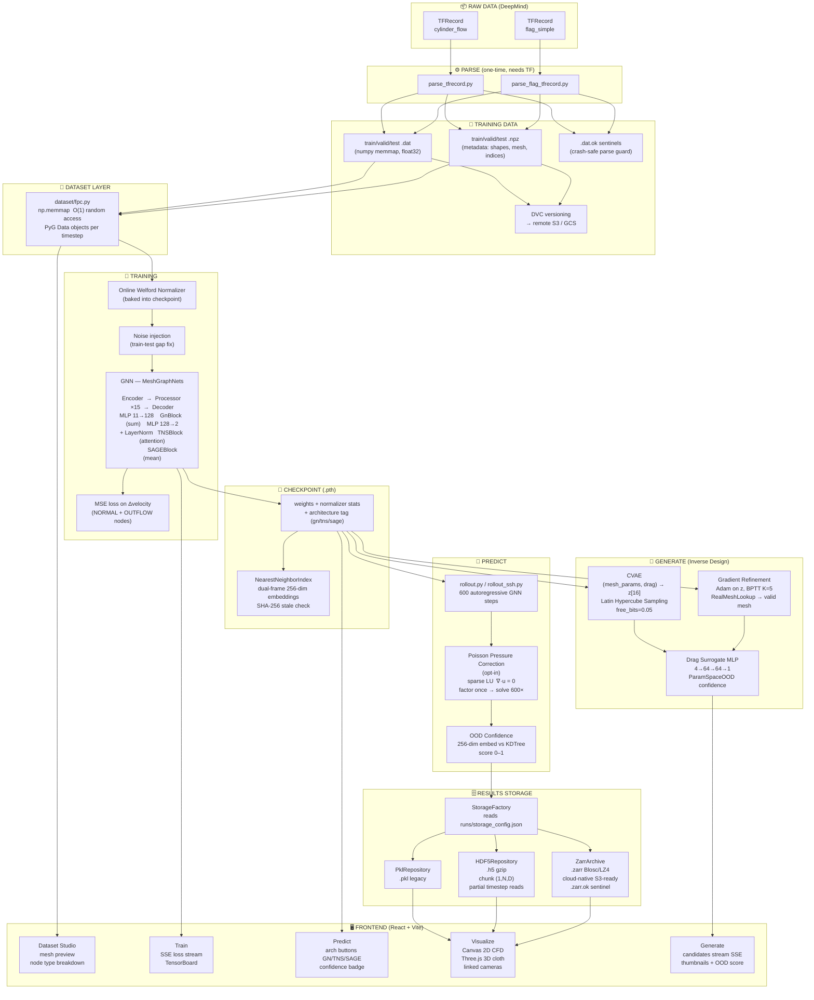
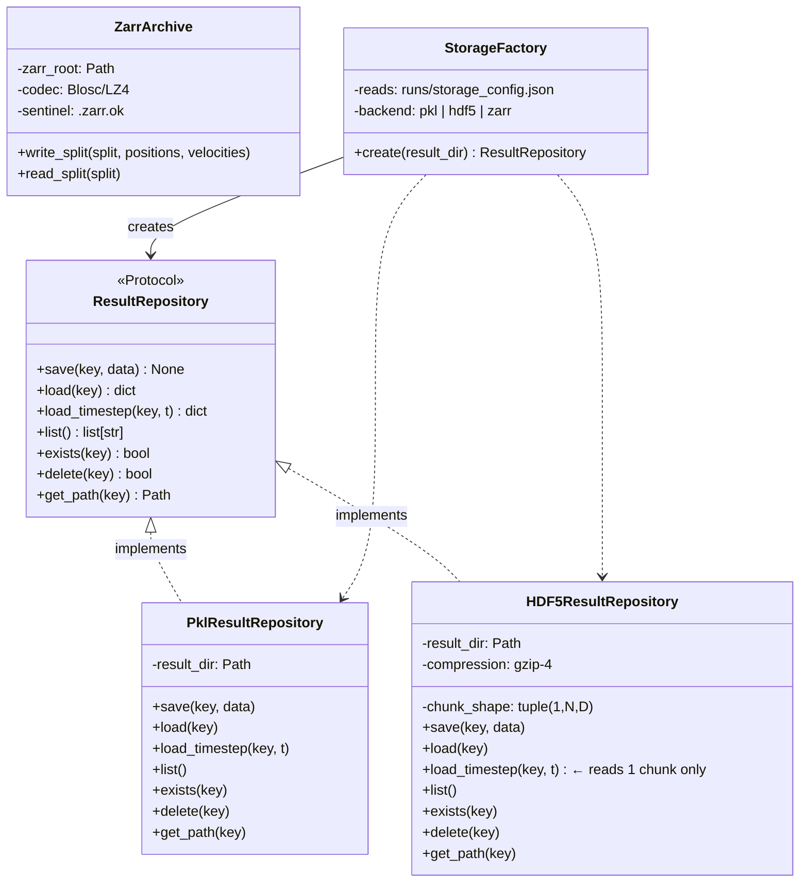
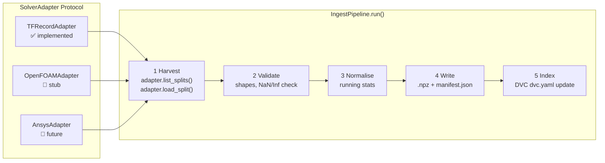
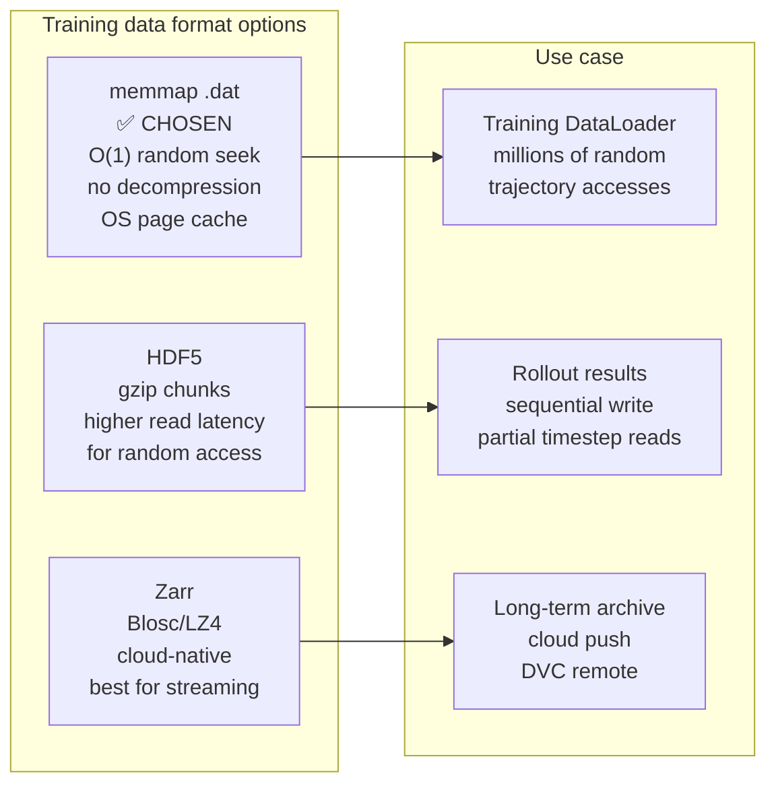
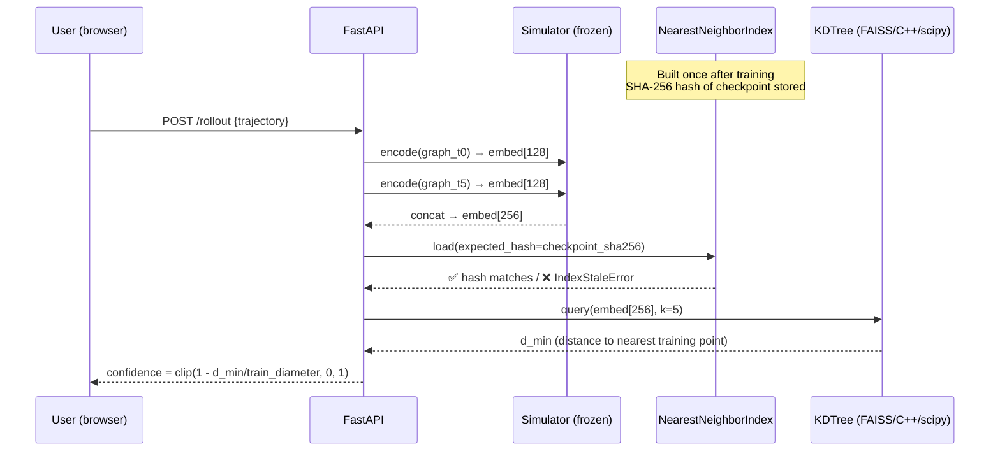
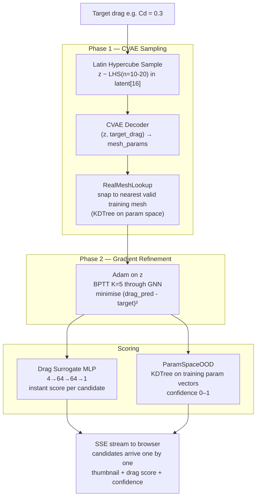

# PhysIQ — Data Flow & Architecture Diagrams

---

## 1. Full Data Flow (Raw → Train → Predict → Generate)

---

## 2. Storage Layer — Repository Pattern (Multi-Format Support)

**Why Protocol, not ABC?**
Any class with the right method signatures satisfies `ResultRepository` — no inheritance needed.
`isinstance(repo, ResultRepository)` returns `True` for all implementations.
Add a new backend (e.g. `S3ResultRepository`) → write one class, add one line in `StorageFactory`. Zero changes to callers.

---

## 3. Ingest Pipeline — Open/Closed for New Solvers

**Adding a new solver** = implement 4 methods (`list_splits`, `load_split`, `source_path`, `name`).
No existing pipeline stage changes. This is the **Open/Closed Principle** directly applied.

---

## 4. Training Data Format Decision

**Rule of thumb:**
- **Random access at training time** → memmap `.dat`
- **Partial reads of results** → HDF5 with chunk `(1, N, D)`
- **Cloud storage / archival** → Zarr with Blosc/LZ4

---

## 5. Confidence Scoring Flow

---

## 6. Inverse Design Flow

---

## Key Design Patterns Summary

| Pattern | Where used | Why |
|---------|-----------|-----|
| **Repository** | `ResultRepository` Protocol → PKL / HDF5 / Zarr | Swap storage backend in one config line, callers unchanged |
| **Factory** | `StorageFactory.create()` | Centralised creation, config-driven |
| **Protocol (structural typing)** | `ResultRepository`, `SolverAdapter` | Duck typing with type safety, no inheritance needed |
| **Strategy** | `BaseDesignSampler` → CFD / Cloth | Swap physics domain without touching generation logic |
| **Open/Closed** | `IngestPipeline` + `SolverAdapter` | New solver = new adapter class, zero existing changes |
| **Sentinel files** | `.dat.ok`, `.zarr.ok` | Fail-fast on corrupt/partial writes |
| **LRU Cache** | Model loading, result pickle | Amortise expensive deserialization across repeated requests |
| **Double-checked locking** | `api/state.py` model cache | Thread-safe loading with minimal lock contention |
| **SSE / Observer** | Train, Rollout, Generate routes | Progressive UI updates without polling |
| **Fail-fast** | `IndexStaleError`, sentinel check | Surface problems loudly, never silently wrong |
