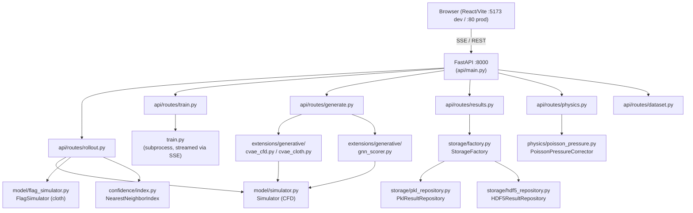
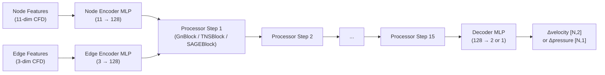
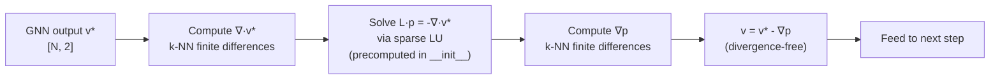
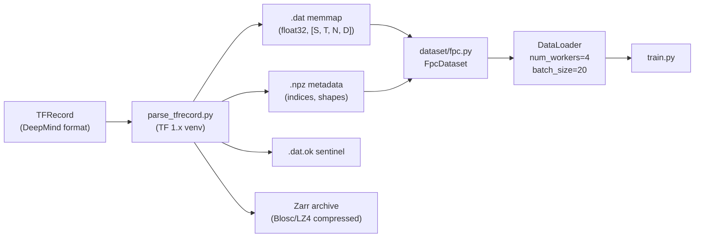

# PhysIQ — Comprehensive Technical Reference

> **Purpose:** Interview reference document for ML engineers and senior software engineers.  
> **Codebase snapshot:** April 2026  
> **Reading instructions:** Each section is self-contained. Jump directly to any section without needing context from prior sections.

---

## Table of Contents

1. [Project Overview](#1-project-overview)
2. [Supported Domains & Datasets](#2-supported-domains--datasets)
3. [System Architecture](#3-system-architecture)
4. [ML Architecture — GNN (Encoder-Processor-Decoder)](#4-ml-architecture--gnn-encoder-processor-decoder)
5. [Confidence & Similarity Scoring](#5-confidence--similarity-scoring)
6. [Inverse Design (Generate)](#6-inverse-design-generate)
7. [Pressure Poisson Correction (LU Decomposition)](#7-pressure-poisson-correction-lu-decomposition)
8. [Data Pipeline](#8-data-pipeline)
9. [Design Patterns & SOLID](#9-design-patterns--solid)
10. [Scalability](#10-scalability)
11. [Connections to Current Research](#11-connections-to-current-research)
12. [Numerical Methods Summary](#12-numerical-methods-summary)
13. [Docker & Deployment](#13-docker--deployment)
14. [Design Decisions & Tradeoffs (Consolidated)](#14-design-decisions--tradeoffs-consolidated)

---

## 1. Project Overview

**PhysIQ** is a neural surrogate simulator that replaces or accelerates classical numerical solvers (CFD, cloth physics) for engineering design workflows. The core premise: traditional solvers like OpenFOAM or FEniCS can take hours to simulate one fluid trajectory; a trained graph neural network can replicate the result in seconds by learning the spatiotemporal dynamics directly from simulation data.

PhysIQ implements the MeshGraphNets architecture (Pfaff et al., ICLR 2021) in PyTorch, wraps it in a full-stack web application, and adds several original extensions: multiple processor architecture variants (GN/TNS/SAGE), a latent-space confidence scoring system, a CVAE-based inverse design module with gradient-descent refinement, and an optional Helmholtz pressure correction pass. The result is a self-contained platform where a user can load a mesh dataset, train a surrogate model, run autoregressive rollouts, inspect results, generate new designs for a target drag coefficient, and receive a calibrated confidence score — all through a browser UI.

**Key numbers:**
- Mesh size: ~1,876 nodes (cylinder_flow), ~500 nodes (flag_simple)
- Trajectory length: 600 timesteps (CFD), variable (cloth)
- Speedup over numerical solver: **10–100×** depending on hardware and solver
- Hidden dimension: 128 throughout (encoder → processor → decoder)
- Processor depth: M = 15 message-passing steps
- Training: Adam, LR = 1e-4 (GN), capped at 3e-5 (TNS/SAGE), 100 epochs default

---

## 2. Supported Domains & Datasets

### 2.1 Domain Summary

| Domain | Dataset | Physics | Mesh size | Input node features | Output | Steps |
|---|---|---|---|---|---|---|
| `cylinder_flow` | DeepMind CFD | Incompressible Navier–Stokes | ~1,876 nodes | 11-dim (velocity + one-hot node type) | Δvelocity [N, 2] or pressure [N, 1] | 600 |
| `flag_simple` | DeepMind cloth | Elastic deformation (Verlet) | ~500 nodes | 12-dim (velocity[3] + one-hot type[9]) | Δworld_pos [N, 3] (acceleration) | Variable |

### 2.2 Node Types (`utils/utils.py`)

```python
class NodeType(enum.IntEnum):
    NORMAL       = 0   # Interior fluid/cloth nodes — model predicts these
    OBSTACLE     = 1   # Cylinder surface nodes — pinned to GT each step
    AIRFOIL      = 2   # Airfoil boundary nodes
    HANDLE       = 3   # Cloth attachment nodes — pinned (Dirichlet BC)
    INFLOW       = 4   # Inlet boundary (fixed velocity profile)
    OUTFLOW      = 5   # Outlet boundary (free-stream conditions)
    WALL_BOUNDARY= 6   # Domain walls
    SIZE         = 9   # Sentinel — used as num_classes for one-hot encoding
```

### 2.3 How Node Types Are Used as Boundary Conditions

**cylinder_flow:** During autoregressive rollout (`rollout.py`), a `boundary_mask` is built once from the node types at step 0. Nodes with `NodeType != NORMAL` (i.e., OBSTACLE, INFLOW, OUTFLOW, WALL_BOUNDARY) are pinned to their ground-truth values at every step — the model's prediction for those nodes is discarded. This enforces the physical constraint that inlet velocity and wall no-slip conditions remain exactly correct throughout a 600-step rollout.

**flag_simple:** `NodeType.HANDLE` nodes (the top edge of the flag attached to the pole) are pinned every step by the `FlagSimulator`. All other nodes evolve under the predicted acceleration via Verlet integration: `world_pos_next = 2·world_pos - world_pos_prev + acc_predicted`.

### 2.4 Feature Dimensions

**CFD velocity mode** (node_input_size=11, edge_input_size=3):
- Node: `[vel_x, vel_y, one_hot(node_type, 9)]` — raw then normalised
- Edge: `[Δx, Δy, |Δr|]` — Cartesian + Distance PyG transforms

**CFD pressure mode** (node_input_size=10, edge_input_size=3):
- Node: `[pressure, one_hot(node_type, 9)]`
- Edge: same as velocity mode

**Cloth** (node_input_size=12, edge_input_size=7):
- Node: `[(world_pos_t - world_pos_{t-1})[3], one_hot(node_type, 9)[9]]`
- Edge: `[rel_world[3], |rel_world|[1], rel_mesh[2], |rel_mesh|[1]]`

---

## 3. System Architecture

### 3.1 Full System Diagram



### 3.2 Layer Descriptions

**Browser (React + Vite):** SPA at `app/src/`. Key components: `Predict.tsx` (rollout UI with architecture selector), `Train.tsx` (training config panel), `Visualize.tsx` (Three.js mesh animation), `Generate.tsx` (inverse design), `DatasetStudio.tsx` (dataset explorer with mesh quality stats). Communicates with backend via:
- **SSE (Server-Sent Events):** for streaming training logs, rollout progress, generate progress — allows real-time log display without polling
- **REST JSON:** for all configuration, results queries, dataset info

**FastAPI (:8000):** `api/main.py` mounts all route blueprints. `api/state.py` is the shared module — holds domain config (`DOMAINS` dict), LRU-cached model loaders, and training process handles. No global mutable state per-request; all rollout/train processes write output to named log files.

**Model layer:** `model/simulator.py` (`Simulator`) for CFD, `model/flag_simulator.py` (`FlagSimulator`) for cloth. Both wrap `model/model.py` (`EncoderProcesserDecoder`). Checkpoints are saved with domain, architecture, and normalizer state so the exact model can be reconstructed without re-specifying hyperparameters.

**Storage layer:** `storage/protocols.py` defines `ResultRepository` (a `@runtime_checkable` Protocol). `StorageFactory.create()` reads `runs/storage_config.json` and returns either `PklResultRepository` (default) or `HDF5ResultRepository`. API routes depend only on the Protocol — they never import concrete repositories directly.

---

## 4. ML Architecture — GNN (Encoder-Processor-Decoder)

### 4.1 The Core Architecture

PhysIQ implements the **Encode-Process-Decode** pattern from MeshGraphNets (Pfaff et al., *Learning Mesh-Based Simulation with Graph Networks*, ICLR 2021).



**Encoder** (`model/model.py:Encoder`):
- Node MLP: `in→128→128→128→128` + LayerNorm
- Edge MLP: `in→128→128→128→128` + LayerNorm
- Both MLPs use `build_mlp()` with 3 hidden ReLU layers (3 hidden + 1 output = 4 linears total, matching the trained checkpoint architecture)

**Processor:** M=15 identical blocks (one of GnBlock, TNSBlock, SAGEBlock depending on `architecture` config). Each block has residual connections: `output = old + MLP(old)`.

**Decoder** (`model/model.py:Decoder`): Node MLP: `128→128→128→128→output_size`, no LayerNorm on final output. Returns raw delta values that are then denormalised and added to current state.

### 4.2 Message Passing Mechanics — EdgeBlock + NodeBlock

Defined in `model/blocks.py`.

**EdgeBlock:**
```
new_edge_ij = MLP( concat(h_sender_i, h_receiver_j, edge_attr_ij) )
# Input dim: 3 × 128 = 384
# Output dim: 128
```
For each directed edge (i→j), the sender node, receiver node, and edge attribute are concatenated and passed through a shared MLP. The MLP output becomes the new edge attribute.

**NodeBlock:**
```
agg_j = scatter_sum(new_edge_ij for all i→j)   # [N, 128]
new_node_j = MLP( concat(h_j, agg_j) )
# Input dim: 2 × 128 = 256
# Output dim: 128
```
For each node, incoming updated edges are summed (scatter reduce), then concatenated with the node's own embedding and passed through an MLP.

**Residual connection in GnBlock:**
```python
x_new       = x_old + graph_after_nodeblock.x
edge_attr_new = edge_attr_old + graph_after_edgeblock.edge_attr
```
Residuals prevent vanishing gradients across 15 processor steps and allow the model to learn small corrections on top of an identity mapping.

**LayerNorm:** applied after every MLP (inside `build_mlp()`). Stabilises training and prevents hidden-dim feature scales from diverging across 15 deep processor steps.

### 4.3 Three Processor Variants

Controlled by `architecture` parameter in `Simulator.__init__()` and `train.py` config.

#### GN (Graph Network) — default
```
GnBlock = EdgeBlock(MLP_384→128) + NodeBlock(MLP_256→128) + residual
```
Standard scatter-and-aggregate message passing. Edges carry geometric information into node updates. Most stable, best understood, default for production.

#### TNS (Transformer)
```python
# model/model.py:TNSBlock
TransformerConv(
    in_channels=128,
    out_channels=128 // heads,  # concat=True → output = 128
    heads=4,
    beta=True,            # learned gating between self and attention
    edge_dim=128,         # encoder edge features enter key computation
    dropout=0.0,
    root_weight=True,
)
```
Replaces the EdgeBlock+NodeBlock with multi-head dot-product attention:
```
α_ij = softmax( (W_Q·h_i)ᵀ (W_K·h_j + W_E·e_ij) / √d_head )
new_h_i = Σ_j α_ij · W_V·h_j
```
Edge features enter the attention key, giving each head access to geometric/relational information. **Note:** edge attributes are NOT updated per-block — they remain fixed from the encoder output. Higher capacity than GN but prone to gradient explosion → requires grad clipping and lower LR.

#### SAGE (GraphSAGE)
```python
# model/model.py:SAGEBlock
SAGEConv(
    in_channels=128,
    out_channels=128,
    aggr="mean",      # mean aggregation (vs GN's sum)
    normalize=True,   # L2-normalize output
    root_weight=True,
)
```
Aggregation: `new_h_v = Linear( concat(h_v, MEAN(h_neighbors)) )`. Key differences from GN:
- MEAN aggregation normalises by degree → robust to high-valence mesh nodes
- Explicit self/neighbor separation → reduces over-smoothing across 15 layers
- No edge feature update, no edge features in message → faster

**Design decision — why three variants?** Different problems have different capacity/stability tradeoffs:

| Variant | Aggregation | Edge updates | Grad stability | Capacity | Default LR |
|---|---|---|---|---|---|
| GN | Sum | Yes (per step) | High | Medium | 1e-4 |
| TNS | Attention-weighted | No (encoder only) | Low | High | ≤3e-5 |
| SAGE | Mean | No (encoder only) | Medium | Medium-high | ≤3e-5 |

GN is the default. Use TNS for best accuracy if training stability can be managed. Use SAGE as a middle ground.

### 4.4 Input Feature Construction

Feature construction lives in `Simulator.update_node_attr()` (`model/simulator.py`):

```python
# node_type: [N, 1] int → one_hot: [N, 9]
one_hot = F.one_hot(node_type.squeeze(-1).long(), num_classes=9)
# Velocity mode: concat([vel_x, vel_y], one_hot) → [N, 11]
# Pressure mode: concat([pressure], one_hot) → [N, 10]
node_feats = torch.cat([frames, one_hot.float()], dim=-1)
return self._node_normalizer(node_feats, self.training)
```

Edge features are computed by PyG transforms applied in `train.py` / `rollout.py`:
```python
transformer = T.Compose([
    T.FaceToEdge(),        # triangular faces → directed edge index
    T.Cartesian(norm=False), # [Δx, Δy] per edge
    T.Distance(norm=False)   # |Δr| per edge
])
```
Result: `edge_attr = [Δx, Δy, |Δr|]` → 3-dim, then normalised by `edge_normalizer`.

**Cloth features** (`model/flag_simulator.py:FlagSimulator`):
- Node: `[vel_x, vel_y, vel_z, one_hot(9)]` → 12-dim, where velocity = `world_pos_t - world_pos_{t-1}`
- Edge (7-dim): `[rel_world[3], |rel_world|[1], rel_mesh[2], |rel_mesh|[1]]` — both world-space and mesh-space displacements, enabling the model to distinguish stretching (world ≠ mesh) from rigid motion

### 4.5 Training Details (`train.py`)

**Loss:** MSE on the normalised delta field (velocity difference or acceleration), computed only over NORMAL nodes for CFD to avoid boundary condition interference:
```python
loss = (normalizer(target_delta) - predicted) ** 2
loss = loss[node_mask].mean()  # mask out non-NORMAL nodes
```

**Noise injection (regularisation):** Small Gaussian noise added to velocity inputs during training:
```python
velocity_sequence_noise = torch.randn_like(frames) * noise_std  # noise_std=2e-2 CFD
```
This is the key regularisation against compound error accumulation in autoregressive rollout. At test time the model sees noise-free inputs, so its predictions are slightly off; injecting training noise bridges the train-test distribution gap (analogous to scheduled sampling).

**Optimiser and LR:**
```python
_effective_lr = cfg['lr'] if arch == 'gn' else min(cfg['lr'], 3e-5)
optimizer = torch.optim.Adam(simulator.parameters(), lr=_effective_lr)
```
TNS/SAGE attention/aggregation layers produce larger gradient magnitudes than GN's pure MLPs → hard cap at 3e-5 prevents NaN divergence on the first few batches.

**Gradient clipping** (TNS/SAGE only):
```python
if architecture in ('tns', 'sage'):
    torch.nn.utils.clip_grad_norm_(simulator.parameters(), max_norm=1.0)
```
GN is intentionally left without clipping — it is stable and clipping adds unnecessary computation.

**Cloth training extras:**
- DeepMind exponential LR decay: `γ = 0.1^(1/5_000_000)` per gradient step, floor at 1e-6
- Normaliser warmup: first 1,000 steps accumulate statistics without gradient updates
- Loss computed on 3D acceleration, not velocity, then converted back via Verlet

### 4.6 Autoregressive Rollout (`rollout.py`)

```python
for i in range(num_steps):
    graph = build_graph(predicted_velocity_or_pos)
    delta = simulator(graph, noise=0)  # inference: no noise
    predicted = current + denormalise(delta)
    # Pin boundary nodes to ground truth
    predicted[boundary_mask] = ground_truth[i][boundary_mask]
    predicteds.append(predicted)
    current = predicted
```

**Train-test gap:** Training sees 1-step ahead targets. Rollout does 600 steps, feeding its own predictions back. Errors compound multiplicatively. The noise injection during training is the primary mitigation. The optional Poisson correction (section 7) provides a physics-based secondary mitigation for CFD.

**Error metric** (`rollout_error()` in `rollout.py`):
```python
per_step_rmse = sqrt(mean((predicted - target)^2))  # [T]
```
Saved as a plot to `result/rollout_error_{index}.png`.

---

## 5. Confidence & Similarity Scoring

### 5.1 What It Does

The confidence system answers: *"How well does the model's training distribution cover this query trajectory?"* A score near 1.0 means the query is well inside the training envelope. A score near 0 means it is out-of-distribution (OOD).

### 5.2 How Confidence Is Computed

**Index build** (`confidence/build_index.py`):
1. Load trained checkpoint + training dataset
2. For each training trajectory, run the encoder on frames 0 and 5 → pool over all nodes → get two [128] vectors → concat → [256] embedding
3. Build `NearestNeighborIndex` over all [N_train, 256] embeddings
4. Compute `train_diameter = percentile_95(5-NN distances within training set)`
5. Store SHA-256 hash of checkpoint alongside embeddings in pickle file

**Inference** (`confidence/index.py:NearestNeighborIndex.query()`):
```python
score = clip(1 - d_min / train_diameter, 0, 1)
```
where `d_min` = distance from query embedding to nearest training embedding.

### 5.3 Dual-Frame CFD Embedding (`model/embedding.py`)

```
embedding = concat(encoder(frame_0), encoder(frame_5))  →  [256]
```

**Why two frames?**
- **frame_0 only:** Two designs with identical cylinder geometry but different inlet velocities look identical at t=0. No advection has occurred yet.
- **frame_5 only:** Geometry information (cylinder position, size) has been partially washed out by the dynamics.
- **Dual-frame:** frame_0 captures geometry + BCs; frame_5 captures early flow dynamics after advection. Together they uniquely identify both geometric and dynamic characteristics.

**Why pool over ALL nodes (not just NORMAL)?**
WALL_BOUNDARY nodes carry cylinder geometry. INFLOW/OUTFLOW nodes carry inlet velocity. Pooling only over NORMAL nodes would discard precisely the structural information that distinguishes different designs.

**Cloth:** Single-frame [128] embedding (cloth frame 0 IS the design — world_pos at t=0). HANDLE nodes define attachment geometry.

### 5.4 Backend Priority

`NearestNeighborIndex.build()` tries backends in priority order:
1. **FAISS** (`faiss-cpu`) — exact IndexFlatL2, highly optimised (fastest)
2. **C++ KDTree** (`confidence/kdtree.cpp`, compiled via pybind11 + cmake) — ~3–5× faster than scipy for repeated queries
3. **scipy KDTree** — always available, fallback

For 5,000 training embeddings in [256]-dim space:
- Brute force: O(N) = 5,000 distance computations per query
- KDTree: O(log N) ≈ 12 distance computations per query

### 5.5 Stale Index Detection

```python
# At build time (build_index.py):
index.checkpoint_hash = checkpoint_hash(checkpoint_path)  # SHA-256[:16]
index.save(output_path)

# At load time (index.py:NearestNeighborIndex.load()):
current_hash = checkpoint_hash(expected_checkpoint)
if stored_hash != current_hash:
    raise IndexStaleError("Rebuild with: python -m confidence.build_index ...")
```

**Design decision:** Silent stale scores (returning confident predictions from an old model's index applied to a new model's embeddings) are worse than a loud `IndexStaleError`. The error message includes the exact rebuild command.

### 5.6 Where KDTree Is Used in the Codebase

| Location | Purpose | Why KDTree |
|---|---|---|
| `confidence/index.py` | NN search over training embeddings | O(log N) per query; C++/FAISS backends available |
| `api/routes/physics.py` | k-NN for gradient estimation on unstructured mesh | No regular grid → KDTree is the natural structure |
| `physics/poisson_pressure.py` | Build k-NN neighborhood for Laplacian and gradient estimation | Same reason as above |

---

## 6. Inverse Design (Generate)

### 6.1 Problem Statement

Given a target drag coefficient `t`, find mesh geometry parameters `θ` such that the GNN-simulated flow over `mesh(θ)` yields drag ≈ `t`. Defined in `api/routes/generate.py` and implemented in `extensions/generative/`.

### 6.2 Two Strategies

#### CVAE Sampling

Defined in `extensions/generative/cvae_cfd.py` (CFD) and `cvae_cloth.py` (cloth).

The CVAE is trained separately to learn `p(mesh_params | drag)`:
- Encoder: `(mesh_params, drag)` → `μ, log_σ` in latent space Z
- Decoder: `(z, drag_condition)` → reconstructed mesh params
- Loss: ELBO = reconstruction MSE + KL divergence, with `free_bits=0.05` to prevent posterior collapse

**At generation time:**
1. Sample `z` from prior using **Latin Hypercube Sampling** (LHS) instead of pure random
   - LHS partitions the latent space into a stratified grid → better coverage than iid Normal samples
   - Uses `scipy.stats.qmc.LatinHypercube`
2. Condition decoder on target drag → candidate mesh params
3. Look up nearest real training mesh via `RealMeshLookup` (avoids OOD GNN inputs)

#### Gradient Descent Refinement

Defined in `extensions/generative/inverse_design.py`.

Starting from the best CVAE sample, backprop through a K=5 GNN rollout to minimise `|predicted_drag - target|`:
```python
for step in range(K):  # K=5
    graph = build_graph(current_params)
    delta = simulator(graph)
    current_pos = current_pos + delta  # Verlet for cloth
drag_pred = compute_drag(current_pos)
loss = (drag_pred - target_drag) ** 2
loss.backward()
optimizer.step()  # update mesh params θ
```

`RealMeshLookup` maps continuous θ to the nearest real training mesh (nearest-neighbour interpolation), keeping GNN inputs in-distribution. Defined in `extensions/generative/mesh_generator.py`.

**5-step BPTT (K=5):** balance between:
- Signal quality: more steps = better drag signal propagated back through time
- Memory/speed: each step stores the full computation graph; K=5 is ~5× more expensive than K=1 but provides far better gradient signal than a single step

### 6.3 Design Tradeoffs

| | CVAE Sampling | Gradient Descent |
|---|---|---|
| Speed | Fast (no rollout needed) | Slow (5× GNN forward+backward) |
| Diversity | High (stochastic LHS sampling) | Low (converges to local optimum) |
| Physical accuracy | Lower (surrogate of surrogate) | Higher (actual GNN rollout feedback) |
| Best use | Exploration, many candidates | Refinement of best candidate |

Typical workflow: generate 20–50 CVAE candidates, score them, then run gradient refinement on the top 3–5.

### 6.4 Out-of-Distribution Detection for Generated Params

`extensions/generative/ood_detector.py:ParamSpaceOOD`:
- Fits a KDTree over training mesh parameter vectors
- Scores candidate params by nearest-neighbor distance in parameter space
- Added to `CFDDesignSampler.__init__()` — each generated candidate receives a param-space OOD score alongside the latent-space confidence score from section 5

### 6.5 How to Improve (Research Directions)

- **Differentiable mesh generation:** Currently maps params → nearest real mesh. Replace with a graph VAE or implicit neural representation that generates mesh geometry differentiably, removing the nearest-mesh bottleneck.
- **Equivariant GNN scoring:** Rotation-invariant drag prediction using e3nn steerable MLPs.
- **Multi-objective Pareto front:** Jointly optimise drag + lift + material cost with multi-objective evolutionary algorithms or NSGA-II.
- **Normalizing flows:** Exact likelihood over `p(params | drag)`, no posterior approximation — better latent coverage than VAE.
- **CMA-ES:** Evolution strategy over latent space — no gradients required, handles non-smooth objectives and discontinuous mesh lookup.
- **Bayesian optimisation:** Model the drag function in latent space with a Gaussian Process; acquisition function guides sample-efficient search.

---

## 7. Pressure Poisson Correction (LU Decomposition)

### 7.1 Why It's Needed

GNN-predicted velocity fields are not guaranteed to satisfy the incompressibility constraint `∇·v = 0` (divergence-free condition of incompressible Navier–Stokes). Violations accumulate over 600 steps, causing unphysical pressure build-up and eventual velocity blowup. The Helmholtz projection removes the divergent component from any velocity field.

### 7.2 Algorithm (`physics/poisson_pressure.py:PoissonPressureCorrector`)



**Step-by-step:**

1. **Build k-NN graph** from node coordinates (k=7 neighbors default): `cKDTree(crds).query(crds, k=7)`

2. **Build sparse Laplacian `L`** with inverse-distance-squared weights:
   ```
   w_ij = 1 / ||x_i - x_j||²
   L[i,i] += w_ij for all neighbors j
   L[i,j] -= w_ij
   ```
   Pin node 0 to ground (Dirichlet BC) to remove null space.

3. **Factorise once:** `self._lu = splu(L)` — one-time O(N log N) cost in `__init__`

4. **Per timestep:**
   ```python
   b = compute_divergence(v_star)   # O(N·k) finite differences
   p = self._lu.solve(-b)           # O(N) triangular solve
   grad_p = compute_gradient(p)     # O(N·k) finite differences
   v_corrected = v_star - grad_p    # O(N)
   ```

### 7.3 LU Decomposition — Where and Why

| Usage | Location | Comment |
|---|---|---|
| `splu(L)` | `physics/poisson_pressure.py:__init__` | Sparse Laplacian, factorised once, reused 600× |
| `np.linalg.solve(A, rhs)` | `poisson_pressure.py:_compute_divergence/_compute_gradient` | Batched 2×2 per-node least-squares — LAPACK dgesv internally |
| `np.linalg.solve` | `api/routes/physics.py` | 2×2 gradient estimation for vorticity/divergence display |

**Why LU over iterative solvers (CG, GMRES)?**  
The mesh topology is **fixed** — same nodes and edges for all 600 timesteps. `splu()` factorises `L` once at O(N log N) cost. Each timestep then requires only two triangular solves at O(N) each. Iterative solvers (CG) would require O(N · iterations) per timestep — 600× more work for the same result. For a fixed topology, direct LU factorisation amortised over 600 timesteps is always faster.

### 7.4 Design Decision: Opt-In, Default OFF

```python
# rollout.py
corrector = None
if poisson_correction:
    corrector = PoissonPressureCorrector(crds_init)
```

**Overhead:** ~2–7 ms per step on CPU. For a 600-step GPU rollout, this can double total runtime. The user toggles it in the Predict UI with a checkbox. This follows the principle: don't pay for what you don't use.

---

## 8. Data Pipeline

### 8.1 Overview



### 8.2 TFRecord Parsing (`parse_tfrecord.py`)

DeepMind released the datasets in TensorFlow TFRecord format. `parse_tfrecord.py` requires TF < 1.15 (enforced with a `RuntimeError` check) and runs in a separate `venv_tf/` virtual environment. It reads the `meta.json` schema, decodes each field (static, dynamic, dynamic_varlen), and writes:
- `data/{split}.dat` — memory-mapped float32 array, shape `[S, T, N, D]`
- `data/{split}.npz` — metadata: trajectory indices, shapes, node types
- `data/{split}.dat.ok` — sentinel written only after clean completion

### 8.3 Sentinel Files (`.dat.ok`)

```python
# dataset/fpc.py:FpcDataset.__init__
if not os.path.exists(dat_ok_path):
    raise RuntimeError(
        f"Missing sentinel {dat_ok_path}. "
        "Re-run parse_tfrecord.py to regenerate the dataset."
    )
```

**Design decision:** Fail fast over silent degradation. Without the sentinel, a partially written `.dat` file (from a crashed parse run) would silently train on corrupted data. The sentinel guarantees the file was fully and cleanly written.

### 8.4 FpcDataset (`dataset/fpc.py`)

Wraps the memory-mapped `.dat` file. Each item is a single timestep graph for a single trajectory:
- `graph.x` — node features (velocity + one-hot type) at timestep `t`
- `graph.face` — triangular mesh connectivity (fixed for CFD)
- Target is the velocity at `t+1` (retrieved as a separate tensor)

`num_workers=4` in DataLoader exploits memmap's ability to be safely read from multiple processes (read-only mode).

### 8.5 Storage Layer — Repository Pattern

```
storage/protocols.py    → ResultRepository (Protocol, @runtime_checkable)
storage/pkl_repository.py → PklResultRepository  (pickle, legacy)
storage/hdf5_repository.py → HDF5ResultRepository (gzip-4, chunks=(1,N,D))
storage/factory.py      → StorageFactory.create() → reads runs/storage_config.json
```

**PklResultRepository:** each result saved as a single `.pkl` file containing `{predictions, targets, coords, metadata}`. `load_timestep(name, t)` loads the entire file and slices `[t]` — O(file size) per partial read.

**HDF5ResultRepository:** predictions/targets stored as chunked HDF5 datasets with `chunks=(1, N, D)` (one chunk = one timestep). `load_timestep(name, t)` reads exactly one chunk — O(1) regardless of trajectory length. Compression: gzip level 4 (good compression ratio, not too slow).

**Switch backend:**
```bash
echo '{"result_backend":"hdf5"}' > runs/storage_config.json
```
Zero code changes required; all API routes continue to work identically.

### 8.6 Zarr Archive

Written alongside the memmap during parsing (additive — memmap always written first, Zarr is best-effort):
- Blosc/LZ4 compression
- Enables: data versioning, regenerating `.dat` if lost, cloud-native access (S3/GCS)
- **Why Zarr over HDF5 for raw dataset?** Zarr supports cloud-native chunked access without POSIX file semantics. HDF5 requires a POSIX filesystem; Zarr works directly on object storage (S3, GCS). For the result backend (section 8.5), HDF5 is correct because it lives on local disk and benefits from gzip compression.

### 8.7 DVC (`dvc.yaml`)

```bash
dvc add data/*.dat      # creates data/*.dat.dvc pointer files
git add data/*.dat.dvc  # track pointer in git
# Large files stay in .dvc/cache (local)
```

**Why DVC over git-lfs?** DVC understands data pipelines — it can track stages (parse → train), detect when inputs change, and reproduce experiments. git-lfs is purely large file storage with no pipeline awareness.

### 8.8 Ingest Pipeline (`ingest/`)

For adding new solvers or data sources without modifying existing code.

```
ingest/protocols.py    → SolverAdapter (Protocol: list_splits, load_split, source_path, name)
ingest/adapters/       → TFRecordAdapter (wraps .dat loading), OpenFOAMAdapter (stub)
ingest/pipeline.py     → IngestPipeline.run()
ingest/stages/         → harvest.py, validate.py, normalise.py, write.py, index.py
```

**`IngestPipeline.run()`** orchestrates stages:
1. `harvest(adapter, split)` — calls `adapter.load_split()`, returns raw numpy arrays
2. `validate(data, split)` — shape checks, NaN detection, node type consistency
3. `normalise(data)` — computes per-field statistics, returns normalised data + stats
4. `write_npz(data, stats, out_dir, split)` — writes `.dat` + `.npz` + `.dat.ok`
5. `index.rebuild_confidence_index()` — triggers confidence index rebuild post-ingest

**Adding a new solver:** implement `SolverAdapter` (2 methods: `list_splits`, `load_split`), pass to `IngestPipeline`. Zero changes to storage, training, API, or frontend.

---

## 9. Design Patterns & SOLID

### 9.1 Design Patterns

| Pattern | Location | Why |
|---|---|---|
| **Repository** | `storage/protocols.py`, `pkl_repository.py`, `hdf5_repository.py` | Decouple result I/O from route logic; swap PKL↔HDF5 without touching API routes |
| **Strategy** | `storage/factory.py:StorageFactory` | Select backend at runtime from config |
| **Adapter** | `ingest/adapters/` | Wrap TFRecord/OpenFOAM behind uniform `SolverAdapter` interface |
| **Pipeline** | `ingest/pipeline.py:IngestPipeline` | Composable stages, each independently testable and replaceable |
| **Factory** | `StorageFactory.create()` | Central creation point hides backend complexity from callers |
| **Sentinel/Guard** | `.dat.ok` files | Crash-early on incomplete data; fail-fast over silent degradation |
| **LRU Cache** | `api/state.py`, `api/routes/results.py` | Bound memory usage; O(1) amortised model/result access |
| **Observer (partial)** | SSE streaming in `api/routes/train.py`, `rollout.py`, `generate.py` | Frontend observes backend progress without polling |

### 9.2 SOLID Principles Applied

#### S — Single Responsibility

- `PoissonPressureCorrector` (`physics/poisson_pressure.py`): only Helmholtz projection. No rollout logic, no model loading.
- `FpcDataset` (`dataset/fpc.py`): only data loading and graph construction. No training loop, no model calls.
- `NearestNeighborIndex` (`confidence/index.py`): only KDTree build/query/save/load. No model calls, no data loading.
- Each ingest stage (`harvest`, `validate`, `normalise`, `write`, `index`): exactly one transformation responsibility.

#### O — Open/Closed

- Adding `HDF5ResultRepository`: new file created (`storage/hdf5_repository.py`), zero changes to `api/routes/results.py` or any route that calls `repository.save()`/`repository.load()`.
- Adding a new domain: implement `SolverAdapter`, register it — zero changes to `IngestPipeline` internals.
- Adding TNS/SAGE processor: added new classes to `model/model.py`, `Simulator` picks via config string — no changes to `train.py` training loop logic.

#### L — Liskov Substitution

`PklResultRepository` and `HDF5ResultRepository` both satisfy `ResultRepository` Protocol. `StorageFactory.create()` returns either one; all callers (`api/routes/results.py`, `api/routes/rollout.py`) operate on the Protocol and are unaware which concrete type they hold. Substituting one for the other produces identical behaviour from the caller's perspective.

#### I — Interface Segregation

- `ResultRepository` has a minimal interface: `save / load / load_timestep / list / exists / delete / get_path`. No training-specific methods leaked in.
- `SolverAdapter` exposes only `list_splits` and `load_split`. Nothing about normalisation, storage, or model training is leaked into the adapter interface.

#### D — Dependency Inversion

- API routes (`api/routes/results.py`) depend on `ResultRepository` (Protocol, defined in `storage/protocols.py`), not on `PklResultRepository` (concrete class).
- `IngestPipeline` (`ingest/pipeline.py`) depends on `SolverAdapter` (Protocol), not on `TFRecordAdapter`.
- `api/routes/rollout.py` calls `StorageFactory.create()` which returns a Protocol — the route never knows if it's writing pickle or HDF5.

### 9.3 Adding a New Solver/Domain — Zero Breaking Changes

1. **Implement `SolverAdapter`** in `ingest/adapters/your_solver.py` (2 methods: `list_splits`, `load_split`)
2. **Pass to `IngestPipeline`**: `IngestPipeline(YourAdapter(path)).run()`
3. **Register domain** in `api/state.py:DOMAINS` dict with `data_dir`, `label`, `available`
4. **Add rollout logic** for new physics if needed — or reuse existing `Simulator` if features match

**Untouched:** storage layer, confidence system, results API, generate pipeline, frontend visualization, tests for other domains.

---

## 10. Scalability

### 10.1 Current Bottlenecks

| Bottleneck | Current state | Impact |
|---|---|---|
| Model inference | Single-threaded, one trajectory at a time | Concurrent rollout requests conflict |
| Result storage | PKL flat files, no indexing | O(N) list scan; O(file size) partial timestep read |
| Confidence index | Manual rebuild via CLI | Stale index after every retraining |
| Training | Single GPU / CPU | Cannot distribute over multiple GPUs |
| Data loading | Local `.dat` memmaps | Not cloud-accessible for distributed training |
| Request queuing | None | Second rollout request during active rollout hits shared state |

### 10.2 Improvements Path

| Bottleneck | Current | Improvement |
|---|---|---|
| Inference throughput | 1 trajectory | Batch inference; async job queue (Celery/Ray); TorchServe |
| Result storage | PKL flat files | HDF5 (implemented) → add metadata DB (SQLite/Postgres) for indexed queries |
| Confidence index | Manual rebuild | Hook in `train.py` post-epoch to auto-rebuild; or `IngestPipeline` stage |
| Training | Single GPU | `train_ddp.py` (already present) — `DistributedDataParallel` over N GPUs |
| Data loading | 4 workers local | Zarr + object storage (S3/GCS) → distributed data parallel training |
| Frontend polling | SSE implemented | Already good — no change needed |

### 10.3 Billion-Scale Path

1. **Raw data:** Replace `.dat` memmaps with Zarr + S3/GCS object storage. Zarr's cloud-native chunked access allows distributed training workers to stream data without shared filesystem.
2. **Results:** Replace PKL with HDF5 + SQLite/Postgres metadata DB for indexed queries (`WHERE domain='cylinder_flow' AND confidence > 0.8`).
3. **Training:** `train_ddp.py` already wraps the `Simulator` in `DistributedDataParallel`. Scale to N nodes with a shared checkpoint directory on NFS or S3.
4. **Inference service:** TorchServe or Triton Inference Server; queue-based job dispatch (Celery + Redis). Each rollout job picks up a worker from the pool — no shared state conflicts.
5. **Confidence index:** Replace KDTree with FAISS IVF index (approximate NN) for >100K training embeddings. Already supported via the FAISS backend in `NearestNeighborIndex`.

---

## 11. Connections to Current Research

### 11.1 Is the Model Equivariant?

**No.** MeshGraphNets is purely data-driven — standard MLPs and aggregations have no geometric symmetry constraints. This means:
- Predictions are not guaranteed consistent under rotation or reflection of the mesh
- The model must see training data covering all orientations (or augment with rotations)
- For `cylinder_flow`: DeepMind's dataset uses a consistent orientation (flow always left-to-right), so this is fine in practice

**How to add equivariance:** Use the `e3nn` library. Replace standard `Linear` layers with steerable MLPs (equivariant to SO(3) or E(3)). Replace standard message passing with equivariant message passing (SEGNN, NequIP, MACE). Tradeoff: more physically principled and generalises from fewer examples, but ~5–10× more computation per forward pass and substantially more complex to implement.

### 11.2 Relation to JEPAs (Joint Embedding Predictive Architectures)

JEPA (LeCun 2022; I-JEPA, V-JEPA 2024): learn to predict **representations** of future states in latent space — not pixel values or field values directly. The key insight: predicting in representation space forces the model to learn abstract, structured features rather than pixel-level noise.

**Our confidence scoring is JEPA-adjacent:**
- We encode trajectories into a [256] latent embedding (the "representation space")
- At inference, we measure how far the query embedding is from the training manifold in that space
- This is essentially asking: does the training embedding space cover this region?

**Key difference:** our encoder is trained to reconstruct velocity fields (MSE loss), not to predict future embeddings. This means the embedding space is shaped by reconstruction fidelity rather than by prediction consistency.

**True JEPA extension for PhysIQ would be:**
1. Train the encoder to predict the embedding of frame `t+5` given the embedding of frame `t` (no decoding back to velocity space)
2. The latent space would then encode **dynamics** (what will happen) rather than just geometry (what is the current state)
3. Confidence scoring in this space would detect both geometric OOD (different cylinder size) and dynamic OOD (different Reynolds number regime)

### 11.3 How to Improve Mesh Generation

Current: CVAE samples latent `z` → decodes to params → `RealMeshLookup` maps to nearest real training mesh.

Limitations:
- Nearest-mesh lookup quantises the design space to ~N_train discrete meshes
- Cannot generate truly novel geometries outside the training set

Better approaches (roughly in order of complexity):
1. **Graph VAE:** directly encode/decode node positions + connectivity as a graph. No parameter bottleneck. Requires handling variable topology.
2. **Implicit Neural Representation (SDF):** represent geometry as a signed distance function `f(x, y) → d`. Sample iso-surface to get mesh. Clean interpolation in param space; no topology discontinuities.
3. **Diffusion model on meshes:** denoising diffusion over node positions — current state of the art for 3D shape generation (MeshDiffusion). Generates valid mesh topology + geometry jointly.
4. **Direct 2D/3D mesh generation via GNN:** encode mesh as graph, decode new mesh from latent code — handles irregular topologies natively.

### 11.4 CVAE vs Gradient Descent — How to Do Better

| Approach | What's better |
|---|---|
| **Normalizing flows** | Exact likelihood (no KL approximation), better latent space coverage than VAE, fully invertible |
| **Consistency models / flow matching** | Faster sampling than diffusion, better quality than VAE, deterministic trajectory from noise |
| **CMA-ES** | Evolution strategy in latent space — no gradients needed, handles non-smooth objectives and discontinuous mesh lookup |
| **Bayesian optimisation** | Model drag function in latent space with a Gaussian Process; acquisition function (EI/UCB) guides sample-efficient search — especially good when rollout is expensive |
| **Diffusion model** | Reverse-diffuse from noise conditioned on target drag — handles multi-modal design distributions natively |

---

## 12. Numerical Methods Summary

| Method | Location | When | Why LU? |
|---|---|---|---|
| `np.linalg.solve(A_2x2, rhs)` | `physics/poisson_pressure.py:_compute_divergence` and `_compute_gradient` | Per-node gradient estimation via k-NN least squares | 2×2 system per node — LAPACK `dgesv` (LU) called internally; tiny fixed size |
| `scipy.sparse.linalg.splu(L)` | `physics/poisson_pressure.py:__init__` | Mesh Laplacian, factorised once per mesh | Fixed mesh topology → factorise O(N log N) once, solve O(N) × 600 steps |
| `np.linalg.solve` | `api/routes/physics.py` | Vorticity/divergence display via k-NN gradient estimation | Same 2×2 batched system as above |
| `np.linalg.norm` | `rollout.py`, `api/routes/results.py`, `physics/poisson_pressure.py` | Vector magnitude: RMSE, speed, displacement | Standard LAPACK `dnrm2` |
| `np.linalg.lstsq` | `extensions/generative/shape_extractor.py` | Overdetermined least squares: fit shape params from mesh coords | SVD-based, handles near-singular cases gracefully |
| `np.linalg.svd` | `extensions/generative/cloth_extractor.py` | PCA of cloth deformation modes for CVAE latent space | Extract principal deformation directions from trajectory ensemble |

**Planned (documented in `docs/NUMERICAL_METHODS.md`):**
- **Laplacian mesh smoothing** (issue #2): `L·x = x_original`, sparse LU factorised once per topology, smoothing as regularisation for mesh generation
- **Implicit FVM baseline solver** (issue #3): real wall-clock speedup benchmark; sparse LU per timestep for reference solver

---

## 13. Docker & Deployment

### 13.1 Container Setup (`docker-compose.yml`)

Three services:

| Service | Image | Port | Purpose |
|---|---|---|---|
| `api` | `Dockerfile.api` (Python 3.12-slim, CPU PyTorch) | 8000 | FastAPI backend |
| `frontend` | `Dockerfile.frontend` (nginx) | 80 | Serve built Vite bundle, proxy `/api/*` |
| `frontend-dev` | `node:20-alpine` | 5173 | Vite HMR dev server (`--profile dev` only) |

### 13.2 Key Design Decisions

**CPU-only in container:** GPU work uses the existing SSH-to-remote-GPU feature (`rollout_ssh.py`, `generate_ssh.py`). No `nvidia-container-toolkit` required in the Docker host — the container is portable to any machine. GPU stays on the dedicated ML server.

**SSE preserved through nginx:**
```nginx
# Dockerfile.frontend nginx config
proxy_buffering off;
chunked_transfer_encoding on;
```
Without `proxy_buffering off`, nginx would buffer SSE chunks until the response completes — defeating the real-time streaming entirely.

**Data as volumes, never baked into image:**
```yaml
volumes:
  - ./data:/app/data
  - ./checkpoints:/app/checkpoints
  - ./result:/app/result
  - ./runs:/app/runs
```
Images stay lean (~500 MB). Data and checkpoints persist across image rebuilds. Multiple containers can share the same host data directory.

**Healthcheck:**
```yaml
healthcheck:
  test: ["CMD", "curl", "-f", "http://localhost:8000/health"]
  interval: 30s
  timeout: 10s
  retries: 3
```
`docker compose up` with `depends_on: {api: {condition: service_healthy}}` ensures frontend only starts after the API is genuinely ready.

---

## 14. Design Decisions & Tradeoffs (Consolidated)

| Decision | Choice made | Alternative considered | Why |
|---|---|---|---|
| **GNN architecture** | Encoder-Processor-Decoder (MeshGraphNets) | PINN, FNO | DeepMind proven on this exact dataset; interpretable; mesh-native |
| **Processor variants** | GN / TNS / SAGE selectable at train time | Fixed architecture | Different capacity/stability needs; one size does not fit all |
| **LR cap for TNS/SAGE** | `min(lr, 3e-5)` | Same LR as GN (1e-4) | Attention layers produce larger gradient magnitudes → NaN divergence at 1e-4 |
| **Grad clipping** | TNS/SAGE only, `max_norm=1.0` | Clip all architectures | GN is stable; unnecessary overhead on GN; clip only where needed |
| **Hidden size** | 128 throughout | 256 | Matches DeepMind checkpoint; larger increases memory 4× for marginal gain on ~1,876 nodes |
| **Processor depth** | M = 15 | M = 10 or M = 20 | DeepMind default; empirically well-tuned for ~2,000-node meshes |
| **Storage default** | PKL | HDF5 | Backward compatible with existing saved results; HDF5 is opt-in |
| **Result storage pattern** | Repository Pattern (`protocols.py`) | Direct `pickle.load()` in routes | Swappable backend without changing route logic; testable with mocks |
| **Dataset archive format** | Zarr (Blosc/LZ4) | HDF5 | Zarr is cloud-native chunked; HDF5 requires POSIX filesystem |
| **Data versioning** | DVC | git-lfs | DVC is pipeline-aware (stages, reproducibility); git-lfs is just large file storage |
| **Confidence embedding** | Dual-frame [256] (frames 0 + 5) | Single-frame [128] | Single-frame cannot distinguish same geometry + different inlet velocity |
| **Confidence pooling** | All nodes (NORMAL + boundary) | NORMAL nodes only | Wall/boundary nodes carry geometry and BC information critical to OOD detection |
| **Stale index detection** | SHA-256 hash, `IndexStaleError` on mismatch | Silent (accept stale scores) | Silent stale scores are actively harmful; a loud error is safer and self-documenting |
| **Poisson correction** | Opt-in, default OFF | Always on | Adds ~2–7 ms/step latency; 600 steps = up to 4 s overhead; user decides |
| **LU for Poisson** | `splu` (sparse direct LU) | Iterative (CG, GMRES) | Fixed mesh topology → factorise O(N log N) once, reuse 600 × O(N) triangular solves |
| **Inverse design** | CVAE sampling + gradient descent | Pure gradient descent | CVAE for diversity (stochastic exploration); gradient for accuracy (refinement) |
| **Latent sampling** | LHS (Latin Hypercube) | iid Normal | LHS gives stratified coverage of latent space; iid can leave large regions unexplored |
| **CVAE regularisation** | `free_bits=0.05` | KL annealing | Prevents posterior collapse without the scheduling complexity of KL annealing |
| **Mesh lookup in inverse design** | Nearest real training mesh | Generate new mesh | Avoids sending OOD inputs to GNN; new meshes outside training domain unpredictable |
| **Gradient descent rollout** | K=5 steps BPTT | K=1 or K=20 | K=1 has weak gradient signal; K=20 is too slow; K=5 balances signal vs compute |
| **Equivariance** | Not implemented | e3nn steerable MLPs | Training data has consistent orientation; equivariance adds ~5–10× compute for marginal gain |
| **GPU dispatch** | SSH to remote GPU machine | Docker GPU (`nvidia-container-toolkit`) | No container runtime GPU dependency; GPU work stays on dedicated ML server |
| **Ingest abstraction** | `SolverAdapter` Protocol | Hard-coded TFRecord paths | Open/closed: new solvers plugged in without touching pipeline, storage, or API |
| **Sentinel files** | `.dat.ok` written after parse completion | None (trust file existence) | Partial files from crashed parse are silently wrong; sentinel makes failure visible |
| **Node feature one-hot** | `num_classes=9` (SIZE=9 sentinel) | Actual max class value | SIZE=9 is the canonical class count; using it makes feature dim stable across datasets |

---

*Document generated from codebase inspection — April 2026. For the current state of any component, the source of truth is the code itself.*
