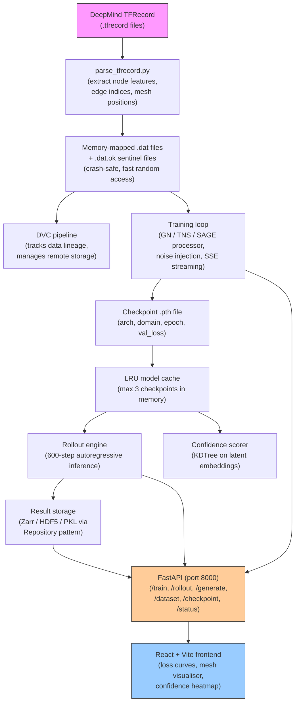

# PhysIQ / MeshGraphNets — System Overview

> **Audience:** ML engineers and senior software engineers preparing for technical interviews.
> **Purpose:** Understand the *why* behind every design decision, not just the *what*.
> **Related files:** [[02_domains_datasets]] | [[03_system_architecture]] | [[04_gnn_architecture]]

---

## The Problem Worth Solving

Imagine you are an aerospace engineer designing a new wing profile, or a chip designer routing cooling channels around a processor die. To know whether your design works, you need to simulate the physics — specifically computational fluid dynamics (CFD). You build a mesh of your geometry, discretise the Navier-Stokes equations across thousands or millions of mesh cells, and run an iterative solver until the solution converges. On a modest workstation, a single high-fidelity simulation might take anywhere from thirty minutes to several hours. In a design loop, you might want to evaluate thousands of design variants. The maths scales poorly: halving mesh element size (to get twice the spatial resolution) typically multiplies runtime by roughly 8× in 3D (the curse of dimensionality hitting both spatial and temporal resolution simultaneously). The result is that engineering design is fundamentally bottlenecked by simulation cost.

This is not a new observation. Engineers have used reduced-order models (ROMs), surrogate models, and response surfaces for decades. The problem with classical surrogates — polynomial chaos, kriging, proper orthogonal decomposition — is that they generalise poorly across geometry changes and require careful, domain-specific feature engineering. They also struggle to capture the non-linear dynamics that matter most: flow separation, vortex shedding, turbulent transitions. They are, essentially, interpolation in a hand-crafted feature space.

The central question of PhysIQ is: **can a learned model replace a physics solver entirely, while being orders of magnitude faster, and without requiring manual feature engineering?**

The answer, as demonstrated by DeepMind's MeshGraphNets (Pfaff et al., ICLR 2021) and the body of work it rests on, is: yes — with important caveats. You can train a graph neural network on trajectories produced by a high-fidelity solver, and then at inference time the GNN predicts the next timestep in milliseconds rather than minutes. The caveats are that (1) you need a library of solver-generated trajectories to train on, (2) the GNN generalises well within its training distribution but can fail on genuinely out-of-distribution geometries, and (3) long rollouts accumulate errors. PhysIQ is a full-stack platform that operationalises this idea: ingest solver data, train GNNs, run fast rollouts, score confidence, and support inverse design.

---

## The Core Insight: Physics on Meshes Is a Graph Problem

Before we talk about neural networks, we need to understand why graph neural networks specifically are the right architecture here. The answer comes from how physics solvers represent their domain.

A finite element or finite volume solver divides the simulation domain into a **mesh** — a collection of small elements (triangles, tetrahedra, hexahedra, etc.). At each mesh **node** (vertex), the solver stores the current state: velocity, pressure, temperature. To update the state at a node, the solver computes fluxes or forces from **neighbouring** nodes, connected through mesh **edges**. This is, by definition, a graph: nodes are vertices, edges are mesh connectivity, and node features are physical state variables.

A regular image is just a special case of this — a grid graph where every node has exactly 4 neighbours (or 8 with diagonals) arranged in a regular Cartesian lattice. Convolutional neural networks exploit this regularity by learning spatially-invariant filter kernels. But physics meshes are *unstructured* — nodes can have 3 neighbours or 12, they can be clustered densely near boundaries and sparse in the free-stream, and the geometry can be an arbitrary curved surface. CNNs are simply the wrong tool. Graph neural networks, which learn message-passing functions that operate on arbitrary graph topology, are the right one.

The MeshGraphNets insight (and the insight that underlies PhysIQ) is that if you faithfully represent the mesh as a graph, with physically meaningful features on nodes and edges, then a GNN trained to predict one-step state updates will learn to approximate the solver's update rule. After training, you simply run the GNN autoregressively — feed its prediction back as input for the next step — to produce a full trajectory. This is the **neural surrogate** idea, and it is the foundation of the entire system.

---

## What PhysIQ Does, End to End

PhysIQ is a full-stack platform with four major capabilities:

**1. Data ingestion and preprocessing.** DeepMind provides simulation data in TFRecord format. PhysIQ parses these into memory-mapped `.dat` files that training code can read efficiently without loading entire datasets into RAM. This step converts a domain-expert format (TFRecord) into a ML-training-friendly format (flat binary arrays on disk). See [[02_domains_datasets]] for the full story.

**2. Training.** Given preprocessed data, PhysIQ trains a MeshGraphNets-style GNN to predict one-step state updates. Three processor variants are supported: the default Graph Network (GN), a Transformer-based variant (TNS), and GraphSAGE (SAGE). Training is streamed via Server-Sent Events (SSE) so the browser shows a live loss curve. On CPU-only Docker hosts, training is dispatched to a remote GPU machine via SSH. See [[04_gnn_architecture]] for the model internals.

**3. Rollout and confidence.** Given a trained checkpoint, PhysIQ runs an autoregressive 600-step rollout: feed the initial state to the GNN, get a prediction, feed the prediction back as the next input, repeat. The result is a full predicted trajectory. A KDTree-based confidence scorer compares latent space embeddings of the query to training examples — if the query is far from anything seen during training, confidence is low. This is a practical safety check for distribution shift.

**4. Inverse design.** Given a desired output (e.g., a target pressure distribution), PhysIQ uses a Conditional Variational Autoencoder (CVAE) plus gradient descent to search for an input design that produces the desired output. This inverts the forward model.

---

## System Data Flow

The diagram below shows data flowing through the system from raw solver output to browser visualisation:



The key insight in this flow is that every stage is decoupled. The data pipeline (TFRecord → memmap) is independent of the training loop. The training loop writes checkpoints independently of the inference engine. The result storage layer is abstracted behind a Repository interface. This decoupling makes it easy to swap components — for example, the storage backend changed from PKL to HDF5 to Zarr without touching the inference code.

---

## Key Numbers

To make this concrete, here are the numbers that matter for any conversation about the system:

| Metric | Value | Notes |
|---|---|---|
| Rollout length | 600 timesteps | Full trajectory prediction |
| Typical node count | ~1,800 nodes | `cylinder_flow`; `flag_simple` varies |
| Processor steps | 15 | Message-passing rounds per timestep |
| Latent dimension | 128 | All MLPs map to 128-dim embeddings |
| Speedup vs FEM | 10–100× | Depends on mesh size and hardware |
| Processor variants | 3 | GN (default), TNS, SAGE |
| Simulation domains | 2 | `cylinder_flow`, `flag_simple` |
| MLP hidden layers | 2 | Each MLP: Linear → ReLU → Linear → ReLU → Linear |
| LRU cache size | 3 | Max checkpoints held in memory |
| Training noise σ | Uniform(0, σ_max) | Injected to combat covariate shift |
| GN learning rate | 1e-4 | Adam optimiser |
| TNS/SAGE learning rate | 3e-5 | Lower due to attention instability |
| Gradient clip norm | 1.0 | TNS and SAGE only |

The 10–100× speedup figure deserves a note. The lower end (10×) applies to relatively fine-grained meshes where the GNN itself has significant computation per step. The upper end (100×) applies to scenarios where the FEM solver is iterating to tight convergence tolerances and the GNN inference is batched efficiently on GPU. The speedup is not free — it comes with the cost of training data (solver must generate trajectories first) and reduced accuracy compared to ground truth. The bet is that for design exploration (where you want fast feedback on many candidates, then do one final high-fidelity check on the best), approximate-but-fast is more valuable than exact-but-slow.

---

## Project Folder Layout

Understanding what each part of the repository does is essential for both onboarding and interviews:

```
meshGraphNets_pytorch/
│
├── model/                          # The GNN itself
│   ├── encoder.py                  # Node + edge feature → 128-dim latent MLPs
│   ├── processor.py                # GN / TNS / SAGE processor blocks (15 steps)
│   ├── decoder.py                  # 128-dim latent → target feature MLPs
│   ├── normalizer.py               # Online Welford running mean/variance
│   └── meshgraphnets.py            # Top-level model: wires encoder→processor→decoder
│
├── data/                           # Data loading and preprocessing
│   ├── parse_tfrecord.py           # DeepMind TFRecord → .dat memmap conversion
│   ├── dataset.py                  # PyTorch Dataset wrapping .dat files
│   └── normalization_stats/        # Cached μ/σ per feature (from training set)
│
├── training/
│   ├── train.py                    # Main training loop with noise injection + SSE
│   └── loss.py                     # One-step MSE on predicted accelerations
│
├── inference/
│   ├── rollout.py                  # 600-step autoregressive inference
│   ├── rollout_ssh.py              # SSH dispatch variant (GPU remote)
│   └── confidence.py               # KDTree latent-space confidence scoring
│
├── inverse/
│   ├── cvae.py                     # Conditional VAE architecture
│   └── generate.py                 # Gradient descent inverse design loop
│   └── generate_ssh.py             # SSH dispatch variant
│
├── pressure/
│   └── poisson_correction.py       # Sparse LU Poisson pressure post-processing
│
├── storage/
│   ├── repository.py               # Protocol definition + concrete implementations
│   ├── pkl_repo.py                 # Legacy pickle storage
│   ├── hdf5_repo.py                # HDF5 storage
│   ├── zarr_repo.py                # Zarr (cloud-native) storage
│   └── factory.py                  # StorageFactory reads storage_config.json
│
├── api/                            # FastAPI backend
│   ├── main.py                     # App entrypoint, middleware, route registration
│   ├── routes/
│   │   ├── train.py                # POST /train → SSE streaming
│   │   ├── rollout.py              # POST /rollout → autoregressive inference
│   │   ├── generate.py             # POST /generate → inverse design
│   │   ├── dataset.py              # GET /dataset → stats + quality metrics
│   │   ├── checkpoint.py           # GET /checkpoint → list .pth metadata
│   │   └── status.py               # GET /status → GPU utilisation, training state
│   └── cache.py                    # LRU model cache (max 3 checkpoints)
│
├── frontend/                       # React + Vite SPA
│   ├── src/
│   │   ├── components/
│   │   │   ├── MeshViewer.tsx      # WebGL mesh visualiser
│   │   │   ├── LossCurve.tsx       # Live SSE-fed training chart
│   │   │   └── ConfidenceMap.tsx   # Per-node confidence heatmap
│   │   └── api/                    # Typed fetch wrappers for each route
│   └── vite.config.ts
│
├── runs/
│   ├── storage_config.json         # Which storage backend to use + path config
│   └── <run_id>/                   # One directory per training run
│       ├── checkpoints/            # .pth files: {arch}_{domain}_{epoch}_{loss}.pth
│       └── results/                # Rollout outputs (format depends on backend)
│
├── docker/
│   ├── Dockerfile                  # CPU-only FastAPI container
│   └── docker-compose.yml
│
├── scripts/
│   ├── ssh_train.sh                # Wrapper: rsync → SSH remote train → scp back
│   └── ssh_rollout.sh
│
└── docs/
    └── technical/
        ├── 01_overview.md          # ← You are here
        ├── 02_domains_datasets.md
        ├── 03_system_architecture.md
        └── 04_gnn_architecture.md
```

The most important thing to notice about this layout is the **separation of concerns**: the `model/` directory knows nothing about storage or HTTP; the `api/` directory knows nothing about GNN internals; the `storage/` directory knows nothing about physics. This is not accidental — it is a deliberate architectural choice that makes each component independently testable and replaceable.

---

## The Two Physics Domains

PhysIQ currently supports two simulation domains, which were chosen to test different physical regimes:

**`cylinder_flow`** is 2D incompressible CFD: fluid flowing around a cylinder, governed by the incompressible Navier-Stokes equations. The characteristic phenomenon is the **Kármán vortex street** — alternating vortices shed from either side of the cylinder at a frequency that depends on Reynolds number. This tests whether the GNN can learn time-periodic, convection-dominated dynamics. It is an Eulerian description: the mesh is fixed, and fluid flows through it.

**`flag_simple`** is cloth dynamics: a rectangular flag clamped at one edge and subject to gravity and aerodynamic loading. It is a Lagrangian description: the mesh nodes *are* the material particles, and they move with the simulation. This tests whether the GNN can handle structural dynamics with large deformations. There is no pressure field in this domain — the physics is entirely different, yet the same graph framework handles it because both domains reduce to "update each node's state based on its neighbours."

The fact that the same model architecture handles both incompressible fluid mechanics and cloth dynamics with only minor data preprocessing changes is perhaps the strongest argument for the GNN-on-mesh approach. See [[02_domains_datasets]] for feature-level details and [[04_gnn_architecture]] for how the model adapts to different output dimensions.

---

## The Confidence Problem

A surrogate model that is confidently wrong is more dangerous than one that says "I don't know." PhysIQ addresses this with a **KDTree-based latent space confidence scorer**. The idea is simple: after encoding a query mesh state into the 128-dimensional latent space, find its K nearest neighbours among training examples (also encoded and stored). The distance to the nearest neighbours is a proxy for how familiar the query is. If the query is far from the training manifold, the model is likely extrapolating, and confidence should be low.

This is not a theoretically rigorous uncertainty estimate — it does not give calibrated probabilities. But it is fast, interpretable, and effective at catching obvious out-of-distribution queries. For a production system, you would want to layer this with more principled methods (Monte Carlo dropout, deep ensembles, conformal prediction), but KDTree similarity is a pragmatic starting point.

---

## Interview Talking Points

When explaining this project in an interview, the narrative arc should be:

1. **Start with the problem.** "Traditional CFD solvers take hours per simulation, which is too slow for design loops where you want to evaluate thousands of candidates. I built a system that replaces the solver with a GNN trained on solver-generated trajectories."

2. **Explain the insight.** "The key insight is that a physics mesh *is* a graph — nodes are mesh vertices, edges are mesh connectivity. Graph neural networks are naturally suited to this because they learn message-passing rules that operate on arbitrary graph topology, exactly like how a physics solver propagates information between mesh neighbours."

3. **Talk about scale and results.** "We support 600-step rollouts with ~1,800 nodes, achieving 10–100× speedup over the underlying solver. We tested on two domains — incompressible CFD and cloth dynamics — to verify the approach generalises across different physics."

4. **Go deep on architecture if asked.** "We implemented three processor variants — a standard Graph Network, a Transformer-based variant, and GraphSAGE. The Transformer variant requires a lower learning rate and gradient clipping because attention weights can produce unstable gradients. See [[04_gnn_architecture]] for the details."

5. **Talk about engineering decisions.** "The system is a full-stack platform: FastAPI backend with SSE streaming for live training curves, React frontend, SSH dispatch to remote GPU machines, a Repository-pattern storage layer that we evolved from pickle to HDF5 to Zarr. Every layer is decoupled so we could evolve the storage backend without touching the model code."

6. **Acknowledge limitations.** "The model is interpolative — it generalises well within its training distribution but can fail on genuinely novel geometries. We address this with a KDTree confidence scorer that flags queries far from the training manifold. Error accumulation in long rollouts is the other key limitation; noise injection during training helps but does not fully solve it."

The ability to go deep on any of these points — from the Welford normaliser to the SSE buffering issue with nginx to the reason we use accelerations rather than absolute values in the decoder — is what distinguishes a candidate who built the system from one who read about it. Each of those details is covered in the remaining files: [[02_domains_datasets]], [[03_system_architecture]], [[04_gnn_architecture]].

---

## Why Now? The Broader Context

MeshGraphNets (Pfaff et al., ICLR 2021) was not the first attempt at physics surrogates, but it was the first to convincingly demonstrate that a single GNN architecture could handle multiple different physical systems on unstructured meshes, in a fully autoregressive rollout, with competitive accuracy. It built on earlier work (Graph Networks, Battaglia et al. 2018; Learning to Simulate, Sanchez-Gonzalez et al. 2020) but the mesh-native representation was the key contribution.

PhysIQ is an engineering project that takes the academic proof-of-concept and wraps it in the production infrastructure needed to actually use it: data pipelines, model versioning, a web interface, confidence scoring, inverse design, and deployment tooling. The gap between "we proved this works in a paper" and "I can hand this to an engineer who has never read the paper and they can use it to accelerate their design workflow" is enormous. That gap is what PhysIQ fills.

---

*Next: [[02_domains_datasets]] — deep dive into the physics of each simulation domain, the data pipeline from TFRecord to memmap, and why we made the storage choices we did.*
