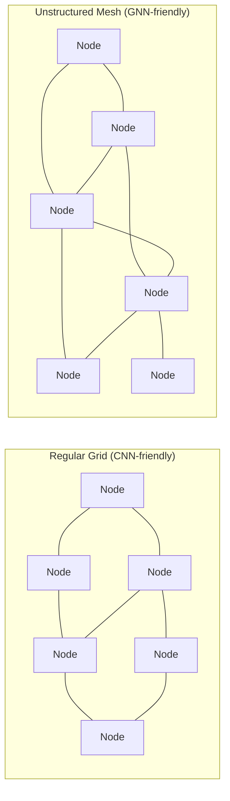
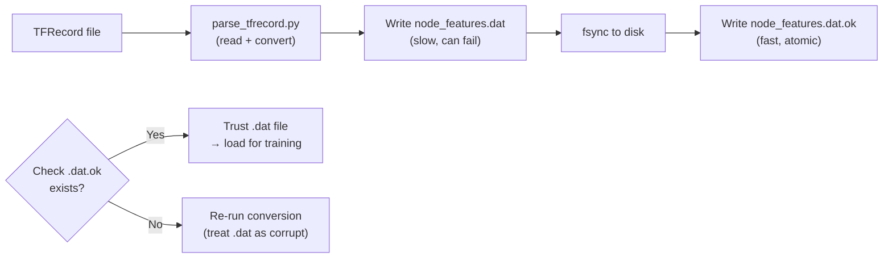

# Domains and Datasets — Physics, Meshes, and the Data Pipeline

> **Audience:** ML engineers and senior software engineers preparing for technical interviews.
> **Purpose:** Understand the physics of each domain, why unstructured meshes are necessary, and every design decision in the data pipeline.
> **Related files:** [[01_overview]] | [[03_system_architecture]] | [[04_gnn_architecture]]

---

## Why Unstructured Meshes? Starting from First Principles

To understand why PhysIQ uses graph neural networks rather than CNNs, you first need to understand why physics solvers use unstructured meshes rather than regular grids.

Consider the simplest possible case: simulating fluid flow over a flat plate in 2D. If the plate is aligned with your coordinate axes and the domain is rectangular, a regular Cartesian grid works fine. You have an `N × M` array of cells, and you can use finite differences to approximate spatial derivatives. CNNs — which are exactly learned finite-difference operators on regular grids — would be a natural choice for a surrogate here.

Now add a circle (the cylinder in `cylinder_flow`). The boundary of the circle does not align with any Cartesian grid. You have two choices:

1. **Staircase approximation:** Force the cylinder boundary to align with your grid by making grid cells very small everywhere. This wastes enormous compute on the far-field (where nothing interesting is happening) just to resolve the boundary.

2. **Unstructured mesh:** Let the mesh elements be triangles (in 2D) or tetrahedra (in 3D) of arbitrary shape and size. Place many small elements near the cylinder boundary (where gradients are steep — the boundary layer) and large elements far from the cylinder (where the flow is nearly uniform). The mesh *conforms* to the geometry.

Unstructured meshing is universally preferred in high-fidelity CFD for exactly this reason: **adaptive resolution**. You resolve physics where it is complex and save compute where it is smooth. A well-designed mesh for `cylinder_flow` might have 30-40 small triangles packed into the boundary layer within a cylinder radius, and 10 large triangles covering the same area in the far field. The ratio of element sizes can easily be 100:1 or higher.

The price you pay is that the mesh has **irregular topology**: each node has a different number of neighbours (degree), and the neighbour relationships are stored as an explicit edge list rather than being implicit in array indexing. This is precisely the graph structure that graph neural networks are designed to operate on.



The left side is what CNNs assume: every node has the same number of neighbours, arranged in a regular lattice. The right side is what physics meshes actually look like: variable degree, irregular spacing, topology dictated by geometry rather than a regular grid. The **mesh is the graph**, and the GNN is the natural architecture for learning on it.

---

## Domain 1: `cylinder_flow` — Incompressible CFD

### The Physics

`cylinder_flow` simulates 2D incompressible viscous flow around a circular cylinder. The governing equations are the **incompressible Navier-Stokes equations**:

```
∂u/∂t + (u · ∇)u = -∇p + ν∇²u    (momentum)
∇ · u = 0                           (incompressibility)
```

Where `u = (vx, vy)` is the velocity vector field, `p` is the (kinematic) pressure field, and `ν` is the kinematic viscosity. The incompressibility constraint `∇ · u = 0` means the fluid cannot be compressed — a reasonable assumption for liquids and low-speed gas flows.

The characteristic phenomenon at moderate Reynolds numbers (Re ~ 100–400) is the **Kármán vortex street**: alternating vortices are shed from either side of the cylinder and advect downstream, forming a periodic, staggered pattern. This shedding has a well-defined frequency (the Strouhal number relates shedding frequency to flow speed and cylinder diameter). The vortex street is one of the most recognised patterns in fluid mechanics, and it is a stringent test for a surrogate model: the model must learn a time-periodic, spatially structured, non-linear dynamics.

The simulation is **Eulerian**: the mesh is fixed in space, and fluid flows through it. At each timestep, the solver updates the velocity and pressure at every mesh node. The GNN must learn to emulate this update.

### Node Features

Each mesh node in `cylinder_flow` carries the following features:

| Feature | Dimension | Description |
|---|---|---|
| `velocity` | 2 | Current velocity `(vx, vy)` in m/s |
| `node_type` | 1 (categorical) | One of 5 types (see below) |
| `mesh_pos` | 2 | Fixed mesh coordinates `(x, y)` |

The **node type** is crucial. It tells the model what boundary condition applies at each node:

- **NORMAL (0):** Interior fluid node. The model predicts velocity and pressure updates here.
- **CYLINDER (1):** Node on the cylinder surface. No-slip boundary: velocity must remain zero. The model should learn not to update these nodes (or to predict zero update).
- **INFLOW (2):** Left boundary. Prescribed inflow velocity (e.g., uniform horizontal flow). Fixed.
- **OUTFLOW (3):** Right boundary. Zero-gradient or pressure boundary condition.
- **WALL (4):** Top/bottom boundaries. No-slip or free-slip, depending on configuration.

Without node type information, the GNN would have no way of knowing which nodes are constrained and which are free — it would try to update all nodes the same way, violating boundary conditions and producing physically wrong results. The node type acts as a **mask** that encodes the boundary condition structure into the graph.

### Output Targets

The model predicts, for each NORMAL (interior) node:

- **Velocity update** `Δ(vx, vy)`: the change in velocity between the current and next timestep.
- **Pressure** `p`: the scalar pressure field (or pressure update, depending on formulation).

Note the key design decision: the model outputs **accelerations** (deltas), not absolute values. The next-timestep velocity is then `v_{t+1} = v_t + Δv`. This is covered in depth in [[04_gnn_architecture]], but the short version is that learning small corrections is much easier than learning the full field — the model only needs to figure out *what changed*, not *what the state is*.

### What the Data Looks Like

A single trajectory in `cylinder_flow` consists of approximately **600 timesteps**, each storing the full mesh state. With ~1,800 nodes per mesh, and 5 features per node, a single trajectory is roughly `600 × 1800 × 5 = 5.4 million` floating-point values — about 21 MB at float32. The full dataset contains hundreds of trajectories with varied cylinder positions, sizes, and inflow velocities, totalling several GB.

The mesh topology (edge indices and edge features) is fixed for a given trajectory — the Eulerian mesh does not move. Edge features encode the relative displacement between connected nodes: `Δx = x_j - x_i`, `Δy = y_j - y_i`, and the edge length `||Δx||`. This gives the model a sense of geometric scale and direction for each message-passing step.

---

## Domain 2: `flag_simple` — Cloth Dynamics

### The Physics

`flag_simple` simulates a rectangular cloth panel (a flag) attached at one edge (the "handle") and subject to gravity and aerodynamic loading. The governing physics is **Lagrangian structural dynamics**: unlike `cylinder_flow` where we track the state of fixed spatial locations (Eulerian), here we track the state of material particles. The mesh nodes *are* the material particles — they move through space as the cloth deforms.

The equations of motion for cloth simulation are essentially Newton's second law applied to each node:

```
m_i * ẍ_i = F_internal(x_i, x_neighbours) + F_external
```

Where `x_i` is the world position of node `i`, `F_internal` comes from spring-like elastic forces between connected nodes (resisting stretching and shearing), and `F_external` includes gravity and aerodynamic drag.

There is no pressure field in this domain — the physics is structurally different from CFD. Yet the same GNN framework handles it, because both domains reduce to the same abstract problem: update each node's state based on its own state and the states of its connected neighbours.

### Node Features

| Feature | Dimension | Description |
|---|---|---|
| `world_pos` | 3 | Current 3D position of the node in world space |
| `mesh_pos` | 2 | Fixed 2D coordinates in the cloth's rest configuration |
| `node_type` | 1 | NORMAL (0) or HANDLE (1) |
| `velocity` (derived) | 3 | Computed from position difference between timesteps |

The **HANDLE** node type marks nodes that are clamped — their positions are prescribed (they are attached to the flagpole). The model must learn that HANDLE nodes do not move, and that they are sources of boundary forces that propagate through the mesh.

### The Verlet Integration Insight

Here is where `flag_simple` gets interesting from an ML perspective. Unlike `cylinder_flow` where the state at each timestep is self-contained (velocity and pressure at time `t` fully determine the update), cloth dynamics requires **momentum information**: a node that is moving fast will keep moving fast even if forces are momentarily zero. In classical simulation this is handled by tracking both position and velocity as separate state variables.

But the dataset provides something more subtle: both the **current position `x_t`** and the **previous position `x_{t-1}`** are given as input features. The velocity is implicitly encoded in the difference `x_t - x_{t-1}`. This is **Verlet integration**: a well-known numerical technique in physics simulation that tracks position at two consecutive timesteps and derives velocity from their difference, rather than storing velocity explicitly.

Why does this matter for the GNN? Because the model input naturally carries momentum information: a node moving fast has a large `x_t - x_{t-1}` difference, and the model can learn to use this to produce appropriate acceleration predictions. The model does not need an explicit velocity feature — the velocity is already encoded in the positional history. This is a domain-specific insight baked into the data representation that comes directly from how Pfaff et al. designed the original MeshGraphNets system.

### Output Targets

The model predicts the **world position update** `Δx_i` for each NORMAL node. The next position is `x_{t+1} = x_t + Δx_t`. The mesh position `mesh_pos` is constant — it is the cloth's rest configuration, used to compute strain (how stretched each mesh edge is compared to its rest length). The edge feature in `flag_simple` therefore includes not just the current geometric displacement but also the rest-length difference, encoding elastic strain.

---

## The Data Pipeline: From TFRecord to Training

### Why TFRecord?

DeepMind generated and released the simulation datasets in **TFRecord format** — Google's serialised binary format for TensorFlow training data. Each record in a TFRecord file contains a serialised `tf.train.Example` protobuf, which is essentially a dictionary mapping string keys to lists of bytes, floats, or integers.

For PhysIQ, TFRecord is the **source-of-truth format** that we do not own or re-engineer. DeepMind provides it; we consume it. The right design decision is therefore to parse it exactly once (at pipeline setup time) and convert it into a format optimised for ML training. Re-parsing TFRecord files during every training run would be wasteful and would introduce a hard dependency on the TensorFlow ecosystem in what is otherwise a pure PyTorch system.

### parse_tfrecord.py: The Conversion Step

The conversion script `data/parse_tfrecord.py` reads each TFRecord file and writes the results into **memory-mapped `.dat` files** (flat binary arrays on disk, using NumPy's `np.memmap`). Specifically, it writes:

- `node_features.dat` — shape `(num_trajectories, num_timesteps, num_nodes, num_node_features)`, dtype `float32`
- `edge_indices.dat` — shape `(num_trajectories, num_edges, 2)`, dtype `int32`
- `edge_features.dat` — shape `(num_trajectories, num_edges, num_edge_features)`, dtype `float32`
- `targets.dat` — shape `(num_trajectories, num_timesteps-1, num_nodes, num_target_features)`, dtype `float32`

The shapes are deliberately chosen so that a single trajectory can be accessed with a single contiguous slice — `node_features.dat[traj_idx]` — without loading the entire dataset.

### Sentinel Files: `.dat.ok`

Every `.dat` file has a corresponding `.dat.ok` sentinel file that is written **only after the `.dat` file is completely written and `fsync`ed**. When the pipeline starts, it checks for `.dat.ok` before trusting a `.dat` file. If `.dat.ok` is absent, the `.dat` file is considered partial and is re-written.

This pattern exists because the conversion process can take tens of minutes for large datasets, and it can be interrupted (machine restart, disk full, SIGTERM). Without sentinels, a partial `.dat` file would silently corrupt training data — the memmap would read garbage from the incompletely written portion, and the model would train on invalid data. The error would be extremely hard to diagnose because the corruption is silent (no exception is raised — you just read wrong numbers).

The sentinel pattern is a form of **write-ahead logging for data files**: do the work, then atomically mark it as complete. It is a standard technique in distributed systems (think Kafka's log segment completion markers, or HBase WAL) applied here to local file I/O.



### Memory-Mapped `.dat` Files: Why?

**Memory-mapped files** (via `numpy.memmap`) are the key data structure for PhysIQ's training pipeline. When you open a memmap file, the operating system does **not** load the entire file into RAM. Instead, it maps the file's pages into the process's virtual address space. When you access a particular element (`node_features[42, 300, ...]`), the OS loads only the relevant page(s) from disk into the page cache. Subsequent accesses to the same page are served from RAM with no disk I/O.

This has several important properties for a training workload:

1. **Datasets larger than RAM work automatically.** A 50 GB dataset can be trained on a machine with 16 GB RAM, because only the accessed pages need to be in memory at any given time. The OS page cache acts as an automatic LRU cache for data.

2. **Random access is efficient.** Training loads random batches across many trajectories and timesteps. With memmap, each random access is an O(1) virtual memory dereference — the OS figures out which page to load. Compare this to HDF5's compression: to decompress an arbitrary chunk you need to read and decompress the entire chunk containing that element, which is wasted work if you only wanted one element.

3. **Zero-copy reads.** NumPy operations on memmap arrays read directly from the OS-managed page cache into the computation. There is no Python-level copy.

4. **No serialization overhead.** The `.dat` files are raw float32 binary. Reading a slice is a single `fread` call under the hood. There is no parsing, no decompression, no format overhead.

The tradeoff is that memmap files are **not cloud-native**: you cannot stream them efficiently over S3 or GCS, and they cannot be read without filesystem access. This is why rollout *results* (which need to be shared and are much smaller) use Zarr (cloud-native, chunked, compressed), while training data (which lives on the same machine as the training process) uses memmap. The right tool for the right job.

### DVC: Pipeline-Aware Data Version Control

PhysIQ uses **DVC (Data Version Control)** to manage the data pipeline rather than git-lfs. It is worth understanding why — this is a common interview topic.

**git-lfs** is a Git extension that stores large binary files in a separate storage system (S3, GCS, etc.) and replaces them in the repository with pointer files. It is a storage solution: it answers "where is this large file?" but it knows nothing about *how that file was produced* or *what it depends on*.

**DVC** is a **pipeline-aware** data management tool. It knows that `node_features.dat` was produced by running `python data/parse_tfrecord.py` on `raw/cylinder_flow.tfrecord`. This relationship is encoded in a `dvc.yaml` pipeline file. Consequently:

- DVC can detect that `node_features.dat` is stale if the source TFRecord file or the parsing script changed.
- DVC can reproduce the entire pipeline from scratch (`dvc repro`) on any machine with access to the remote.
- DVC supports multiple remote backends (S3, GCS, Azure, SSH) with a single config change.
- DVC tracks both data *and* model checkpoints, enabling experiment reproducibility: "this checkpoint was produced by training on this dataset version with these hyperparameters."

For a project where data → preprocessing → training → checkpoint is a directed pipeline with versioned artifacts at each stage, DVC is a far better fit than git-lfs. The ability to run `dvc repro` and get exactly the same checkpoint as a colleague produced three months ago — including re-running data preprocessing if the source data changed — is genuinely valuable for reproducibility.

The tradeoff against DVC is added complexity: engineers need to learn the DVC CLI and pipeline syntax, and DVC stages need to be kept in sync with actual data processing code. For a solo project, this overhead can feel unnecessary. But for a team or for any work that needs to be reproduced later, it pays dividends.

---

## Feature Engineering Decisions

### Why Include `mesh_pos` as a Node Feature?

In `cylinder_flow`, `mesh_pos` (the fixed `(x, y)` coordinates of each mesh node) is included as an input feature. This might seem unnecessary — the model gets edge features encoding relative displacements, so it "sees" the local geometry through those. Why give it absolute coordinates?

The reason is that the flow field is *not* spatially homogeneous: the wake behind the cylinder behaves differently from the free-stream region, and the inflow region behaves differently from the outflow. Absolute position tells the model where in the domain a node is, allowing it to learn position-dependent flow patterns. Without this, the model would need to infer position from the graph topology alone (via multi-hop message passing), which is much harder.

There is a philosophical question here about **inductive bias**: including absolute position makes the model less general (it is tied to a specific geometry/domain size) but more accurate for in-distribution predictions. For a production surrogate where you are always simulating the same class of geometry, this is the right trade-off. For a model meant to generalise across wildly different geometries, you would want to remove absolute position and rely on relative edge features alone.

### Why One-Hot Encode Node Types?

Node types are categorical integers (0–4 for `cylinder_flow`). They are **not** passed as raw integers to the encoder MLP. Instead, they are one-hot encoded (or embedded) into a continuous vector before being concatenated with other node features. 

The reason is that raw integers imply an ordering (node type 2 is "twice" node type 1), which is semantically meaningless — INFLOW and OUTFLOW boundaries are not more "similar" to each other just because their integer codes are 1 apart. One-hot encoding treats each type as a distinct, equidistant category. In practice, a learned embedding table (nn.Embedding) is preferable to a fixed one-hot for large type vocabularies, but for 5 types the difference is negligible.

### Edge Features in Detail

Edges in PhysIQ carry features that describe the geometric relationship between their endpoint nodes:

**For `cylinder_flow`:**
- `Δx = x_j - x_i` (relative position x)
- `Δy = y_j - y_i` (relative position y)
- `||Δ|| = sqrt(Δx² + Δy²)` (edge length)
- `edge_type` (one-hot): mesh edge vs. world edge (some implementations add "world" edges connecting distant nodes that influence each other aerodynamically)

**For `flag_simple`:**
- `Δx_world = x_j^{world} - x_i^{world}` (current world displacement)
- `Δx_mesh = x_j^{mesh} - x_i^{mesh}` (rest configuration displacement)
- `||Δ_world|| - ||Δ_mesh||` (strain: how stretched the edge is vs. rest length)
- `edge_type` (one-hot)

The strain feature in `flag_simple` is particularly important: it is the elastic driving force for cloth restoration. A highly strained edge wants to return to its rest length — this creates a restoring force on both endpoint nodes. By encoding strain explicitly, the model does not have to compute it implicitly from the world and mesh positions; it is handed directly as a feature.

---

## Storage Architecture for Results

### The Evolution: PKL → HDF5 → Zarr

PhysIQ's storage layer went through three generations, and understanding why is a good exercise in engineering trade-offs.

**Generation 1: Pickle (PKL).** The simplest possible approach: `pickle.dump(results_dict, f)`. It works for small experiments. It fails completely at scale: pickle files cannot be partially read (you must deserialise the entire file to get one trajectory), they are not interoperable (can only be read by Python), and they are not cloud-native.

**Generation 2: HDF5.** HDF5 is a hierarchical binary format designed for scientific data. It supports chunked storage, compression, partial reads, and metadata. It is the standard in scientific computing (HDF5 is used by virtually every major scientific code from NumPy to h5py to neuroscience data archives). PhysIQ's HDF5 storage groups trajectories as datasets under run-specific groups, allowing selective reading.

The limitation of HDF5 is that it is designed for local or POSIX-shared filesystems. While there are S3-backed HDF5 drivers, they are notoriously unreliable for concurrent access — HDF5 uses byte-range locking internally, and cloud object stores do not provide POSIX byte-range locks.

**Generation 3: Zarr.** Zarr is a cloud-native array storage format. Each Zarr array is stored as a collection of **chunk files** — typically small (a few MB each) independent objects, each containing one chunk of the array compressed with LZ4/Blosc/Zstd. Because each chunk is a separate object, Zarr works natively with S3, GCS, and Azure Blob Storage: reading chunk `(2, 5)` is just an HTTP GET for object `2/5` in the Zarr store. There are no locks, no format drivers, no byte-range issues.

Zarr also supports **lazy reading via Dask**: a 100 GB Zarr array can be opened in milliseconds, and computations on it are expressed as a computation graph that Dask executes chunk-by-chunk. This makes large-scale analysis of rollout results practical without loading everything into RAM.

The current architecture keeps all three backends (via the Repository pattern — see [[03_system_architecture]]) because different deployment contexts have different needs: local development uses PKL for simplicity, on-premise cluster uses HDF5, and cloud deployment uses Zarr.

---

## Data Quality and Statistics

The `/dataset` API endpoint provides several data quality metrics that are computed at load time:

**Mesh quality metrics:** For each mesh in the dataset, we compute:
- **Aspect ratio** of mesh elements (triangles with very elongated shapes cause numerical issues in both FEM solvers and GNNs — long thin triangles have very different effective edge lengths along their two axes)
- **Minimum/maximum element area** (as a proxy for resolution uniformity)
- **Node degree distribution** (minimum, maximum, mean, standard deviation of node connectivity)

**Feature statistics:** Running mean and standard deviation of each node feature and target feature across the training set. These statistics are used by the [[04_gnn_architecture]] normalizer.

**Outlier detection:** Using isolated forest or simple Z-score thresholding on trajectory-level statistics (e.g., maximum velocity in a trajectory) to flag trajectories that are suspiciously far from the rest of the dataset. These could indicate solver convergence failures or data corruption.

These quality metrics serve two purposes: debugging (if training is unstable, checking mesh quality can reveal degenerate elements causing extreme feature values) and model validation (if inference is producing garbage, checking whether the input mesh is within the training distribution's quality envelope is a useful diagnostic).

---

## Design Decisions: Summary and Tradeoffs

| Decision | What was chosen | Why | Tradeoff |
|---|---|---|---|
| Training data format | NumPy memmap `.dat` | O(1) random access, no deserialization overhead, works with datasets larger than RAM | Not cloud-native; files must be on local filesystem |
| Source data format | TFRecord (kept as-is) | DeepMind provides it; no need to re-engineer | Hard dependency on TFRecord parsing at pipeline setup |
| Sentinel files | `.dat.ok` per `.dat` | Crash-safe: prevents reading partial/corrupt data | Extra file per data file; pipeline must check before reading |
| Data versioning | DVC (not git-lfs) | Pipeline-aware: tracks lineage, enables `dvc repro`, supports remote backends | More complex than git-lfs; team must learn DVC |
| Results storage | Zarr (evolution from PKL → HDF5 → Zarr) | Cloud-native, chunked, compressed, lazy reads via Dask | Zarr tooling less mature than HDF5; extra dependency |
| Velocity representation (flag_simple) | Implicit via Verlet (x_t, x_{t-1}) | Matches classical physics integrator; no explicit velocity needed | Must always provide two timesteps of position history, not just one |
| Absolute position as feature | Yes (`mesh_pos` included) | Allows position-dependent flow patterns to be learned | Reduces generalisability to different domain sizes/geometries |
| Node type encoding | One-hot / embedding | Avoids false ordinal relationships between boundary types | Small fixed vocabulary; embedding not strictly necessary |

---

## Interview Talking Points

**On unstructured meshes:** "The core reason we use GNNs rather than CNNs is that physics meshes are unstructured — variable node degree, topology determined by geometry. A CNN assumes a regular grid, which is a special case that doesn't apply here. GNNs operate on arbitrary graph topology, which is exactly what we need."

**On the data pipeline:** "We parse DeepMind's TFRecord format exactly once, convert to memory-mapped flat binary files, and use sentinel files to ensure crash safety. During training, we access random batches via memmap — the OS page cache handles keeping hot data in RAM. This gives us O(1) random access across a multi-GB dataset without loading it all into memory."

**On DVC vs. git-lfs:** "git-lfs is a storage solution — it tells you where the file is. DVC is pipeline-aware — it tells you *how the file was produced* and can reproduce the entire pipeline from scratch. For a project where data → preprocessing → training → checkpoint is a directed pipeline with versioned artifacts, DVC is the right abstraction."

**On Verlet integration:** "For cloth dynamics, we don't store explicit velocity — instead we give the model both the current and previous timestep positions. The velocity is implicitly encoded in their difference. This is Verlet integration, a standard technique in physics simulation. The model learns to use this positional history to carry momentum information through the trajectory."

**On the storage evolution:** "We went PKL → HDF5 → Zarr for results storage. PKL doesn't support partial reads. HDF5 works locally but breaks on cloud object stores due to POSIX locking assumptions. Zarr stores each chunk as an independent object, which maps cleanly to S3 key-value semantics. That's the right choice for cloud-native deployment."

---

*Next: [[03_system_architecture]] — the full-stack platform: FastAPI routes, SSH GPU dispatch, the Repository pattern for storage, and every engineering decision in between.*
