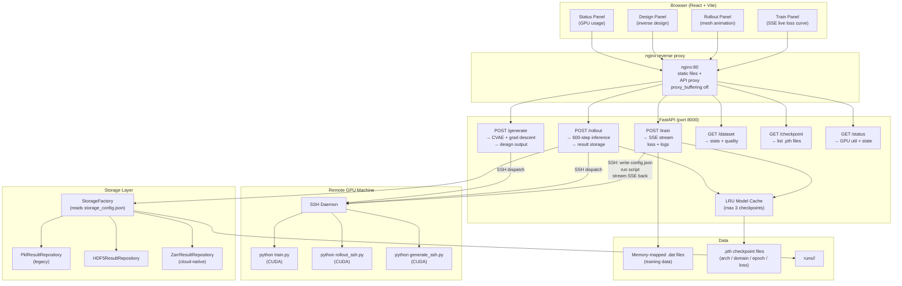
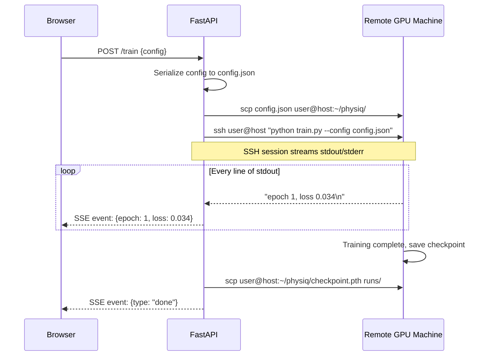

# System Architecture — FastAPI, SSE, SSH Dispatch, and the Storage Layer

> **Audience:** ML engineers and senior software engineers preparing for technical interviews.
> **Purpose:** Understand every architectural decision in the PhysIQ platform: why each component exists, how it connects to the others, and the engineering trade-offs at every layer.
> **Related files:** [[01_overview]] | [[02_domains_datasets]] | [[04_gnn_architecture]]

---

## The Architectural Challenge

Deploying a research-grade GNN as a usable product is not primarily a machine learning problem — it is a software engineering problem. The model itself (covered in [[04_gnn_architecture]]) is relatively self-contained: given graph inputs, produce graph outputs. The hard part is everything around it:

- How do you expose training and inference to a browser without the user needing to understand PyTorch?
- How do you handle the fact that training takes hours and the browser would time out on a synchronous HTTP request?
- How do you deal with CPU-only Docker containers when the model needs a GPU?
- How do you store results in a format that works for local development, on-premise clusters, *and* cloud deployment?
- How do you avoid re-loading a 200MB checkpoint from disk on every prediction request?

Each of these is a non-trivial engineering problem. PhysIQ's architecture addresses them one by one, and the design decisions are the interesting part. This file walks through the system component by component, starting from the overall shape and drilling into each piece.

---

## Full System Architecture



The first thing to notice is that **the FastAPI server is not always the compute engine**. For training and inference, it may delegate to a remote GPU machine via SSH. The FastAPI process itself is lightweight — it manages HTTP connections, coordinates state, serves the storage layer, and proxies compute to wherever the GPU is. This separation is forced by the CPU-only Docker constraint (described below), but it turns out to be a good architecture anyway: it separates the web serving concern from the compute concern.

---

## FastAPI: Why This Framework?

PhysIQ uses **FastAPI** as its HTTP framework. This choice is worth explaining because there are many options (Flask, Django, Tornado, Starlette, aiohttp) and each represents a different philosophy.

**Async-native.** FastAPI is built on Starlette (async) and runs on Uvicorn (ASGI). This means route handlers can be `async def`, allowing them to `await` I/O operations (file reads, subprocess calls, SSH connections) without blocking the event loop. For PhysIQ, this is essential: the `/train` endpoint needs to manage a long-running subprocess and stream its output back to the client without blocking other requests. With a synchronous framework (Flask), you would need a separate thread pool or a task queue (Celery, RQ) to handle this — more infrastructure, more moving parts.

**Pydantic validation.** FastAPI uses Pydantic models for request and response validation. Every route has a typed schema; if the client sends invalid JSON (wrong types, missing required fields), FastAPI returns a 422 with a detailed error message before your handler code even runs. For a system where training jobs are configured via JSON payloads, this catches configuration errors early and avoids cryptic Python tracebacks from deep inside the training loop.

**Automatic OpenAPI documentation.** FastAPI generates an interactive Swagger UI at `/docs` and a ReDoc UI at `/redoc` from your route definitions, with no extra work. During development, this is invaluable: you can test every endpoint from the browser, see all the schemas, and share the API spec with frontend developers. For a full-stack project where frontend and backend developers need to stay in sync, this removes an entire class of integration bugs.

**SSE support.** FastAPI supports Server-Sent Events via `EventSourceResponse` from the `sse-starlette` library. This is the mechanism for streaming live training progress to the browser. SSE is discussed in detail below.

---

## The Six Routes in Detail

### `POST /train` — Streaming Training Progress

The most complex route. A client sends a training configuration:

```json
{
  "domain": "cylinder_flow",
  "processor": "GN",
  "epochs": 100,
  "learning_rate": 1e-4,
  "noise_std": 0.02,
  "batch_size": 4,
  "remote": true
}
```

The handler needs to start a training process and stream progress back to the client in real time. This is inherently a long-running, stateful operation — completely unlike a typical REST request/response pattern.

The handler does the following:

1. **Validates** the configuration via Pydantic. If `processor` is "TNS" but `learning_rate` is 1e-4, it should ideally warn that TNS typically needs 3e-5 (this could be a Pydantic validator).
2. **Decides whether to run locally or via SSH** based on `remote: true` and whether a GPU is available locally. If remote, it serialises the config to a JSON file, copies it to the remote via `scp`, and runs the training script on the remote via SSH.
3. **Opens a subprocess** (either local `python training/train.py --config ...` or remote `ssh user@gpu_host "python train.py --config ..."`).
4. **Reads stdout/stderr** from the subprocess line by line and yields each line as an SSE event.
5. **On completion**, emits a final SSE event with `{"type": "done", "checkpoint_path": "..."}`.

The SSE response looks like this from the client's perspective:

```
data: {"type": "loss", "epoch": 1, "train_loss": 0.0341, "val_loss": 0.0389}

data: {"type": "loss", "epoch": 2, "train_loss": 0.0298, "val_loss": 0.0331}

data: {"type": "log", "message": "Saved checkpoint: GN_cylinder_flow_002_0.0331.pth"}

data: {"type": "done", "checkpoint": "runs/run_001/checkpoints/GN_cylinder_flow_100_0.0089.pth"}
```

The React frontend opens an `EventSource` connection to `/train`, listens for events, and updates the live loss chart with each `"loss"` event.

### `POST /rollout` — Autoregressive Inference

Takes a trained checkpoint path and an initial condition (mesh state at t=0), runs the GNN autoregressively for 600 steps, stores the result, and returns a result ID.

The key subtlety here is the **LRU model cache**. Loading a checkpoint from disk involves reading a potentially large `.pth` file, deserialising it with `torch.load`, initialising the model architecture, and loading the state dict. This can take 1–5 seconds. For interactive use where a user might run multiple rollouts with the same checkpoint, repeating this every time would be unacceptably slow.

PhysIQ maintains an **LRU cache of the last 3 loaded models** in memory:

```python
# api/cache.py (conceptual)
from functools import lru_cache
from collections import OrderedDict

class ModelCache:
    def __init__(self, maxsize=3):
        self._cache = OrderedDict()
        self._maxsize = maxsize

    def get(self, checkpoint_path: str) -> MeshGraphNets:
        if checkpoint_path in self._cache:
            self._cache.move_to_end(checkpoint_path)  # mark as recently used
            return self._cache[checkpoint_path]
        model = self._load(checkpoint_path)
        self._cache[checkpoint_path] = model
        if len(self._cache) > self._maxsize:
            self._cache.popitem(last=False)  # evict LRU
        return model

    def _load(self, path: str) -> MeshGraphNets:
        checkpoint = torch.load(path, map_location='cpu')
        model = build_model(checkpoint['config'])
        model.load_state_dict(checkpoint['model_state_dict'])
        model.eval()
        return model
```

The maxsize of 3 is a deliberate choice: 3 checkpoints (potentially 3 different architectures or domains) are a reasonable in-memory footprint for typical interactive usage. A power user might compare all three processor variants on the same domain, which requires exactly 3 models — so 3 is the natural maximum. More than 3 starts to consume significant RAM (each model is 5–20 MB depending on processor depth), with diminishing returns on cache hit rate.

### `POST /generate` — Inverse Design

The inverse design pipeline takes a **target output specification** (e.g., "I want the pressure at these mesh locations to be this distribution") and searches for an input design that produces it. This involves:

1. Sampling from a CVAE latent space to get an initial design candidate.
2. Running the forward model (the GNN) on the candidate to get a predicted output.
3. Computing the loss between predicted output and target.
4. Backpropagating through the GNN to get gradient with respect to the design parameters.
5. Taking a gradient step to update the design.
6. Repeating for N iterations.

This is essentially differentiable optimisation through the GNN. The result is a design that, according to the surrogate model, should produce the target output. Whether it actually does depends on the accuracy of the surrogate and the degree of distribution shift.

The route streams intermediate results (current design state, current loss) via SSE so the user sees the optimisation converging in real time.

### `GET /dataset` — Statistics and Quality

Returns statistics about the training dataset: feature distributions, mesh quality metrics (aspect ratio, node degree), outlier trajectories. Used for data exploration and debugging. See [[02_domains_datasets]] for the full description of what these metrics mean.

### `GET /checkpoint` — List Checkpoints with Metadata

Lists all `.pth` checkpoint files in `runs/`, parsing each filename and checkpoint metadata to return a structured list:

```json
[
  {
    "path": "runs/run_001/checkpoints/GN_cylinder_flow_100_0.0089.pth",
    "arch": "GN",
    "domain": "cylinder_flow",
    "epoch": 100,
    "val_loss": 0.0089,
    "created_at": "2026-04-15T14:23:11Z"
  },
  ...
]
```

The frontend uses this to populate a dropdown of available checkpoints for rollout. The naming convention `{arch}_{domain}_{epoch}_{val_loss}.pth` makes the key metadata human-readable from the filename alone — useful when browsing the filesystem directly.

### `GET /status` — GPU Utilisation and Training State

Polls `nvidia-smi` (locally or via SSH to the remote GPU machine) for GPU utilisation, memory usage, and temperature. Also returns the current training state: "idle", "training (epoch 47/100, loss 0.023)", "running rollout", etc. The frontend polls this endpoint every few seconds to keep the status panel current.

---

## SSE vs. WebSocket: A Deliberate Choice

PhysIQ uses **Server-Sent Events (SSE)** rather than WebSockets for streaming training progress. This is a meaningful architectural choice.

**WebSockets** provide full-duplex communication: the client and server can send messages to each other at any time over a persistent TCP connection. This is necessary for bidirectional protocols (chat applications, multiplayer games, collaborative editors).

**SSE** is unidirectional: the server pushes events to the client, and the client cannot send messages back over the same connection. It is implemented over standard HTTP, using a `Content-Type: text/event-stream` response with `Transfer-Encoding: chunked`.

For training progress streaming, unidirectional is *sufficient* — the server is streaming loss values and logs, and the client does not need to send anything back mid-stream (the training job was fully configured in the initial POST request). SSE is simpler to implement (no separate protocol, no upgrades, works with standard HTTP middleware), simpler to debug (it is just HTTP), and reconnects automatically if the connection drops (the browser's `EventSource` API handles reconnection with the `Last-Event-ID` header).

The one significant complication is **nginx buffering**: by default, nginx buffers upstream responses before forwarding them to the client. For SSE, this means the client might not receive events until nginx's buffer fills up — defeating the purpose of streaming. The fix is:

```nginx
location /api/ {
    proxy_pass http://fastapi:8000;
    proxy_buffering off;                    # Don't buffer the response
    proxy_cache off;                        # Don't cache
    chunked_transfer_encoding on;           # Enable chunked encoding
    proxy_set_header Connection '';         # Keep connection alive
    proxy_http_version 1.1;                 # Required for chunked encoding
}
```

The `proxy_buffering off` directive is the critical one. Without it, SSE events arrive in the browser with delays proportional to nginx's buffer size. With it, each SSE event is forwarded immediately. This is a subtle operational detail that is easy to miss and extremely frustrating to debug — you see the training complete before the first event arrives in the browser.

---

## SSH Remote GPU Dispatch: The CPU-Only Container Problem

### Why the Problem Exists

PhysIQ's Docker containers are **CPU-only**. NVIDIA GPU passthrough in Docker requires the `nvidia-container-toolkit` on the host, and the deployment environment does not support this (the host machines may not have NVIDIA drivers, or the deployment policy prohibits it). But training a GNN without a GPU takes 10–50× longer — completely impractical for any serious use.

The solution is to run the Docker container as an API server and dispatcher, and do the actual compute on a **remote machine with a GPU** via SSH. The remote machine does not run in a container; it is a bare-metal or VM host with CUDA drivers and a GPU.

### The SSH Dispatch Pattern

Every compute-intensive operation has two implementations: a local variant and an SSH variant. The SSH variant follows a consistent three-step pattern:



The key insight is that FastAPI acts as a **transparent proxy**: it forwards the config, pipes the stdout stream back as SSE events, and retrieves the result artifact. The GPU machine knows nothing about HTTP or SSE — it just runs a Python script and writes output.

### Scripts: `rollout_ssh.py` and `generate_ssh.py`

These follow the same pattern as SSH training dispatch. `rollout_ssh.py`:

1. Reads a config JSON (the initial mesh state and checkpoint path) from a known location on the remote.
2. Runs the rollout on GPU.
3. Saves the result to a Zarr store on the remote.
4. Emits progress events to stdout (which FastAPI reads).
5. On completion, `scp` transfers the Zarr store back to the local machine.

The identical structure for training, rollout, and generation (`ssh dispatch → stdout streaming → artifact retrieval`) means there is essentially one pattern to understand, applied three times. This is the "boring" kind of engineering that is actually very maintainable.

### SSH Key Management and Security

The FastAPI container has an SSH private key mounted as a Docker secret. The remote GPU machine has the corresponding public key in `~/.ssh/authorized_keys`. The connection uses `StrictHostKeyChecking=yes` with a known_hosts file (also mounted) to prevent MITM attacks. The remote user has minimal permissions: write access to the `~/physiq/` working directory, read access to the training data directory, and the ability to run `python`. It cannot `sudo` or access other users' data.

---

## The Storage Layer: Repository Pattern

### Why Abstract Storage?

The storage layer is behind a **Repository Pattern**: a protocol (interface) that defines how results are stored and retrieved, with multiple concrete implementations (PKL, HDF5, Zarr). The specific backend is selected at runtime via `runs/storage_config.json`:

```json
{
  "backend": "zarr",
  "zarr": {
    "base_path": "runs/results/",
    "compression": "lz4",
    "chunk_shape": [1, 600, 1800, 5]
  }
}
```

The result-writing code calls `repo.save(run_id, trajectory)`, and `repo` could be any of the three implementations. The training and inference code knows nothing about whether results are going to pickle files, HDF5 groups, or Zarr stores.

This matters because the right storage backend depends on deployment context:
- **Local development:** PKL — zero setup, easy to inspect with Python.
- **On-premise cluster:** HDF5 — mature tooling, POSIX filesystem, compression.
- **Cloud deployment:** Zarr — cloud-native, chunked, works with S3/GCS.

Without the abstraction, switching backends requires modifying training/inference code. With the abstraction, you change one line in `storage_config.json`.

### Why Protocol, Not ABC?

PhysIQ uses Python's **`typing.Protocol`** rather than an abstract base class (`abc.ABC`) to define the Repository interface:

```python
# storage/repository.py
from typing import Protocol, runtime_checkable
import numpy as np

@runtime_checkable
class ResultRepository(Protocol):
    def save(self, run_id: str, trajectory: np.ndarray, metadata: dict) -> None: ...
    def load(self, run_id: str) -> tuple[np.ndarray, dict]: ...
    def list_runs(self) -> list[str]: ...
    def delete(self, run_id: str) -> None: ...
```

The difference between Protocol and ABC is fundamental to Python's type system:

- **ABC (nominal subtyping):** A class is a `ResultRepository` if and only if it explicitly inherits from `ResultRepository` and implements all abstract methods. The inheritance relationship is explicit.
- **Protocol (structural subtyping):** A class is a `ResultRepository` if it has the right methods with the right signatures — regardless of whether it inherits from `ResultRepository`. This is duck typing with type checking.

The Protocol approach means you can treat any object that has `.save()`, `.load()`, `.list_runs()`, `.delete()` methods as a `ResultRepository`, without forcing it to inherit from a specific base class. This is more flexible and more Pythonic: you could wrap a third-party storage library (e.g., `mlflow.tracking.MlflowClient`) as a `ResultRepository` without modifying the library or creating an adapter subclass. You just verify it structurally satisfies the Protocol.

With `@runtime_checkable`, you can also use `isinstance(obj, ResultRepository)` at runtime, which is useful for validation at the factory:

```python
# storage/factory.py
def create_repository(config: dict) -> ResultRepository:
    backend = config["backend"]
    if backend == "zarr":
        repo = ZarrResultRepository(config["zarr"])
    elif backend == "hdf5":
        repo = HDF5ResultRepository(config["hdf5"])
    elif backend == "pkl":
        repo = PklResultRepository(config["pkl"])
    else:
        raise ValueError(f"Unknown storage backend: {backend}")
    assert isinstance(repo, ResultRepository), f"{type(repo)} doesn't satisfy ResultRepository protocol"
    return repo
```

### StorageFactory

The `StorageFactory` is a simple factory function that reads `runs/storage_config.json` and returns the appropriate `ResultRepository` instance. It is called once at application startup and the result is held in application state. There is no need to re-read the config on every request — storage backends do not change at runtime.

---

## The LRU Model Cache in Depth

The LRU cache deserves more attention because it is a classical data structure with specific implementation choices.

**Why max 3?** A PyTorch model with 15 processor steps, 128 latent dimensions, and 2-layer MLPs has roughly 3–5 million parameters, occupying 12–20 MB of RAM at float32. Three such models use 36–60 MB — a small and acceptable footprint. More importantly, the most common interactive workflow is comparing all three processor variants (GN, TNS, SAGE) for the same domain — exactly 3 models. Choosing maxsize=3 means the full comparison workflow never evicts from cache.

**LRU vs. LFU:** Least-Recently-Used eviction is appropriate here because checkpoint usage tends to be *session-local*: a user works with one or two checkpoints during a session, then moves on. LRU captures this pattern: recently used checkpoints stay in cache. Least-Frequently-Used (LFU) would be problematic during extended sessions where a rarely-used-but-important checkpoint from early in the session gets evicted.

**Thread safety:** FastAPI routes run in an async event loop, but `torch.load` is synchronous and can be CPU-intensive. The LRU cache must be thread-safe if multiple requests arrive simultaneously (FastAPI can serve concurrent requests on multiple threads via its threadpool for sync routes). The `OrderedDict` operations in the LRU implementation need to be protected by a lock:

```python
import threading

class ModelCache:
    def __init__(self, maxsize=3):
        self._cache = OrderedDict()
        self._maxsize = maxsize
        self._lock = threading.Lock()

    def get(self, checkpoint_path: str) -> MeshGraphNets:
        with self._lock:
            if checkpoint_path in self._cache:
                self._cache.move_to_end(checkpoint_path)
                return self._cache[checkpoint_path]
        # Load outside the lock to avoid blocking other cache lookups
        model = self._load(checkpoint_path)
        with self._lock:
            # Double-check: another thread might have loaded it while we were loading
            if checkpoint_path not in self._cache:
                self._cache[checkpoint_path] = model
                if len(self._cache) > self._maxsize:
                    self._cache.popitem(last=False)
            return self._cache[checkpoint_path]
```

The double-checked locking pattern ensures that if two requests arrive simultaneously for the same un-cached checkpoint, only one loads it from disk — the second finds it in the cache after acquiring the lock.

---

## The Poisson Pressure Correction Module

`cylinder_flow` simulations have a physical constraint that the GNN may not perfectly satisfy: the **incompressibility condition** `∇ · u = 0`. A GNN predicts velocity updates as a learned function; there is no guarantee that the predicted velocity field is divergence-free. In practice, GNN predictions accumulate small divergence errors over long rollouts, which can cause unphysical pressure artefacts.

The **Poisson pressure correction** in `pressure/poisson_correction.py` is a post-processing step that enforces incompressibility after the GNN update. It solves the Poisson equation for a pressure correction:

```
∇²φ = ∇ · u*   (where u* is the GNN-predicted velocity)
u_corrected = u* - ∇φ
```

This is a linear system: `Aφ = b`, where `A` is the discrete Laplacian matrix (sparse, size `N × N` for `N` mesh nodes) and `b` is the discrete divergence of the predicted velocity. The solution uses **sparse LU factorisation** (via `scipy.sparse.linalg.splu`).

The LU factorisation is computed **once** for a given mesh topology and reused across all timesteps. For a fixed mesh, `A` is constant — only `b` changes at each timestep. LU factorisation has cost `O(N^{1.5})` for sparse 2D problems (via nested dissection ordering), but once the factorisation is stored, solving for each new `b` is `O(N log N)`. For 1800 nodes, this is effectively instantaneous.

This module is an example of **physics-informed post-processing**: rather than trying to train the GNN to be perfectly divergence-free (which would require adding a divergence-free constraint to the loss function and is hard to implement correctly), we let the GNN predict freely and then project the prediction onto the space of divergence-free fields. The projection is cheap and exact. This is a common pattern in physics-ML: use the ML model for the hard nonlinear part, use classical numerics for the easy linear constraint.

---

## Confidence Scoring: KDTree on Latent Embeddings

The confidence scorer in `inference/confidence.py` answers the question: "For this input mesh state, how confident should we be in the GNN's prediction?"

The approach is **K-nearest neighbours in latent space**:

1. At training time, encode every training sample through the GNN encoder and save the resulting 128-dimensional latent embeddings. Store these in a KDTree.
2. At inference time, encode the query sample through the same encoder and query the KDTree for its K nearest neighbours.
3. The **mean distance** to the K nearest neighbours is the confidence score (inverted: small distance = high confidence, large distance = low confidence).

The per-node confidence can be visualised as a heatmap overlaid on the mesh — nodes where the latent embedding is far from training examples are highlighted in red, indicating the model may be unreliable for those specific mesh regions.

This is not a Bayesian uncertainty estimate. It does not give you a calibrated probability that the prediction error exceeds some threshold. But it is:

- **Fast:** KDTree queries are O(log N) per query.
- **Interpretable:** "This node is far from training examples" is a meaningful statement.
- **Actionable:** If confidence is low everywhere, the query is out-of-distribution and the user should treat the prediction with skepticism.
- **No extra training required:** The KDTree is built from encoder embeddings, which are already computed during training.

The limitation is that latent-space distance is a proxy, not a ground truth. The GNN encoder may map physically different states to similar latent embeddings if they look similar to the encoder's learned features, and vice versa. A more rigorous approach would use Bayesian neural networks or deep ensembles, but these multiply the training cost by the ensemble size.

---

## Frontend Architecture: React + Vite

The frontend is a React single-page application built with **Vite**. It communicates with FastAPI through nginx (in production) or a Vite development proxy (in development). The decoupling between frontend and backend provides several benefits:

**Independent deployment:** The frontend can be deployed to a CDN (S3 + CloudFront, Netlify, Vercel) and call the FastAPI backend at a different origin. The nginx configuration in the Docker Compose setup handles CORS and proxying for single-host deployment.

**TypeScript type safety:** API response types are defined as TypeScript interfaces that mirror the Pydantic response models in FastAPI. Any schema changes that break this contract are caught at compile time rather than at runtime in production.

**Component architecture:**

- `MeshViewer.tsx`: A WebGL-based mesh visualiser using `Three.js`. Renders the mesh as a collection of triangles, coloured by a scalar field (velocity magnitude, pressure, confidence). Supports animation by cycling through rollout timesteps.
- `LossCurve.tsx`: A live chart (using `recharts` or `Chart.js`) that subscribes to the `/train` SSE stream and updates in real time.
- `ConfidenceMap.tsx`: Overlays per-node confidence scores on the mesh as a colour gradient from green (high confidence) to red (low confidence).

---

## Design Decisions: Summary and Tradeoffs

| Decision | What was chosen | Why | Tradeoff |
|---|---|---|---|
| HTTP framework | FastAPI | Async-native, Pydantic validation, auto OpenAPI docs, SSE support | More opinionated than Flask; steeper initial learning curve |
| Streaming protocol | SSE (not WebSocket) | Unidirectional is sufficient; simpler; auto-reconnect | Can't send client→server messages mid-stream |
| nginx proxy | `proxy_buffering off` | Ensures SSE events forwarded immediately | Must remember this config — easy to miss, hard to debug |
| GPU access | SSH dispatch to remote GPU | Works with CPU-only Docker containers | Network latency for config/checkpoint transfer; more moving parts |
| Model persistence | LRU cache (max 3) | Avoids repeated checkpoint deserialization | Memory footprint of 3 loaded models (~60 MB) |
| Storage abstraction | Repository Protocol | Swap backends without touching inference code | More indirection; Protocol requires disciplined type annotations |
| Storage backend | Zarr (primary), HDF5 (on-premise), PKL (local dev) | Cloud-native for production, mature for on-premise, simple for dev | Three backends to maintain; StorageFactory complexity |
| Pressure correction | Sparse LU (post-processing) | Enforces incompressibility exactly; fast after one-time factorisation | Only corrects velocity divergence; does not fix other GNN errors |
| Confidence scoring | KDTree on latent embeddings | Fast, interpretable, no extra training | Not calibrated; latent-space distance is a proxy |
| Type system | Protocol (structural) not ABC (nominal) | More flexible; no inheritance required for third-party adapters | Requires discipline to maintain type correctness |

---

## Interview Talking Points

**On SSE vs WebSocket:** "Training progress is a server-push pattern — the client just wants to receive updates, it doesn't need to send anything back mid-stream. SSE is a simpler protocol for this: it's just HTTP with chunked encoding, the browser reconnects automatically, and it integrates with standard HTTP middleware. WebSockets would add complexity without adding value here."

**On the nginx SSE buffering issue:** "There's a subtle production issue with SSE behind nginx: nginx buffers upstream responses by default, so SSE events might not reach the browser until the buffer fills. The fix is `proxy_buffering off` in the nginx config. This is the kind of thing that works perfectly in development (no proxy) and breaks mysteriously in production (with nginx)."

**On SSH GPU dispatch:** "Our Docker containers are CPU-only, but training a GNN without a GPU is impractical. Rather than trying to thread CUDA support through the container setup, we separated the concerns: the FastAPI container handles HTTP and coordination, and actual compute is dispatched via SSH to a GPU machine. The FastAPI server writes a config JSON, SSHes into the GPU host, runs a Python training script, streams stdout back as SSE events, and fetches the checkpoint via SCP when done. Same pattern for rollout and inverse design."

**On the LRU cache:** "Loading a 200MB checkpoint from disk and deserialising it takes a few seconds. For interactive use where someone might run multiple rollouts, we cache the last 3 loaded models in an LRU OrderedDict. Max 3 corresponds to the common workflow of comparing all three processor variants simultaneously. The cache is protected by a threading.Lock because FastAPI can serve concurrent requests."

**On the Repository pattern + Protocol:** "The storage layer went through three generations: pickle for local dev, HDF5 for cluster, Zarr for cloud. Rather than hard-coding the backend, we defined a ResultRepository Protocol (not ABC — structural subtyping, no inheritance required) with four methods: save, load, list_runs, delete. A StorageFactory reads a JSON config file and returns the right implementation. Switching backends is one line in a config file."

---

*Next: [[04_gnn_architecture]] — deep dive into the MeshGraphNets encoder-processor-decoder, all three processor variants, noise injection for robust rollouts, and every training detail.*
