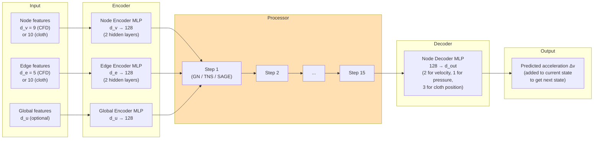
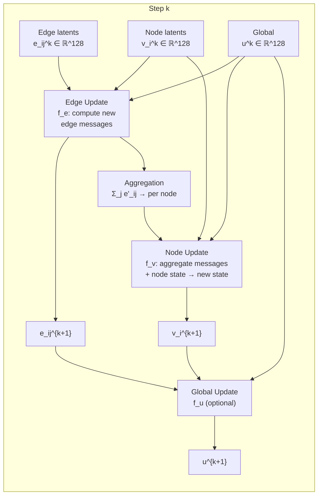
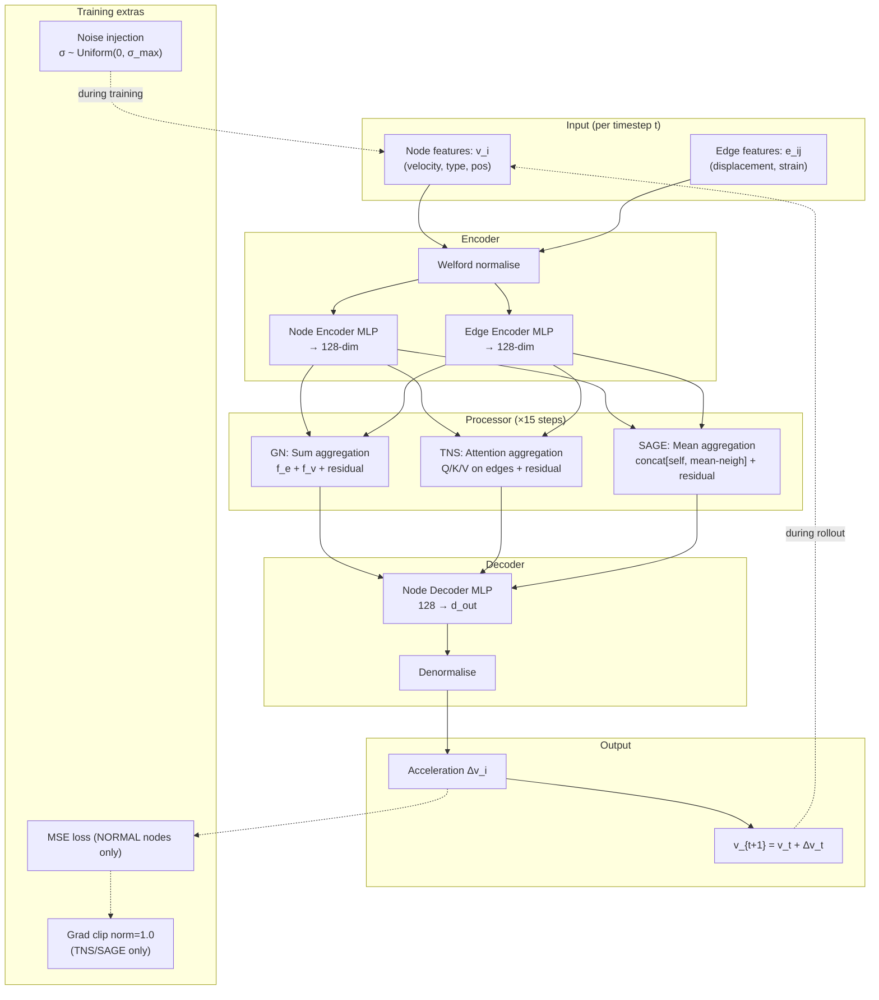

# GNN Architecture — MeshGraphNets: Encoder, Processor, Decoder

> **Audience:** ML engineers and senior software engineers preparing for technical interviews.
> **Purpose:** Understand every architectural decision in the MeshGraphNets model: the encoder/processor/decoder decomposition, all three processor variants, the training regime, and the design decisions behind each choice.
> **Related files:** [[01_overview]] | [[02_domains_datasets]] | [[03_system_architecture]]

---

## Why Not CNNs? Building Up the Motivation

Before we look at any code or architecture diagrams, we need to firmly establish why graph neural networks are the right architectural choice for physics simulation on meshes — and why the obvious alternative (convolutional neural networks) fails.

A standard 2D CNN takes an image of shape `(H, W, C)` — height, width, channels — and applies learned filter kernels that slide over the spatial dimensions. The key assumption built into this operation is **translation invariance on a regular grid**: the same kernel is applied at every spatial position, and every position has the same neighbourhood structure (the same number of adjacent pixels arranged in the same relative positions). This assumption buys you enormous efficiency — the number of learned parameters does not grow with H or W, only with the filter size and number of channels.

Physics meshes violate this assumption in multiple ways:

1. **Irregular topology.** Mesh nodes do not form a regular grid. Node `i` might have 3 neighbours; node `j` might have 8. The concept of "apply the same filter at every position" does not have a natural generalisation when every position has a different neighbourhood shape.

2. **Variable resolution.** Mesh element size varies dramatically across the domain — small near boundaries (to resolve thin boundary layers), large in the free-stream (to save computation). A CNN would need to somehow handle this variable-resolution structure; GNNs handle it naturally since each node's update depends only on its actual neighbours, regardless of how many there are.

3. **Geometry-dependent connectivity.** The mesh connectivity is determined by the physical geometry, not by a fixed lattice. The cylinder boundary creates a ring of densely-connected nodes; the wake region has sparser connectivity. The topology of the graph carries geometric information that should influence how information propagates.

4. **Different input sizes.** Different meshes (different geometries, different refinement levels) produce different graph sizes. CNNs require fixed input dimensions (or careful padding). GNNs operate on arbitrary-size graphs with no modification.

The solution is graph neural networks, which learn message-passing functions that operate on arbitrary graph topology. The message-passing framework is: for each node, aggregate information from its neighbours, combine with the node's own state, and produce an updated node state. This is exactly how a finite element solver updates node states — it aggregates flux contributions from neighbouring elements and applies the update rule. A GNN learning to emulate a physics solver is learning a data-driven version of the solver's own update rule.

---

## Graph Representation: Nodes, Edges, Globals

Before looking at the model, we need to define precisely how a simulation mesh is represented as a graph for MeshGraphNets.

### Nodes

Each node `i` in the graph corresponds to a mesh vertex. It carries a **feature vector** `v_i ∈ ℝ^{d_v}` that concatenates all relevant physical state variables:

**For `cylinder_flow`:**
```
v_i = [vx_i, vy_i, type_0, type_1, type_2, type_3, type_4, x_i, y_i]
     = [velocity(2), one-hot node_type(5), mesh_pos(2)]
     → d_v = 9
```

**For `flag_simple`:**
```
v_i = [wx_i, wy_i, wz_i,   # world position (3)
       mx_i, my_i,          # mesh (rest) position (2)
       type_0, type_1,      # one-hot node type (2): NORMAL, HANDLE
       vx_i, vy_i, vz_i]   # velocity from Verlet (3)
     → d_v = 10
```

Note that these feature vectors have different dimensions for different domains. The **encoder** (described below) maps both to the same 128-dimensional latent space, so the processor and decoder are domain-agnostic. The domain-specific dimensions are isolated to the encoder and decoder.

### Edges

Each directed edge `(i, j)` carries a **feature vector** `e_{ij} ∈ ℝ^{d_e}` encoding the geometric relationship between node `i` and node `j`:

**For `cylinder_flow`:**
```
e_ij = [Δx, Δy, ||Δ||, edge_type_0, edge_type_1]
      = [relative_pos(2), length(1), one-hot edge_type(2)]
      → d_e = 5
```

**For `flag_simple`:**
```
e_ij = [Δwx, Δwy, Δwz,    # world displacement (3)
        Δmx, Δmy,           # mesh displacement (2) — strain info
        ||Δw||,             # world distance (1)
        ||Δm||,             # mesh (rest) distance (1)
        ||Δw|| - ||Δm||,   # strain: current vs rest length (1)
        edge_type_0, edge_type_1]
      → d_e = 10
```

The edges are **directed**: edge `(i, j)` and edge `(j, i)` are distinct, carrying `Δ` and `-Δ` respectively. This gives the model the direction of the relationship, not just the magnitude. In practice, messages travel along both directions — from `i` to `j` and from `j` to `i` — so every undirected mesh edge gives rise to two directed graph edges.

### Globals

There is a single **global feature vector** `u ∈ ℝ^{d_u}` per graph that captures simulation-level context: simulation time, Reynolds number, or other scalar parameters. In the basic MeshGraphNets implementation, `d_u` is small (1–4 features) or even zero (the global is ignored). The full Graph Network formalism (Battaglia et al., 2018) includes globals, but in practice they are often dropped when the simulator parameters are constant within a trajectory.

---

## The Encoder-Processor-Decoder Architecture

The high-level structure of MeshGraphNets is:

```
raw node features → Encoder → 128-dim latent → Processor (×15 steps) → 128-dim latent → Decoder → predicted accelerations
```

Each stage is a specific architectural component. The key design principle is **separation of concerns**: the encoder handles domain-specific feature preprocessing, the processor handles domain-agnostic graph reasoning, and the decoder handles domain-specific output mapping. This means the processor — the most expensive and most important part — can be trained once and is completely agnostic to whether it is doing CFD or cloth simulation.



---

## The Encoder: Why and How

### Input Normalisation: The Welford Algorithm

Before features reach the encoder MLP, they are **normalised** using running statistics. This is necessary because raw input features span wildly different scales:

- Velocity components `(vx, vy)`: typically O(1) in normalised units but can be 0.0–5.0 m/s
- Mesh positions `(x, y)`: domain-dependent, typically 0.0–2.0 in normalised coordinates
- Node type (one-hot): binary, values exactly 0 or 1
- Pressure: can be negative, typically O(1) but offset from zero

Without normalisation, the encoder MLP's first layer receives inputs of very different magnitudes. The gradient of the loss with respect to the first layer's weights will be dominated by the large-magnitude features, causing effective learning to be slow or unstable for small-magnitude features. In the worst case, the network learns to largely ignore small-magnitude features.

PhysIQ uses a **Welford online normaliser** (implemented in `model/normalizer.py`) that computes running mean and variance without storing all data points:

```python
class WelfordNormalizer:
    """
    Compute running mean and variance using Welford's online algorithm.
    Memory: O(d) regardless of number of samples seen.
    No need to make a pass over the full dataset before training.
    """
    def __init__(self, feature_dim: int):
        self.n = 0
        self.mean = torch.zeros(feature_dim)
        self.M2 = torch.zeros(feature_dim)  # Sum of squared deviations

    def update(self, x: torch.Tensor) -> None:
        # x: (batch_size, feature_dim) or (feature_dim,)
        batch = x.reshape(-1, x.shape[-1])
        for sample in batch:
            self.n += 1
            delta = sample - self.mean
            self.mean += delta / self.n
            delta2 = sample - self.mean
            self.M2 += delta * delta2

    @property
    def variance(self) -> torch.Tensor:
        if self.n < 2:
            return torch.ones_like(self.mean)
        return self.M2 / (self.n - 1)

    @property
    def std(self) -> torch.Tensor:
        return torch.sqrt(self.variance + 1e-8)  # ε for numerical stability

    def normalize(self, x: torch.Tensor) -> torch.Tensor:
        return (x - self.mean.to(x.device)) / self.std.to(x.device)

    def denormalize(self, x: torch.Tensor) -> torch.Tensor:
        return x * self.std.to(x.device) + self.mean.to(x.device)
```

The Welford algorithm has two key properties. First, it requires **O(d) memory** (where d is the feature dimension) regardless of how many samples have been seen — there is no need to store the full dataset. Second, it runs **online**: the normaliser can be updated incrementally during training without a separate pre-processing pass. This is important for streaming data and for consistency: the normaliser statistics are always computed on exactly the training samples seen so far.

The normaliser statistics are saved to disk alongside checkpoints and loaded back at inference time. If you normalise training data with training set statistics, you must normalise inference data with the same statistics — not recomputed inference statistics. Using the wrong statistics is a common and subtle bug.

### Encoder MLP Architecture

After normalisation, the raw features pass through separate encoder MLPs for nodes, edges, and globals:

```
Input (d_v or d_e or d_u)
→ Linear(d_in, 128)
→ ReLU
→ Linear(128, 128)
→ ReLU
→ Linear(128, 128)
→ LayerNorm(128)
```

The output is a 128-dimensional latent vector. Every node and every edge is mapped to the same latent dimensionality — this is what makes the processor domain-agnostic. The 128 dimension is a choice from the original MeshGraphNets paper; it balances expressiveness (enough capacity to represent complex physical states) against computation cost (O(N × 128) memory and O(N × 128²) compute for matrix multiplications).

**Why LayerNorm at the encoder output?** Layer normalisation (not batch normalisation) is used throughout the GNN. The reason for layer norm over batch norm in graph neural networks is that batch norm computes statistics over the batch dimension, which assumes the batch contains many similar nodes. On graphs, the batch might contain wildly different numbers of nodes (variable-size graphs), making batch statistics unreliable. Layer norm computes statistics over the feature dimension of a single node, which is stable regardless of graph size or batch composition.

---

## The Processor: Three Variants

The processor is the heart of the model. It takes the encoder's 128-dim latent embeddings for all nodes and edges and runs K=15 message-passing steps, producing updated latent embeddings that capture long-range physics interactions. The three variants — GN, TNS, SAGE — differ in how they aggregate messages from neighbours. This section is long because the processor is where all the interesting ML engineering lives.

### Processor Step Structure (Common to All Variants)

Each processor step (regardless of variant) follows this high-level structure:



After each step, **residual connections** add the step's input back to the output:

```
v_i^{k+1} = f_v(v_i^k, messages) + v_i^k
e_ij^{k+1} = f_e(e_ij^k, v_i^k, v_j^k) + e_ij^k
```

The residual connection is a direct adoption from ResNet. Without it, gradients flowing back through 15 processor steps would either vanish (if activations are in the saturating regime) or explode (if they are large). Residual connections provide a "gradient highway" — the gradient can flow directly from the output of step 15 back to the input of step 1 without passing through 15 non-linear transformations. This is essential for stable training at 15-step depth.

### Variant 1: GN (Graph Network — Default)

The Graph Network processor is the implementation of the full Graph Network (GN) framework from Battaglia et al. (2018), specialised for simulation meshes. It is the default variant for good reasons: empirically stable training, proven performance on physics simulation benchmarks, and interpretable operation.

**Edge Update:**
```
e_ij^{k+1} = f_e(concat[e_ij^k, v_i^k, v_j^k, u^k]) + e_ij^k
```
The edge update MLP receives:
- The current edge latent `e_ij^k` (128 dims)
- The sender node latent `v_i^k` (128 dims)
- The receiver node latent `v_j^k` (128 dims)
- The global latent `u^k` (128 dims, if used)

Total input: 384 (or 512 with global) dims → Linear → ReLU → Linear → ReLU → Linear → LayerNorm → 128 dims.

The edge update computes a **message** from sender to receiver. The key insight is that the message depends on *both* the sender's state and the receiver's state — allowing the model to compute interaction forces (which depend on both particles' states, like spring forces or viscous stress) rather than just advecting information directionally.

**Node Update (Sum Aggregation):**
```
m_i^k = Σ_{j ∈ N(i)} e_ij^{k+1}   (aggregate incoming messages)
v_i^{k+1} = f_v(concat[v_i^k, m_i^k, u^k]) + v_i^k
```
The node update MLP receives:
- The current node latent `v_i^k` (128 dims)
- The sum of incoming edge messages `m_i^k` (128 dims)
- The global `u^k` (128 dims, if used)

The aggregation is **sum** across all incoming edges. Why sum and not mean? Sum is more natural for physics: if a node has more neighbours, it typically has more forces acting on it, so summing makes the total force proportional to the number of contributions. Mean would normalise away the effect of having many neighbours. However, sum can scale with degree — a node with 10 neighbours gets a sum that is roughly 10× larger than one with 1 neighbour, which can cause instability for highly variable-degree graphs. The LayerNorm after the node update partially mitigates this.

**Why GN is the default:** The GN processor has straightforward gradient behaviour. There is no attention mechanism to go numerically unstable. The sum aggregation is a simple linear operation over neighbours. Training converges reliably with Adam at learning rate 1e-4, and the loss curve is smooth. For a new domain or a first experiment, GN is always the right starting point. TNS and SAGE are for when you need something GN can't provide.

### Variant 2: TNS (Transformer-Based)

The Transformer processor replaces the sum aggregation in the node update with **multi-head self-attention** over the set of incoming edge messages. The motivation is that not all neighbours are equally important: a node in the wake region of the cylinder might have one neighbour that is a high-vorticity node (highly influential) and several that are essentially in the free-stream (less influential). Learned attention allows the model to weight these contributions appropriately.

**Attention Mechanism on Edges:**
```
For node i receiving messages from neighbours j ∈ N(i):

q_i = W_Q v_i^k        (query: "what kind of information do I need?")
k_j = W_K e_ij^k       (key: "what kind of information is this edge offering?")
v_j = W_V e_ij^k       (value: "the actual information content of this edge")

α_ij = softmax_j(q_i · k_j / sqrt(d_head))   (attention weights)
m_i^k = Σ_j α_ij v_j                          (weighted message aggregation)
```

This is exactly scaled dot-product attention, but the "sequence" is the set of incoming edge messages rather than a temporal or positional sequence. Multi-head attention runs H parallel attention heads (H=4 or H=8 in practice) and concatenates their outputs:

```
m_i^k = concat[head_1(i), head_2(i), ..., head_H(i)] W_O
```

The node update then proceeds as in GN:
```
v_i^{k+1} = f_v(concat[v_i^k, m_i^k]) + v_i^k
```

**The Instability Problem and Its Solutions:**

Attention over variable-degree neighbourhoods has a subtle numerical issue. When node `i` has many neighbours (high degree), the softmax denominator is a sum over many exponentials. For high-degree nodes, if several attention scores happen to be large, the softmax produces extreme attention weights (close to 1 for one neighbour, close to 0 for all others). This is called **attention collapse** — the model effectively ignores all but one neighbour. In the backward pass, the gradient of the softmax is nearly zero for ignored edges, creating very sparse gradients and slow learning.

Furthermore, during early training when weights are random, some attention scores can be very large (large Q·K dot products) or very small, causing extreme attention distributions. When this happens at multiple processor steps simultaneously, the gradients can be enormous (the chain rule multiplies through all those attention weight gradients across 15 steps).

PhysIQ addresses this with two changes for TNS:

1. **Lower learning rate: 3e-5 vs 1e-4 for GN.** A smaller learning rate means each gradient step makes smaller changes to the attention weights, reducing the risk of the optimiser pushing weights into the extreme-attention regime.

2. **Gradient clipping at norm 1.0.** After computing gradients and before the optimiser step:
   ```python
   torch.nn.utils.clip_grad_norm_(model.parameters(), max_norm=1.0)
   ```
   Any gradient vector with norm greater than 1.0 is scaled down to norm 1.0. This prevents a single bad batch from causing a large, destabilising update to the attention weights.

**When TNS wins over GN:** For problems with genuinely non-local interactions — where certain neighbours are far more influential than others and this varies dynamically — attention can outperform sum aggregation. Turbulent flows with intermittent coherent structures are a candidate. For laminar `cylinder_flow` at moderate Reynolds numbers, the interactions are largely local and GN often matches or outperforms TNS while training more reliably.

### Variant 3: SAGE (GraphSAGE)

GraphSAGE (Hamilton et al., 2017) was originally designed for inductive learning on large graphs — learning to generate embeddings for nodes that were not seen during training. The "SAGE" in GraphSAGE stands for "Sample and AggreGatE": sample a fixed-size neighbourhood around each node and aggregate the sampled embeddings.

In PhysIQ, the full neighbourhood is used (no sampling, since mesh graphs are not extremely large), and the aggregation is mean aggregation:

```
m_i^k = MEAN_{j ∈ N(i)}(W_neigh * v_j^k)    (mean of transformed neighbour embeddings)
v_i^{k+1} = ReLU(W_self * v_i^k + W_neigh * m_i^k) + v_i^k
```

The key difference from GN is the **concatenation-then-linear** structure:

```
v_i^{k+1} = f(concat[v_i^k, MEAN_j(v_j^k)]) + v_i^k
```

The node's own embedding and the mean of its neighbours' embeddings are concatenated before the update MLP, rather than summing aggregated messages (GN) or attending over messages (TNS). This concatenation preserves the distinction between "the node's own state" and "the average of its neighbours' states" throughout the MLP, which can be useful when the node's own state is qualitatively different from its neighbours (e.g., a HANDLE node surrounded by NORMAL nodes in `flag_simple`).

**Note that SAGE aggregates node embeddings, not edge embeddings.** GN and TNS use the updated edge latents as messages; SAGE bypasses the edge update and directly aggregates node latents. This is both a simplification (fewer parameters in the message-passing step) and a loss of information (the edge features — relative displacement, strain — are not as directly incorporated into the aggregation). In practice, the edge features still influence the node update indirectly because the node latent `v_i^k` was itself produced by earlier steps that did use edge features.

**Why SAGE as a middle ground:** SAGE is more parameter-efficient than full GN (no edge update MLP with 384-dim input), and more stable than TNS (no attention mechanism). On large graphs where GN's edge update becomes computationally expensive (O(|E| × 384 × 128) per step), SAGE's O(|N| × 256 × 128) per step is significantly cheaper. For `flag_simple` meshes with many edges per node, SAGE can train noticeably faster per epoch.

### The 15-Step Depth: Why That Number?

The processor runs 15 message-passing steps, not 5, not 50. This number comes from the original MeshGraphNets paper, and the reasoning is rooted in physics:

In a graph with mesh-like connectivity (each node connects to a few local neighbours), **after K message-passing steps, each node has seen information from its K-hop neighbourhood**. For physics to be correctly simulated, information needs to propagate across the relevant length scales of the problem. In `cylinder_flow`, pressure changes near the cylinder can affect the flow field several cylinder-diameters upstream — the acoustic/pressure mode travels at the speed of sound, which in an incompressible simulation is infinite (hence the global pressure correction). With ~1800 nodes and a graph diameter of roughly 50-100 hops, 15 steps is enough to propagate information across ~15 hops per timestep.

The choice of 15 is a tradeoff:
- **Too few steps (e.g., 5):** Each node only sees a small local neighbourhood. Long-range physics interactions (pressure waves, vortex shedding dynamics) cannot be captured. Model underfits.
- **Too many steps (e.g., 50):** Expensive computation. For TNS, the attention computation at each step scales quadratically with neighbourhood size, so 50 steps is 3.3× more compute than 15. Also, deeper processors have more gradient flow issues despite residual connections. Empirically, diminishing returns set in around 10-20 steps for these mesh sizes.
- **15 steps:** The sweet spot recommended by Pfaff et al. for meshes in the ~1000–5000 node range.

---

## The Decoder: Learning Accelerations, Not Absolute Values

### Architecture

The decoder is simpler than the encoder: a 2-layer MLP from 128-dim latent to the target output dimension:

```
128
→ Linear(128, 128)
→ ReLU
→ Linear(128, d_out)
```

No LayerNorm at the output — we want unnormalized output that can be added to the current state. The output dimension `d_out` is:
- `cylinder_flow`: 2 (velocity acceleration `Δvx, Δvy`) + optionally 1 (pressure)
- `flag_simple`: 3 (position acceleration `Δwx, Δwy, Δwz`)

### Why Predict Accelerations, Not Absolute Values?

This is one of the most important design decisions in the entire architecture. The decoder predicts **delta values** (how much the state changes in one timestep), not the absolute next-state values.

**The case for absolute values:** Simpler conceptually. The model just predicts what the velocity field looks like at t+1.

**The case for accelerations (deltas):** Consider what the model actually needs to learn. The velocity field at timestep `t+1` is very similar to the velocity field at timestep `t` — the changes between consecutive timesteps are small relative to the absolute values. If the model predicts absolute values, it needs to memorise the entire velocity field structure at every timestep, and any error directly shows up as a wrong absolute velocity. If the model predicts deltas, it only needs to learn the *changes* — which are physically driven by forces and can be predicted from local physics. The "default" prediction of zero delta (nothing changes) is already a reasonable first guess; predicting zero absolute velocity is not.

More formally, learning `Δv ≈ F/m * Δt` (Newton's second law discretised) is a simpler regression target than learning `v_{t+1}` directly, because the forces `F` are determined by local geometry and state — exactly the information the GNN processes. The absolute velocity has a strong dependence on the initial condition and history that the model would have to carry in its latent state.

**Physical interpretation:** Predicting accelerations has a clean physical interpretation — the model is learning a discrete version of the equation of motion. The GNN is learning `dv/dt ≈ F(v, x, mesh_topology)`, which is exactly the structure of Newton's second law or the Navier-Stokes equation. This physical alignment between the model's output format and the true governing equations is one reason MeshGraphNets generalises well.

**Reconstruction at inference:** To get the actual next state:
```python
# Velocity update (cylinder_flow)
v_next = v_current + decoder_output    # decoder output is Δv

# Position update (flag_simple)  
x_next = x_current + decoder_output   # decoder output is Δx
```

The decoder output is denormalised (using the inverse of the target normalisation) before adding to the current state.

---

## Autoregressive Rollout: The 600-Step Challenge

### What Autoregressive Means

During **training**, the model makes one-step predictions: given the ground-truth state at time `t`, predict the state at time `t+1`. The loss is computed against the ground-truth `t+1` state, and the weights are updated.

During **inference (rollout)**, the model must generate a full trajectory: given only the initial state at time `t=0`, predict `t=1`, then use the predicted `t=1` to predict `t=2`, then use predicted `t=2` to predict `t=3`, and so on for 600 steps. The model feeds its own predictions back as inputs. This is **autoregressive rollout**.

The problem is immediately apparent: the model was never trained on its own predictions. It was trained on ground-truth states. At inference, it receives states that contain its own accumulated prediction errors — a fundamentally different distribution from its training inputs. This is **covariate shift** (or, more specifically, **compounding error**): small errors in early timesteps are fed back as inputs, producing larger errors at the next step, which produce even larger errors, and so on. By step 600, the accumulated error can be large enough to make the prediction physically meaningless.

### Noise Injection: The Training Trick

The standard solution in MeshGraphNets for covariate shift during rollout is **training-time noise injection**. The idea is simple: during training, before computing the one-step prediction, add Gaussian noise to the input node features:

```python
# training/train.py (conceptual)
for batch in dataloader:
    node_features, edge_features, edge_indices, targets = batch

    if training:
        # Sample noise level from uniform distribution
        noise_std = torch.empty(1).uniform_(0, max_noise_std).item()
        # Add noise to node features (but NOT to node type one-hot or mesh_pos)
        noise = torch.randn_like(node_features[..., :velocity_dims]) * noise_std
        node_features = node_features.clone()
        node_features[..., :velocity_dims] += noise

    predictions = model(node_features, edge_features, edge_indices)
    loss = criterion(predictions, targets)
    loss.backward()
    optimizer.step()
```

By training on noisy inputs, the model learns to make good predictions even when its inputs are imperfect. At inference time, the input to each step is the model's own prediction from the previous step — which is imperfect in exactly the way that training noise imitates. The model has learned to be robust to such imperfections.

The noise level is sampled from `Uniform(0, σ_max)` rather than fixed, so the model is trained on a range of input quality levels. The maximum noise `σ_max` is a hyperparameter that controls the trade-off:

- **Too small:** The model barely sees noise during training, doesn't learn robustness, errors compound rapidly at inference.
- **Too large:** The model's inputs are too corrupted to make accurate predictions; the training signal becomes noisy and convergence is slow.
- **Typical value:** `σ_max ≈ 0.01–0.02` in normalised feature space — enough to see some noise without overwhelming the training signal.

### Why Noise Injection Works

The intuition is that noise injection is a form of **data augmentation** that simulates the distribution of inputs the model will actually see at inference time. In supervised learning, data augmentation (random crops, flips, colour jitter for images) typically improves generalisation by training the model on a more diverse input distribution. Noise injection does the same for rollout: the model trains on inputs that are perturbed by the kind of errors it will make during autoregressive generation.

There is a theoretical connection to denoising autoencoders: training to predict the correct state from a noisy version of the state is equivalent to learning the score function of the data distribution. Models trained this way tend to "pull toward" high-probability states, which in the context of physics simulation means "pull toward physically plausible states." A model trained with noise injection has an implicit denoising tendency that helps stabilise long rollouts.

### The 600-Step Challenge: What Remains Difficult

Noise injection helps but does not fully solve the compounding error problem. After 600 steps of autoregressive prediction, even a very good model will have accumulated errors that are visible. In `cylinder_flow`, this typically manifests as:

- **Phase drift** in the Kármán vortex street: the predicted vortex shedding frequency is slightly different from the ground truth, causing the two trajectories to gradually go out of phase.
- **Amplitude error**: the predicted vortex strength is slightly wrong, causing the wake structure to look correct but slightly too strong or too weak.
- **Boundary condition violations**: in rare cases, the model starts predicting non-physical velocities at boundary nodes, causing the solution to blow up.

These are active research areas. Beyond noise injection, techniques include:

- **Multi-step loss**: train on 2-4 step rollouts, backpropagating through multiple steps. This directly trains the model to minimise compounding errors.
- **Scheduled sampling** (mixing ground truth and model predictions during training).
- **Physics-informed regularisation**: add a term to the loss that penalises divergence of the predicted velocity field (`∇ · v`).

PhysIQ uses noise injection as the primary mitigation, with the Poisson pressure correction (see [[03_system_architecture]]) as a physics-based post-processing step for `cylinder_flow`.

---

## Loss Function: One-Step MSE on Accelerations

### The Loss

```python
# training/loss.py
def meshgraphnets_loss(
    predicted_acc: torch.Tensor,    # (N_nodes, d_out) — model output
    target_acc: torch.Tensor,       # (N_nodes, d_out) — ground truth acceleration
    node_type: torch.Tensor,        # (N_nodes,) — only compute loss on NORMAL nodes
) -> torch.Tensor:
    # Mask out boundary nodes — we don't supervise the model on them
    mask = (node_type == NodeType.NORMAL)
    pred = predicted_acc[mask]
    tgt = target_acc[mask]
    return F.mse_loss(pred, tgt)
```

The loss is **mean squared error on the predicted accelerations** (deltas), computed only over NORMAL (interior) nodes. Boundary nodes (CYLINDER, INFLOW, OUTFLOW, WALL, HANDLE) are excluded from the loss because their states are prescribed by boundary conditions and should not be updated by the model.

Why MSE rather than MAE (mean absolute error) or a physics-informed loss? MSE has several practical advantages:

1. **Gradient properties:** The gradient of MSE is proportional to the error (`2 × error`), which means large errors receive proportionally larger gradient signals, driving the model to reduce large errors first. MAE has a constant gradient of `±1` regardless of error magnitude, which is better for robustness to outliers but slower to drive down large systematic errors.

2. **Simplicity:** MSE is differentiable everywhere and well-behaved for Adam optimisation. Physics-informed losses (adding terms for divergence, vorticity, etc.) add complexity and additional hyperparameters (the relative weights of physics terms vs. data terms) without consistently improving results for in-distribution data.

3. **Proven sufficiency:** Pfaff et al. showed that one-step MSE is sufficient to train models that generalise well to 600-step rollouts with noise injection, provided training data is diverse enough. More complex loss functions are not needed for the benchmarks PhysIQ targets.

### Optimiser: Adam with Learning Rate Scheduling

All three variants use **Adam** (Adaptive Moment Estimation) with:

```python
# GN
optimizer = torch.optim.Adam(model.parameters(), lr=1e-4)

# TNS and SAGE
optimizer = torch.optim.Adam(model.parameters(), lr=3e-5)
scheduler = torch.optim.lr_scheduler.ExponentialLR(optimizer, gamma=0.9998)
```

The lower learning rate for TNS/SAGE reflects the attention stability issues described above. The `ExponentialLR` scheduler slowly reduces the learning rate throughout training, allowing fine-grained adjustments in later epochs without risking instability from large updates.

---

## Gradient Clipping: Why TNS and SAGE Need It, GN Does Not

Gradient clipping — scaling down the gradient vector when its norm exceeds a threshold — is applied for TNS and SAGE but not for GN. Understanding why reveals something important about attention mechanisms.

In GN, the message aggregation is a simple sum: `m_i = Σ_j e_ij`. The gradient of the loss with respect to the edge embeddings is computed by backpropagating through this sum, which distributes the gradient evenly across all contributing edges. The gradients are well-behaved.

In TNS, the message aggregation involves softmax attention: `m_i = Σ_j α_ij v_j` where `α_ij = softmax_j(q_i · k_j / sqrt(d))`. When attention is concentrated (`α_ij ≈ 1` for one `j`, `α_ij ≈ 0` for all others), the gradient of the loss with respect to the un-attended edges' key and value vectors is nearly zero (they don't affect the output), but the gradient with respect to the attended edge is very large (it carries the entire node's information). This creates **large, sparse gradients** that can destabilise training.

With gradient clipping at norm 1.0:

```python
# After loss.backward() in training/train.py
if config.processor in ('TNS', 'SAGE'):
    torch.nn.utils.clip_grad_norm_(model.parameters(), max_norm=1.0)
optimizer.step()
```

The gradient vector (concatenation of all parameter gradients into one long vector) is scaled so that its L2 norm is at most 1.0 before the optimiser step. This prevents any single bad batch from causing a catastrophically large update to the attention weights.

Why norm 1.0 specifically? This is a heuristic validated in many sequence models (Transformers, LSTMs) and works well here empirically. The right threshold is the smallest value that prevents divergence without slowing convergence too much. Values between 0.5 and 5.0 are commonly used; 1.0 is the standard starting point.

---

## Architecture Summary: Putting It All Together



---

## Design Decisions: Summary and Tradeoffs

| Decision | What was chosen | Why | Tradeoff |
|---|---|---|---|
| Architecture | Encoder-Processor-Decoder | Separates domain-specific preprocessing from domain-agnostic graph reasoning | Adds inference stages vs. end-to-end flat MLP |
| Latent dimension | 128 | Sufficient capacity for mesh-scale physics; from original MGN paper | Larger (256) improves capacity but quadruples compute in MLPs |
| Processor depth | 15 steps | ~15-hop information propagation for ~1800-node meshes; from MGN paper | More steps = more compute; diminishing returns beyond ~20 for this scale |
| Message aggregation | Sum (GN) / Attention (TNS) / Mean (SAGE) | Sum for physics (total force); Attention for selective influence; Mean for efficiency | Sum unstable at high degree; Attention unstable with extreme weights; Mean less expressive |
| Normaliser | Welford online | O(d) memory, online update, no dataset pre-pass | Running statistics can be skewed by early batches if distribution shifts |
| Normalisation | LayerNorm (not BatchNorm) | Stable for variable-size graphs; doesn't depend on batch statistics | Slightly more compute than BatchNorm; can't exploit batch-level normalisation |
| Residual connections | Yes (every processor step) | Gradient highway through 15 steps; prevents vanishing gradients | Slightly less expressive than pure residual-free stacking (but always worth it) |
| Output target | Acceleration Δv (not absolute v) | Physically aligned with equations of motion; easier regression target | Requires denormalisation and adding back current state at inference |
| Loss function | One-step MSE on NORMAL nodes | Simple, well-behaved gradients, proven sufficient for rollout quality | Does not directly penalise rollout compounding errors |
| Covariate shift mitigation | Training-time noise injection | Simple, effective, no extra architecture needed | Doesn't fully solve long-rollout compounding; σ_max is a sensitive hyperparameter |
| Gradient clipping | norm=1.0 for TNS/SAGE | Prevents attention weight divergence; standard for attention models | Caps gradient magnitude even when large gradient is correct; can slow convergence |
| GN learning rate | 1e-4 | Standard for Adam on physics GNNs | May need tuning for different mesh sizes or physics |
| TNS/SAGE learning rate | 3e-5 | Empirically required for attention stability | 3× slower convergence per epoch; more total training time |

---

## Interview Talking Points

**On why GNNs over CNNs:** "CNNs assume a regular grid where every node has the same neighbourhood structure. Physics meshes are unstructured — variable node degree, topology determined by geometry. GNNs learn message-passing functions that work on arbitrary graph topology, making them the natural architecture for mesh-based simulation."

**On the encoder-processor-decoder split:** "The encoder maps domain-specific raw features (velocity, pressure, node type, position) to a 128-dimensional latent space that is the same for all domains. The processor does 15 rounds of domain-agnostic message passing in that latent space. The decoder maps back to domain-specific outputs. This means the expensive processor is completely independent of the physics domain — it only sees 128-dimensional vectors."

**On the three processor variants:** "GN uses sum aggregation over edge messages — straightforward, stable, proven. TNS uses multi-head attention — can learn which neighbours matter, but needs a 3× lower learning rate and gradient clipping because attention weights can go extreme and destabilise training. SAGE concatenates the node's own embedding with the mean of its neighbours' embeddings — parameter-efficient, stable, good middle ground. We let the user train all three and compare validation loss."

**On predicting accelerations vs. absolute values:** "We predict the change in velocity between timesteps, not the absolute velocity at the next step. The physical motivation is that the change is governed by forces, which depend on local geometry and state — exactly what the GNN computes. The absolute velocity has a strong history dependence. Empirically, models that learn accelerations generalise better and are easier to train."

**On the noise injection training trick:** "The fundamental problem with autoregressive rollout is covariate shift: the model trains on ground-truth states but at inference time it receives its own imperfect predictions. We address this by adding Gaussian noise to input features during training, sampled from Uniform(0, σ_max). The model learns to be robust to imperfect inputs, which imitates the distribution it sees during rollout. It's essentially training a denoising model that's robust to the kind of errors it will accumulate."

**On the Welford normaliser:** "We need to normalise features, but we don't want to make a full pass over the dataset before training starts — it wastes time and requires either two passes or loading everything into memory. Welford's online algorithm updates running mean and variance in O(1) per sample with O(d) memory. Same result as full-pass batch normalisation, computed incrementally. We save the statistics at the end of training and reload them for inference — using inference-time recomputed statistics would be a subtle bug."

---

*All four technical reference files are complete. Links between them: [[01_overview]] → [[02_domains_datasets]] → [[03_system_architecture]] → [[04_gnn_architecture]]*
