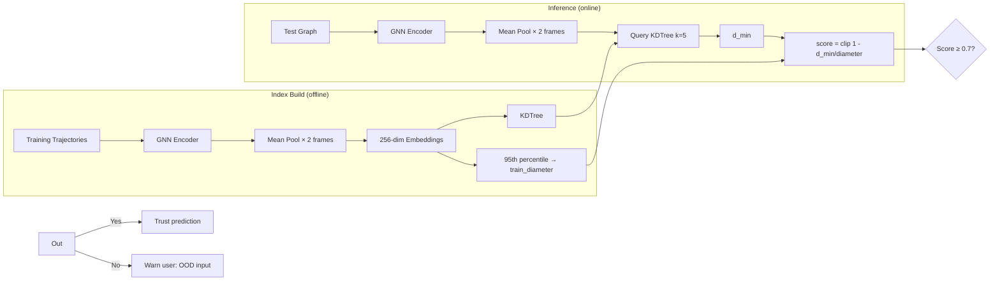
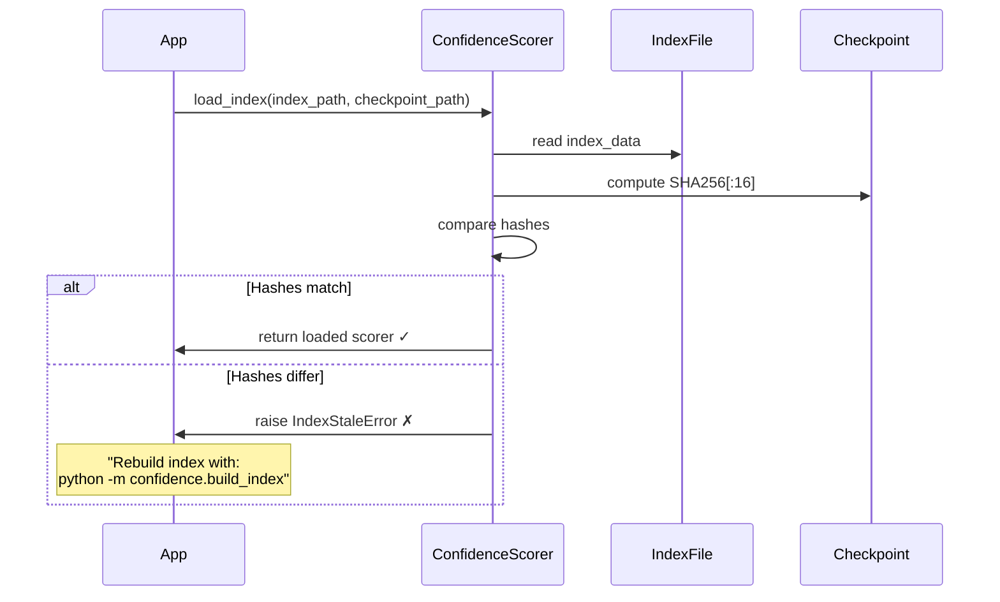
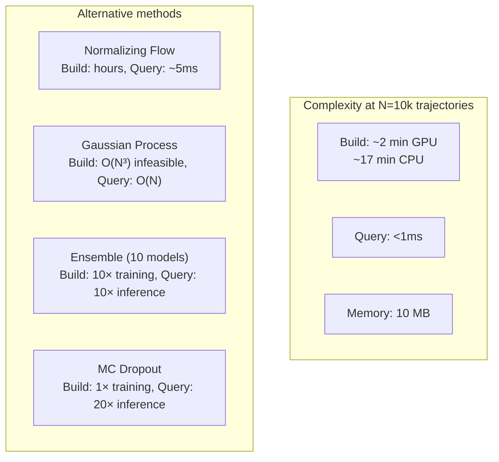

# 05 — Confidence Scoring: Knowing What the Model Doesn't Know

> **Related docs**: [[03_system_architecture]] · [[04_gnn_rollout]] · [[06_inverse_design]]
>
> **Audience**: ML engineers, senior software engineers preparing for system-design interviews.
>
> **What you'll understand after reading this**: Why a GNN surrogate can silently produce garbage on out-of-distribution inputs, how a JEPA-inspired embedding space detects this, and every design decision that went into the KDTree confidence scorer — including what we considered and rejected.

---

## 1. The Problem: Confident Lies

Imagine you've trained MeshGraphNets on 1,000 cylinder-flow simulations. The cylinders vary in radius from 0.02 m to 0.08 m, placed roughly in the centre of the domain, with inlet velocities ranging from 0.5 to 2.0 m/s. The model trains well. RMSE on the held-out test set is excellent.

Then a user uploads their own mesh. It's a cylinder of radius 0.12 m — 50% larger than anything in the training set. Or it's placed near the wall. Or the mesh is extremely coarse (200 nodes instead of the usual 1,800). The GNN runs. It produces a velocity field. It looks plausible. It is, in fact, completely wrong.

This is the **silent failure mode** of neural surrogates. The model doesn't know it doesn't know. There's no built-in alarm. The forward pass succeeds, the loss is never computed (it's inference time), and the user gets a number they might trust.

This failure mode is not academic. In an engineering context, a surrogate model that extrapolates silently can produce drag predictions that are off by 40%. An engineer using those predictions to make decisions about a product could build something that fails.

The question this document answers: **how do we give the model a voice to say "I've never seen anything like this"?**

---

## 2. The Insight: What JEPA Tells Us

In 2022, Yann LeCun published the paper *"A Path Towards Autonomous Machine Intelligence"*, which introduced the concept of **Joint Embedding Predictive Architectures (JEPA)**. The core idea is:

> Don't predict in the raw observation space (pixels, velocities). Instead, learn a latent representation space where predictions are made. The encoder maps observations to this space; the predictor operates inside it.

The JEPA insight that's relevant to us is subtle but powerful: **similar inputs should map to nearby points in the latent space, and dissimilar inputs should map far apart**. This is the definition of a good representation — it preserves the semantic structure of the input space.

Now flip this around. If we have a test input and we find that it maps to a point in latent space that is **far from all training inputs**, this is geometric evidence that the model is extrapolating. The encoder is being asked to project an input into a region of latent space where it was never trained to reason. The decoder (or in our case, the GNN message-passing layers) will produce outputs based on activations it has never encountered during training. The gradient signal that shaped those weights never came from this region.

This is the conceptual foundation for our approach: **use the encoder's own latent space as the detector for out-of-distribution inputs**. No separate anomaly detection model. No held-out OOD dataset. Just the representation the GNN learned to learn physics.

---

## 3. The Embedding Space: From Graph to Vector

### 3.1 The Encoder as a Compressor

The MeshGraphNets architecture has an explicit encoder stage: raw node features (position, velocity, node type) are projected by a small MLP into a 128-dimensional node embedding. Then several rounds of message-passing (graph attention or edge-convolution) refine these embeddings using neighbourhood context.

After encoding, each node $i$ has a 128-dimensional vector $\mathbf{h}_i \in \mathbb{R}^{128}$ that represents "what this node knows about its local physics environment at this timestep."

To characterise an *entire simulation*, we need to aggregate all node embeddings into a single vector. The natural operation is **mean pooling**:

$$\mathbf{z} = \frac{1}{N} \sum_{i=1}^{N} \mathbf{h}_i \in \mathbb{R}^{128}$$

This gives us a single 128-dimensional **simulation embedding**. Mean pooling is:
- **Permutation-equivariant**: the result doesn't depend on the arbitrary ordering of nodes in the mesh file.
- **Scale-invariant**: works regardless of mesh size (200 nodes or 2,000 nodes).
- **Fast**: a single reduce operation.

### 3.2 The Frame-0 Problem

Here's the catch. If we encode frame $t=0$ (the initial condition), two simulations with identical mesh geometry but different inlet velocities look *identical*. At $t=0$, all velocities are zero (or whatever the initial condition is), and the only variation is geometry. The inlet velocity boundary condition hasn't had time to propagate into the mesh interior.

Concretely: a simulation with $u_{inlet} = 0.5$ m/s and a simulation with $u_{inlet} = 2.0$ m/s will produce the *same* embedding at $t=0$. Their confidence scores will be indistinguishable. But their downstream physics are completely different — one might be laminar, the other turbulent. This is a catastrophic failure of a single-frame embedding.

### 3.3 The DUAL-FRAME Solution

The fix is conceptually simple: **concatenate embeddings from two frames**.

$$\mathbf{z}_{dual} = [\mathbf{z}^{(0)} \; \| \; \mathbf{z}^{(5)}] \in \mathbb{R}^{256}$$

Frame 0 captures geometry (mesh topology, cylinder size, cylinder position). Frame 5 captures the **early flow development** — at this point, the velocity boundary condition has had five timesteps to propagate inward from the inlet. The flow profile near the cylinder is starting to form. The Reynolds number has already imprinted itself on the embedding through the dynamics.

Why frame 5 specifically? This is the `CFD_WARMUP_FRAMES = 5` constant. The logic:

- **Too early (frame 1–2)**: the BC propagation wavefront hasn't reached the interior. Most of the mesh still looks like the initial condition. We gain almost nothing over frame 0.
- **Frame 5**: a good balance. Enough timesteps for BC information to travel through approximately $5 \times \Delta t \times c$ where $c$ is the effective information-propagation speed in the message-passing graph. At our typical $\Delta t$ and mesh resolution, this reaches the cylinder.
- **Too late (frame 50+)**: the flow is already deep into its trajectory. We're now capturing trajectory-specific dynamics, which makes it harder to compare across simulations that might be at different phases of vortex shedding.

The dual-frame embedding is robust to the two most common sources of variation in our dataset: geometry (captured by frame 0) and flow conditions (captured by frame 5).

---

## 4. The KDTree: Nearest-Neighbour Confidence

### 4.1 Building the Index

During the **index build** phase, we run every training trajectory through the encoder:

```python
for traj in training_set:
    frame_0 = traj.frames[0]
    frame_5 = traj.frames[CFD_WARMUP_FRAMES]   # = 5
    
    z0 = mean_pool(encoder(frame_0))            # shape: (128,)
    z5 = mean_pool(encoder(frame_5))            # shape: (128,)
    z_dual = np.concatenate([z0, z5])           # shape: (256,)
    
    embeddings.append(z_dual)
    metadata.append(traj.id)

tree = KDTree(np.stack(embeddings))            # build the spatial index
```

The result is a KDTree containing $N_{train}$ points in $\mathbb{R}^{256}$, one per training trajectory. The KDTree is a binary space-partitioning structure: it recursively bisects the space along the dimension of maximum variance, building a tree that allows $O(\log N)$ nearest-neighbour queries.

We also compute the **training diameter** at index build time. This represents how spread out the training data is in embedding space:

```python
# For each training point, find its 5 nearest neighbours within the training set
dists, _ = tree.query(embeddings, k=6)          # k=6 because the point itself is k=1
nn_dists = dists[:, 1:]                         # exclude self-distance (always 0)
min_dists = nn_dists.min(axis=1)                # minimum NN distance per point

train_diameter = np.percentile(min_dists, 95)   # 95th percentile → robust diameter
```

Why the 95th percentile rather than the maximum? The maximum is easily dominated by a single outlier in the training set — an unusual geometry that's genuinely far from everything else. The 95th percentile is **robust**: it characterises the spread of the *bulk* of the training data, ignoring the 5% most isolated points. This gives us a normalisation constant that reflects where 95% of training points live, not where the most exotic one ended up.

### 4.2 Computing the Confidence Score at Inference Time

When a test input arrives:

```python
z_test = dual_frame_embedding(test_graph)       # shape: (256,)
dists, indices = tree.query(z_test, k=5)        # 5 nearest training embeddings
d_min = dists.min()                             # closest training point

score = np.clip(1.0 - d_min / train_diameter, 0.0, 1.0)
```

The score formula deserves unpacking:

$$\text{score} = \text{clip}\!\left(1 - \frac{d_{min}}{d_{diameter}},\; 0,\; 1\right)$$

- **$d_{min} = 0$**: test point is *identical* to a training point. Score = 1.0. Maximum confidence.
- **$d_{min} = d_{diameter}$**: test point is as far from its nearest neighbour as the typical training point is from *its* nearest neighbour. Score = 0.0. We're at the edge of the training distribution.
- **$d_{min} > d_{diameter}$**: test point is further than typical training spread. Score is clipped to 0.0. Clear out-of-distribution.

The score is thus **dimensionless**, **normalised to [0, 1]**, and **calibrated to the actual density of the training set**. A score of 0.7 means "this test point is 30% of the training diameter away from its nearest training point" — an interpretable, actionable number.



---

## 5. Stale Index Detection: The Integrity Problem

### 5.1 The Problem with Mutable State

Here is a scenario that *will* happen in practice. You train a new version of the model — better data augmentation, lower RMSE. The model checkpoint is updated. But the confidence index was built with the *old* encoder weights. The 256-dim embeddings in the KDTree reflect what the *old* encoder's internal representation space looked like.

The new encoder might organise the latent space completely differently. Two simulations that were close together under the old encoder might be far apart under the new one. The KDTree distances are now meaningless. Confidence scores will be wrong — but not detectably wrong. They'll produce numbers in [0, 1], they'll look normal, and they'll silently mislead users.

This is **quiet data corruption**. It's worse than a crash.

### 5.2 The Hash-Based Solution

The solution is to **bind the index to the exact checkpoint it was built from**. We compute a SHA-256 hash of the checkpoint file and store the first 16 hex characters (64 bits of collision resistance — far more than enough for this purpose) inside the index file itself:

```python
def _checkpoint_hash(path: Path) -> str:
    h = hashlib.sha256()
    with open(path, "rb") as f:
        for chunk in iter(lambda: f.read(65536), b""):
            h.update(chunk)
    return h.hexdigest()[:16]
```

When we **save** the index, we include:

```python
index_data = {
    "embeddings": embeddings_array,         # shape: (N, 256)
    "metadata": trajectory_ids,
    "train_diameter": float(train_diameter),
    "checkpoint_hash": _checkpoint_hash(checkpoint_path),
    "built_at": datetime.utcnow().isoformat(),
    "n_training_trajectories": len(embeddings_array),
}
np.save(index_path, index_data, allow_pickle=True)
```

When we **load** the index:

```python
index_data = np.load(index_path, allow_pickle=True).item()
current_hash = _checkpoint_hash(current_checkpoint_path)

if index_data["checkpoint_hash"] != current_hash:
    raise IndexStaleError(
        f"Index was built from checkpoint {index_data['checkpoint_hash']!r} "
        f"but current checkpoint is {current_hash!r}. "
        f"Rebuild index with: python -m confidence.build_index"
    )
```

### 5.3 Why Fail-Fast, Not Silent Rebuild or Warning

There were three design choices here. We deliberately chose **fail-fast**:

**Option A — Fail-fast** (`IndexStaleError`): Crash immediately with a clear message. Force the caller to explicitly rebuild.
- ✅ No silent wrongness. The error is impossible to ignore.
- ✅ Rebuilding is a deliberate, observable action. You know when it happened and why.
- ❌ Disruptive if it happens during a demo or a production run.

**Option B — Silent rebuild**: Detect the mismatch, rebuild the index automatically, continue.
- ✅ Seamless user experience.
- ❌ Rebuilding takes 5+ minutes on our dataset. This would silently stall the system at an unexpected time — during inference, not during setup.
- ❌ The rebuild might fail (disk full, permissions issue) and now you've nested a failure inside a different operation.
- ❌ You lose the audit trail of when the rebuild happened.

**Option C — Warning**: Log a warning, use the stale index anyway.
- ✅ Doesn't block anything.
- ❌ Warnings are routinely ignored. This option is operationally identical to "no check at all."

Fail-fast is the right call. The 5-minute rebuild cost is a one-time setup cost that should happen during deployment, not during inference. The `IndexStaleError` message includes the exact command to run to fix it, making the error actionable rather than just alarming.



---

## 6. Connection to JEPA and the Broader Research Landscape

### 6.1 Our Encoder IS a JEPA-Style World Model

LeCun's JEPA framework describes a model that learns to predict the *latent representation* of future states, rather than predicting the raw future state. In JEPA:

$$\hat{\mathbf{z}}_{t+1} = \text{predictor}(\mathbf{z}_t, \mathbf{a}_t)$$

where $\mathbf{z}_t$ is the latent embedding of state $t$ and $\mathbf{a}_t$ is the action or control input.

MeshGraphNets operates in exactly this mode. The encoder maps a physics state (velocity field + mesh) to a latent representation. The GNN message-passing layers then *predict the next latent state* implicitly, before the decoder maps back to velocity space. The encoder is not just a feature extractor — it's the world model's state representation.

Our confidence scoring borrows the key JEPA intuition: **the latent space has geometric meaning**. Close points in latent space should correspond to similar physical scenarios. Far points correspond to different physics. We exploit this to detect when a test input falls outside the region of latent space the model has experience with.

### 6.2 The Formal Framework: Support Estimation

What we're doing is a form of **support estimation** of the training distribution $p_{train}$ in the latent space $\mathcal{Z}$. A confidence score of 1 means $\mathbf{z}_{test}$ is in the high-density region of $p_{train}$; a score of 0 means it's in the near-zero-density region (or outside the support entirely).

The gold standard for this would be **exact density estimation**: compute $p_{train}(\mathbf{z}_{test})$ and threshold it. Several approaches exist:

**Normalizing Flows**: Learn an invertible function $f: \mathcal{Z} \to \mathcal{W}$ such that $f(\mathbf{z})$ is Gaussian. Then $p_{train}(\mathbf{z}) = p_{\mathcal{W}}(f(\mathbf{z})) \cdot |\det J_f|$ is exact. Excellent accuracy, but requires training an additional generative model. Complexity: high.

**Gaussian Process Uncertainty**: Model the mapping from latent embeddings to outputs as a GP. The posterior variance gives a principled uncertainty estimate. Works well for small datasets; computational cost scales as $O(N^3)$ for exact inference, which is prohibitive for $N = 10{,}000$ training trajectories.

**Monte Carlo Dropout**: At inference, enable dropout and run $K = 20$ forward passes. The variance of outputs is a proxy for epistemic uncertainty. Requires the model to have been trained with dropout. Inference time multiplies by $K$. The connection between MC Dropout and Bayesian uncertainty is theoretically valid but empirically noisy.

**Ensemble Methods**: Train 5–10 independent models. High variance across ensemble members → high uncertainty. Very reliable but requires 5–10× the training compute and storage.

**Our KDTree approach**: $O(\log N)$ query after $O(N \log N)$ one-time build. No additional model training. Exact nearest-neighbour (not approximate). Interpretable: you can literally look up *which training trajectories* are closest to the test input (the returned `indices` from `tree.query`). The trade-off: it's a **distance-based proxy** for density, not actual density. It can't distinguish between "low confidence because test input is far from training" (distribution shift) and "low confidence because this region of training space has high inherent model uncertainty" (model limitation). For our operational needs, this distinction doesn't matter — either way, you should trust the prediction less.

---

## 7. Implementation Details

### 7.1 Coordinate System for the Embedding

The GNN encoder produces embeddings in a 128-dimensional space that is not standardised — the axes have no predefined scale or interpretation. When we concatenate $[\mathbf{z}^{(0)} \| \mathbf{z}^{(5)}]$ to get a 256-dim vector, the distances in this space depend on the magnitude of the encoder's activations.

We do **not** normalise the embeddings before building the KDTree. The reason: normalisation (e.g., L2 normalising each vector to the unit hypersphere) would make the distance metric cosine similarity rather than Euclidean distance. Cosine similarity ignores magnitude, which in our case carries meaningful information (high-magnitude embeddings might correspond to high-velocity flows).

However, this means the distance threshold depends on the specific model's weight scale. The `train_diameter` normalisation accounts for this: it's computed *from the same embedding space* as the test query, so it automatically adapts to whatever scale the encoder uses.

### 7.2 k=5 Nearest Neighbours

We query `k=5` neighbours and take the minimum distance rather than the mean. Why?

- The minimum represents the *closest analogous scenario* in training data.
- The mean across 5 nearest neighbours would be dominated by the 4 less-relevant ones.
- If even the single closest training trajectory is far away, the prediction is suspect.

The k=5 serves a secondary purpose: in the index build step, we compute intra-training 5-NN distances to estimate `train_diameter`. Using k=5 (rather than k=1) means our diameter estimate is based on the *local neighbourhood density* rather than just the single closest neighbour, which is more robust to duplicates or near-duplicates in the training set.

### 7.3 Memory and Performance

For $N = 10{,}000$ training trajectories, each with a 256-dimensional embedding:

- **Memory**: $10{,}000 \times 256 \times 4$ bytes (float32) = 10 MB. Trivially small.
- **KDTree build time**: $O(N \log N \cdot D) \approx 10{,}000 \times 13 \times 256 \approx 33M$ operations. Approximately 2 seconds with scipy.
- **Query time** (k=5): $O(\log N \cdot D) \approx 3{,}328$ operations. Sub-millisecond.
- **Index build total** (encoding all training trajectories): each encoding requires a GNN forward pass on a graph with ~1,800 nodes. With the dual-frame requirement, 2 passes per trajectory. At ~50ms per pass on CPU, this is $10{,}000 \times 2 \times 0.05 \approx 17$ minutes. GPU reduces this to ~2 minutes. This is why rebuild is a deliberate offline operation, not something done on-the-fly.



---

## 8. Integration with the Rest of the System

The confidence scorer integrates at two points in the system:

**Point 1: API response enrichment**. The REST API endpoint for rollout (`POST /api/simulate`) calls the scorer as a post-processing step. The confidence score is attached to the response JSON alongside the predicted velocity field. The frontend renders it as a colour-coded badge (green ≥ 0.7, yellow 0.4–0.7, red < 0.4).

**Point 2: Inverse design filtering** (see [[06_inverse_design]]). During CVAE sampling, each generated candidate geometry is scored before being presented to the GNN. Candidates with score < 0.4 are filtered out — not because the geometry is bad, but because the GNN hasn't seen similar configurations and the prediction would be unreliable.

The scorer is designed as a stateless callable after loading:

```python
scorer = ConfidenceScorer.load(index_path, checkpoint_path)
# scorer is now callable:
score, nearest_ids = scorer(test_graph)
# score: float in [0, 1]
# nearest_ids: list of 5 most similar training trajectory IDs
```

The `nearest_ids` are useful for debugging: if a test input gets a low score, you can retrieve the actual training trajectories that were closest — they tell you *what the model knows* that's adjacent to the test case.

---

## 9. Design Decisions Summary

The following table consolidates every major decision discussed in this document, with the rationale and the alternative considered.

| Decision | Choice | Alternative | Why |
|----------|--------|-------------|-----|
| Embedding aggregation | Mean pool (permutation-equivariant) | Max pool, attention-weighted sum | Mean is unbiased and topology-independent |
| Number of frames | 2 (frame 0 + frame 5) | 1 frame (frame 0), or 3+ frames | Frame 0 captures geometry, frame 5 captures BCs; more frames add little |
| Warmup frames | 5 | 3, 10 | Empirically sufficient for BC propagation |
| Embedding dimension | 256 (2 × 128) | 128, 512 | Matches encoder output; concatenation doubles it naturally |
| Nearest-neighbour method | Exact KDTree (scipy) | FAISS (approximate) | $N = 10k$ is exact-KDTree territory; FAISS adds dependency for no benefit |
| Diameter normalisation | 95th percentile of 5-NN distances | Max distance, mean distance | Robust to outliers; 95th represents the bulk training distribution |
| k for query | 5 | 1, 10 | 1 is too sensitive to a single anomalous training point; 10 adds unnecessary compute |
| Stale detection | SHA-256 hash, fail-fast | No check, warning, silent rebuild | Silent failures in production are unacceptable; 5-min rebuild cost belongs at setup time |
| Embedding normalisation | None (raw activations) | L2 normalise to unit sphere | Raw Euclidean distance is more informative than cosine similarity for magnitude-carrying embeddings |
| Density estimation method | KDTree distance proxy | Normalizing flows, GP, MC Dropout | O(log N) query, interpretable, no additional training |

---

## 10. Interview Questions and Answers

This section is aimed at interview preparation. These are the questions a senior ML systems interviewer would ask about this component.

**Q: Why do you use embedding distance as a proxy for model confidence, rather than model output variance?**

A: Output variance requires either an ensemble or multiple stochastic forward passes (MC Dropout). Ensemble inference is $K \times$ slower ($K$ = ensemble size, typically 10–20). MC Dropout requires the model to be trained with dropout active and then enabled at inference time, adding complexity and still requiring $K$ passes. Our approach separates the concerns: the GNN is trained purely for prediction accuracy; the confidence scorer is a separate module that operates on the frozen encoder's outputs. It's $O(\log N)$ at inference time regardless of $K$.

**Q: Can you explain the 95th percentile choice for train_diameter? What would happen with max or mean?**

A: The max distance is dominated by the single most isolated point in the training set — perhaps an unusual geometry that was intentionally included for coverage. Using the max would cause the scorer to under-penalise test inputs that are actually far from the *typical* training region. The mean distance would be too conservative — it would penalise test inputs that are farther than the *average* intra-training distance, flagging many valid test cases. The 95th percentile is the standard statistical tool for "robust range" estimation: it includes the vast majority of the distribution while excluding the extreme tail. It's the same logic as using the 95th percentile for SLO latency budgets.

**Q: What happens if the GNN architecture changes but the checkpoint hash doesn't? For example, if you change the model config but not the weights file.**

A: The hash is computed on the checkpoint file contents, not the model config. If the architecture changes but the weights file is the same bytes, the hash would match — but the model would fail to load because the state dict wouldn't match the new architecture. The failure would occur at `torch.load()` before the confidence scorer is even consulted. In practice, changing the architecture always requires retraining, which produces a new checkpoint file with new bytes and a new hash. The hash is sufficient for the threat model we care about: catching weight updates that happen without index rebuilds.

**Q: How would you extend this to handle meshes with very different node counts?**

A: Mean pooling already handles this — the result is always a fixed 256-dim vector regardless of whether the mesh has 200 or 2,000 nodes. The concern would be if a very coarse mesh produces embeddings with systematically lower magnitude (fewer message-passing neighbours → lower activation variance). In that case, we might want to add a normalisation step — but we'd need to measure whether this is actually a problem empirically before adding complexity.

---

*Next: [[06_inverse_design]] — using the GNN as a differentiable surrogate in inverse design, where we work backwards from a target drag coefficient to mesh geometry.*
