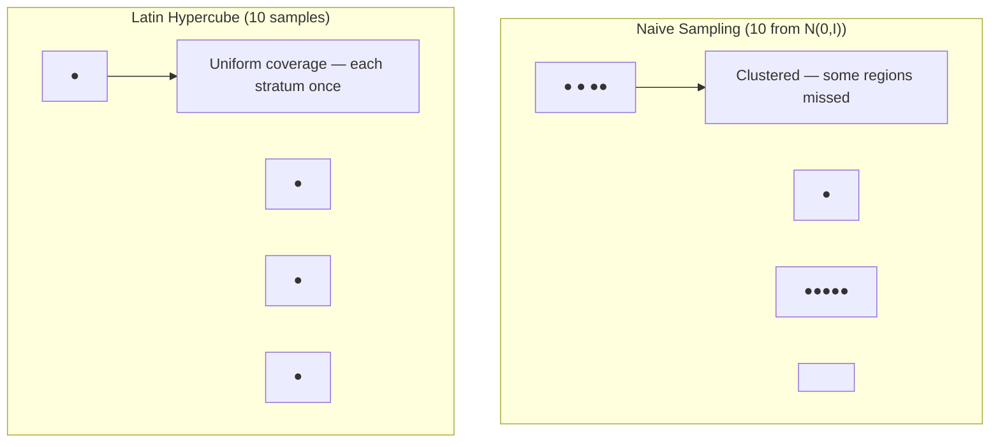
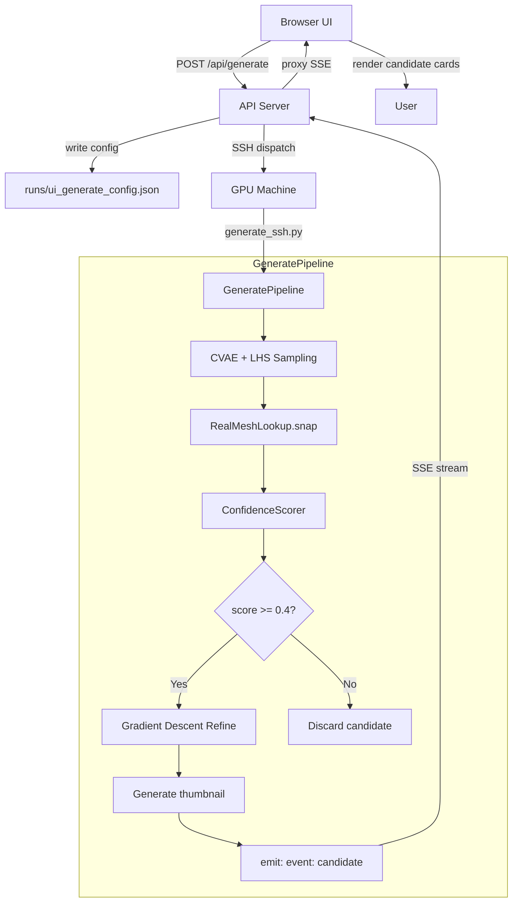

# 06 — Inverse Design: Working Backwards from Target to Geometry

> **Related docs**: [[03_system_architecture]] · [[05_confidence_scoring]] · [[07_poisson_correction_lu]]
>
> **Audience**: ML engineers, senior software engineers preparing for system-design interviews.
>
> **What you'll understand after reading this**: Why inverse design is fundamentally harder than forward simulation, how CVAEs let us navigate geometry space intelligently, why gradient descent through a GNN requires careful bookkeeping, and every design decision in the two-stage CVAE-then-gradient-descent pipeline.

---

## 1. The Problem: Inversion is Hard

The forward problem in computational fluid dynamics is well-defined and well-posed: given a geometry (cylinder radius, position), solve for the resulting flow field and compute derived quantities like drag coefficient $C_d$. Modern ML surrogates like MeshGraphNets make this fast — a 600-timestep rollout takes seconds instead of hours.

The **inverse problem** asks the opposite question: given a desired outcome ($C_d = 0.3$), what geometry produces it? This is fundamentally harder for several reasons:

**Non-uniqueness**: Many geometries might produce $C_d = 0.3$. A thin, elongated cylinder, a fatter cylinder at a different position, a cylinder with a specific mesh density — multiple solutions exist. The inverse problem is ill-posed (no unique solution).

**Non-differentiability of the original solver**: Traditional CFD solvers (OpenFOAM, ANSYS Fluent) are not differentiable. You can't backpropagate through a finite-volume solver. This eliminates gradient-based optimisation from the toolkit unless you have a differentiable surrogate.

**High-dimensional search space**: The geometry is described by dozens of parameters (radius, position, mesh density, boundary layer thickness...). Exhaustive search is out of the question. Genetic algorithms and Bayesian optimisation work but are slow — typically requiring hundreds to thousands of forward evaluations.

Our approach uses the GNN surrogate as a **differentiable proxy** for the real solver, and pairs it with a **Conditional VAE** that learns the geometry-outcome relationship during training. This gives us two complementary tools: global exploration via sampling, and local refinement via gradient descent.

---

## 2. Theoretical Background: VAEs, CVAEs, and Latent Space Geometry

### 2.1 The Basic VAE

A standard Variational Autoencoder (VAE) consists of:
- An **encoder** $q_\phi(\mathbf{z} | \mathbf{x})$: maps input $\mathbf{x}$ to a distribution over latent codes $\mathbf{z}$, parameterised as a diagonal Gaussian $\mathcal{N}(\boldsymbol{\mu}_\phi(\mathbf{x}), \text{diag}(\boldsymbol{\sigma}^2_\phi(\mathbf{x})))$.
- A **decoder** $p_\theta(\mathbf{x} | \mathbf{z})$: maps latent codes back to reconstructions.

The VAE training objective is the Evidence Lower Bound (ELBO):

$$\mathcal{L}_{VAE} = \mathbb{E}_{q_\phi(\mathbf{z}|\mathbf{x})}[\log p_\theta(\mathbf{x}|\mathbf{z})] - \text{KL}(q_\phi(\mathbf{z}|\mathbf{x}) \| p(\mathbf{z}))$$

The first term is reconstruction quality; the second term regularises the encoder to produce distributions close to the standard Gaussian prior $p(\mathbf{z}) = \mathcal{N}(\mathbf{0}, \mathbf{I})$.

The key insight of the VAE is that the latent space $\mathcal{Z}$ is *smooth and continuous*: nearby points in $\mathcal{Z}$ decode to similar, valid outputs. This makes $\mathcal{Z}$ a good space for optimisation — gradients have meaning, and interpolation produces sensible results.

### 2.2 The Conditional VAE (CVAE)

A CVAE extends the VAE with a condition variable $\mathbf{y}$. In our case, $\mathbf{y}$ is the target drag coefficient (a scalar, or a small vector of target physical quantities). The ELBO becomes:

$$\mathcal{L}_{CVAE} = \mathbb{E}_{q_\phi(\mathbf{z}|\mathbf{x},\mathbf{y})}[\log p_\theta(\mathbf{x}|\mathbf{z},\mathbf{y})] - \text{KL}(q_\phi(\mathbf{z}|\mathbf{x},\mathbf{y}) \| p(\mathbf{z}))$$

The generative model at inference time is:

$$\mathbf{z} \sim \mathcal{N}(\mathbf{0}, \mathbf{I}), \qquad \hat{\mathbf{x}} = \text{decoder}(\mathbf{z}, \mathbf{y}_{target})$$

This is the **inverse design sampling procedure**: sample $\mathbf{z}$ from the prior, condition the decoder on the desired drag, and get a mesh geometry $\hat{\mathbf{x}}$ that the CVAE *believes* will achieve that drag. The CVAE has learned, during training, the mapping from (drag, latent code) to geometry.

What are $\mathbf{x}$ and $\mathbf{y}$ concretely?

- $\mathbf{x} \in \mathbb{R}^d$: a compact **parametric description** of the mesh. Not the raw mesh node positions (that would be $\sim 3{,}600$ numbers for a 1,800-node mesh), but a low-dimensional parameter vector: cylinder radius, cylinder $x$/$y$ position, characteristic mesh density, boundary layer resolution parameter. Typically $d \approx 8$–$16$ parameters.
- $\mathbf{y} \in \mathbb{R}^1$ or $\mathbb{R}^m$: the target drag (and optionally lift, pressure drop, or other quantities of interest).

Training data: for each simulation in the training set, we have the mesh parameters $\mathbf{x}$ and the GNN-predicted (or ground-truth) drag $\mathbf{y}$. The CVAE trains on these (param, drag) pairs.

### 2.3 The Posterior Collapse Problem and Free Bits

A notorious failure mode of VAEs is **posterior collapse**: the encoder learns to ignore the latent code entirely (producing $q_\phi(\mathbf{z}|\mathbf{x}) \approx p(\mathbf{z})$ for all $\mathbf{x}$), and the decoder learns to reconstruct $\mathbf{x}$ from $\mathbf{y}$ alone. The KL term goes to zero (good for the loss), but the latent space carries no information (bad for generation diversity).

Posterior collapse happens when the decoder is powerful enough to reconstruct $\mathbf{x}$ well from $\mathbf{y}$ alone — so it never bothers to use $\mathbf{z}$. In our case, drag is highly correlated with mesh geometry, so the decoder might just memorise "drag = 0.3 → use radius ≈ 0.05 m" without involving $\mathbf{z}$.

The **free bits** technique prevents this. For each latent dimension $j$, we modify the KL penalty:

$$\mathcal{L}_{KL} = \sum_j \max(\lambda, \text{KL}(q_\phi(z_j | \mathbf{x}, \mathbf{y}) \| p(z_j)))$$

where $\lambda = 0.05$ nats is the `free_bits` constant. This means: each latent dimension is allowed to encode up to $\lambda$ nats of information without penalty. Only KL above $\lambda$ per dimension is penalised. This creates a "free information budget" that prevents the encoder from fully collapsing.

Why $\lambda = 0.05$ nats?
- Too small ($\lambda \approx 0$): effectively no free bits; posterior collapse can still occur.
- Too large ($\lambda > 0.5$): the KL penalty is almost never applied; the latent space becomes unregularised and the prior $p(\mathbf{z})$ no longer approximates the aggregate posterior. Sampling from $\mathcal{N}(\mathbf{0}, \mathbf{I})$ at inference produces poor results.
- $\lambda = 0.05$: a standard empirically validated value from the literature (Kingma et al., 2016). Each dimension can carry up to 0.05 nats ≈ 7% of 1 bit of information freely.

---

## 3. Method 1: CVAE Sampling with Latin Hypercube Sampling

### 3.1 Naive Sampling and Its Problem

The simplest approach to generate $n_{candidates} = 10$ candidates: sample $\mathbf{z}_1, \ldots, \mathbf{z}_{10} \sim \mathcal{N}(\mathbf{0}, \mathbf{I})$ independently, decode each with the target drag, run through GNN, pick the best.

The problem: with 10 independent standard Gaussian samples in, say, a 16-dimensional latent space, some regions of the latent space will be sampled multiple times while others are missed entirely. This is the **curse of dimensionality** for random sampling. With only 10 points in 16 dimensions, coverage is sparse and non-uniform.

### 3.2 Latin Hypercube Sampling

**Latin Hypercube Sampling (LHS)** is a stratified sampling strategy that guarantees coverage across all dimensions simultaneously. The idea, stated abstractly:

> Divide each dimension into $n$ equal-probability strata. Sample exactly one point from each stratum per dimension. Combine the per-dimension samples randomly across dimensions.

Concretely, for $n = 10$ samples and $d = 16$ latent dimensions:

```python
from scipy.stats.qmc import LatinHypercube, norm

sampler = LatinHypercube(d=latent_dim)     # d = 16 dimensions
unit_cube = sampler.random(n=n_candidates) # shape: (10, 16), values in [0, 1]
# Each column has exactly one sample per decile: [0.0-0.1), [0.1-0.2), ...

# Transform to standard normal (inverse CDF of normal = norm.ppf)
z_samples = norm.ppf(unit_cube)            # shape: (10, 16)
```

The result: each of the 16 latent dimensions is sampled once per decile. No dimension is over-sampled in any region. The 10 samples collectively cover all parts of the latent space uniformly.

**The population survey analogy**: if you want to survey 10 people to represent a population across 10 age groups (20s, 30s, ..., 110s), random sampling might give you 4 people in their 30s and nobody over 60. LHS guarantees exactly one person per age decade. Our "age groups" are deciles of the Gaussian distribution in each latent dimension.



### 3.3 RealMeshLookup: Snapping to Physical Validity

After decoding $n_{candidates}$ parameter vectors $\hat{\mathbf{x}}_1, \ldots, \hat{\mathbf{x}}_{10}$, we face a subtle problem: the CVAE decoder is a neural network that outputs values in a continuous parameter space. It might output, for example, `radius = 0.11 m` — which is outside the training domain — or a mesh density parameter combination that results in highly distorted elements.

The CVAE learned an approximation to the training data manifold, but it doesn't perfectly enforce the constraints of physical validity. Interpolation (and especially extrapolation) in parameter space doesn't always yield a valid mesh.

The solution is **RealMeshLookup**: after decoding, snap each parameter vector to the nearest real mesh in the training set.

```python
class RealMeshLookup:
    def __init__(self, training_params: np.ndarray):
        # training_params: shape (N_train, d_params)
        self.tree = KDTree(training_params)
        self.training_params = training_params
        self.training_ids = [...]   # trajectory IDs for each row

    def snap(self, decoded_params: np.ndarray) -> tuple[np.ndarray, str]:
        """Return the nearest training mesh parameters and its ID."""
        dist, idx = self.tree.query(decoded_params)
        return self.training_params[idx], self.training_ids[idx]
```

This guarantees that every candidate fed to the GNN is a real, physically valid mesh that the meshing tool has already successfully generated. The "snapping" cost is $O(\log N)$ — negligible.

The philosophical trade-off: we lose the ability to explore truly novel geometries that don't exist in the training set. But we gain guaranteed physical validity and GNN reliability (since the snapped mesh is a training input, the confidence score will be high). For engineering applications where you need physically buildable designs, this is the right trade-off.

### 3.4 The Full CVAE Sampling Loop

```python
def cvae_sample(target_drag: float, n_candidates: int = 10) -> list[Candidate]:
    # Step 1: LHS in latent space
    z_samples = latin_hypercube_normal(n=n_candidates, d=latent_dim)  # (10, 16)
    
    # Step 2: Decode with target condition
    y_target = torch.tensor([target_drag]).expand(n_candidates, 1)
    with torch.no_grad():
        decoded_params = cvae.decode(z_samples, y_target)  # (10, d_params)
    
    # Step 3: Snap to real meshes
    candidates = []
    for params in decoded_params:
        real_params, traj_id = mesh_lookup.snap(params.numpy())
        candidates.append(Candidate(params=real_params, source_traj=traj_id))
    
    # Step 4: Run GNN forward on each candidate
    results = []
    for cand in candidates:
        mesh = load_mesh(cand.source_traj)
        rollout = gnn_rollout(mesh)
        predicted_drag = compute_drag(rollout)
        confidence = scorer(mesh)
        results.append(Result(params=cand, drag=predicted_drag, score=confidence))
    
    # Step 5: Sort by |predicted_drag - target_drag|
    results.sort(key=lambda r: abs(r.drag - target_drag))
    return results
```

This whole process takes seconds. The GNN forward passes dominate; everything else is negligible.

---

## 4. Method 2: Gradient Descent Refinement

### 4.1 Why Gradient Descent?

CVAE sampling is fast and global — it searches the whole latent space. But it's imprecise. The best candidate might have $C_d = 0.31$ when the target is $C_d = 0.30$. For engineering applications, this 3% error might matter.

Gradient descent can refine this: starting from the best CVAE candidate, we treat the mesh parameters as trainable variables and minimise the loss:

$$\mathcal{L} = (\text{GNN}(\mathbf{x}) - C_d^{target})^2$$

This requires the GNN to be **differentiable with respect to its input**. PyTorch's automatic differentiation makes this possible as long as every operation in the forward pass is differentiable.

### 4.2 Backpropagation Through Time (BPTT)

The GNN rollout is a sequence of $T = 600$ steps:

$$\mathbf{v}^{(t+1)} = \text{GNN}_\theta(\mathbf{v}^{(t)}, \mathbf{x}_{mesh})$$

The drag coefficient is computed by integrating pressure over the cylinder surface at the final steady state (or averaged over the last $K$ timesteps). Computing the gradient $\partial C_d / \partial \mathbf{x}_{mesh}$ requires backpropagating through the entire 600-step chain. This is **BPTT** — the same algorithm used to train RNNs.

The problem: BPTT through $T = 600$ steps requires storing the activations of every intermediate step (for the backward pass). Memory scales as $O(T \times N \times D)$ where $N$ is the number of nodes and $D$ is the embedding dimension. At $T = 600$, $N = 1{,}800$, $D = 128$: approximately $600 \times 1{,}800 \times 128 \times 4$ bytes = **553 MB per rollout**. On a machine with multiple concurrent users, this is prohibitive.

### 4.3 Truncated BPTT with K Steps

The solution is **truncated BPTT**: only backpropagate through the last $K$ steps.

```python
K_BPTT = 5   # Truncated BPTT horizon

def gradient_refine(init_params: torch.Tensor, target_drag: float, 
                    n_steps: int = 50) -> torch.Tensor:
    params = init_params.clone().requires_grad_(True)
    optimizer = torch.optim.Adam([params], lr=1e-3)
    
    for opt_step in range(n_steps):
        optimizer.zero_grad()
        
        # Run full rollout without gradient tracking (cheap)
        with torch.no_grad():
            v_warmup = gnn_rollout(params, steps=T - K_BPTT)
        
        # Run last K steps WITH gradient tracking (expensive)
        v_K = gnn_rollout_from(params, v_warmup, steps=K_BPTT)
        
        drag_pred = compute_drag(v_K)
        loss = (drag_pred - target_drag) ** 2
        loss.backward()
        optimizer.step()
        
        # Clamp params to valid physical range
        with torch.no_grad():
            params.clamp_(param_min, param_max)
    
    return params.detach()
```

Why does $K = 5$ work? The gradient $\partial C_d / \partial \mathbf{x}_{mesh}$ through 5 steps still carries information about how the geometry affects the near-cylinder flow field. The geometry (cylinder radius, position) affects every timestep — you don't need 600 steps of gradient to know that a larger cylinder produces more drag. The **local physics signal** is sufficient for the optimiser to move in the right direction.

The memory cost drops from 553 MB to $5 \times 1{,}800 \times 128 \times 4 \approx 4.6$ MB. A 120× reduction.

Why not $K = 1$? A single step gradient doesn't capture any dynamics. The GNN at one step is essentially just interpolating from the initial condition — the gradient would be dominated by the geometry's direct effect on the initial embedding, not its effect on the flow development. $K = 5$ ensures the gradient signal propagates through the vortex formation and shedding dynamics that determine drag.

```mermaid
sequenceDiagram
    participant Opt as Optimiser
    participant GNN
    participant Loss

    Note over Opt,Loss: Truncated BPTT, K=5 steps

    Opt->>GNN: params (requires_grad=True)
    GNN->>GNN: Steps 1 to T-5 (no_grad, cheap)
    GNN->>GNN: Steps T-4 to T (grad tracked, K=5 steps)
    GNN->>Loss: drag_predicted
    Loss->>Loss: (drag_pred - target)²
    Loss-->>GNN: backward() through K=5 steps only
    GNN-->>Opt: ∂L/∂params
    Opt->>Opt: Adam step, clamp to valid range
```

### 4.4 Why Not Use the Real FEM Solver?

A natural question: why use the GNN surrogate in the gradient loop at all? If the gradient is approximate anyway (due to GNN model error), why not use the ground-truth solver and just do gradient-free optimisation?

The answer is pure practicality. A single OpenFOAM forward pass takes 15–60 minutes depending on mesh resolution. 50 gradient descent steps would require 12–50 hours for a single design optimisation. The GNN forward pass takes 2–5 seconds. 50 steps take 2–4 minutes.

The gradient through the GNN is not the true physics gradient. But it's a **consistent** gradient — it correctly identifies the direction in parameter space that would improve the GNN's prediction of drag. Since the GNN's prediction is highly correlated with the true drag (that's why we trained it), the GNN gradient is a useful proxy.

The limitation: if the GNN has systematic error in a particular region of parameter space, the gradient descent might converge to a local optimum of the GNN's landscape that isn't a true physical optimum. This is why gradient descent is used for *refinement* (starting from a good CVAE candidate) rather than as the primary search. The CVAE provides global context; gradient descent provides local precision.

---

## 5. When to Use Which Method

The two methods are complementary. Their characteristics:

| Property | CVAE Sampling | Gradient Descent Refinement |
|----------|--------------|----------------------------|
| Speed | Seconds | Minutes (GPU), 15+ min (CPU) |
| Search type | Global (explores all regions) | Local (refines around start point) |
| Precision | ±5–10% of target | ±0.5–2% of target |
| Physical validity | Guaranteed (RealMeshLookup) | Must clamp to valid range |
| Memory | Negligible | ~5 MB (K=5 BPTT) |
| Best for | Initial exploration, feasibility check | Final tuning, precise target matching |

The recommended workflow:
1. Run CVAE sampling to get 10 candidates across parameter space.
2. Evaluate each with confidence scorer — discard any with score < 0.4.
3. Take the top 2–3 candidates (closest drag to target, highest confidence).
4. Run gradient descent refinement on each in parallel.
5. Return the final refined candidates ranked by drag error.

---

## 6. SSH Dispatch for GPU-Accelerated Generation

### 6.1 The Compute Asymmetry Problem

The UI runs on a lightweight server (possibly a CPU-only machine). Gradient descent through 50 optimisation steps, each involving a 5-step GNN rollout with backpropagation, is painfully slow on CPU — 15+ minutes for a single design candidate. On a GPU, the same computation takes roughly 1 minute.

This creates a **compute asymmetry**: the UI server doesn't have the GPU; the training machine does. The solution is to dispatch the computation over SSH.

### 6.2 The Dispatch Protocol

```
Client UI → POST /api/generate → API server
    API server: write config to runs/ui_generate_config.json
    API server: SSH to gpu_machine; execute generate_ssh.py --config runs/ui_generate_config.json
    generate_ssh.py → streams results back via SSE (Server-Sent Events)
    API server: proxy SSE stream back to client
    Client: render candidates as they arrive
```

The config file approach (write-to-JSON then SSH) rather than passing all arguments on the command line avoids shell escaping issues and provides a persistent record of what was requested.

### 6.3 Named SSE Events vs Generic Data Events

Server-Sent Events support named events:

```
event: candidate
data: {"rank": 1, "drag": 0.302, "confidence": 0.87, "thumbnail": "<base64_png>"}

event: candidate
data: {"rank": 2, "drag": 0.315, "confidence": 0.79, "thumbnail": "<base64_png>"}

event: done
data: {"total_candidates": 3, "best_drag": 0.302}
```

Compare to the rollout endpoint, which uses generic `data:` events (no `event:` field). Why the difference?

The rollout streams a sequence of *homogeneous* timestep data — every message is the same type (a velocity field at time $t$). The client handles them identically. Named events would add overhead without adding information.

The generate endpoint streams *heterogeneous* messages: individual candidates (which the client renders as cards) and a terminal "done" event (which closes the SSE connection and enables the "Export" button). Named events let the client switch on event type without parsing the data payload to determine what to do. This is cleaner event-driven design.

### 6.4 Thumbnail Generation

Each candidate includes a thumbnail — a small PNG visualisation of the predicted velocity field — encoded as a base64 string in the SSE payload. This allows the UI to show a preview without a separate API call.

```python
def generate_thumbnail(rollout_result: dict, node_coords: np.ndarray) -> str:
    fig, ax = plt.subplots(figsize=(3, 2), dpi=72)
    vel_mag = np.linalg.norm(rollout_result["velocity"][-1], axis=-1)
    ax.tripcolor(node_coords[:, 0], node_coords[:, 1], vel_mag, cmap="RdYlBu_r")
    ax.set_aspect("equal")
    ax.axis("off")
    
    buf = io.BytesIO()
    fig.savefig(buf, format="png", bbox_inches="tight", pad_inches=0)
    plt.close(fig)
    
    return base64.b64encode(buf.getvalue()).decode("utf-8")
```

Thumbnails are cached in `_thumbnail_cache` (an in-memory dict keyed by trajectory ID) to avoid regenerating them if the same trajectory appears across multiple generate requests.

The base64 overhead: a 3×2 inch PNG at 72 dpi is 216×144 pixels ≈ 93 KB. Base64 encoding inflates this by 33% to ≈ 124 KB. For a stream of 10 candidates, this is 1.24 MB total — acceptable for a single design session. If scaling to batch generation, switch to pre-stored URLs (store thumbnails on disk, return paths).

---

## 7. Implementation Architecture



---

## 8. Design Decisions and Tradeoffs

### 8.1 Why CVAE, Not Direct Optimisation from Random Initialisation?

You could, in principle, skip the CVAE entirely. Start from random mesh parameters, run gradient descent from scratch. The problem: the loss landscape in raw parameter space is highly non-convex. There are many local minima. Gradient descent from a random start is likely to converge to a poor local minimum.

The CVAE provides a **learned prior** — a distribution over (geometry, drag) pairs that respects the actual physics of the training data. The decoded starting points are already in physically plausible territory. Gradient descent from a CVAE starting point is refining a good solution, not searching from scratch.

Analogy: finding a route on a map. Random initialisation = starting at a random GPS coordinate. CVAE = starting from a known city that's already close to the destination.

### 8.2 Why n_candidates = 10?

This is a practical default. Fewer (say, 3–5) risks missing important regions of the latent space. More (say, 50) multiplies the GNN evaluation cost linearly and produces diminishing returns — the best result rarely comes from beyond the top 5 anyway.

At 10 candidates, 5 steps of gradient descent each, 50 optimisation iterations per step: 10 × 50 × 5 GNN passes = 2,500 GNN forward/backward passes. On GPU, this completes in approximately 1–2 minutes. This is a reasonable interactive wait time.

### 8.3 Why Not Use the GNN's Own Gradients for Physics-Aware Loss?

An interesting alternative: instead of computing drag from the final velocity field, include additional physical constraints in the loss (divergence-free field, momentum conservation). This would make the optimisation more "physics-aware."

The practical problem: the GNN is a learned approximation. Its internal gradients reflect the GNN's learned approximation of the physics, not the true physics. Adding physics-based constraints to the loss would be mixing two sources of approximate physics (GNN surrogate + constraint terms), potentially creating conflicting gradients. The simpler approach — just minimise drag error — is more predictable.

### 8.4 Latent Dimension of the CVAE

The CVAE latent dimension is a hyperparameter. We use a latent dimension of 16, matching the intrinsic dimensionality of our mesh parameter space (which has $d \approx 8$–$16$ free parameters). The general rule of thumb: the latent dimension should be at least as large as the intrinsic dimensionality of the data. Larger latent dimensions make LHS less effective (more dimensions to cover) without adding generative power.

### 8.5 The free_bits = 0.05 Choice Revisited

It's worth examining what happens without free bits in our specific setting. Our mesh parameter space $\mathbf{x}$ is low-dimensional ($d \approx 8$–$16$). The condition $\mathbf{y}$ (drag) is strongly predictive of $\mathbf{x}$ for cylinder flow (drag is monotonically related to Reynolds number, which is determined by geometry and inlet velocity). This means the decoder can achieve near-perfect reconstruction from $\mathbf{y}$ alone, with high probability of posterior collapse.

With free_bits = 0.05, we observed:
- Latent dimensions remain active (KL per dimension ≈ 0.1–0.3 nats, above the 0.05 floor).
- Generated samples show meaningful diversity (different candidate geometries for the same target drag).
- Without free bits: the model collapses to producing nearly identical candidates regardless of $\mathbf{z}$ — defeat the purpose of sampling.

---

## 9. Limitations and Future Work

**Limitation 1: RealMeshLookup limits exploration.** By snapping to the nearest training mesh, we can only find geometries that already exist in the training set. We cannot discover genuinely novel geometries. This is acceptable for our current use case (exploring the training distribution) but limits the method's power for true design space exploration.

*Future work*: train a parametric mesh generator and include it in the differentiable pipeline. Then gradient descent can explore truly novel parameter combinations.

**Limitation 2: Gradient through GNN is approximate.** The GNN has model error — its predictions diverge from the true physics. The gradient is the gradient of the GNN's approximation, not the true physics. Optimising against the GNN might find solutions that look good to the GNN but don't perform well in real simulation.

*Future work*: use the GNN as a warm-start. After gradient descent converges, run the true solver (OpenFOAM) on the top 3 candidates. This closes the loop and validates the GNN's optimisation.

**Limitation 3: Scalar drag only.** The current implementation targets a single drag coefficient. Real engineering problems are multi-objective: minimise drag AND maximise lift AND meet stress constraints. CVAE conditioning can be extended to multi-dimensional $\mathbf{y}$, but the training data needs corresponding multi-output labels.

---

## 10. Interview Questions and Answers

**Q: How does a CVAE differ from a standard VAE, and why does the conditioning matter for inverse design?**

A: A standard VAE learns to encode and decode unconditionally. At generation time, you sample from the prior and get a random point from the learned distribution. You have no control over what you get. A CVAE makes both the encoder and decoder aware of a condition variable — in our case, the target drag. The decoder sees the target drag and learns to generate geometries consistent with that target. This is exactly what inverse design needs: "given target drag $y$, generate geometry $x$."

**Q: Why is truncated BPTT with K=5 sufficient? Couldn't a longer horizon give better gradients?**

A: Longer horizons give more accurate gradients but at quadratic memory cost (or linear with gradient checkpointing). The key insight is that we're doing *refinement*, not full optimisation from scratch. The CVAE starting point is already physically plausible, so we don't need large parameter changes. Small, locally-informed updates (K=5 steps of gradient signal) are sufficient to push the solution toward the target. The diminishing returns of longer K kick in quickly: going from K=1 to K=5 dramatically improves gradient quality; going from K=5 to K=50 improves it modestly at 10× the memory cost.

**Q: What's the risk of using the GNN surrogate in the optimisation loop?**

A: The fundamental risk is **surrogate misuse**: the optimiser exploits regions of the GNN's learned function that don't correspond to real physics. If the GNN has errors in parameter regions far from the training distribution, gradient descent might find a "solution" that minimises the GNN's predicted drag but is physically nonsensical. This is why we (a) start from CVAE-generated points (which are near the training distribution), (b) apply the confidence scorer to filter low-confidence candidates before gradient descent, and (c) clamp parameters to the valid training domain throughout.

---

*Next: [[07_poisson_correction_lu]] — the divergence-free correction layer that enforces physical conservation laws on the GNN's velocity field predictions, using LU decomposition of the Laplacian operator.*
