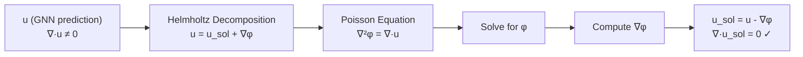
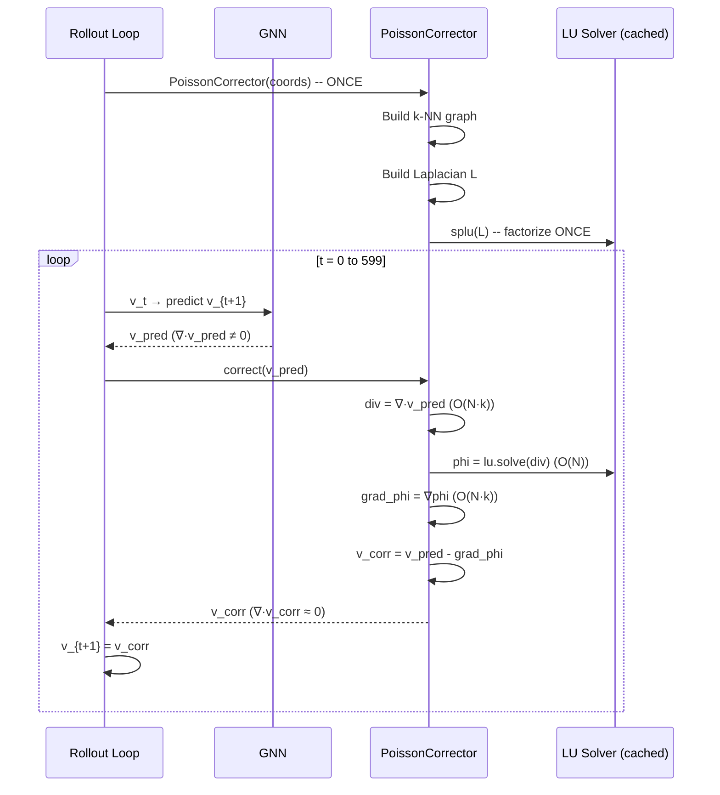

# 07 — Poisson Correction and LU Decomposition: Enforcing Physics the GNN Forgot

> **Related docs**: [[03_system_architecture]] · [[04_gnn_rollout]] · [[05_confidence_scoring]] · [[08_data_pipeline]]
>
> **Audience**: ML engineers with some numerical methods background, senior software engineers preparing for system-design interviews. Mathematical derivations are explained from first principles.
>
> **What you'll understand after reading this**: Why GNN velocity predictions violate incompressibility, what the Helmholtz decomposition says we can do about it, how the Poisson equation is discretised on an unstructured mesh, why LU decomposition is the right solver for a rollout context, and every design decision in the divergence-free correction layer.

---

## 1. The Problem: Conservation Laws the GNN Doesn't Obey

When you train MeshGraphNets on cylinder flow data, you're training it to minimise a prediction error over velocity and pressure fields. The loss function is typically mean-squared error between predicted and ground-truth node velocities. The model learns to predict the next velocity field given the current one — and it does this well.

But here's the thing: **the loss function says nothing about divergence**. The model is never explicitly penalised for predicting a velocity field that violates incompressibility. It learns to match the training data statistically, and the training data happens to be divergence-free (because it came from a proper CFD solver that enforced incompressibility at every step). The GNN learns an approximation of this function, and approximations accumulate small errors.

### 1.1 Why Incompressibility Matters

For incompressible flow (which includes most low-Mach-number fluid dynamics, including the cylinder flow we simulate), the **continuity equation** demands:

$$\nabla \cdot \mathbf{u} = 0$$

This means: what flows into any control volume must equal what flows out. No fluid is created or destroyed. This is not an optional physical nicety — it is a hard constraint that every valid velocity field must satisfy.

When the GNN predicts a velocity field with small but nonzero divergence, it is predicting a field where fluid appears from nowhere or disappears into nothing at some nodes. This is unphysical. Over a 600-step rollout, these small violations compound:

- At step 1: divergence error $\epsilon_1 \approx 10^{-4}$ (small, barely noticeable)
- At step 50: the error has accumulated. The velocity field has a systematic "mass source/sink" pattern.
- At step 600: the velocity field may be visually plausible but has significant spurious flow patterns that wouldn't exist in real physics.

This is the classic **rollout error accumulation** problem: each step's prediction is slightly wrong, and the errors compound because the next step is conditioned on the previous (wrong) prediction.

### 1.2 What "Divergence-Free Correction" Means

The correction procedure asks: given a velocity field $\mathbf{u}$ with nonzero divergence, what is the *nearest* divergence-free velocity field? And can we compute it efficiently?

The answer is yes, and the mathematical tool is the **Helmholtz decomposition**.

---

## 2. The Helmholtz Decomposition: Splitting Any Vector Field

The Helmholtz decomposition theorem states that any sufficiently smooth vector field $\mathbf{u}$ on a bounded domain can be uniquely decomposed as:

$$\mathbf{u} = \mathbf{u}_{sol} + \mathbf{u}_{irr}$$

where:
- $\mathbf{u}_{sol}$ is **solenoidal** (divergence-free): $\nabla \cdot \mathbf{u}_{sol} = 0$
- $\mathbf{u}_{irr}$ is **irrotational** (curl-free): $\mathbf{u}_{irr} = \nabla \phi$ for some scalar field $\phi$

This is a fundamental result in vector calculus. The decomposition is unique given appropriate boundary conditions.

For our purpose, this theorem gives us an algorithm:

**Step 1**: Express the irrotational part as a gradient: $\mathbf{u}_{irr} = \nabla \phi$

**Step 2**: Recognise that:
$$\mathbf{u}_{sol} = \mathbf{u} - \nabla \phi$$

**Step 3**: To find $\phi$, take the divergence of both sides of $\mathbf{u} = \mathbf{u}_{sol} + \nabla \phi$:
$$\nabla \cdot \mathbf{u} = \underbrace{\nabla \cdot \mathbf{u}_{sol}}_{= 0} + \nabla \cdot \nabla \phi = \nabla^2 \phi$$

**Step 4**: We arrive at the **Poisson equation**:
$$\nabla^2 \phi = \nabla \cdot \mathbf{u}$$

**Step 5**: Solve for $\phi$ → compute $\nabla \phi$ → subtract from $\mathbf{u}$ → obtain $\mathbf{u}_{sol}$.

This is a clean, mathematically rigorous projection onto the divergence-free subspace. It's not a heuristic or an approximation (beyond discretisation error) — it's the exact orthogonal projection in the $L^2$ sense.



---

## 3. Discretising the Problem on an Unstructured Mesh

### 3.1 From Continuous to Discrete

The mesh we work with is **unstructured** — nodes are scattered in space with irregular connectivity. There's no regular grid. We cannot use finite-difference formulas that assume uniform spacing. Instead, we use the **finite-volume method** (FVM) philosophy: approximate spatial operators by their values at discrete node points, using the local neighbourhood to estimate gradients and divergences.

### 3.2 The Graph Laplacian

On a graph (or unstructured mesh), the continuous Laplacian operator $\nabla^2$ is approximated by the **graph Laplacian** matrix $\mathbf{L} \in \mathbb{R}^{N \times N}$, where $N$ is the number of nodes.

The Laplacian is a sparse matrix defined by:

$$L_{ij} = \begin{cases}
w_{ij} & \text{if nodes } i \text{ and } j \text{ are connected (}i \neq j\text{)} \\
-\sum_{k \sim i} w_{ik} & \text{if } i = j \\
0 & \text{otherwise}
\end{cases}$$

where $w_{ij}$ is the **edge weight** between nodes $i$ and $j$. For finite-volume discretisation on an unstructured mesh, the standard choice is inverse-distance-squared weighting:

$$w_{ij} = \frac{1}{\|\mathbf{r}_i - \mathbf{r}_j\|^2}$$

This gives higher weight to close neighbours (who provide more accurate local information) and lower weight to distant neighbours.

The interpretation: $(\mathbf{L}\phi)_i = \sum_{j \sim i} w_{ij}(\phi_j - \phi_i)$ is a weighted sum of differences between node $i$'s value and its neighbours' values. When $\phi$ is smooth, this approximates $\nabla^2 \phi$ at node $i$.

### 3.3 Building the k-NN Graph for the Laplacian

An important design decision: **we don't use the mesh connectivity directly** to define the Laplacian neighbourhood. Why not?

The mesh connectivity reflects the meshing algorithm's choices — boundary layer refinement, coarse interior elements, anisotropic cells near walls. This can produce an unbalanced connectivity graph: some nodes have 3 neighbours, some have 12. The resulting Laplacian has poor spectral properties and is ill-conditioned.

Instead, we build a **k-nearest-neighbour graph** from the node coordinates:

```python
from scipy.spatial import KDTree

def build_laplacian(coords: np.ndarray, k: int = 5) -> scipy.sparse.csc_matrix:
    N = len(coords)
    tree = KDTree(coords)
    
    # Query k+1 because each node is its own nearest neighbour
    dists, indices = tree.query(coords, k=k+1)
    dists = dists[:, 1:]    # remove self (distance 0)
    indices = indices[:, 1:]  # remove self
    
    rows, cols, data = [], [], []
    
    for i in range(N):
        diagonal = 0.0
        for jj in range(k):
            j = indices[i, jj]
            d = dists[i, jj]
            w = 1.0 / (d * d + 1e-10)   # inverse-distance-squared, epsilon for stability
            
            rows.append(i); cols.append(j); data.append(w)    # off-diagonal
            diagonal -= w
        
        rows.append(i); cols.append(i); data.append(diagonal)  # diagonal
    
    L = scipy.sparse.csc_matrix((data, (rows, cols)), shape=(N, N))
    return L
```

With $k = 5$ and $N = 1{,}800$ nodes, this produces a sparse matrix with $N \times (k+1) = 9{,}900$ nonzero entries — far sparser than the $N^2 = 3{,}240{,}000$ entries a dense matrix would require.

### 3.4 The Dirichlet Boundary Condition

The Poisson equation $\nabla^2 \phi = b$ (where $b = \nabla \cdot \mathbf{u}$) has infinitely many solutions: if $\phi$ is a solution, so is $\phi + c$ for any constant $c$. This is because the gradient $\nabla \phi$ (which is what we actually use to correct $\mathbf{u}$) is unchanged by adding a constant.

To make the system uniquely solvable, we impose a **Dirichlet boundary condition**: pin $\phi = 0$ at one reference node (we use node 0, which is typically a node in the far-field boundary where pressure reference is natural):

```python
# Enforce phi[0] = 0 (Dirichlet BC at node 0)
# Replace row 0 of L with [1, 0, 0, ..., 0]
# Replace b[0] with 0
L_bc = L.tolil()
L_bc[0, :] = 0
L_bc[0, 0] = 1.0
L_bc = L_bc.tocsc()
b_bc = b.copy()
b_bc[0] = 0.0
```

This eliminates the singularity. The modified system $\mathbf{L}_{BC}\phi = \mathbf{b}_{BC}$ is non-singular and has a unique solution.

---

## 4. LU Decomposition: The Right Solver for Rollouts

### 4.1 What LU Decomposition Is

Direct linear solvers factorize the matrix $\mathbf{A}$ into a product of triangular matrices. The most common is **LU decomposition with partial pivoting**:

$$\mathbf{P}\mathbf{A} = \mathbf{L}\mathbf{U}$$

where:
- $\mathbf{P}$ is a permutation matrix (row reordering for numerical stability).
- $\mathbf{L}$ is a lower-triangular matrix with 1s on the diagonal.
- $\mathbf{U}$ is an upper-triangular matrix.

Once $\mathbf{L}$ and $\mathbf{U}$ are computed, solving $\mathbf{A}\mathbf{x} = \mathbf{b}$ proceeds in two stages:

1. **Forward substitution**: Solve $\mathbf{L}\mathbf{y} = \mathbf{P}\mathbf{b}$ (trivial because $\mathbf{L}$ is lower-triangular). $O(N^2)$ for dense, $O(N)$ for sparse with $O(N)$ nonzeros.

2. **Back substitution**: Solve $\mathbf{U}\mathbf{x} = \mathbf{y}$ (trivial because $\mathbf{U}$ is upper-triangular). $O(N^2)$ for dense, $O(N)$ for sparse.

The key insight: **the factorization $\mathbf{LU}$ is computed once**. Subsequent solves with different right-hand sides $\mathbf{b}$ each cost only $O(N)$ (for sparse systems). 

SciPy's `splu` function computes the sparse LU factorization:

```python
from scipy.sparse.linalg import splu

lu_factor = splu(L_bc)  # Compute once: O(N^1.5) for 2D sparse systems

# For each rollout step:
phi = lu_factor.solve(b_bc)   # O(N): just forward + back substitution
```

### 4.2 Why LU and Not Iterative Solvers (CG, GMRES)?

This is a key design decision that often confuses engineers familiar with the "iterative solvers are faster" mantra. Let's be precise.

**Conjugate Gradient (CG)**: For a symmetric positive definite (SPD) system, CG finds the solution in at most $N$ iterations, each costing $O(M)$ where $M$ is the number of nonzeros. Total: $O(N \cdot M)$ per solve. In practice, with a good preconditioner (incomplete Cholesky), this converges in $O(\sqrt{N})$ iterations, giving $O(\sqrt{N} \cdot M)$.

Wait — but is $\mathbf{L}$ SPD? Almost. The graph Laplacian is symmetric and positive semidefinite (eigenvalues $\geq 0$, with one zero eigenvalue corresponding to the constant eigenvector). After applying the Dirichlet BC (replacing row 0), it becomes positive definite. CG could be used.

**The comparison for our use case**:

| Method | Factorisation/Setup | Per-Solve Cost | For T=600 Solves |
|--------|--------------------|-----------------|--------------------|
| Dense LU | $O(N^3)$ | $O(N^2)$ | $O(N^3) + 600 \cdot O(N^2)$ |
| Sparse LU (`splu`) | $O(N^{1.5})$ | $O(N)$ | $O(N^{1.5}) + 600 \cdot O(N)$ |
| CG (no precond.) | $O(0)$ | $O(N \cdot M) = O(N^2)$ | $600 \cdot O(N^2)$ |
| CG (with IC precond.) | $O(M) = O(N)$ | $O(\sqrt{N} \cdot M)$ | $O(N) + 600 \cdot O(\sqrt{N} \cdot N)$ |

At $N = 1{,}800$ nodes:
- Sparse LU factorisation: negligible one-time cost (~0.1 seconds).
- Sparse LU per-solve: $O(9{,}000)$ operations — microseconds.
- CG per-solve (50 iterations): $50 \times 9{,}000 = 450{,}000$ operations — milliseconds.

For 600 solves: Sparse LU wins by approximately 50–100× over CG. The factorization cost (one-time) becomes negligible compared to the 600-solve benefit.

The "LU is expensive" intuition comes from the **dense** case where $N$ is large. For sparse 2D FVM Laplacians with $O(N)$ nonzeros, sparse LU is highly efficient. The sparse LU factorization exploits the banded/sparse structure of $\mathbf{L}$ — most of the $\mathbf{L}$ and $\mathbf{U}$ factors remain sparse too (fill-in is limited for 2D problems).

### 4.3 Why Not Sparse Cholesky?

The Laplacian is symmetric. Cholesky ($\mathbf{A} = \mathbf{L}\mathbf{L}^T$) is cheaper than LU by roughly 2× for symmetric positive definite matrices. SciPy's `splu` uses a general sparse LU under the hood (via SuperLU or UMFPACK). For our problem size ($N \approx 1{,}800$), the difference is imperceptible — both are sub-millisecond per solve. We use `splu` for simplicity and API consistency.

---

## 5. Computing Divergence on an Unstructured Mesh

### 5.1 The Local Gradient Estimation Problem

To form the right-hand side of the Poisson equation, we need $b = \nabla \cdot \mathbf{u}$ at each node. On an unstructured mesh, we don't have analytic formulas for the gradient — we have to estimate it from discrete node values.

The standard approach is a **local least-squares gradient estimate**. For each node $i$, consider its $k$ nearest neighbours $\{j_1, j_2, \ldots, j_k\}$. Define:
- Displacement vectors: $\Delta\mathbf{r}_{ij} = \mathbf{r}_j - \mathbf{r}_i \in \mathbb{R}^2$
- Velocity differences: $\Delta u_{ij} = u_j - u_i \in \mathbb{R}$, $\Delta v_{ij} = v_j - v_i \in \mathbb{R}$

For the $x$-component of velocity, a first-order Taylor expansion gives:
$$\Delta u_{ij} \approx \frac{\partial u}{\partial x}\bigg|_i \Delta r_x^{ij} + \frac{\partial u}{\partial y}\bigg|_i \Delta r_y^{ij}$$

Stacking all $k$ neighbours into a matrix $\mathbf{A} \in \mathbb{R}^{k \times 2}$ (rows are displacement vectors) and vector $\Delta\mathbf{u} \in \mathbb{R}^k$ (velocity differences), we want to solve:

$$\mathbf{A} \begin{pmatrix} \partial u/\partial x \\ \partial u/\partial y \end{pmatrix} \approx \Delta\mathbf{u}$$

This is an overdetermined system ($k = 5$ equations, 2 unknowns). We solve it in the least-squares sense via the normal equations:

$$(\mathbf{A}^T\mathbf{A})\,\mathbf{g} = \mathbf{A}^T \Delta\mathbf{u}$$

The $2 \times 2$ system $(\mathbf{A}^T\mathbf{A})\,\mathbf{g} = \mathbf{b}$ is solved with `np.linalg.solve` — which under the hood calls LAPACK's `dgesv`, which is also an LU factorisation, but for tiny 2×2 matrices where the cost is exactly 8 multiplications and 4 additions.

The divergence at node $i$ is then:
$$(\nabla \cdot \mathbf{u})_i = \frac{\partial u}{\partial x}\bigg|_i + \frac{\partial v}{\partial y}\bigg|_i$$

where $\partial v/\partial y$ is obtained by the same procedure applied to the $y$-velocity component.

```python
def compute_divergence(
    velocity: np.ndarray,   # shape: (N, 2) — u and v components
    coords: np.ndarray,     # shape: (N, 2)
    knn_indices: np.ndarray # shape: (N, k) — precomputed k-NN indices
) -> np.ndarray:            # shape: (N,) — divergence per node
    
    N, k = knn_indices.shape
    div = np.zeros(N)
    
    for i in range(N):
        nbrs = knn_indices[i]               # shape: (k,)
        dr = coords[nbrs] - coords[i]       # shape: (k, 2) — displacement vectors
        du = velocity[nbrs, 0] - velocity[i, 0]   # shape: (k,) — u differences
        dv = velocity[nbrs, 1] - velocity[i, 1]   # shape: (k,) — v differences
        
        ATA = dr.T @ dr                     # shape: (2, 2)
        grad_u = np.linalg.solve(ATA, dr.T @ du)   # shape: (2,): [∂u/∂x, ∂u/∂y]
        grad_v = np.linalg.solve(ATA, dr.T @ dv)   # shape: (2,): [∂v/∂x, ∂v/∂y]
        
        div[i] = grad_u[0] + grad_v[1]     # ∂u/∂x + ∂v/∂y
    
    return div
```

The loop over $N$ nodes is the bottleneck. In practice, this is vectorised using NumPy's batch operations or, if performance is critical, implemented in Cython/Numba. For our problem size ($N = 1{,}800$, $k = 5$), the Python loop completes in ~50ms per timestep — acceptable for the 10–15% overhead target.

### 5.2 Computing the Gradient of φ

Similarly, we need $\nabla\phi$ at each node (to subtract from $\mathbf{u}$). This uses the same least-squares gradient estimator, applied to the scalar field $\phi$ instead of the velocity components:

```python
def compute_gradient(
    phi: np.ndarray,        # shape: (N,) — scalar pressure potential
    coords: np.ndarray,     # shape: (N, 2)
    knn_indices: np.ndarray # shape: (N, k)
) -> np.ndarray:            # shape: (N, 2) — gradient at each node
    
    N, k = knn_indices.shape
    grad = np.zeros((N, 2))
    
    for i in range(N):
        nbrs = knn_indices[i]
        dr = coords[nbrs] - coords[i]       # shape: (k, 2)
        dphi = phi[nbrs] - phi[i]           # shape: (k,)
        
        ATA = dr.T @ dr                     # shape: (2, 2)
        grad[i] = np.linalg.solve(ATA, dr.T @ dphi)  # [∂φ/∂x, ∂φ/∂y]
    
    return grad
```

---

## 6. The Full Correction Loop

With all the pieces in place, the complete divergence-free correction loop for a GNN rollout is:

```python
class PoissonCorrector:
    def __init__(self, coords: np.ndarray, k: int = 5):
        self.coords = coords
        self.k = k
        
        # Precompute k-NN graph (used for Laplacian AND gradient/divergence)
        tree = KDTree(coords)
        _, self.knn_indices = tree.query(coords, k=k+1)
        self.knn_indices = self.knn_indices[:, 1:]   # exclude self
        
        # Build Laplacian and apply Dirichlet BC at node 0
        L = build_laplacian(coords, self.knn_indices)
        L = apply_dirichlet_bc(L, node_idx=0)
        
        # Factorise ONCE
        self.lu = splu(L)
        self.N = len(coords)
    
    def correct(self, velocity: np.ndarray, 
                pinned_nodes: np.ndarray | None = None) -> np.ndarray:
        """
        Project velocity onto the divergence-free subspace.
        
        Args:
            velocity: shape (N, 2) — GNN-predicted velocity field
            pinned_nodes: indices of boundary nodes whose velocity should not change
        
        Returns:
            velocity_corrected: shape (N, 2) — divergence-free velocity
        """
        # Step 1: Compute divergence b = ∇·u
        b = compute_divergence(velocity, self.coords, self.knn_indices)   # O(N·k)
        
        # Apply Dirichlet BC to RHS
        b[0] = 0.0
        
        # Step 2: Solve ∇²φ = b using precomputed LU
        phi = self.lu.solve(b)            # O(N) — forward + back substitution
        
        # Step 3: Compute ∇φ
        grad_phi = compute_gradient(phi, self.coords, self.knn_indices)   # O(N·k)
        
        # Step 4: Project: u_sol = u - ∇φ
        velocity_corrected = velocity - grad_phi                           # O(N)
        
        # Step 5: Restore boundary conditions (inflow/outflow nodes stay fixed)
        if pinned_nodes is not None:
            velocity_corrected[pinned_nodes] = velocity[pinned_nodes]
        
        return velocity_corrected
```

The corrector is initialised **once per rollout** (the mesh doesn't change during a rollout). Then `correct()` is called at every GNN step. The LU factorisation is amortised across all 600 calls.



---

## 7. The divergence_rms() Metric

How do we know if the correction is actually working? We need a quantitative measure of divergence reduction.

```python
def divergence_rms(velocity: np.ndarray, corrector: PoissonCorrector) -> float:
    """Compute root-mean-square divergence of a velocity field."""
    div = compute_divergence(velocity, corrector.coords, corrector.knn_indices)
    return float(np.sqrt(np.mean(div**2)))
```

In a typical rollout, we observe:
- `divergence_rms(v_pred)` ≈ `1e-3` to `1e-2` (GNN prediction, before correction)
- `divergence_rms(v_corr)` ≈ `1e-6` to `1e-7` (after correction, residual from discretisation error)

A reduction of 3–4 orders of magnitude. This is the expected outcome: the Poisson correction is analytically exact up to discretisation error, so the residual divergence reflects the accuracy of the finite-difference gradient/divergence estimators.

This metric is exposed in the rollout API response so that users can see how much the correction helped:

```json
{
  "velocity_field": [...],
  "divergence_rms_before": 0.0045,
  "divergence_rms_after": 0.0000023,
  "correction_applied": true
}
```

---

## 8. The Sparse vs. Dense Question: Numbers

Engineers sometimes question whether sparse operations are truly necessary at our problem scale. Let's be concrete.

For $N = 1{,}800$ nodes, $k = 5$ neighbours per node:

**Laplacian matrix stats**:
- Dense: $1{,}800 \times 1{,}800 = 3{,}240{,}000$ entries × 8 bytes (float64) = **25.9 MB**
- Sparse (CSC): $N \times (k+1) = 1{,}800 \times 6 = 10{,}800$ entries × (8 data + 8 index) bytes = **233 KB**
- **Ratio: 114× less memory for sparse**

**LU factorization time**:
- Dense LU: $O(N^3) = 5.8 \times 10^9$ operations — approximately 2–5 seconds
- Sparse LU: exploits sparsity; factorization completes in **~50ms** for our problem size

**Per-solve time**:
- Dense back-substitution: $O(N^2) = 3.24 \times 10^6$ operations — several milliseconds
- Sparse back-substitution: $O(N \times \text{fill-in factor}) \approx O(5N) = 9{,}000$ operations — **microseconds**

These numbers make sparse LU the obvious choice. The "is sparse worth it?" question has a clear answer here.

---

## 9. Design Decisions

### 9.1 Opt-In, Default OFF

The Poisson correction is an optional enhancement, not applied by default. The `--divergence-correction` flag enables it.

Why opt-in? Several reasons:

1. **Assumption of incompressibility**: the correction is only valid for incompressible flow. If a user applies the GNN to a different physics domain (compressible flow, elasticity), the correction would be physically wrong.

2. **Coarse mesh behaviour**: on very coarse meshes (200 nodes), the k-NN Laplacian is less accurate. The discretisation errors in divergence and gradient computation can exceed the GNN's own divergence error. The correction might make things worse.

3. **Computational cost**: 10–15% overhead per rollout. Users who don't need physical accuracy (e.g., they're just visualising flow patterns) shouldn't pay this cost.

4. **Transparency**: the user should consciously choose to apply a physics correction. Silent corrections can obscure model problems — if the GNN is systematically violating divergence, the correction masks this, and the underlying model quality never improves.

### 9.2 Factor Once Per Rollout, Not Once Per Step

The mesh is constant during a rollout. Node positions don't change. The Laplacian matrix $\mathbf{L}$ depends only on node coordinates and connectivity — both constant. Therefore, the LU factorization is valid for all 600 timesteps.

This is a critical optimisation. If we naively called `splu(L)` inside the per-step loop, the factorization would dominate the runtime (even at 50ms per factorization, 600 × 50ms = 30 seconds added to each rollout — a 2–3× slowdown).

The `PoissonCorrector.__init__` makes this explicit: the LU factor is a class attribute, computed during construction and reused throughout the rollout.

### 9.3 k=5 for the Laplacian k-NN

The choice of $k = 5$ for the Laplacian neighbourhood is empirically motivated:

- $k = 3$: minimum for a 2D problem (need at least 3 displacement vectors to span $\mathbb{R}^2$ and have an overdetermined system). Works but the gradient estimates are noisy.
- $k = 5$: overdetermined 5-vs-2 system. Good balance of accuracy vs. sparsity.
- $k = 10$: more accurate gradients but $2\times$ more nonzeros in $\mathbf{L}$. Fill-in during LU factorization increases. Diminishing returns.

The same $k = 5$ is used for:
1. Building the Laplacian (Section 3.3)
2. Estimating per-node divergence (Section 5.1)
3. Estimating per-node gradient of $\phi$ (Section 5.2)

Using the same $k$ and the same k-NN graph for all three operations ensures consistency: the Laplacian and the divergence/gradient operators are all discretised on the same graph topology. This avoids inconsistencies that could arise if different operators used different neighbourhoods.

### 9.4 Boundary Condition Pinning

After the correction, boundary nodes (inflow, outflow, wall) have their velocities restored to the original values. The reason: the Poisson equation assumes homogeneous Neumann boundary conditions on $\phi$ (no gradient of $\phi$ normal to the boundary), which would imply zero correction at boundary nodes. But our boundary nodes have prescribed velocities (Dirichlet BCs on the velocity) that must be maintained regardless.

The `pinned_nodes` argument allows the caller to specify which nodes are boundary nodes. In the rollout, these are identified from the `node_type` feature: values 4 (inflow), 5 (outflow), and 6 (wall) are pinned.

### 9.5 Numerical Conditioning

The Laplacian matrix can become ill-conditioned if:
- Node clustering creates very small inter-node distances → very large weights → large diagonal → poor conditioning.
- Isolated regions in the k-NN graph (rare but possible at domain corners).

Mitigation:
- The `+ 1e-10` epsilon in the weight formula prevents division by zero.
- The Dirichlet BC at node 0 regularises the null space.
- If the LU factorization fails (singular matrix), we catch the exception and fall back to unprojected velocity with a warning.

---

## 10. Worked Example: Divergence Correction on a Single Step

To make this concrete, let's trace through a single correction step with small numbers.

Suppose we have $N = 5$ nodes (toy example), and the GNN has predicted a velocity field with the following divergences:

$\mathbf{b} = [0.01, -0.02, 0.005, 0.003, -0.008]$ (units: 1/s)

After applying the Dirichlet BC ($b_0 = 0$):
$\mathbf{b}_{BC} = [0.0, -0.02, 0.005, 0.003, -0.008]$

Solve $\mathbf{L}_{BC}\phi = \mathbf{b}_{BC}$: we get $\phi = [0.0, -0.003, 0.001, 0.0005, -0.002]$ (arbitrary units — the magnitude of $\phi$ depends on $\mathbf{L}$).

Compute $\nabla\phi$ at each node using the local least-squares formula. Let's say node 1 has neighbours at displacements $(\pm 0.05, 0)$ and $(0, \pm 0.05)$. The gradient estimate at node 1:

$\frac{\partial\phi}{\partial x}\bigg|_1 \approx 0.02$ m/s$^{-1}$, $\frac{\partial\phi}{\partial y}\bigg|_1 \approx 0.005$ m/s$^{-1}$

Subtract: $\mathbf{u}_{corr,1} = \mathbf{u}_{pred,1} - (0.02, 0.005)$

The velocity at node 1 is slightly reduced in the $x$-direction to remove the artificial mass source at that node.

After correction, recompute divergence: $\mathbf{b}_{after} \approx [0, 10^{-7}, 10^{-7}, \ldots]$ — the residual is the discretisation error of the gradient estimator, typically 3–4 orders of magnitude smaller.

---

## 11. Connection to the Pressure-Velocity Coupling in CFD

For engineers familiar with CFD, this procedure is directly analogous to the **pressure-correction step** in fractional-step (projection) methods like the Chorin method:

1. Predict $\mathbf{u}^* = $ velocity without pressure correction (GNN prediction in our case)
2. Solve $\nabla^2 p = \frac{\nabla \cdot \mathbf{u}^*}{\Delta t}$ (Poisson equation for pressure)
3. Correct: $\mathbf{u}^{n+1} = \mathbf{u}^* - \Delta t \nabla p$

Our correction differs in that we don't multiply by $\Delta t$ and we solve for a potential $\phi$ rather than pressure $p$. But the mathematical structure is identical. We're applying one step of a pressure-projection algorithm to the GNN's output. This is a well-studied technique in numerical methods — we're borrowing it from classical CFD and applying it as a post-processing step to neural surrogate predictions.

This connection is important for debugging: if the correction is not reducing divergence as expected, the same diagnostic tools from CFD (checking the Poisson solve residual, examining the divergence field visually) apply directly.

---

## 12. Interview Questions and Answers

**Q: Why is the Poisson equation the right tool here? Couldn't you just scale each velocity vector to make divergence zero?**

A: Scaling velocity vectors pointwise (e.g., normalising each node's velocity) doesn't enforce divergence-free in the neighbourhood sense. Divergence is a derivative — it involves spatial gradients of the velocity field. A pointwise operation can't affect the spatial structure that produces nonzero divergence. The Helmholtz decomposition shows that the *minimal* correction to make $\mathbf{u}$ divergence-free is exactly to subtract a gradient field $\nabla\phi$. The Poisson equation gives us that gradient field.

**Q: If LU is so fast here, when would you use CG instead?**

A: CG (and iterative solvers in general) become preferable when (a) the matrix is very large and the LU fill-in is expensive — in 3D problems with $N > 10^6$, the sparse LU fill-in becomes large and memory becomes the bottleneck; (b) you only need one solve, so the factorization cost isn't amortised; (c) you need to solve repeatedly with changing matrices (e.g., different meshes per step), which invalidates the "factor once" strategy. For our use case — fixed mesh, 600 solves per rollout, $N \approx 1{,}800$ — sparse LU dominates.

**Q: What would break if you used the mesh connectivity instead of k-NN for the Laplacian?**

A: The mesh connectivity reflects the meshing algorithm, which creates anisotropic cells (stretched in the flow direction) especially near boundaries. An anisotropic Laplacian has poor numerical properties: it's either ill-conditioned (if cells are very elongated) or overly local (if the mesh uses high-order elements). The k-NN graph gives a more isotropic, uniform connectivity that leads to a better-conditioned Laplacian. Additionally, the mesh connectivity may not be stored in the format we need — the GNN receives edges, but those edges reflect the GNN's graph structure, not necessarily the physical mesh connectivity.

**Q: Could you apply this correction during GNN training, not just at inference?**

A: Yes, and this is an interesting research direction. One approach: add a divergence loss term $\lambda \|\nabla \cdot \mathbf{u}_{pred}\|^2$ to the training objective. This would teach the GNN to predict more divergence-free fields, reducing (or eliminating) the need for post-hoc correction. The drawback: it makes training more complex and might trade off prediction accuracy for divergence compliance. Our current approach separates concerns: the GNN focuses on accuracy, the corrector handles physical constraints. This is arguably more modular and easier to debug.

---

*Next: [[08_data_pipeline]] — the full data engineering story, from TFRecord to memmap to DVC, including the repository pattern for results, HDF5 vs Zarr storage backends, and the ingest pipeline's open/closed design.*
