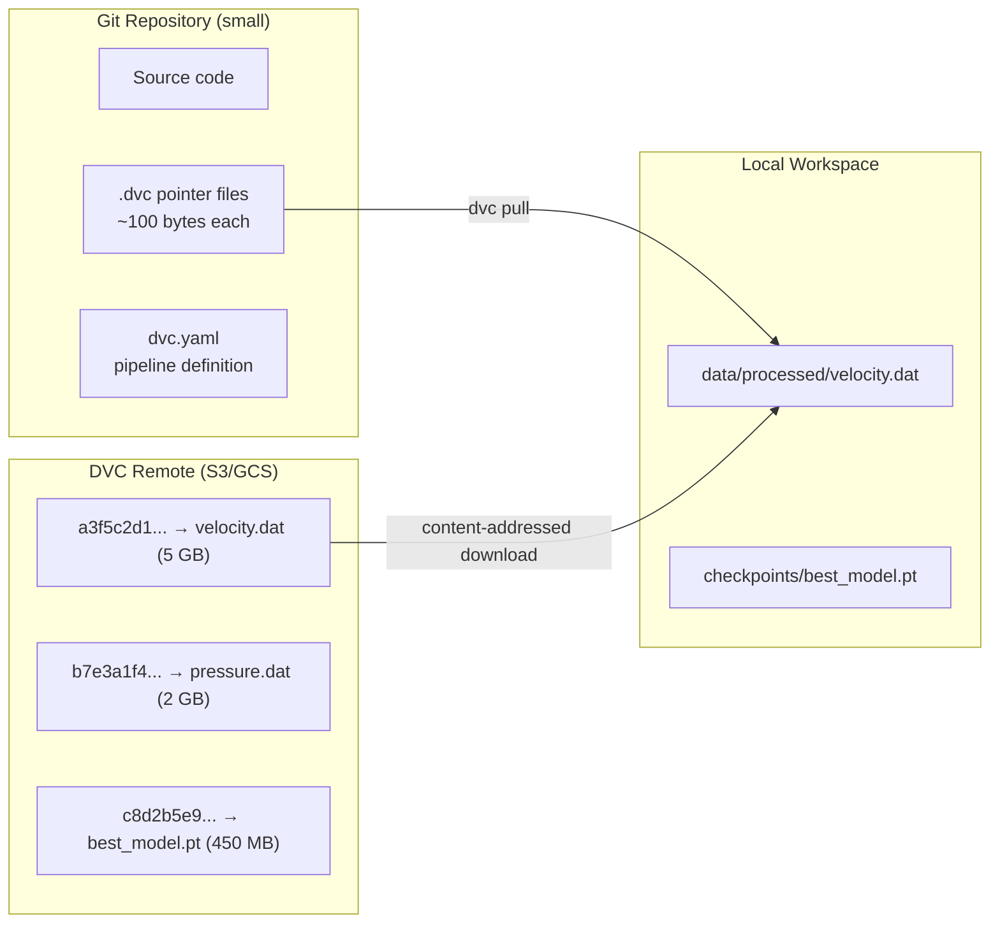
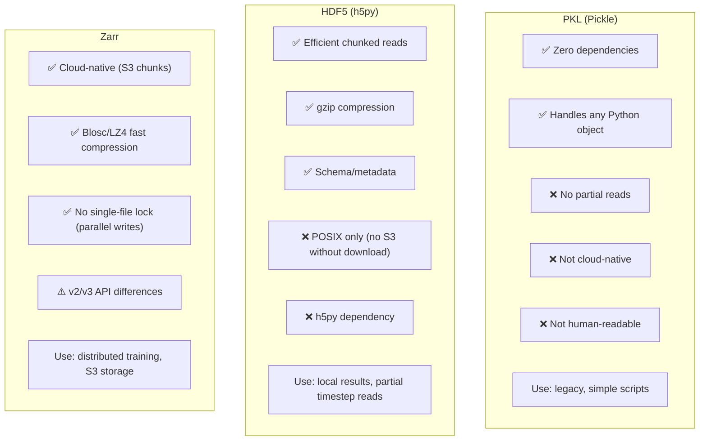
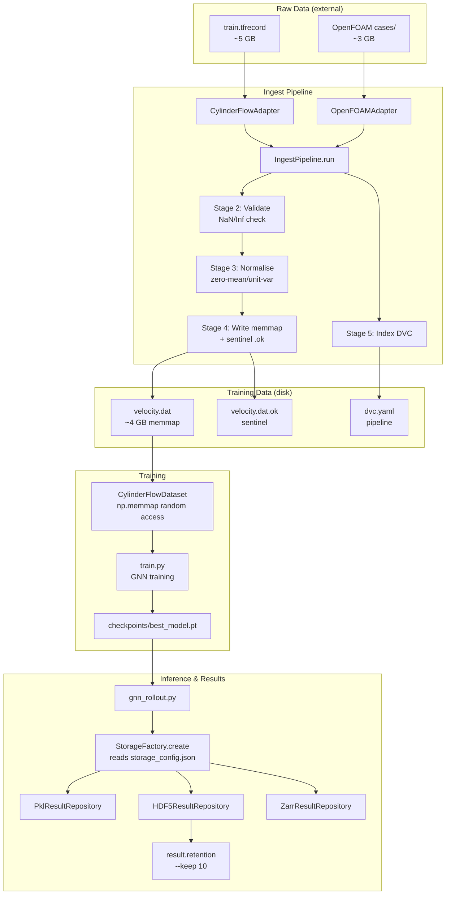

# 08 — Data Pipeline: From Raw Bytes to Training-Ready Tensors

> **Related docs**: [[03_system_architecture]] · [[05_confidence_scoring]] · [[07_poisson_correction_lu]]
>
> **Audience**: ML engineers, senior software engineers preparing for system-design interviews. This document covers both the ML-specific data concerns and the software engineering patterns for extensible, reliable data systems.
>
> **What you'll understand after reading this**: Why data pipelines are consistently underestimated, how every format and pattern choice in this pipeline was motivated by a real problem, and how software engineering principles (Repository Pattern, Open/Closed, Protocol types) apply to ML data infrastructure.

---

## 1. The Big Picture: Why Data Pipelines Are Underestimated

There is a pattern in ML projects: the model gets attention, the data pipeline gets none. "Just load the data" is treated as a solved problem. It is not.

In practice, the data pipeline is where projects silently fail. The model trains to low loss, validation metrics look good, then production predictions are wrong — because a normalisation step was applied incorrectly, because a training/validation split was accidentally corrupted, because a training run used data from a different preprocessing version than the evaluation run. These failures are hard to detect because nothing crashes. The system produces numbers. The numbers are wrong.

This document is the story of every design decision in the data pipeline, including the mistakes that motivated them.

The pipeline has five concerns:

1. **Format translation**: DeepMind provides data in TFRecord (TensorFlow binary format); we use PyTorch. These must be bridged.
2. **Storage for training**: how to store training data for fast random-access during GPU training.
3. **Versioning**: how to ensure a model and its training data are always linked.
4. **Storage for results**: how to save rollout outputs in a queryable, efficient format.
5. **Extensibility**: how to add new data sources (new physics solvers) without rewriting the pipeline.

Each of these has a story.

---

## 2. From TFRecord to Memmap: The Format Translation Problem

### 2.1 The TFRecord Format

Google DeepMind released the cylinder flow simulation dataset in **TFRecord** format — TensorFlow's binary sequential record format. A TFRecord file is a sequence of serialised `tf.train.Example` protocol buffers, each containing named feature tensors.

We're using PyTorch, not TensorFlow. We don't want TensorFlow as a runtime dependency — it's a large library (gigabytes), has its own CUDA requirements, and would create version conflicts. We need to translate the data out of TFRecord format exactly once and store it in a PyTorch-friendly format.

`parse_tfrecord.py` does this translation:

```python
import tensorflow as tf   # Used ONLY here, for TFRecord reading
import numpy as np

def parse_tfrecord(tfrecord_path: Path, output_dir: Path) -> None:
    dataset = tf.data.TFRecordDataset(str(tfrecord_path))
    
    trajectories = []
    for raw_record in dataset:
        example = tf.train.Example()
        example.ParseFromString(raw_record.numpy())
        
        features = example.features.feature
        velocity = np.array(features["velocity"].float_list.value).reshape(T, N, 2)
        pressure = np.array(features["pressure"].float_list.value).reshape(T, N, 1)
        node_type = np.array(features["node_type"].int64_list.value).reshape(N)
        cells = np.array(features["cells"].int64_list.value).reshape(-1, 3)
        mesh_pos = np.array(features["mesh_pos"].float_list.value).reshape(N, 2)
        
        trajectories.append({
            "velocity": velocity,    # (T, N, 2)
            "pressure": pressure,    # (T, N, 1)
            "node_type": node_type,  # (N,)
            "cells": cells,          # (F, 3)
            "mesh_pos": mesh_pos,    # (N, 2)
        })
    
    # Write to numpy memmap
    _write_memmap(trajectories, output_dir)
```

The TensorFlow import is isolated to this one file. No other file in the project imports TensorFlow. This is an intentional **dependency boundary**: if TensorFlow breaks (version incompatibility, CUDA conflict), exactly one file is affected, and its fix doesn't cascade.

### 2.2 Memmap: Disk-Backed Arrays

After parsing, we write the data to **numpy memmap** files — binary `.dat` files that numpy can read as if they were in-memory arrays, using the OS virtual memory system to load pages on demand.

The motivation is straightforward: our training dataset is approximately 10 GB. A typical training machine has 16–32 GB of RAM. We cannot load the entire dataset into RAM at training start and expect any memory headroom for the model, gradients, and CUDA allocations. We need **demand-paged** access: load only the trajectories that the current training batch needs.

Memmap provides exactly this:

```python
def _write_memmap(trajectories: list[dict], output_dir: Path) -> None:
    n_traj = len(trajectories)
    T, N, _ = trajectories[0]["velocity"].shape
    
    # Create memmap files
    vel_mm = np.memmap(
        output_dir / "velocity.dat", 
        dtype=np.float32, mode="w+", 
        shape=(n_traj, T, N, 2)
    )
    pres_mm = np.memmap(
        output_dir / "pressure.dat", 
        dtype=np.float32, mode="w+", 
        shape=(n_traj, T, N, 1)
    )
    
    for i, traj in enumerate(trajectories):
        vel_mm[i] = traj["velocity"].astype(np.float32)
        pres_mm[i] = traj["pressure"].astype(np.float32)
    
    # Flush to disk
    del vel_mm, pres_mm   # triggers flush
```

At training time, the dataset class reads from these memmaps:

```python
class CylinderFlowDataset(Dataset):
    def __init__(self, data_dir: Path):
        self.velocity = np.memmap(
            data_dir / "velocity.dat", 
            dtype=np.float32, mode="r",
            shape=(n_traj, T, N, 2)
        )
    
    def __getitem__(self, idx: int) -> dict:
        # This reads exactly one trajectory page from disk (or OS cache)
        return {"velocity": self.velocity[idx]}   # shape: (T, N, 2)
```

The OS page cache does the rest: frequently-accessed trajectories stay in RAM; rarely-accessed ones are evicted. After the first epoch, the working set of "hot" trajectories is cached in RAM, and subsequent epochs are purely RAM-reads.

**Random access performance**: Memmap access to trajectory `idx` requires seeking to byte offset `idx × T × N × 2 × 4` in the file. This is an $O(1)$ seek — no parsing, no decompression, no header reading. Compare to HDF5 (which we'll discuss later): a single HDF5 read requires parsing the file's B-tree index, decompressing the relevant chunk(s), and reconstructing the array. For random-access heavy patterns (like training with shuffled batches), memmap wins by 5–10×.

### 2.3 Sentinel Files: The .dat.ok Pattern

Here is a failure mode that happened before sentinel files were introduced.

The parse job runs overnight. At 3am, a disk-full error occurs after writing 60% of the trajectories. The job fails. `velocity.dat` exists on disk and has data — but only the first 600 of 1,000 trajectories. The next morning, a training job starts. It reads `velocity.dat`. The file is valid numpy memmap. It contains data. The training job loads trajectories 800, 900, etc. — which contain zeros (unwritten pages). Training proceeds with a corrupted dataset. The model underfits. Nobody knows why.

Sentinel files solve this:

```python
def _write_memmap(trajectories, output_dir):
    sentinel = output_dir / "velocity.dat.ok"
    sentinel.unlink(missing_ok=True)   # Remove old sentinel first
    
    # ... write data ...
    
    # Only write sentinel after successful complete write
    sentinel.touch()

def load_memmap(data_dir):
    if not (data_dir / "velocity.dat.ok").exists():
        raise RuntimeError(
            f"Memmap sentinel missing: {data_dir / 'velocity.dat.ok'}. "
            f"Re-run: python parse_tfrecord.py --output {data_dir}"
        )
    return np.memmap(data_dir / "velocity.dat", ...)
```

The rule: **never read a `.dat` file without checking for its `.ok` sentinel**. The sentinel is atomic — it's either present (complete) or absent (incomplete or missing). There's no partial-sentinel state. This is the same design as WAL (Write-Ahead Log) commit markers in databases.

---

## 3. DVC: Data Version Control

### 3.1 The Problem with Git for Data

Git is designed for source code: text files, diffs, merges. When you `git add data/train.dat`, git computes a SHA of the entire 5 GB file and stores a blob object. The blob is stored in `.git/objects/` permanently. Every `git clone` downloads all history — including all historical versions of all 5 GB training files. A 6-month-old project might have 100 GB of git history, 95% of which is binary data blobs.

`git-lfs` (Large File Storage) helps: it replaces large blobs with tiny pointer files, and stores the actual blobs in an external service (GitHub LFS, AWS S3). This keeps the git repository small. But git-lfs has no understanding of *how* the data was produced. If `train.dat` is regenerated from `train.tfrecord` using `parse_tfrecord.py`, git-lfs doesn't know this. It can't tell you if `train.dat` is stale relative to `train.tfrecord`. It's just a file pointer.

### 3.2 What DVC Adds: Pipeline Awareness

DVC (Data Version Control) adds what git-lfs lacks: **dependency graph awareness**. DVC knows that `data/train.dat` was produced FROM `data/raw/train.tfrecord` BY running `parse_tfrecord.py`. This relationship is recorded in `dvc.yaml`:

```yaml
stages:
  parse_train:
    cmd: python parse_tfrecord.py --input data/raw/train.tfrecord --output data/processed/
    deps:
      - data/raw/train.tfrecord
      - parse_tfrecord.py
    outs:
      - data/processed/train/velocity.dat
      - data/processed/train/velocity.dat.ok
      - data/processed/train/pressure.dat
      - data/processed/train/pressure.dat.ok
    
  train_model:
    cmd: python train.py --data data/processed/
    deps:
      - data/processed/train/velocity.dat
      - data/processed/train/velocity.dat.ok
      - train.py
    outs:
      - checkpoints/best_model.pt
    metrics:
      - runs/train_metrics.json
```

With this, `dvc repro` can:
- Check if `train.tfrecord` has changed since `velocity.dat` was last generated.
- If yes: re-run `parse_tfrecord.py`, then re-run `train.py`.
- If no: skip both (outputs are up to date).
- Handle the dependency graph: if only `parse_tfrecord.py` changes (bug fix), it re-parses but reuses cached intermediate outputs where valid.

This is the key capability: **automatic staleness detection** for a data pipeline with multiple stages and dependencies.

### 3.3 DVC Remote Storage

DVC stores large file content in a **remote storage** (S3, GCS, Azure Blob, SSH server). What git stores is just a small `.dvc` pointer file:

```
# data/processed/train/velocity.dat.dvc
outs:
- md5: a3f5c2d1e8b4...
  size: 5368709120
  path: velocity.dat
```

This 6-line file is what lives in git. The actual 5 GB binary lives in S3. To get the data:

```bash
dvc pull data/processed/train/velocity.dat.dvc
```

DVC downloads from S3 by content-addressed hash (the `md5` field). To share the dataset across the team or restore a historical version:

```bash
git checkout v1.0          # restore pointer files from model version 1.0
dvc checkout               # restore exact data versions the pointers refer to
```

`dvc checkout` fetches exactly the data version that corresponds to the git commit — including the exact `velocity.dat` used to train the model at that commit. This is **full reproducibility**: code version → data version → model version, all locked together.



---

## 4. The Repository Pattern for Results

### 4.1 The Problem: Ad Hoc Result Saving

Early in the project, rollout results were saved like this:

```python
# In rollout.py
result = gnn_rollout(mesh, steps=600)
with open(f"results/traj_{traj_id}.pkl", "wb") as f:
    pickle.dump(result, f)
```

And loaded like this:

```python
# In analysis.py
with open(f"results/traj_{traj_id}.pkl", "rb") as f:
    result = pickle.load(f)
```

And again in:

```python
# In visualise.py
with open(f"results/traj_{traj_id}.pkl", "rb") as f:
    result = pickle.load(f)
```

This works until it doesn't. Problems arise when:

1. The team decides to switch from pickle to HDF5 for random timestep access — now every file that touches results needs to change.
2. A new engineer adds a new analysis script and saves results to a different directory.
3. Tests use real files, creating coupling between test outcomes and disk state.
4. The result format changes (add a new field); now old pickle files can't be loaded with the new code.

These are symptoms of the same underlying issue: **storage logic is coupled to business logic**. The solution is the Repository Pattern.

### 4.2 The ResultRepository Protocol

```python
from typing import Protocol, runtime_checkable
from pathlib import Path

@runtime_checkable
class ResultRepository(Protocol):
    """Abstract interface for rollout result persistence."""
    
    def save(self, key: str, data: dict) -> None:
        """Save a complete rollout result. key = trajectory ID or run name."""
        ...
    
    def load(self, key: str) -> dict:
        """Load a complete rollout result."""
        ...
    
    def load_timestep(self, key: str, t: int) -> dict:
        """Load a single timestep efficiently (no need to load full rollout)."""
        ...
    
    def list(self) -> list[str]:
        """List all stored result keys."""
        ...
    
    def exists(self, key: str) -> bool:
        """Check if a result exists."""
        ...
    
    def delete(self, key: str) -> bool:
        """Delete a result. Returns True if deleted, False if not found."""
        ...
    
    def get_path(self, key: str) -> Path:
        """Return the filesystem path for a result (for direct file access)."""
        ...
```

This is a **Protocol** (structural subtyping), not an abstract base class. The difference:

- **ABC** (`from abc import ABC, abstractmethod`): requires explicit inheritance. `class HDF5ResultRepository(ResultRepository, ABC)`. Classes that don't inherit from the ABC don't satisfy the type.
- **Protocol** (`from typing import Protocol`): requires only that the class has the right methods. Any class with `save`, `load`, `load_timestep`, `list`, `exists`, `delete`, `get_path` satisfies `ResultRepository` — even if it was written before this Protocol existed.

`@runtime_checkable` means you can use `isinstance(repo, ResultRepository)` at runtime to verify compliance. This enables the `StorageFactory` to validate its output:

```python
repo = StorageFactory.create(config)
assert isinstance(repo, ResultRepository), "Factory returned non-conforming object"
```

### 4.3 PklResultRepository

The simplest implementation — one pickle file per result:

```python
class PklResultRepository:
    def __init__(self, base_dir: Path):
        self.base_dir = Path(base_dir)
        self.base_dir.mkdir(parents=True, exist_ok=True)
    
    def save(self, key: str, data: dict) -> None:
        path = self.base_dir / f"{key}.pkl"
        with open(path, "wb") as f:
            pickle.dump(data, f, protocol=pickle.HIGHEST_PROTOCOL)
    
    def load(self, key: str) -> dict:
        path = self.base_dir / f"{key}.pkl"
        if not path.exists():
            raise KeyError(f"Result not found: {key}")
        with open(path, "rb") as f:
            return pickle.load(f)
    
    def load_timestep(self, key: str, t: int) -> dict:
        # Pickle has no partial read; load full result and slice
        result = self.load(key)
        return {k: v[t] if hasattr(v, "__len__") else v 
                for k, v in result.items()}
    
    def list(self) -> list[str]:
        return [p.stem for p in self.base_dir.glob("*.pkl")]
    
    def exists(self, key: str) -> bool:
        return (self.base_dir / f"{key}.pkl").exists()
    
    def delete(self, key: str) -> bool:
        path = self.base_dir / f"{key}.pkl"
        if path.exists():
            path.unlink()
            return True
        return False
    
    def get_path(self, key: str) -> Path:
        return self.base_dir / f"{key}.pkl"
```

PKL is simple, requires no dependencies, and works for everything. Its weakness: `load_timestep` loads the entire result and slices — wasteful if you only need one frame from a 600-timestep simulation.

### 4.4 HDF5ResultRepository

HDF5 (Hierarchical Data Format 5) is a binary format with compression, chunking, and schema. The critical feature: **chunked storage** allows efficient partial reads.

```python
class HDF5ResultRepository:
    def __init__(self, base_dir: Path, compression_level: int = 4):
        self.base_dir = Path(base_dir)
        self.base_dir.mkdir(parents=True, exist_ok=True)
        self.gzip_level = compression_level   # 1 (fast) to 9 (small)
    
    def save(self, key: str, data: dict) -> None:
        path = self.base_dir / f"{key}.h5"
        with h5py.File(path, "w") as f:
            for field, array in data.items():
                if isinstance(array, np.ndarray) and array.ndim >= 2:
                    T = array.shape[0]
                    # chunks=(1, *remaining_dims): each timestep is one chunk
                    chunk_shape = (1,) + array.shape[1:]
                    f.create_dataset(
                        field, data=array,
                        chunks=chunk_shape,
                        compression="gzip",
                        compression_opts=self.gzip_level
                    )
                else:
                    f.create_dataset(field, data=array)
    
    def load_timestep(self, key: str, t: int) -> dict:
        path = self.base_dir / f"{key}.h5"
        with h5py.File(path, "r") as f:
            # HDF5 reads exactly the chunks that cover row t
            # With chunks=(1, N, D), this reads exactly 1 chunk = 1 timestep
            return {field: f[field][t] for field in f.keys()}
```

The chunk shape `(1, N, D)` is the key design decision. HDF5 stores data in fixed-size chunks. When you read `f["velocity"][t]` (one timestep), HDF5 reads exactly the chunks that cover row `t`. With chunk shape `(1, N, D)`, each timestep is exactly one chunk — so reading one timestep reads exactly as much data as it needs, and no more.

Compare to chunk shape `(T, N, D)` (default — no chunking): reading one timestep requires reading the entire $T \times N \times D$ array. For $T = 600$, $N = 1{,}800$, $D = 2$: reading one timestep reads $600 \times 1{,}800 \times 2 \times 4 = 8.64$ MB when you only needed $1{,}800 \times 2 \times 4 = 14.4$ KB. A 600× overhead.

**Compression**: gzip-4 gives a good balance. Velocity fields from CFD simulations are highly compressible — smooth, slowly varying fields compress to 20–30% of their original size. A 50 MB rollout result typically compresses to 10–15 MB.

The tradeoff: compression adds latency to reads. Random timestep access on a compressed HDF5 file is 2–5× slower than on an uncompressed memmap. For results (which are read infrequently, once per analysis), this tradeoff is fine. For training data (read millions of times per epoch), it's not — which is why we use uncompressed memmap for training data.

### 4.5 The StorageFactory

```python
class StorageFactory:
    _registry: dict[str, type] = {
        "pkl": PklResultRepository,
        "hdf5": HDF5ResultRepository,
        "zarr": ZarrResultRepository,
    }
    
    @classmethod
    def create(cls, config_path: Path = Path("runs/storage_config.json")) -> ResultRepository:
        if config_path.exists():
            with open(config_path) as f:
                config = json.load(f)
        else:
            config = {"backend": "pkl", "base_dir": "results/"}
        
        backend = config["backend"]
        if backend not in cls._registry:
            raise ValueError(f"Unknown storage backend: {backend!r}. "
                           f"Valid: {list(cls._registry)}")
        
        base_dir = Path(config.get("base_dir", "results/"))
        extra_kwargs = {k: v for k, v in config.items() 
                       if k not in ("backend", "base_dir")}
        
        repo = cls._registry[backend](base_dir, **extra_kwargs)
        assert isinstance(repo, ResultRepository)
        return repo
    
    @classmethod
    def register(cls, name: str, implementation: type) -> None:
        """Add a new storage backend without modifying StorageFactory."""
        cls._registry[name] = implementation
```

The `runs/storage_config.json` file:

```json
{
  "backend": "hdf5",
  "base_dir": "results/hdf5/",
  "compression_level": 4
}
```

To switch to Zarr: change `backend` to `"zarr"`. No code changes. All callers (`rollout.py`, `visualise.py`, `analysis.py`) use `StorageFactory.create()` and are completely insulated from the storage choice.

Adding a new backend (say, DuckDB for columnar queries):

```python
class DuckDBResultRepository:
    def save(self, key, data): ...
    def load(self, key): ...
    # ... implement protocol ...

StorageFactory.register("duckdb", DuckDBResultRepository)
```

No changes to `StorageFactory` itself. This is the **Open/Closed Principle**: the factory is open for extension (new backends via `register`) and closed for modification (the `create` method is unchanged).

---

## 5. HDF5 vs Zarr vs PKL: The Full Tradeoff Analysis



### 5.1 Zarr: Cloud-Native Chunking

Zarr stores arrays as a directory of chunk files rather than a single binary file. For an array of shape `(T, N, D)` with chunk shape `(1, N, D)`:

```
results/traj_0001.zarr/
    .zarray        # metadata (dtype, shape, chunk shape, compressor)
    .zattrs        # user attributes
    0.0.0          # chunk [t=0, all N, all D]
    1.0.0          # chunk [t=1, all N, all D]
    2.0.0          # chunk [t=2, all N, all D]
    ...
    599.0.0        # chunk [t=599, all N, all D]
```

On S3, each chunk file becomes an S3 object with key `results/traj_0001.zarr/42.0.0`. Reading timestep 42 is a single `s3.get_object` call — no file download, no seeking, no full-file read. This is what "cloud-native" means: the storage format aligns with the cloud storage model (object store with random object access).

**Zarr v2/v3 compatibility**: The `BloscCodec` (the fast Blosc compression codec) moved from `numcodecs.Blosc` (v2) to `zarr.codecs.BloscCodec` (v3) between versions. Our code uses a fallback chain:

```python
def _get_compressor():
    try:
        # zarr v3 API
        from zarr.codecs import BloscCodec
        return BloscCodec(cname="lz4", clevel=5)
    except ImportError:
        try:
            # zarr v2 API
            import numcodecs
            return numcodecs.Blosc(cname="lz4", clevel=5)
        except ImportError:
            # No Blosc available; fall back to gzip via zarr
            return None   # zarr default compression
```

This makes Zarr usage resilient to version variations in different environments.

**In-memory Zarr store for tests**:

```python
import zarr

def make_test_repository() -> ZarrResultRepository:
    """Create an in-memory Zarr store for unit tests (no disk I/O)."""
    store = zarr.storage.MemoryStore()
    return ZarrResultRepository(store=store)
```

An in-memory Zarr store behaves identically to a filesystem-based store from the API perspective, but lives entirely in RAM. Tests can run at full speed without creating temporary directories or cleaning up after themselves.

### 5.2 The Migration Path from PKL to HDF5

Legacy results stored as pickle files can be migrated without losing data:

```python
# migrate_pkl_to_hdf5.py
def migrate(source_dir: Path, dest_dir: Path, dry_run: bool = False) -> None:
    pkl_repo = PklResultRepository(source_dir)
    hdf5_repo = HDF5ResultRepository(dest_dir)
    
    keys = pkl_repo.list()
    for key in tqdm(keys, desc="Migrating"):
        if hdf5_repo.exists(key):
            continue   # already migrated
        
        data = pkl_repo.load(key)
        
        if not dry_run:
            hdf5_repo.save(key, data)
            # Verify round-trip
            loaded = hdf5_repo.load(key)
            for field in data:
                np.testing.assert_allclose(data[field], loaded[field], 
                                           err_msg=f"Round-trip failed for {field}")
    
    if not dry_run:
        print(f"Migrated {len(keys)} results. Verify before deleting PKL files.")
```

The round-trip verification (save then load and compare) catches serialisation bugs immediately. Only after successful verification does the user delete the original PKL files. The `--dry-run` flag lets users preview what would be migrated without committing.

---

## 6. The Ingest Pipeline: Open/Closed Design for New Solvers

### 6.1 The Problem: Adding a New Solver

The initial pipeline was hardcoded for DeepMind's cylinder flow dataset. Every function referenced `cylinder_flow` paths, cylinder-flow-specific field names, and cylinder-flow-specific validation logic:

```python
def parse_all():
    for split in ["train", "valid", "test"]:
        path = f"data/raw/cylinder_flow/{split}.tfrecord"   # hardcoded
        data = parse_tfrecord(path)
        validate_cylinder_flow(data)                         # hardcoded
        write_memmap(data, f"data/processed/cylinder_flow/{split}/")
```

Adding OpenFOAM data meant modifying this function — and every test that touched it. This is the **Open/Closed Principle violation**: to extend the system, you modify the existing code.

### 6.2 The SolverAdapter Protocol

```python
@runtime_checkable
class SolverAdapter(Protocol):
    """Interface for adding new CFD solver data sources."""
    
    def list_splits(self) -> list[str]:
        """Return available data splits. Typically ['train', 'valid', 'test']."""
        ...
    
    def load_split(self, split: str) -> dict[str, np.ndarray]:
        """Load a data split. Returns dict with keys: velocity, pressure, 
           node_type, mesh_pos, cells, and any solver-specific fields."""
        ...
    
    def source_path(self) -> Path:
        """Return the path to the raw data (for DVC dependency tracking)."""
        ...
    
    def name(self) -> str:
        """Return a unique identifier for this solver/dataset.
           Used as directory name: data/processed/{name}/"""
        ...
    
    def field_schema(self) -> dict[str, tuple]:
        """Return expected shapes per field. Used for validation.
           Example: {"velocity": ("T", "N", 2), "pressure": ("T", "N", 1)}"""
        ...
```

Implementations:

```python
class CylinderFlowAdapter:
    """Adapter for DeepMind cylinder flow TFRecord data."""
    
    def name(self) -> str: return "cylinder_flow"
    def source_path(self) -> Path: return Path("data/raw/cylinder_flow/")
    def list_splits(self) -> list[str]: return ["train", "valid", "test"]
    
    def load_split(self, split: str) -> dict:
        tf_path = self.source_path() / f"{split}.tfrecord"
        return parse_tfrecord(tf_path)
    
    def field_schema(self) -> dict:
        return {
            "velocity": ("T", "N", 2),
            "pressure": ("T", "N", 1),
            "node_type": ("N",),
            "mesh_pos": ("N", 2),
            "cells": ("F", 3),
        }


class OpenFOAMTurbulenceAdapter:
    """Adapter for OpenFOAM k-ε turbulence simulation data."""
    
    def name(self) -> str: return "openfoam_turbulence"
    def source_path(self) -> Path: return Path("data/raw/openfoam/")
    def list_splits(self) -> list[str]: return ["train", "test"]   # no valid split
    
    def load_split(self, split: str) -> dict:
        # OpenFOAM writes output directories: 0/, 1/, 2/, ..., T/
        # Parse each timestep directory and stack
        case_dirs = sorted((self.source_path() / split).iterdir())
        return parse_openfoam_case_dirs(case_dirs)
    
    def field_schema(self) -> dict:
        return {
            "velocity": ("T", "N", 2),
            "pressure": ("T", "N", 1),
            "turbulent_kinetic_energy": ("T", "N", 1),   # OpenFOAM-specific
            "dissipation_rate": ("T", "N", 1),           # OpenFOAM-specific
            "node_type": ("N",),
            "mesh_pos": ("N", 2),
            "cells": ("F", 3),
        }
```

### 6.3 The IngestPipeline: Five Composable Stages

```python
class IngestPipeline:
    """
    Orchestrates the five-stage data ingestion process.
    
    Stage 1 — Harvest: load raw data using the adapter
    Stage 2 — Validate: check shapes, no NaN/Inf, required fields present
    Stage 3 — Normalise: compute statistics, normalise to zero-mean/unit-var
    Stage 4 — Write: write memmap .dat files, touch sentinels
    Stage 5 — Index: update DVC pipeline, write index metadata
    """
    
    def __init__(self, adapter: SolverAdapter, output_base: Path):
        assert isinstance(adapter, SolverAdapter), \
            f"{type(adapter)} doesn't implement SolverAdapter protocol"
        self.adapter = adapter
        self.output_base = output_base
    
    def run(self, splits: list[str] | None = None) -> IngestResult:
        splits = splits or self.adapter.list_splits()
        results = {}
        
        for split in splits:
            print(f"[{self.adapter.name()}:{split}] Stage 1/5: Harvest")
            raw_data = self.adapter.load_split(split)
            
            print(f"[{self.adapter.name()}:{split}] Stage 2/5: Validate")
            self._validate(raw_data, split)
            
            print(f"[{self.adapter.name()}:{split}] Stage 3/5: Normalise")
            norm_data, stats = self._normalise(raw_data)
            
            print(f"[{self.adapter.name()}:{split}] Stage 4/5: Write")
            out_dir = self.output_base / self.adapter.name() / split
            self._write_memmap(norm_data, out_dir)
            
            results[split] = {"output_dir": out_dir, "stats": stats}
        
        print(f"[{self.adapter.name()}] Stage 5/5: Index")
        self._update_dvc_index(results)
        
        return IngestResult(
            adapter_name=self.adapter.name(),
            splits=results,
            source_path=self.adapter.source_path()
        )
```

**Stage 2 — Validate** checks:
- All required fields from `field_schema()` are present.
- Shapes match the schema (within the expected symbolic dimensions).
- No NaN values in velocity or pressure fields.
- No Inf values anywhere.
- Node type values are in the valid range.

```python
def _validate(self, data: dict, split: str) -> None:
    schema = self.adapter.field_schema()
    
    for field, expected_shape in schema.items():
        if field not in data:
            raise ValidationError(f"Missing required field: {field!r}")
        
        arr = data[field]
        if np.any(np.isnan(arr)):
            raise ValidationError(
                f"NaN in field {field!r} (split={split}). "
                f"Check solver convergence."
            )
        if np.any(np.isinf(arr)):
            raise ValidationError(
                f"Inf in field {field!r} (split={split}). "
                f"Possible solver divergence."
            )
        
        # Validate ndim (can't validate symbolic dims like T, N without knowing values)
        if arr.ndim != len(expected_shape):
            raise ValidationError(
                f"Field {field!r}: expected {len(expected_shape)}D, got {arr.ndim}D"
            )
```

The NaN/Inf check is especially important. CFD solvers can produce diverged solutions (blow up numerically). A single NaN in one trajectory will propagate through the GNN's message-passing and contaminate the entire batch gradient. This causes mysterious training instabilities that take days to debug.

**Stage 3 — Normalise** computes per-field statistics across the full split and normalises to zero-mean/unit-variance:

```python
def _normalise(self, data: dict) -> tuple[dict, dict]:
    stats = {}
    norm_data = {}
    
    for field, arr in data.items():
        if arr.dtype in (np.float32, np.float64):
            mean = arr.mean(axis=(0, 1))   # mean over trajectories and timesteps
            std = arr.std(axis=(0, 1)) + 1e-8   # epsilon prevents division by zero
            stats[field] = {"mean": mean, "std": std}
            norm_data[field] = (arr - mean) / std
        else:
            # Integer fields (node_type, cells): don't normalise
            norm_data[field] = arr
            stats[field] = None
    
    return norm_data, stats
```

The `+ 1e-8` epsilon in the std is critical. For fields that are constant (e.g., node_type when all nodes are interior nodes, or a boundary field that never changes), std = 0. Without epsilon, we divide by zero and get NaN in the normalised data — defeating the entire purpose of normalisation.

### 6.4 Why Protocol Not ABC?

The choice of `Protocol` over `ABC` for `SolverAdapter` and `ResultRepository` deserves explicit justification.

**With ABC**:
```python
from abc import ABC, abstractmethod

class SolverAdapter(ABC):
    @abstractmethod
    def list_splits(self) -> list[str]: ...
    @abstractmethod
    def load_split(self, split: str) -> dict: ...
    # ...
```

Every adapter must explicitly inherit from `SolverAdapter`. If a library provides an adapter class that happens to have the right methods but doesn't inherit from our ABC, it doesn't work without wrapping.

**With Protocol**:
```python
class CylinderFlowAdapter:   # No base class!
    def list_splits(self): return [...]
    def load_split(self, split): return {...}
    # ...
```

This satisfies `SolverAdapter` purely by having the right methods — **duck typing with static type checking**. The benefits:

1. **No import coupling**: adapters don't need to import anything from our package to satisfy the protocol. They're independently testable.

2. **Retroactive conformance**: a third-party adapter library that has the right methods automatically satisfies our Protocol without modification.

3. **Simpler mocks in tests**: a test mock is a simple class with the required methods, not a class that inherits from a base class and calls `super()`:

```python
class MockAdapter:
    def list_splits(self): return ["train"]
    def load_split(self, split): return {"velocity": np.zeros((10, 5, 2))}
    def source_path(self): return Path("/mock")
    def name(self): return "mock"
    def field_schema(self): return {"velocity": ("T", "N", 2)}

# MockAdapter automatically satisfies SolverAdapter — no inheritance needed
pipeline = IngestPipeline(MockAdapter(), output_dir)
```

---

## 7. Result Retention: Preventing Disk Fill

### 7.1 The Problem

After a week of active development — hyperparameter sweeps, debugging runs, rollout tests — the `results/` directory accumulates hundreds of result files. Each HDF5 result is 10–15 MB. 200 results = 2–3 GB. A thousand results (not unusual for automated testing or HPO) = 10–15 GB. Eventually, disk fills and the system stops working.

### 7.2 The Retention Policy

```python
# python -m result.retention --keep 10 [--dry-run]
def apply_retention_policy(
    repo: ResultRepository, 
    keep: int, 
    dry_run: bool = False
) -> RetentionReport:
    all_keys = repo.list()
    
    # Sort by creation time (most recent first)
    keys_with_mtime = []
    for key in all_keys:
        path = repo.get_path(key)
        mtime = path.stat().st_mtime if path.exists() else 0
        keys_with_mtime.append((key, mtime))
    
    keys_sorted = sorted(keys_with_mtime, key=lambda x: x[1], reverse=True)
    
    to_keep = [k for k, _ in keys_sorted[:keep]]
    to_delete = [k for k, _ in keys_sorted[keep:]]
    
    if dry_run:
        print(f"Would keep {len(to_keep)} results:")
        for k in to_keep: print(f"  ✓ {k}")
        print(f"Would delete {len(to_delete)} results:")
        for k in to_delete: print(f"  ✗ {k}")
        return RetentionReport(kept=to_keep, deleted=[], dry_run=True)
    
    deleted = []
    for key in to_delete:
        if repo.delete(key):
            deleted.append(key)
    
    return RetentionReport(kept=to_keep, deleted=deleted, dry_run=False)
```

The `--dry-run` flag is non-negotiable for destructive operations. Every tool that deletes data must have a dry-run mode. The pattern is: show exactly what would happen, then require an explicit flag to execute. This prevents the "I ran the wrong command" disaster that every engineer has experienced.

The `get_path()` method on the Repository is what makes retention possible without coupling to storage internals: the retention code gets the filesystem path and uses `stat().st_mtime` to determine creation time — a filesystem-level concern that the repository exposes without revealing its internal structure.

---

## 8. The Full Data Flow



---

## 9. Design Decisions Consolidated

This section lists every major design decision in the data pipeline, stated as a question with a clear rationale.

**Q: Why memmap for training data and not HDF5?**

Training requires millions of random-access reads (one per batch, shuffled). HDF5 with gzip requires decompression for every read — adding 2–5× latency per access. Memmap provides $O(1)$ seek with zero decompression overhead. After the first epoch, the working set is hot in the OS page cache. For sequential reads (evaluation), HDF5 would be fine. For shuffled random reads (training), memmap wins decisively.

**Q: Why DVC instead of just git-lfs?**

git-lfs stores blobs. DVC stores a dependency graph. When `parse_tfrecord.py` is updated, DVC can detect that `velocity.dat` needs to be regenerated. git-lfs has no concept of "this file was produced by that script from that input." DVC's `dvc repro` gives us reproducible, dependency-aware pipeline reruns.

**Q: Why Protocol instead of ABC for SolverAdapter and ResultRepository?**

Protocol enables duck typing with static checking — any class with the right methods satisfies the Protocol, regardless of inheritance. This reduces coupling, enables retroactive conformance, and simplifies test mocking. ABCs require explicit inheritance, which creates unnecessary dependencies.

**Q: Why is load_timestep a required method on ResultRepository?**

Because the most common access pattern for visualisation and analysis is single-timestep reads. Without `load_timestep`, callers would implement it themselves (badly), loading full results and slicing — $600\times$ more I/O than necessary. Making it part of the interface forces each implementation to handle it efficiently.

**Q: Why sentinel files instead of checksums?**

Checksums verify content correctness (detect bit rot or corruption). Sentinel files verify write completeness (detect interrupted writes). We care about the latter: partial writes from crashed jobs. A corrupt file that passed a checksum written at the end of the job would not be caught by a checksum on first read (the checksum was computed on the corrupt data). Sentinel files are simpler and address the actual failure mode.

**Q: Why gzip-4 for HDF5 and not lz4?**

HDF5 via h5py natively supports gzip compression. LZ4 requires the `hdf5plugin` library, adding a dependency. For our result files (written once, read occasionally), the compression throughput difference between gzip-4 and LZ4 doesn't matter. We optimise for fewer dependencies and standard tooling.

**Q: Why separate normalisation statistics per field rather than global normalisation?**

Different fields have vastly different scales. Velocity might range 0–2 m/s; pressure might range −100 to +100 Pa; node coordinates might range −0.3 to +1.0 m. Global normalisation would leave some fields with large residual variance. Per-field normalisation to zero-mean/unit-variance gives each field equal importance in the loss function and stabilises gradient magnitudes.

---

## 10. Interview Questions and Answers

**Q: How would you handle adding a completely new physics domain (e.g., solid mechanics / stress analysis) to this pipeline?**

A: Implement a new `SolidMechanicsAdapter` that satisfies the `SolverAdapter` Protocol: `list_splits()`, `load_split()`, `source_path()`, `name()`, `field_schema()`. The `IngestPipeline` is unchanged. The `StorageFactory` is unchanged. The `ResultRepository` implementations are unchanged. Only the new adapter and the domain-specific data loading code need to be written. This is the Open/Closed Principle: the pipeline is closed for modification, open for extension.

**Q: What happens if a training run is interrupted after memmap files are written but before the DVC index is updated?**

A: The sentinel files (`.dat.ok`) guarantee the memmap data is complete and valid. The DVC index update (`dvc.yaml` + `.dvc` pointer files) happens last. If interrupted before that, the data exists on disk but DVC doesn't know about it. `dvc status` would show the stage as "changed" (output exists but not tracked). Running `dvc add` or `dvc repro` would re-register the existing output. No data is lost; only the tracking record needs updating.

**Q: Why is the normalisation computed over the full training split rather than per-trajectory?**

A: Per-trajectory normalisation would remove the signal we care about: a high-velocity trajectory and a low-velocity trajectory should look different to the model. Global normalisation (across all trajectories and timesteps) preserves the relative magnitudes while centering and scaling to reasonable ranges. The model needs to distinguish between cases, not have each case normalised to look identical.

**Q: How would you test the HDF5ResultRepository's load_timestep performance claim?**

A: Benchmark it: create a representative HDF5 file (600 timesteps, 1800 nodes, 2 velocity components), call `load_timestep(t)` for 100 random timesteps and measure median latency. Compare to PKL's `load_timestep` (which loads the full file and slices). The expected result: HDF5 should be faster by ~100–600× because it reads one chunk (1 timestep) instead of the full 600-timestep array. Use `pytest-benchmark` or `timeit` to make the comparison reproducible.

---

*This document is the final entry in the PhysIQ/MeshGraphNets technical reference series. For the full system picture, see [[03_system_architecture]].*
