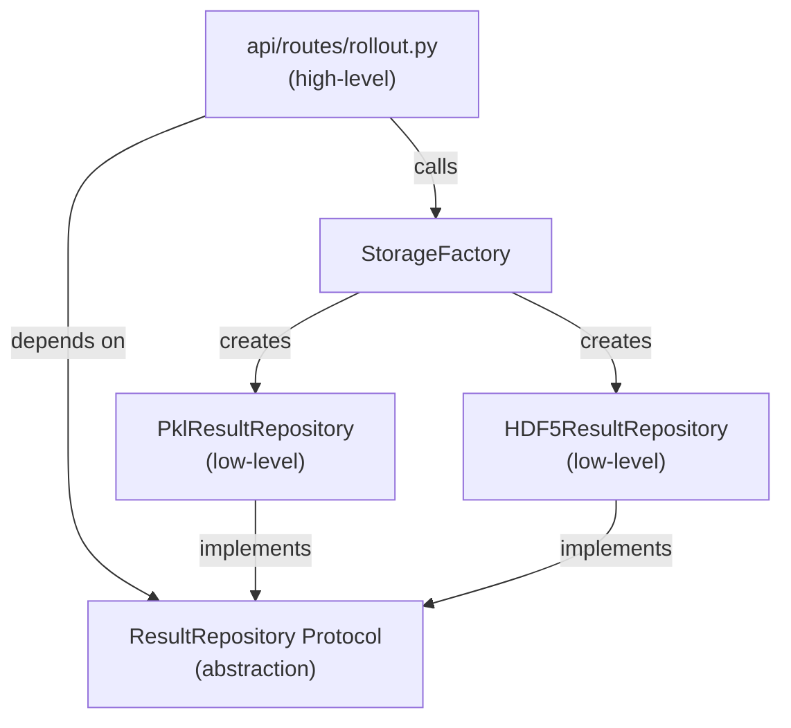
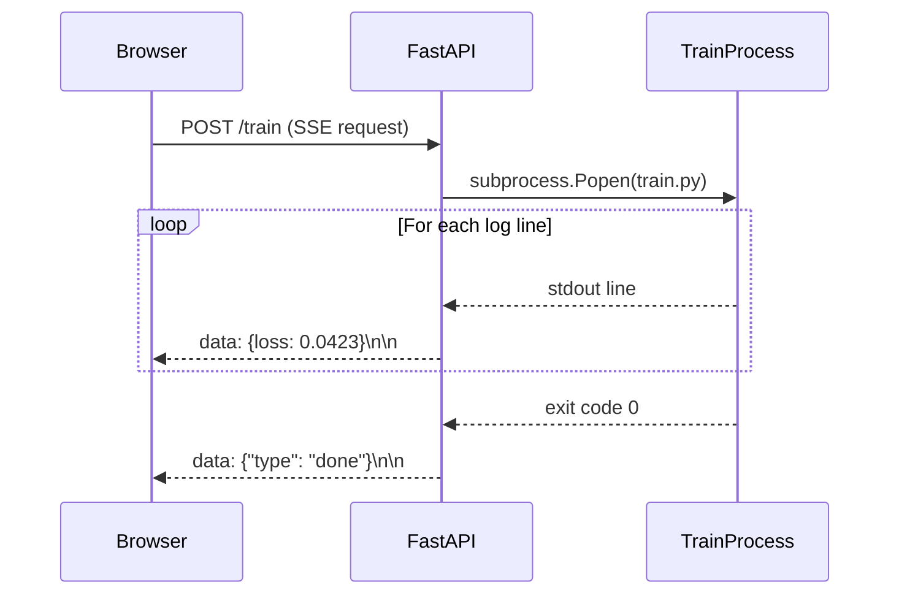
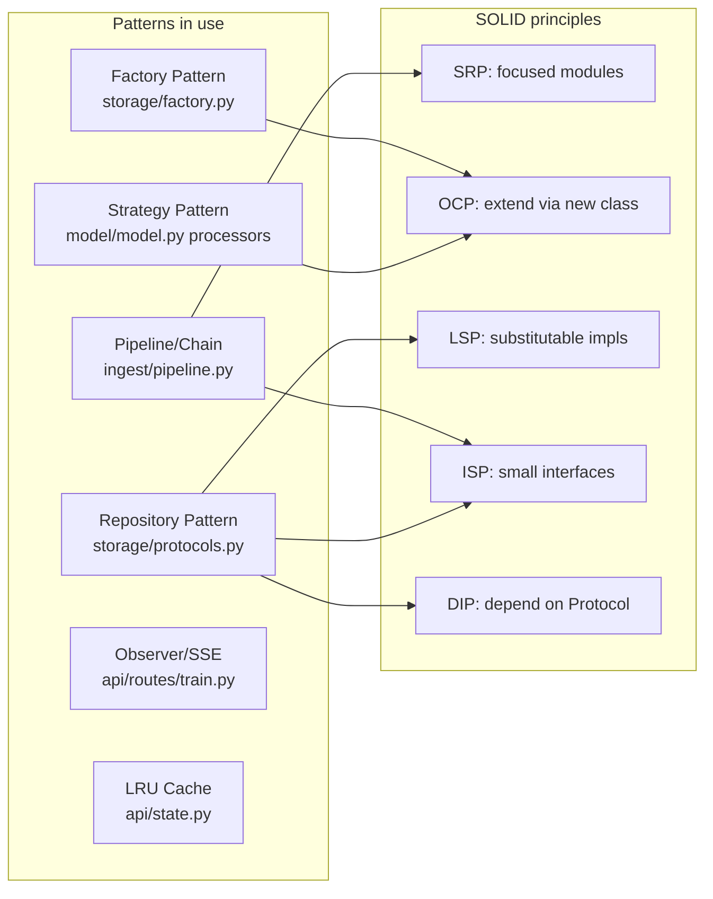

# 09 — Design Patterns & SOLID Principles in PhysIQ

> **Audience**: ML engineers and senior software engineers preparing for system-design interviews.
> **Story arc**: Start from the mess, arrive at the structure. Every pattern earns its keep.

Related: [[03_system_architecture]] | [[10_scalability]] | [[11_research_connections]]

---

## The Problem with "Research Code"

Every ML project starts the same way. You open a Jupyter notebook, you write a training loop, you pickle the results, you visualise inline. It works. It's fast to write. And it's completely unmaintainable the moment you need to:

- Swap the storage backend from pickle to HDF5
- Run the inference pipeline from a REST API instead of a script
- Add a second solver (OpenFOAM alongside the current TFRecord format)
- Test the model in isolation without loading a 50GB dataset

This is the story of how PhysIQ addressed these problems — not by following a textbook, but by feeling the pain of each violation and applying the minimum structural fix. The patterns emerged from necessity.

---

## SOLID: A Quick Framing

SOLID is five principles for object-oriented design. They don't tell you *what* to build; they tell you *how to organise* what you build so it stays changeable. In ML systems the principles are often violated because research code evolves under deadline pressure. But when the project moves from research to production — and PhysIQ did — paying down that structural debt becomes mandatory.

Let's go through each principle with concrete code from this codebase.

---

## S — Single Responsibility Principle

> *A module should have one, and only one, reason to change.*

### The original violation

Early versions of `rollout.py` were a monolith. A single 400-line script that:

1. Loaded the model checkpoint from disk
2. Loaded the mesh data
3. Ran the GNN forward pass in a loop
4. Applied the Poisson pressure correction
5. Serialised results to a pickle file
6. Printed metrics to stdout

Change the storage format? Edit `rollout.py`. Change the metric display? Edit `rollout.py`. Add a new correction method? Edit `rollout.py`. The file had five reasons to change, meaning five independent axes of breakage.

### The fix: extract responsibilities into focused modules

After refactoring, the responsibility map looks like this:

```
model/encoder.py         — encodes graph features into latent space
model/model.py           — EncoderProcesserDecoder architecture
model/simulator.py       — one-step physics prediction
physics/poisson_pressure.py  — divergence correction
storage/protocols.py     — ResultRepository Protocol (interface only)
storage/pkl_repository.py    — PKL persistence
storage/hdf5_repository.py   — HDF5 persistence
storage/factory.py       — selects backend from config
api/routes/rollout.py    — HTTP handler: accepts request, delegates to Simulator + Repository
rollout.py               — CLI entry point (thin orchestration only)
```

Each file has exactly one reason to change. The `Encoder` changes when the input feature schema changes. `PklResultRepository` changes when the PKL serialisation format changes. `StorageFactory` changes when a new backend is added. `rollout.py` the CLI changes only when the command-line interface changes.

### Why SRP matters for ML testing

The most underappreciated consequence of SRP is testability. With the old monolith, testing the GNN's prediction quality required:

- A real mesh data file (gigabytes)
- A trained checkpoint on disk
- A writable directory for output

With SRP, you can unit-test the `Simulator` with a 10-node synthetic graph:

```python
# tests/test_simulator.py
import torch
from torch_geometric.data import Data
from model.simulator import Simulator

def make_tiny_graph(N=10):
    x = torch.randn(N, 11)           # node features
    edge_index = torch.randint(0, N, (2, 30))
    edge_attr = torch.randn(30, 3)   # edge features
    return Data(x=x, edge_index=edge_index, edge_attr=edge_attr)

def test_simulator_output_shape():
    sim = Simulator(node_input_size=11, edge_input_size=3)
    g = make_tiny_graph()
    out = sim(g)
    assert out.shape == (10, 2), f"Expected (10,2), got {out.shape}"
```

No file I/O. No checkpoint. No dataset. The `Simulator` only knows about graph tensors — it has one responsibility.

---

## O — Open/Closed Principle

> *Software entities should be open for extension, but closed for modification.*

This is the principle that distinguishes a good abstraction from a leaky one. The test: when you add a new capability, do you modify existing working code, or do you add new code?

### IngestPipeline: adding OpenFOAM without touching existing stages

The `IngestPipeline` is closed for modification and open for extension via the `SolverAdapter` Protocol:

```python
# ingest/protocols.py
@runtime_checkable
class SolverAdapter(Protocol):
    @property
    def name(self) -> str: ...
    def list_splits(self) -> list[str]: ...
    def load_split(self, split: str) -> dict: ...
    @property
    def source_path(self) -> Path: ...
```

The pipeline's `run()` method calls `self._adapter.list_splits()` and `self._adapter.load_split()`. It has no knowledge of TFRecord, OpenFOAM, or any other format. To add OpenFOAM support:

```python
# ingest/adapters/openfoam_adapter.py  — NEW FILE, nothing existing changes
class OpenFOAMAdapter:
    def __init__(self, case_dir: Path): ...
    @property
    def name(self) -> str: return "OpenFOAM"
    def list_splits(self) -> list[str]: return ["train", "test"]
    def load_split(self, split: str) -> dict:
        # parse OpenFOAM time directories, return unified dict
        ...
    @property
    def source_path(self) -> Path: return self._case_dir
```

The pipeline now works with OpenFOAM data:

```python
adapter = OpenFOAMAdapter(Path("/data/cavity_flow"))
pipeline = IngestPipeline(adapter, out_dir="data/openfoam")
pipeline.run()
```

Zero modifications to `harvest.py`, `validate.py`, `normalise.py`, `write.py`, or `index.py`. They are closed.

### StorageFactory: adding Zarr with one new class + one line

```python
# storage/factory.py (current)
class StorageFactory:
    @staticmethod
    def create(result_dir=None) -> ResultRepository:
        cfg = _load_config()
        backend = cfg.get("result_backend", "pkl")
        rdir = Path(result_dir or cfg.get("result_dir", "result"))

        if backend == "hdf5":
            from storage.hdf5_repository import HDF5ResultRepository
            return HDF5ResultRepository(rdir)
        else:
            from storage.pkl_repository import PklResultRepository
            return PklResultRepository(rdir)
```

Adding Zarr:

```python
# Step 1: NEW FILE — storage/zarr_repository.py
class ZarrResultRepository:
    # implements all 7 methods of ResultRepository Protocol
    ...

# Step 2: ONE LINE ADDED in factory.py
if backend == "zarr":
    from storage.zarr_repository import ZarrResultRepository
    return ZarrResultRepository(rdir)
```

Nothing that *uses* the repository changes. Every API route, every test fixture, every CLI script that calls `StorageFactory.create()` gets Zarr support for free.

### Rollout pipeline: adding Poisson correction as an optional module

The Poisson correction (`physics/poisson_pressure.py`) was added to the rollout without modifying the core GNN inference loop. The correction is wired in as a post-processing step:

```python
# api/routes/rollout.py (simplified)
preds = simulator.rollout(graph, steps=num_steps)   # core loop unchanged

if cfg.get("apply_poisson_correction", False):
    corrector = PoissonPressureCorrector(crds, edges)
    preds = corrector.correct_series(preds)          # new module wired in
```

The `Simulator` doesn't know about Poisson correction. The corrector doesn't know about the API. Open for extension, closed for modification.

---

## L — Liskov Substitution Principle

> *Objects of a subtype must be substitutable for objects of their supertype.*

More practically: if you write code against an abstraction, swapping implementations should not break your code.

### ResultRepository: substitutable backends

The API route `results.py` calls `repo.load(name)` and expects `(predictions, targets, coords, metadata)`. It doesn't care if `repo` is a `PklResultRepository` or `HDF5ResultRepository`.

For this to work, both implementations must honour the same contract:

- `load(name)` → `(np.ndarray, np.ndarray, np.ndarray, dict)` or `raise FileNotFoundError`
- `save(...)` → `Path`
- `list()` → `list[str]` sorted newest-first

### The LSP violation that would break everything

Suppose `HDF5ResultRepository.load()` raised `KeyError` when a result was not found (because HDF5 groups use dict-like access), while `PklResultRepository.load()` raised `FileNotFoundError`.

```python
# api/routes/results.py
try:
    preds, targets, coords, meta = repo.load(name)
except FileNotFoundError:
    raise HTTPException(404, detail=f"Result '{name}' not found")
```

The `except FileNotFoundError` catches PKL failures but **silently crashes** on HDF5 failures (`KeyError` is uncaught → 500 Internal Server Error). You've broken LSP: `HDF5ResultRepository` is not substitutable for `PklResultRepository` even though they both claim to implement `ResultRepository`.

The fix: both implementations must raise `FileNotFoundError`. The HDF5 backend wraps its `KeyError`:

```python
# storage/hdf5_repository.py
def load(self, name: str):
    try:
        with h5py.File(self._path, "r") as f:
            return (
                f[name]["predictions"][:],
                f[name]["targets"][:],
                f[name]["coords"][:],
                json.loads(f[name].attrs["metadata"]),
            )
    except KeyError:
        raise FileNotFoundError(f"Result '{name}' not found in HDF5 store")
```

### Protocol conformance tests

`tests/test_phase2_storage.py` includes explicit LSP checks:

```python
from storage.protocols import ResultRepository
from storage.pkl_repository import PklResultRepository
from storage.hdf5_repository import HDF5ResultRepository

def test_pkl_satisfies_protocol():
    repo = PklResultRepository(tmp_path)
    assert isinstance(repo, ResultRepository), "PklResultRepository must satisfy ResultRepository Protocol"

def test_hdf5_satisfies_protocol():
    repo = HDF5ResultRepository(tmp_path)
    assert isinstance(repo, ResultRepository), "HDF5ResultRepository must satisfy ResultRepository Protocol"
```

`isinstance(repo, ResultRepository)` works here because `ResultRepository` is a `@runtime_checkable Protocol`. Python checks structural compatibility at runtime — does the object have all 7 methods? If yes: `True`. If no: `False`. No inheritance required.

---

## I — Interface Segregation Principle

> *Clients should not be forced to depend on interfaces they don't use.*

### SolverAdapter: 4 methods, nothing more

The `SolverAdapter` Protocol has exactly four members. Not "adapter that also validates and normalises" — those are separate pipeline stages. Not "adapter that also writes NPZ files" — that's `write.py`.

A caller that only needs to list available splits:

```python
print(adapter.list_splits())   # only uses 1 of 4 methods
```

A caller building a UI file picker only needs `list_splits()` and `source_path`. They don't care about `load_split()`. Because the interface is small, they're not forced to implement or mock the parts they don't use.

Compare to a fat interface anti-pattern:

```python
# BAD: forcing all adapters to implement everything
class FatAdapter(Protocol):
    def list_splits(self) -> list[str]: ...
    def load_split(self, split: str) -> dict: ...
    def validate_split(self, split: str) -> bool: ...   # belongs to validate.py
    def normalise(self, data: dict) -> dict: ...         # belongs to normalise.py
    def write_npz(self, data: dict, path: Path): ...     # belongs to write.py
```

Every new adapter would need to re-implement normalisation. The OpenFOAM adapter and the TFRecord adapter would each embed their own (potentially divergent) normalisation logic. Bugs and drift.

### ResultRepository: 7 focused methods

The 7 methods are: `save`, `load`, `load_timestep`, `list`, `exists`, `delete`, `get_path`. Each is independently useful. The API's visualisation endpoint uses only `load_timestep(name, t)` — partial reads without loading the full T×N×D tensor. It doesn't need `delete` or `save`.

A test that only verifies read behaviour only needs to implement `load` and `list`:

```python
class MockRepository:
    def __init__(self, data):
        self._data = data

    def load(self, name):
        return self._data[name]

    def list(self):
        return list(self._data.keys())
    
    # other methods not needed for this test — won't even be called
```

This works because `MockRepository` is used directly, not checked against the Protocol at runtime during this test. ISP enables focused mocks.

### FastAPI route handlers: one handler, one concern

Each route in `api/routes/` does exactly one HTTP thing:

```
rollout.py    — POST /rollout    → run inference
results.py    — GET  /results    → list or fetch stored results
train.py      — POST /train      → kick off training with SSE progress
status.py     — GET  /status     → system health
generate.py   — POST /generate   → CVAE inverse design
```

Shared concerns (loading checkpoint, reading SSH config) are extracted to helper functions in `api/state.py`. Route handlers call helpers; they don't embed the logic themselves.

---

## D — Dependency Inversion Principle

> *High-level modules should not depend on low-level modules. Both should depend on abstractions.*

### API routes depend on Protocol, not concrete class

```python
# api/routes/rollout.py
from storage.factory import get_repository
from storage.protocols import ResultRepository   # the abstraction

def run_rollout(...):
    repo: ResultRepository = get_repository()   # typed as Protocol
    # ... run inference ...
    repo.save(name, predictions, targets, coords, metadata)
```

`run_rollout` depends on `ResultRepository` (abstraction). It doesn't know if the backing store is pickle or HDF5. The concrete implementation is chosen entirely by `StorageFactory`, which reads `runs/storage_config.json`.



### Simulator: depends on tensors, not file formats

The `Simulator` class takes processed `torch_geometric.data.Data` objects. It doesn't know about `.dat` files, `.npz` files, or `.tfrecord` files. It just processes graphs.

```python
class Simulator(nn.Module):
    def forward(self, graph: Data) -> torch.Tensor:
        # graph.x, graph.edge_index, graph.edge_attr — pure tensors
        ...
```

The data loading stack (DataLoader → Dataset → NPZ files) is entirely separate. Swapping the data format doesn't touch the model.

---

## Deep Dive: Repository Pattern

The Repository Pattern is the most important structural decision in this project. It's worth understanding precisely why `Protocol` was chosen over `ABC`.

### Protocol vs ABC: the real difference

```python
# ABC approach
from abc import ABC, abstractmethod

class ResultRepository(ABC):
    @abstractmethod
    def save(self, name: str, ...) -> Path: ...
    @abstractmethod
    def load(self, name: str) -> tuple: ...
    # ...

class PklResultRepository(ResultRepository):   # must explicitly inherit
    def save(self, ...): ...
    def load(self, ...): ...
```

```python
# Protocol approach (what we use)
from typing import Protocol, runtime_checkable

@runtime_checkable
class ResultRepository(Protocol):
    def save(self, name: str, ...) -> Path: ...
    def load(self, name: str) -> tuple: ...
    # ...

class PklResultRepository:   # NO inheritance needed
    def save(self, ...): ...
    def load(self, ...): ...

# isinstance check works via structural typing:
assert isinstance(PklResultRepository(path), ResultRepository)   # True ✓
```

**When to use ABC**: when you want shared implementation. If `BaseResultRepository` had a non-abstract `list_sorted()` helper that both PKL and HDF5 would reuse, ABC is the right choice. Default behaviour lives in the base class.

**When to use Protocol**: when you're defining an interface only — no shared logic. Any object that has the right methods satisfies it, even a third-party class you can't modify. This is called *structural subtyping* or *duck typing with static safety*.

Protocol is the right choice for `ResultRepository` because:
1. There's no shared logic between PKL and HDF5 backends
2. You might want to swap in a third-party store that you can't make inherit from your ABC
3. Tests can use simple `Mock` objects without declaring inheritance

### The `@runtime_checkable` detail

Without `@runtime_checkable`, Protocol is only checked by static type checkers (mypy, pyright). `isinstance()` at runtime would always return `True` (misleadingly). With `@runtime_checkable`, Python checks that the object has all the required methods at runtime. This enables the conformance tests in `tests/test_phase2_storage.py`.

---

## Deep Dive: Factory Pattern

```python
# storage/factory.py
class StorageFactory:
    @staticmethod
    def create(result_dir=None) -> ResultRepository:
        cfg = _load_config()           # reads runs/storage_config.json
        backend = cfg.get("result_backend", "pkl")
        rdir = Path(result_dir or cfg.get("result_dir", "result"))

        if backend == "hdf5":
            from storage.hdf5_repository import HDF5ResultRepository
            return HDF5ResultRepository(rdir)
        else:
            from storage.pkl_repository import PklResultRepository
            return PklResultRepository(rdir)
```

**Benefits**:
- **Centralised creation logic**: one place to change when adding Zarr
- **Configuration-driven**: switch backends by editing a JSON file, not code
- **Lazy imports**: HDF5 library only imported if HDF5 backend is configured
- **Testable**: mock `_load_config()` to force a backend in tests

**Alternative: dependency injection**. Instead of calling `StorageFactory.create()` inside route handlers, you could pass the repository instance from outside:

```python
# DI approach
def create_app(repo: ResultRepository) -> FastAPI:
    app = FastAPI()
    
    @app.post("/rollout")
    async def run_rollout(...):
        repo.save(...)   # repo is captured from outer scope

    return app

# At startup:
repo = PklResultRepository(Path("result"))
app = create_app(repo)
```

DI is more testable (pass a mock repo directly) but requires boilerplate wiring at startup. The Factory approach is pragmatic here: we have one app process, one repository configuration, and the SSE streaming routes make dependency injection cumbersome with FastAPI's route registration model.

---

## Deep Dive: Strategy Pattern

The three processor variants — GN, TNS, SAGE — are strategies. They share the same interface: `forward(graph: Data) -> Data`. The `EncoderProcesserDecoder` composes them interchangeably:

```python
class EncoderProcesserDecoder(nn.Module):
    def __init__(self, ..., architecture: str = "gn"):
        if architecture == "gn":
            blocks = [GnBlock(hidden_size) for _ in range(message_passing_num)]
        elif architecture == "tns":
            blocks = [TNSBlock(hidden_size, heads=tns_heads) for _ in range(message_passing_num)]
        elif architecture == "sage":
            blocks = [SAGEBlock(hidden_size, aggr=sage_aggr) for _ in range(message_passing_num)]
        
        self.processer_list = nn.ModuleList(blocks)

    def forward(self, graph: Data) -> torch.Tensor:
        graph = self.encoder(graph)
        for block in self.processer_list:      # strategy pattern: same interface, different behaviour
            graph = block(graph)
        return self.decoder(graph)
```

The training loop calls `model(graph)` — it has no idea which processor variant is running. Adding a new processor (say, `GATBlock` using Graph Attention Networks) requires:
1. Write `GATBlock` with `forward(graph: Data) -> Data`
2. Add `elif architecture == "gat"` in the factory section
3. Zero changes to training loop, evaluation code, checkpointing

### IngestPipeline stages as strategies

Each stage in the ingest pipeline (`harvest`, `validate`, `normalise`, `write`) follows the same conceptual contract:

```
data_in: dict  →  stage(data_in)  →  data_out: dict
```

This makes it easy to insert, remove, or swap stages:

```python
# Current pipeline:
data = harvest.harvest(adapter, split)
data = validate.validate(data, split)
data, stats = normalise.normalise(data)
npz_path = write.write_npz(data, stats, out_dir, split)

# Adding a new stage (e.g., augment) — no existing code changes:
data = harvest.harvest(adapter, split)
data = validate.validate(data, split)
data = augment.augment(data, rotation_range=15)   # new stage inserted
data, stats = normalise.normalise(data)
npz_path = write.write_npz(data, stats, out_dir, split)
```

---

## Deep Dive: Observer Pattern (SSE as Implicit Observer)

The training route (`api/routes/train.py`) streams progress updates to the browser using Server-Sent Events. This is the Observer pattern implemented with Python generators instead of explicit `Observer` classes.

```python
# api/routes/train.py (simplified)
@router.post("/train")
async def start_training(request: TrainRequest):
    async def event_generator():
        process = subprocess.Popen(["python", "train.py", ...], stdout=subprocess.PIPE)
        for line in process.stdout:
            yield f"data: {line.decode().strip()}\n\n"
        yield "data: {\"type\": \"done\"}\n\n"
    
    return StreamingResponse(event_generator(), media_type="text/event-stream")
```

The browser (client) *observes* the training process. The generator *emits* events. The `StreamingResponse` is the channel. Classic publish-subscribe, but expressed in Python idioms rather than `Observer`/`Subject` classes.



---

## Deep Dive: LRU Cache for Model Loading

### The problem

Loading a GNN checkpoint from disk is expensive:
1. Read the `.pt` file (100-300MB I/O)
2. `torch.load()`: deserialise Python objects, reconstruct tensors (~2-5 seconds)
3. Move model to GPU (another second)

If 10 simultaneous API requests each use the same checkpoint, naively we'd pay this cost 10 times.

### The LRU solution

LRU (Least Recently Used) cache: keep the K most recently used models in memory. If a requested checkpoint is already cached, return it in O(1). If not, load it and evict the least recently used entry.

```python
# api/state.py
from functools import lru_cache

@lru_cache(maxsize=3)
def load_model(checkpoint_path: str) -> torch.nn.Module:
    """Load and cache model from checkpoint. Cache key = path string."""
    model = build_model_from_checkpoint(Path(checkpoint_path))
    model.eval()
    return model
```

**Why `maxsize=3`?**

Each GNN checkpoint is ~50-100MB when loaded into GPU memory (fp32 × 128-dim × 15 layers × N parameters). Three models = 150-300MB. This stays well under the typical 24GB GPU VRAM headroom for inference alongside the active rollout tensors.

**Why a string key instead of a Path object?**

`functools.lru_cache` requires hashable arguments. `pathlib.Path` is hashable in Python 3.6+, so `Path` would work. But the string form is more explicit and avoids any subtlety with path normalisation (`./checkpoints/x.pt` vs `checkpoints/x.pt`). Best to normalise to absolute path before calling:

```python
def get_model(checkpoint_path: str | Path) -> torch.nn.Module:
    abs_path = str(Path(checkpoint_path).resolve())
    return load_model(abs_path)   # consistent cache key
```

**Cache invalidation**: the trickiest part of caching. If a checkpoint file is overwritten (e.g., training resumes and saves a new checkpoint to the same path), the LRU cache returns stale data. The fix: include file modification time in the cache key:

```python
@lru_cache(maxsize=3)
def load_model(checkpoint_path: str, mtime: float) -> torch.nn.Module:
    return build_model_from_checkpoint(Path(checkpoint_path))

def get_model(checkpoint_path: Path) -> torch.nn.Module:
    mtime = checkpoint_path.stat().st_mtime
    return load_model(str(checkpoint_path.resolve()), mtime)
```

Now a rewritten checkpoint file gets a new `mtime` → new cache key → fresh load.

---

## When NOT to Use Design Patterns

This is the most important section. Patterns have overhead — cognitive overhead, code overhead, indirection overhead. They pay for themselves only when the abstraction is exercised.

### Rule of thumb: the abstraction must pay off within ~2 extensions

**Repository Pattern**: Did it pay off? Yes, immediately. We started with PKL, added HDF5. Two backends. Every API route was unchanged. The pattern paid off on the first extension.

**Strategy Pattern for processors**: Did it pay off? Yes. GN was the original. Adding TNS and SAGE was adding two classes and two `elif` branches. The training loop was unchanged.

**What would NOT be worth a pattern**: the SSH tunnel configuration (`api/routes/rollout.py` has SSH config helpers). There's one SSH configuration format. Wrapping it in a `SSHConfigStrategy` and `SSHConfigFactory` would add indirection for a thing that will never vary. Use a simple `dataclass` or function. Patterns are for variation points; if there's no variation, there's no pattern needed.

```python
# GOOD: simple dataclass for SSH config — no variation expected
@dataclass
class SSHConfig:
    host: str
    port: int = 22
    username: str = "ubuntu"
    key_file: Path | None = None

# BAD: over-engineered for something that never varies
class SSHConfigFactory:
    @staticmethod
    def create(backend: str) -> SSHConfigStrategy:
        ...
```

The art of software design is knowing where variation lives and insulating only those points.

---

## Summary: Pattern Map for PhysIQ



The patterns aren't decoration — each one represents a real extension point that was exercised (or is explicitly planned). The SOLID principles are the *reasons* the patterns are arranged as they are.

When you're in an interview and asked "how did you structure this ML project for maintainability?", the answer isn't "I used design patterns." The answer is: "I identified the variation points — storage backend, processor architecture, solver format — and insulated each with an appropriate abstraction. Here's the concrete code."
