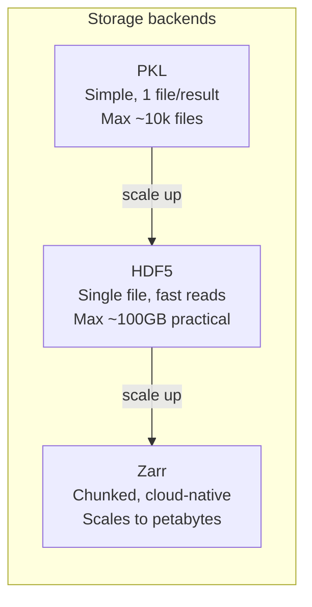
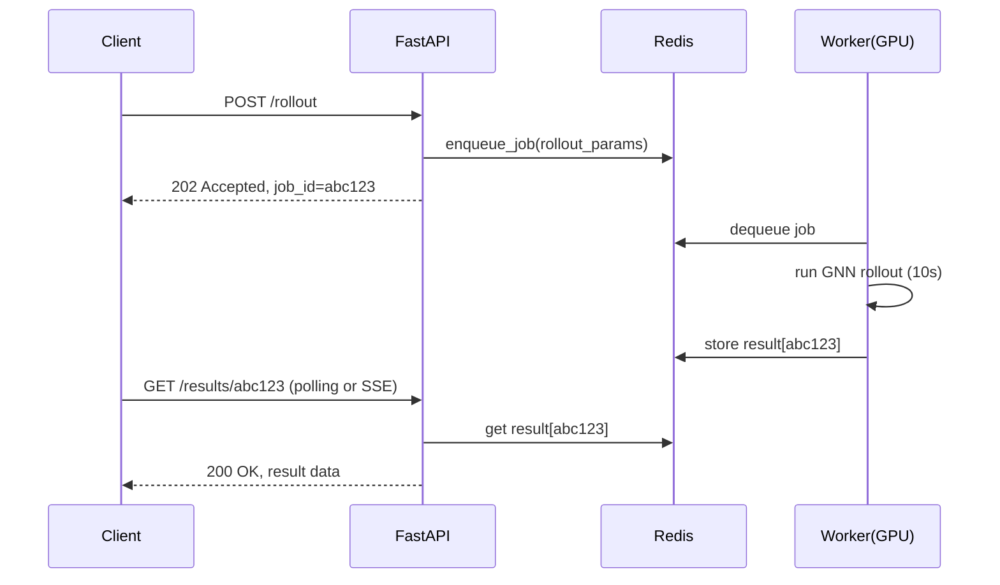
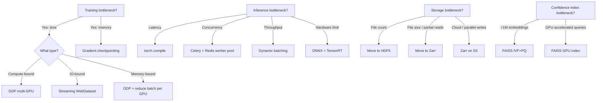

# 10 — Scalability: From Research Prototype to Production Scale

> **Audience**: ML engineers and senior software engineers preparing for system-design interviews.
> **Story arc**: Understand the current bottlenecks deeply, then walk through each scaling upgrade with honest tradeoffs.

Related: [[09_design_patterns_solid]] | [[03_system_architecture]] | [[11_research_connections]] | [[12_numerical_methods]]

---

## The Starting Point: What We Have Now

Before designing for scale, you have to understand what you're scaling *from*. The current system is a well-structured single-machine setup. It handles research workloads comfortably. The question is: at what point does each component hit a wall, and what's the right upgrade for each scenario?

Let's build the current profile honestly, with real numbers.

---

## Current Scalability Profile

### Training

**Configuration**: Single-GPU training on an NVIDIA A100 (80GB).

**Performance**: ~8 hours for 1,000,000 training steps on the CFD dataset with the standard GN processor (15 message-passing layers, hidden size 128).

**The actual bottleneck**: GNN message passing is *memory-bandwidth limited*, not compute limited. Here's why that matters.

A GPU has two fundamentally different bottlenecks:
- **Compute-bound**: the bottleneck is FLOPS. Doubling compute halves time.
- **Memory-bandwidth-bound**: the bottleneck is how fast data moves between HBM (high-bandwidth memory) and the GPU SMs (streaming multiprocessors). More FLOPS doesn't help.

GNN message passing on large sparse graphs is memory-bandwidth-bound because:
1. Each message-passing step accesses `edge_index` (irregular access pattern, poor cache utilisation)
2. For a mesh with N=10,000 nodes and ~50,000 edges, the edge index is 50,000 × 2 × 4 bytes = 400KB. The L2 cache on A100 is 40MB. This fits, but...
3. Each node aggregation reads from scattered memory locations (the source node features for each of its neighbors). These are non-contiguous reads → cache misses.
4. With 15 message-passing layers and a batch size of 1 trajectory, you're doing 15 × N × degree irregular reads per step.

The practical consequence: going from A100 to H100 (which has 2× FLOPS improvement) gives you only ~30-40% speedup on GNN training, not 2×. The FLOPS improvement doesn't help with the memory access pattern.

**Data loading**: `.dat` memory-mapped files with random access. Works up to ~50GB dataset. The OS page cache handles recently-accessed pages. Beyond 50GB:
- Dataset no longer fits in page cache (typical server has 64-128GB RAM, shared with model and OS)
- Random trajectory access causes page faults → reads from SSD (~100μs) instead of DRAM (~100ns)
- Training throughput drops from GPU-limited to IO-limited

**Batch composition**: each step samples one trajectory from the dataset, then samples one timestep from that trajectory. The `DataLoader` wraps this with `num_workers=4` background processes prefetching. With random access on a 50GB dataset, this works. With random access on a 500GB dataset, it breaks.

### Inference

**Single-trajectory rollout**: ~10 seconds on GPU for 600 timesteps on a 2000-node CFD mesh. Breakdown:
- ~8 seconds: GNN forward passes (600 × ~13ms per step)
- ~1 second: Poisson correction (if enabled: sparse LU solve amortised, divergence computation vectorised)
- ~1 second: serialisation to storage backend

**LRU cache**: the `@lru_cache(maxsize=3)` on `load_model()` amortises the 2-5 second checkpoint deserialisation cost. For repeated requests with the same checkpoint, cache hit = ~0ms. Cache miss = 2-5 seconds. With 3 cached slots, you can serve 3 different active models simultaneously.

**Concurrency problem**: FastAPI is async (built on Starlette/anyio), which means it handles many *I/O-bound* concurrent requests well. But rollout is *compute-bound*: it runs a GPU kernel in a tight loop. In Python, `async` doesn't help with CPU/GPU compute — the event loop is blocked for the ~10 second rollout duration.

If 5 users simultaneously submit rollout requests:
- Request 1: starts immediately, runs ~10 seconds
- Requests 2-5: **queued** waiting for Request 1 to finish (because the single FastAPI event loop is blocked on GPU compute)
- Total time for user 5: ~50 seconds

This is not a catastrophic failure; it's expected single-machine behaviour. But it's important to understand and communicate.

### Storage

**PKL backend**: each result is a separate `.pkl` file in the `result/` directory. Listing results requires `os.listdir()` which does a syscall to scan the directory. On ext4/xfs, directory scans are O(N) in the number of files. At 10,000 result files, listing takes ~100ms. At 100,000 files, it takes ~1 second. Not a hard limit, but a degrading experience.

**HDF5 backend**: single `.hdf5` file containing all results as groups. Listing is an HDF5 group enumeration — fast (O(1) metadata operation, no directory scan). Partial reads (`load_timestep`) avoid loading the full T×N×D tensor. But: single file → single writer at a time. Can't split across multiple nodes or cloud storage objects. Hard limit: HDF5 files can theoretically be very large, but in practice, files above ~100GB become unwieldy.

**Zarr backend** (the `storage/zarr_archive.py` module): each chunk is an independent file or object. Designed for cloud scale. Parallel writes to different chunks. S3-native. This is the right choice for production at scale.



---

## Scaling Up Training

### Multi-GPU: PyTorch DDP

PyTorch `DistributedDataParallel` (DDP) is the standard approach for multi-GPU training:

```python
# train_ddp.py (already exists in the project)
import torch.distributed as dist
from torch.nn.parallel import DistributedDataParallel as DDP

def main(rank: int, world_size: int):
    dist.init_process_group("nccl", rank=rank, world_size=world_size)
    
    model = Simulator(...).to(rank)
    model = DDP(model, device_ids=[rank])
    
    # DistributedSampler ensures each GPU sees different trajectories
    sampler = DistributedSampler(dataset, num_replicas=world_size, rank=rank)
    loader = DataLoader(dataset, sampler=sampler, batch_size=1)
    
    for batch in loader:
        loss = compute_loss(model, batch)
        loss.backward()
        # DDP automatically all-reduces gradients across GPUs here
        optimizer.step()
```

**How DDP works**:
1. Replicate model on N GPUs
2. Split the batch across GPUs (each GPU sees `batch_size / N` samples)
3. Forward pass on each GPU independently
4. Backward pass: gradients computed on each GPU
5. **All-reduce**: sum gradients across all GPUs (collective communication)
6. Each GPU updates its parameters with the globally-summed gradient

For a compute-bound workload, DDP gives near-linear scaling: 4 GPUs → 4× faster training. But for our *memory-bandwidth-bound* workload, the scaling is sub-linear. The all-reduce communication adds overhead; the per-GPU throughput doesn't scale as well because we're not compute-limited.

**Practical scaling**: 2-GPU DDP gives roughly 1.7× speedup (not 2×). 4-GPU gives roughly 3×. Still worthwhile for long training runs.

**The variable-size graph challenge**: CFD meshes have variable numbers of nodes (different trajectories, different mesh resolutions). Standard batching assumes fixed tensor sizes. `torch_geometric.data.DataLoader` handles this via a `batch` tensor:

```python
# PyG batching: concatenate all node/edge tensors, track ownership with batch tensor
# Example: 3 graphs with 5, 7, 3 nodes → single batch with 15 nodes
batch.x.shape       # [15, node_features]
batch.edge_index    # re-indexed to global numbering
batch.batch         # [15] — [0,0,0,0,0, 1,1,1,1,1,1,1, 2,2,2]
```

The `batch` tensor tells message-passing layers which nodes belong to which graph, enabling `global_mean_pool` and friends to correctly aggregate per-graph. With DDP, each worker gets its own `DataLoader` with `DistributedSampler` to ensure no trajectory is seen twice per epoch.

### Gradient Checkpointing

**The problem**: autoregressive rollout training requires backpropagating through K timesteps (truncated BPTT). Each timestep's computation graph must be stored for the backward pass. With K=5 and N=10,000 nodes:

```
Memory per rollout step: N × D × float32 = 10,000 × 128 × 4 = 5MB of activations
5 steps × 15 layers × 5MB = 375MB just for one training trajectory's activation storage
```

This grows linearly with rollout length, eventually causing OOM errors.

**Gradient checkpointing**: trade compute for memory. Instead of storing all intermediate activations, recompute them during the backward pass.

```python
# Standard forward (stores all activations):
for block in self.processer_list:
    graph = block(graph)   # activation stored in computation graph

# With gradient checkpointing (recompute activations on backward):
from torch.utils.checkpoint import checkpoint

for block in self.processer_list:
    graph = checkpoint(block, graph)   # activation NOT stored; recomputed on backward
```

**Memory vs compute tradeoff**:
- Memory: O(sqrt(K×L)) instead of O(K×L) — square root savings for K rollout steps and L layers
- Compute: ~2× — each layer's forward pass is run twice (once forward, once during backward recomputation)

For K=5, L=15: standard stores 75 layer outputs. Checkpointing stores ~9 (sqrt(75) ≈ 8.7). At 5MB per layer output: 375MB → 45MB. Worth the 2× compute overhead in memory-constrained training.

### Streaming Data Pipeline

The current `memmap` + random access works up to ~50GB. For larger datasets:

**Option: `IterableDataset` + WebDataset pattern**

```python
import webdataset as wds

# Pack trajectories as .tar archives:
# train_000.tar, train_001.tar, ..., train_999.tar
# Each .tar contains: mesh.npy, velocities.npy, metadata.json

dataset = (
    wds.WebDataset("data/train_{000..999}.tar")
    .decode("numpy")
    .shuffle(buffer_size=1000)           # shuffle buffer: keeps 1000 samples, randomly samples from them
    .map(preprocess_trajectory)
    .batched(1)
)
```

**Why streaming beats random access for large datasets**:
- Sequential disk reads: 100-500 MB/s on SSD, 2-5 GB/s on NVMe
- Random reads: 0.5-2 MB/s effective throughput (dominated by seek latency)
- For a 500GB dataset: streaming = ~500 seconds to read once. Random access at 1 MB/s effective = 137 hours to read once.

**The tradeoff**: true random sampling is lost. You can't guarantee seeing every sample exactly once per epoch with a shuffle buffer — some samples get repeated, some skipped. In practice, with a large enough shuffle buffer (1000-10000 samples), training is equivalent. For production ML at scale, this tradeoff is universally accepted.

---

## Scaling Up Inference

### torch.compile(): Free Speedup

PyTorch 2.0's `torch.compile()` JIT-compiles the model into optimised kernels:

```python
# Simple addition to inference setup
model = Simulator(...)
model = torch.compile(model, mode="reduce-overhead")   # 20-40% speedup on GNN
```

Under the hood, `torch.compile()` traces the computation graph and generates fused CUDA kernels. For GNN message passing, it fuses the edge feature aggregation and node update operations into fewer kernel calls, reducing kernel launch overhead and memory bandwidth wasted on intermediate tensors.

**Expected speedup**: 20-40% on GNN inference. For 600-step rollout at 10 seconds → 7-8 seconds. Not transformative, but essentially free.

**Caveat**: `torch.compile()` has a one-time compilation cost on first call (~30-60 seconds). The LRU cache naturally handles this — the compiled model is cached, so the compilation cost is paid once and amortised across all subsequent requests.

### Celery + Redis: Decoupling Latency from Compute

The fundamental problem with synchronous rollout: the HTTP request hangs for 10 seconds while GPU compute runs. Under load, requests queue.

**Solution: async job queue**



**Implementation with Celery**:

```python
# tasks.py
from celery import Celery

app = Celery("physiq", broker="redis://localhost:6379/0", backend="redis://localhost:6379/1")

@app.task
def run_rollout_task(checkpoint_path: str, trajectory_idx: int, num_steps: int) -> str:
    model = get_model(checkpoint_path)   # LRU cache hit likely
    result = execute_rollout(model, trajectory_idx, num_steps)
    repo = StorageFactory.create()
    name = f"rollout_{trajectory_idx}_{int(time.time())}"
    repo.save(name, result.predictions, result.targets, result.coords, result.metadata)
    return name

# api/routes/rollout.py
@router.post("/rollout")
async def submit_rollout(request: RolloutRequest):
    task = run_rollout_task.delay(request.checkpoint, request.trajectory_idx, request.num_steps)
    return {"job_id": task.id, "status": "queued"}

@router.get("/rollout/{job_id}/status")
async def get_rollout_status(job_id: str):
    result = run_rollout_task.AsyncResult(job_id)
    return {"status": result.status, "result": result.result if result.ready() else None}
```

**Benefits**:
- Client gets immediate response (202 Accepted)
- Multiple GPU workers can process jobs in parallel
- Jobs survive API server restarts (persisted in Redis)
- Worker pool can be scaled independently of API servers

**Tradeoffs**:
- More infrastructure (Redis, Celery workers)
- Result retrieval requires polling or webhooks
- Adds 50-100ms latency for job queueing (usually acceptable)

### Dynamic Batching

For serving multiple simultaneous rollout requests with the same model:

```python
# Naive: one rollout per request
for request in requests:
    result = model.rollout(request.graph, steps=request.num_steps)   # 10s each

# Dynamic batching: group requests arriving within 50ms window, batch them
batched_graph = batch_graphs([r.graph for r in queued_requests])
batched_result = model.rollout(batched_graph, steps=min_steps)       # ~12s for 4 requests
```

**Why it helps**: GPU kernels have fixed launch overhead. Running 4 graphs in one kernel call vs 4 sequential calls:
- Sequential: 4 × 10s = 40s total, 4 × 100% GPU utilisation = efficient per-call but not concurrent
- Batched: 1 × 12s = 12s total for all 4 users. 3× faster end-to-end latency.

**Why it's complex**: requests arrive at different times. You need a collector loop that waits up to N milliseconds for a "full" batch, then dispatches. Variable-size graphs require padding or PyG's heterogeneous batching. This is generally only worth implementing when throughput is more important than individual latency.

### ONNX + TensorRT

For maximum inference performance on NVIDIA hardware:

```python
# Step 1: export to ONNX
dummy_graph = make_dummy_graph(N=2000)
torch.onnx.export(
    model,
    (dummy_graph,),
    "model.onnx",
    dynamic_axes={"x": {0: "num_nodes"}, "edge_index": {1: "num_edges"}},
    opset_version=17
)

# Step 2: build TensorRT engine (run once, produces .engine file)
# trtexec --onnx=model.onnx --saveEngine=model.engine --fp16

# Step 3: inference via TensorRT Python API
import tensorrt as trt
engine = load_engine("model.engine")
# ... setup I/O buffers, run inference ...
```

**Expected speedup**: 2-5× over PyTorch eager mode on NVIDIA inference hardware (T4, A10G, L4). TensorRT fuses operations, selects optimal kernels for the specific GPU, and can use FP16 or INT8 precision.

**The GNN challenge**: TensorRT works best with static shapes. GNN graphs have variable sizes (different meshes have different N and E). `dynamic_axes` in ONNX export handles this, but TensorRT optimisation is less effective with truly dynamic shapes. Practical approach: profile on representative mesh sizes and let TensorRT optimise for those.

---

## Scaling the Confidence Index

The current confidence index stores ~10,000 training embeddings (256-dimensional) and uses a KDTree for nearest-neighbour queries. Query time is O(log N) per query. This works fine.

**At 10 million embeddings** (if we scale training data 1000×):
- KDTree at 256 dimensions: the curse of dimensionality makes tree traversal nearly as expensive as brute-force search. A 256-dimensional unit sphere has most of its volume near the surface — "nearest neighbour" loses meaning at high dimensions.
- Memory: 10M × 256 × float32 = 10GB. Doesn't fit in typical server RAM.

**Solution: FAISS with IVF + PQ**

FAISS (Facebook AI Similarity Search) is the standard library for approximate nearest-neighbour search at scale:

```python
import faiss

# Build index (done once, offline)
d = 256              # embedding dimension
nlist = 1000         # number of Voronoi cells for IVF
m = 32               # number of PQ subquantizers (d must be divisible by m)
nbits = 8            # bits per subquantizer code

# IVF: partition embeddings into nlist clusters (coarse quantisation)
# PQ: compress each embedding to m×8 bits (256 bytes instead of 256×4=1024 bytes)
quantizer = faiss.IndexFlatL2(d)
index = faiss.IndexIVFPQ(quantizer, d, nlist, m, nbits)

index.train(train_embeddings)      # learn cluster centroids and PQ codebooks
index.add(train_embeddings)        # add all 10M embeddings
faiss.write_index(index, "confidence.faiss")

# Query at inference time
index = faiss.read_index("confidence.faiss")
index.nprobe = 50    # search 50 of 1000 clusters (speed/accuracy tradeoff)
distances, indices = index.search(query_embedding[np.newaxis], k=5)
```

**Memory for 10M embeddings with PQ**: 10M × m × nbits/8 = 10M × 32 × 1 = 320MB. Down from 10GB. Query time: ~1ms on CPU, ~0.1ms on GPU.

**Accuracy tradeoff**: IVF+PQ is approximate. For confidence scoring (is this embedding near the training distribution?), approximate nearest-neighbour is perfectly acceptable — the confidence score itself is a heuristic, not a precise probability.

---

## Storage at Scale: Zarr on Cloud Object Store

### Why Zarr?

Zarr arrays are divided into *chunks*. Each chunk is stored as an independent file (local) or object (S3/GCS). Operations on different chunks are fully independent — no locking, no coordination.

```python
import zarr

# Write (can be done in parallel, each chunk is independent)
store = zarr.storage.FSStore("s3://physiq-results/rollouts.zarr")
root = zarr.open_group(store, mode="w")
results = root.require_dataset(
    "predictions",
    shape=(10000, 600, 2000, 2),    # [N_results, T, N_nodes, D]
    chunks=(1, 10, 2000, 2),         # chunk = 1 result, 10 timesteps
    dtype="float32",
    compressor=zarr.Blosc(cname="lz4", clevel=3)
)

# Each chunk is a separate S3 object → parallel writes
results[0] = rollout_0   # writes to s3://.../predictions/0.0
results[1] = rollout_1   # writes to s3://.../predictions/1.0 (independent!)

# Read single timestep (only fetches the relevant chunk, not full T×N×D)
frame_5 = results[result_idx, 5, :, :]   # fetches chunk containing t=5
```

**Comparison to PKL and HDF5 for API performance**:

| Operation | PKL | HDF5 | Zarr |
|-----------|-----|------|------|
| Single timestep read | Load full file (~50MB) | Range read (~400KB) | Chunk read (~400KB) |
| Write new result | New file, O(1) | Append to HDF5, serial | New chunk object, O(1) |
| List all results | Directory scan, O(N files) | Group enumeration, O(1) | Object listing, O(1) |
| Cloud-native | No | No | Yes |
| Parallel writes | Yes (different files) | No (single file lock) | Yes (different chunks) |

For the `load_timestep(name, t)` API (used by the real-time visualisation endpoint), HDF5 and Zarr both shine: they fetch only the relevant slice, not the full trajectory. PKL is forced to deserialise the entire file.

### Zarr + Dask: Lazy Computation at Scale

```python
import dask.array as da

# Open 10000 results as a single lazy Dask array (no data loaded yet)
predictions = da.from_zarr("s3://physiq-results/rollouts.zarr/predictions")
print(predictions.shape)   # (10000, 600, 2000, 2) — lazy, no compute

# Compute mean velocity field across all results at t=300 — fully parallel
mean_field = predictions[:, 300, :, :].mean(axis=0).compute()
# Dask: breaks this into chunks, dispatches parallel workers, merges results
# No single machine needs to load all 10000 results
```

This is the path to ensemble analysis at scale: compute statistics across thousands of rollouts without ever materialising the full dataset on one machine.

---

## Adding a New Solver/Domain: The Interview Answer

This question comes up in every ML systems interview: *"If you had to add support for a new physics domain — say, combustion simulation — what would you change and what would stay the same?"*

Here's the precise answer for PhysIQ, grounded in the [[09_design_patterns_solid]] principles:

### What you'd add (new code only)

```
ingest/adapters/combustion_adapter.py     — implements SolverAdapter for combustion format
dataset/combustion_dataset.py             — defines node features (temperature, species concentrations)
model/combustion_encoder.py               — if input feature size differs, new encoder dims
docs/technical/combustion_domain.md       — domain documentation
```

**Step 1: Implement `CombustionAdapter`**

```python
class CombustionAdapter:
    """Reads Cantera/OpenFOAM combustion simulation output."""
    
    @property
    def name(self) -> str: return "Combustion"
    
    def list_splits(self) -> list[str]:
        return ["train", "valid", "test"]
    
    def load_split(self, split: str) -> dict:
        # Parse combustion output: node features now include
        # [vx, vy, temperature, O2, CO2, H2O, node_type]
        ...
        return {
            "positions": ...,
            "velocities": ...,
            "temperature": ...,   # new field
            "species": ...,       # new field
            "node_types": ...,
            "metadata": {"domain": "combustion"}
        }
```

**Step 2: Wire into pipeline**

```python
adapter = CombustionAdapter(Path("/data/combustion"))
pipeline = IngestPipeline(adapter, out_dir="data/combustion")
pipeline.run()
```

**Step 3: Adjust model input dimensions**

CFD node features: `[vx, vy, node_type_one_hot(3), mesh_type]` → 7 features
Combustion node features: `[vx, vy, T, O2, CO2, H2O, node_type_one_hot(3)]` → 9 features

The `node_input_size` parameter to `EncoderProcesserDecoder` is the only change:

```python
# train.py
model = Simulator(
    node_input_size=9,   # changed from 7
    edge_input_size=3,
    hidden_size=128,
)
```

### What stays identical

- `IngestPipeline.run()` — all stages work the same way
- `ResultRepository` and all storage backends
- Training loop in `train.py`
- Rollout logic in `rollout.py` and `api/routes/rollout.py`
- Simulator's `forward()` method
- All API routes

### What *might* need adjustment

| Component | Why it might change | How |
|-----------|--------------------|----|
| Normalisation statistics | Combustion temperature (1000-2500K) vs CFD velocity (0-10 m/s) — different scales | Recompute `normalise.py` stats from combustion data — same code, different data |
| Confidence index | Domain-specific embeddings live in different manifold | Train domain-specific index, or condition on domain label |
| Poisson correction | Only applies to incompressible flow (∇·u = 0). Combustion is compressible (∇·u ≠ 0) | Skip correction for combustion domain via config flag |
| Visualisation | Temperature field needs different colormap | Frontend rendering function |

This is the Open/Closed Principle in practice: the variation is isolated to the domain-specific components. The infrastructure is open for extension without modification.

---

## Scalability Decision Map



The key insight: each bottleneck has its own fix. Don't over-engineer before hitting the wall, but do know exactly which wall you'll hit next and what the upgrade path looks like.
