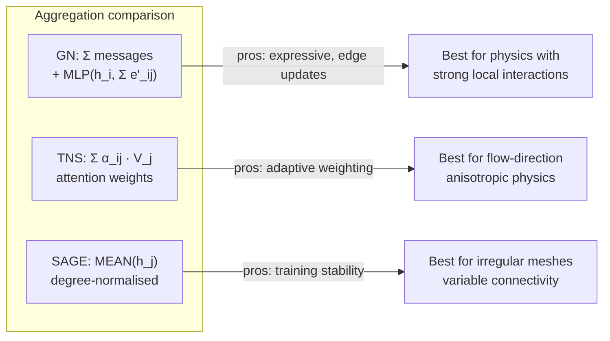
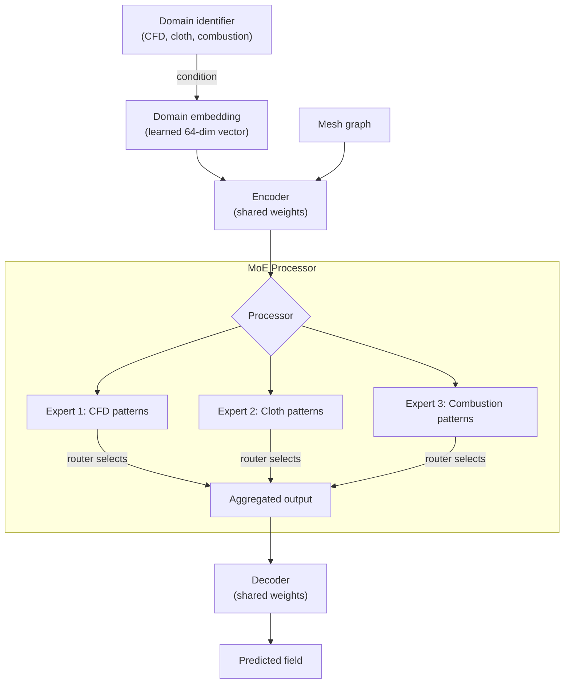

# 11 — Research Connections: Where PhysIQ Sits in the ML Literature

> **Audience**: ML engineers preparing for research-adjacent interviews; engineers who want to speak credibly about the academic lineage of the system they've built.
> **Story arc**: Start from the foundational paper, trace the direct extensions we made, then connect to the broader research frontier and where the field is going.

Related: [[09_design_patterns_solid]] | [[10_scalability]] | [[12_numerical_methods]]

---

## Why Research Connections Matter for Interviews

You don't need to have read every paper. But you need to know *where your system sits in the landscape*. An interviewer at a research-adjacent company (DeepMind, Meta FAIR, Waymo, NVIDIA Research) will ask: "What papers are you building on? What are the limitations of the original paper that you addressed? Where would you take this next?"

This document prepares you to answer those questions with depth.

---

## The Foundation: MeshGraphNets (Pfaff et al., 2021)

**Citation**: Tobias Pfaff, Meire Fortunato, Alvaro Sanchez-Gonzalez, Peter W. Battaglia. *Learning Mesh-Based Simulation with Graph Neural Networks.* ICLR 2021. [[https://arxiv.org/abs/2010.03409]]

### The core problem the paper solved

Before MeshGraphNets, learning physics simulations had a fundamental mismatch problem. Convolutional neural networks (CNNs) require regular grids. Finite element meshes are *irregular* — triangle/quad cells with variable connectivity, boundary layers with high-resolution mesh refinement, coarse mesh in the far field.

You could rasterise the mesh onto a regular grid and use a CNN. But this throws away the mesh structure: the carefully-placed high-resolution mesh near a wall boundary, the geometric encoding of adjacency that the FEM solver actually uses. You'd need a very high resolution to capture all the geometry → huge tensors → slow training.

MeshGraphNets' insight: **the mesh IS a graph. Use a GNN.**

### The three key innovations

**1. Relative mesh-space edge features**

For each edge (i→j), the edge feature encodes:
```
e_ij = [|r_ij|, r_ij/|r_ij|, |r_ij|², (r_ij/|r_ij|)²]
```
where `r_ij = x_j - x_i` is the relative position vector.

Why relative? Absolute positions break translation equivariance. A vortex at position (0,0) and the same vortex at position (100, 100) should produce the same velocity field. Encoding absolute coordinates breaks this symmetry.

Why normalise? Scale equivariance. A mesh that's 2× larger with the same proportions should produce scaled outputs.

In our `model/embedding.py`:

```python
def build_edge_features(positions, edge_index):
    """Compute relative mesh-space edge features."""
    src, dst = edge_index
    r_ij = positions[dst] - positions[src]           # [E, 2] relative position
    dist = torch.norm(r_ij, dim=1, keepdim=True)     # [E, 1] distance
    r_ij_norm = r_ij / (dist + 1e-8)                 # [E, 2] unit vector
    return torch.cat([dist, r_ij_norm, dist**2, r_ij_norm**2], dim=1)  # [E, 6]
```

**2. World-space vs mesh-space edges**

MeshGraphNets distinguishes two types of edges:
- **Mesh edges**: connections in the simulation mesh. Edge features in *mesh space* (material coordinates). For cloth, this is the undeformed cloth shape.
- **World edges**: connections based on proximity in the *current world position* (for deformable objects). The cloth wraps around an obstacle — world-space edges capture the collision proximity.

Our CFD implementation primarily uses mesh edges (the mesh doesn't deform in incompressible flow). The cloth simulation extension would need world-space edges to capture self-contact.

**3. Noise injection for training stability**

Raw training on rollout trajectories suffers from distribution shift: at test time, each prediction is fed back as input for the next step. Training always sees ground-truth inputs. Even small prediction errors compound over 600 steps.

MeshGraphNets' fix: **inject Gaussian noise** into the input features during training:

```python
# During training (not inference)
if training:
    noise_scale = 0.003   # tuned hyperparameter from the paper
    velocity_input = velocity_gt + torch.randn_like(velocity_gt) * noise_scale
```

Why does this work? It forces the model to learn to correct small deviations from the true trajectory, not just interpolate ground truth. The model becomes robust to the small prediction errors it will encounter at inference time.

The noise scale (0.003) is critical. Too small: doesn't help with distribution shift. Too large: model never sees clean inputs, accuracy suffers.

### What PhysIQ adds beyond the paper

The paper trains and evaluates on simulated datasets. It doesn't address:
- Production deployment (API, visualisation)
- Physical constraint enforcement (Poisson pressure correction)
- Inverse design (what input produces a desired output?)
- Confidence scoring (is this rollout reliable?)
- Multi-architecture comparison (GN vs TNS vs SAGE)

These are the engineering and research contributions of this project.

---

## Our Extensions

### TNS Processor: Attention-Augmented Message Passing

The standard GN processor aggregates messages with a permutation-invariant sum:

```
e'_ij = φ_e(h_i, h_j, e_ij)         [edge update]
h'_i  = φ_n(h_i, Σ_j e'_ij)          [node update: SUM aggregation]
```

The TNS (Transformer-Node-Sage) processor replaces the sum with attention-weighted aggregation:

```
α_ij = softmax_j( (W_Q h_i)^T (W_K h_j + W_E e_ij) / √d_head )
h'_i = W_O · concat_heads( Σ_j α_ij · W_V h_j ) + h_i
```

**Why attention?** Sum aggregation treats all neighbours equally. Attention learns which neighbours are more informative for the update. In a CFD mesh, the upstream node (in the flow direction) should matter more than the downstream node for velocity prediction. Attention can learn this.

**Implementation**: `model/model.py` → `TNSBlock` using `torch_geometric.nn.TransformerConv`.

```python
class TNSBlock(nn.Module):
    def __init__(self, hidden_size=128, heads=4):
        self.conv = TransformerConv(
            in_channels=hidden_size,
            out_channels=hidden_size // heads,
            heads=heads,
            concat=True,           # output = heads × (h/heads) = h
            beta=True,             # learned skip connection gate
            edge_dim=hidden_size,  # edge features enter attention key
        )
        self.norm = nn.LayerNorm(hidden_size)

    def forward(self, graph):
        x_new = self.conv(graph.x, graph.edge_index, graph.edge_attr)
        return Data(x=graph.x + self.norm(x_new), ...)   # residual connection
```

### SAGE Processor: Mean Aggregation for Robustness

GraphSAGE (Hamilton et al., 2017) uses mean aggregation:

```
h'_i = σ( W · concat(h_i, MEAN_j∈N(i)(h_j)) )
```

**Why mean over sum?** High-degree nodes (e.g., nodes at mesh refinement boundaries where many elements meet) get large aggregated values with sum aggregation. Mean normalises by degree, preventing these nodes from dominating. In practice, this reduces exploding gradients and improves training stability on meshes with variable connectivity.



---

## Connection to JEPA (LeCun, 2022)

**Paper**: Yann LeCun. *A Path Towards Autonomous Machine Intelligence.* 2022. [[https://openreview.net/pdf?id=BZ5a1r-kVsf]]

### What JEPA proposes

JEPA (Joint Embedding Predictive Architecture) argues that the goal of intelligent systems should be to *predict in representation space*, not in data space.

**Data-space prediction** (what most models do): given frame t, predict pixel values of frame t+1. Problems:
1. Frame t+1 has many plausible realisations — a leaf blowing left or right, both equally valid. Regression in pixel space forces the model to predict the average → blurry, unphysical.
2. Most pixel variation is irrelevant noise (lighting, textures). The model wastes capacity learning to predict noise.

**Representation-space prediction** (JEPA): given frame t, predict the *embedding* of frame t+1. The encoder maps both frames to representations. The predictor operates in that latent space.

```
x_t → Encoder → s_t
x_{t+k} → Encoder → s_{t+k}   (what we want to predict)

Predictor: s_t → ŝ_{t+k}
Loss: ||ŝ_{t+k} - sg(s_{t+k})||²   (sg = stop-gradient)
```

The key: the encoder is trained jointly to make the prediction task *easy*. This pushes the encoder to collapse irrelevant variation and represent only physics-relevant information.

### How PhysIQ's confidence index is JEPA-adjacent

Our confidence index works as follows:
1. For each training trajectory, encode the initial frame: `s_train = Encoder(frame_0_train)`
2. Store all `s_train` embeddings (KDTree)
3. At inference: `s_test = Encoder(frame_0_test)`, find k-nearest `s_train`, distance → confidence

We're using the encoder's latent space as a meaningful geometry where similar physics are close together. This is the core JEPA intuition — the embedding space is the place where predictions and comparisons should happen.

**How to make it more explicitly JEPA-like**: instead of just using the encoder for static frame embeddings, train it to predict future embeddings:

```python
# JEPA-style training objective (planned enhancement)
class JEPAPredictor(nn.Module):
    def forward(self, s_t: torch.Tensor, delta_t: int) -> torch.Tensor:
        """Predict embedding at t + delta_t from embedding at t."""
        ...

# Training loop addition:
s_t = encoder(frame_t)
s_t_plus_k = encoder(frame_t_plus_k)                 # target (stop-gradient)
s_pred = jepa_predictor(s_t, delta_t=k)
jepa_loss = F.mse_loss(s_pred, s_t_plus_k.detach())  # predict in embedding space
```

**Why this improves confidence scoring**: the JEPA-trained encoder is forced to encode temporal dynamics, not just spatial features. Confidence scoring based on this embedding would detect distribution shift in the *physics* (unusual flow patterns, novel Reynolds numbers), not just geometric novelty.

---

## Equivariance: The Strongest Inductive Bias We're Missing

### What equivariance means

A function f is **equivariant** to transformation T if:
```
f(T · x) = T · f(x)
```

For rotations: rotate the input, rotate the output the same way.

A function is **invariant** if:
```
f(T · x) = f(x)
```
Output doesn't change when input is transformed.

**Why it matters for physics**: the Navier-Stokes equations are equivariant to rotation and translation. Rotating a flow field by 90° and simulating it gives the same result as simulating first and rotating the output. A network that enforces this symmetry doesn't need to *learn* it from data — it's baked in structurally.

### The specific violation in our architecture

Our `NodeEncoder` receives node features including `[vx, vy, node_type, ...]`. The velocities `(vx, vy)` are vector components. The MLP treats them as two independent scalars:

```python
# Standard MLP: treats vx and vy as independent
class NodeEncoder(nn.Module):
    def forward(self, x):  # x[:, 0] = vx, x[:, 1] = vy
        return self.mlp(x)   # MLP: vx and vy are just two features
```

If you rotate the mesh by 90°, the new velocity is `(-vy, vx)`. But the MLP output for input `(vx, vy)` is completely different from the output for `(-vy, vx)` — there's no equivariance. The model has to *learn* that these are related from seeing many examples of rotated flows in the training data.

For a domain like fluid dynamics where the training data rarely covers all rotations uniformly, this is a significant limitation.

### How to add equivariance: e3nn

The `e3nn` library (Geiger & Smidt, 2022) provides equivariant neural networks for 3D (SE(3) equivariance) and can be adapted for 2D (SE(2)):

```python
import e3nn
from e3nn import o3

# Instead of raw (vx, vy), represent as an irreducible representation of SO(2)
# l=0: scalar (invariant — e.g., pressure, node type)
# l=1: vector (equivariant — e.g., velocity, force)

irreps_in = o3.Irreps("2x0e + 1x1o")   # 2 scalars + 1 vector
irreps_hidden = o3.Irreps("16x0e + 8x1o")
irreps_out = o3.Irreps("1x1o")          # output: velocity vector

# Equivariant linear layer: respects group structure
layer = o3.Linear(irreps_in, irreps_hidden)
```

Operations in e3nn preserve the group structure by construction. Rotating the input produces exactly the rotated output — not approximately, but exactly.

**Practical cost**:
- ~3-5× computational overhead (tensor products instead of matrix multiplications)
- More complex code (irreducible representations, Clebsch-Gordan coefficients)
- But: ~10× less training data needed for equivalent accuracy
- Especially valuable for 3D domains (SE(3) has 6 generators; learning it from data is hard)

**The data augmentation alternative**: simply rotate training meshes by random angles during training. Cheaper, simpler, but only approximate equivariance. The model learns to be approximately equivariant but can still fail on novel orientations. For production systems where data is abundant, this is often good enough. For low-data regimes (new domains, expensive simulations), e3nn is worth the complexity.

---

## Direct Mesh Generation: Beyond Parametric Description

### Current approach: CVAE over parameters

The inverse design subsystem (`api/routes/generate.py`) uses a CVAE (Conditional Variational Autoencoder) that generates *parameters* describing the geometry:
- For cylinder: `(radius, x_position, y_position)`
- For airfoil: `(angle_of_attack, chord_length, NACA 4-digit code)`

A meshing tool (gmsh, OpenFOAM's blockMesh) then generates the actual mesh from these parameters.

**Limitation**: the parameter space is low-dimensional and rigid. An airfoil optimised for fuel efficiency might require a shape that can't be described by NACA 4-digit codes. A heat exchanger with custom fin geometry can't be reduced to a handful of scalars.

### Research direction 1: Point cloud generation + Delaunay meshing

Generate the geometry as a *point cloud* (set of surface points), then mesh it:

```
condition (target Cd) → PointFlow → point cloud → Delaunay triangulation → mesh
```

**PointFlow** (Yang et al., 2019): normalising flow model for 3D point clouds. Learns the distribution of point clouds conditioned on shape labels. Could be adapted to condition on physics quantities.

**Challenge**: the generated mesh quality depends on point cloud regularity. Randomly distributed points → poor triangle quality. Need constrained Delaunay or Laplacian smoothing post-processing (see [[12_numerical_methods]]).

### Research direction 2: Neural mesh deformation (DiffusionNet)

Start from a template mesh (e.g., a cylinder). Learn to deform it conditioned on target properties:

```
template_mesh + condition → DiffusionNet → deformed mesh
```

**DiffusionNet** (Sharp et al., 2022): operates on meshes using spectral methods (heat diffusion). Intrinsic — invariant to mesh parameterisation. Can deform meshes while preserving local geometry.

Advantage: topology is preserved (no self-intersections, guaranteed mesh validity). Disadvantage: can't change topology (a cylinder can't become a torus without explicit topology modification).

### Research direction 3: 3D tetrahedral mesh generation

Extending from 2D triangular meshes to 3D tetrahedral meshes is the path to realistic 3D CFD:

**What changes**:
- Node features gain z-coordinate: `(vx, vy, vz, pressure, node_type)` → 6 features
- Edge features: `r_ij = (dx, dy, dz)` in 3D
- Meshing backend: TetGen or gmsh's 3D mesher
- Poisson correction: 3D divergence, 3D gradient, 3×3 Jacobian system

**What stays the same**:
- GNN architecture (message passing is dimension-agnostic)
- Repository Pattern, Storage backends
- Training loop structure
- API routes

The `SolverAdapter` Protocol would return 3D coordinates and 3D velocity fields. The pipeline stages would handle 3D data. The `node_input_size` would change. This is exactly the "adding a new domain" analysis from [[10_scalability]].

---

## Physics-Informed Neural Networks: The Road Not Taken

### What PINNs do

PINNs (Raissi, Perdikaris, Karniadakis, 2019) embed the physics equations directly into the loss function:

```python
# Standard data loss
data_loss = MSE(model(x_t), u_t_groundtruth)

# PINN: add physics residual
u_pred = model(x_mesh, t)
residual_loss = (∂u/∂t + u·∇u + ∇p - ν∇²u).norm()   # Navier-Stokes residual
total_loss = data_loss + λ * residual_loss
```

**Advantage**: can train with little or no data if the physics equations are well-known. Automatically satisfies PDEs (approximately, to the degree the loss weight allows).

**Why we didn't go full PINN**:
1. Evaluating the PDE residual requires computing spatial derivatives through the model — expensive automatic differentiation
2. For unstructured meshes, approximating `∇u` and `∇²u` requires the numerical methods (FD stencils) that are exactly as hard as what we're trying to avoid
3. Inference is the same cost (evaluate model + compute residual at every step)
4. Our hybrid approach (data-driven GNN + Poisson correction) is faster at inference and achieves physical consistency without PINN's training complexity

### Our hybrid: data-driven + post-hoc correction

The Poisson pressure correction (see [[12_numerical_methods]] and [[07_poisson_correction_lu]]) achieves something PINN-like without training overhead:

1. **GNN forward pass**: predict velocity field v* (fast, 13ms per step)
2. **Helmholtz decomposition**: decompose v* = v_div-free + ∇φ (sparse LU solve, 1ms per step)
3. **Correction**: v_corrected = v* - ∇φ (the divergence-free component)

v_corrected satisfies ∇·v = 0 exactly (up to numerical precision). This is a hard physical constraint, not a soft loss term. Pure PINNs only approximately satisfy constraints (proportional to λ).

**The conceptual connection**: PINNs enforce physics during training. We enforce physics during inference. For deployment where the physics is known and fixed, inference-time enforcement is often more reliable.

---

## Foundation Models for Physics: Where the Field Is Going

### The trend

2023-2024 saw the first attempts at "foundation models for PDEs" — large models trained on diverse physics domains, analogous to GPT for text:

- **Poseidon** (Herde et al., 2024): trained on multiple PDE types (Darcy flow, wave equations, incompressible NS). Uses a ViT-style attention backbone on fixed-resolution patches.
- **DPOT** (Hao et al., 2024): multi-scale attention with deformable patch operations. Better handling of irregular domains.
- **UNO** (Ashiqur Rahman et al., 2023): universal neural operator — trained on 2D and 3D PDEs simultaneously.

**Key insight from these papers**: a model trained on 50 different PDE types often outperforms a model trained on just one type, even on the single type. The diverse physics "pretraining" improves generalisation.

### How PhysIQ could evolve toward this vision

Our architecture already supports multi-domain via `SolverAdapter`. The structural components for a foundation-model-style PhysIQ exist:



**Mixture-of-Experts (MoE) processor**: replace the fixed processor blocks with expert blocks, each specialised for a physics domain. A learned router selects which experts to activate based on the domain embedding. This is how `GPT-4` handles topic specialisation; the same principle applies to physics.

**Domain conditioning**: prepend the domain embedding to each node's features, or use cross-attention between node features and domain embedding. The encoder then learns to extract domain-relevant features.

**What would need to change**:
- Training data: need multiple physics domains (CFD + cloth + combustion + acoustic + ...)
- Model size: 15 layers × 3 domains with MoE → much more parameters
- Training infrastructure: multi-GPU required (model too large for one GPU)
- Confidence index: domain-specific or domain-aware

**What would stay the same**:
- GNN message-passing backbone
- Repository Pattern and storage
- IngestPipeline (one adapter per domain)
- Rollout logic (domain-agnostic)

This is the 2-3 year research roadmap for the project, connecting directly to the foundation model trend.

---

## Connecting to Core Interview Topics

### "Why GNN over CNN/Transformer for mesh physics?"

CNNs require regular grids. Meshes are irregular. Rasterising wastes the mesh structure. GNNs naturally handle graphs — the mesh IS a graph. Message passing respects the locality principle: physics propagates through neighbors (not globally), matching the PDE's finite propagation speed.

Transformers on point clouds (PointNet++, PCT) work but ignore mesh topology. MeshGraphNets' edge features encode the actual mesh connectivity — the same connectivity the FEM solver uses. This is a stronger inductive bias.

### "What's the computational complexity of GNN message passing?"

- Per layer: O(E × D²) where E = edges, D = hidden dimension
- E ≈ k×N for k-NN mesh, so O(k×N×D²)
- L layers: O(L × k × N × D²)
- For N=10k, D=128, L=15, k=5: 15 × 50k × 16k ≈ 12 billion multiply-adds

This is why A100 (312 TFLOPS) takes ~13ms per step — it's doing O(10^10) operations at ~O(10^13) theoretical peak, with only ~0.1% utilisation (memory bandwidth limited).

### "What papers would you read to improve this system?"

1. **For equivariance**: e3nn paper (Geiger & Smidt, NeurIPS 2022)
2. **For foundation models**: Poseidon (ICLR 2024), DPOT (NeurIPS 2024)
3. **For inverse design quality**: DiffusionNet (Sharp et al., ACM TOG 2022)
4. **For confidence/uncertainty**: Deep Ensembles (Lakshminarayanan, NeurIPS 2017) or MC Dropout as a simpler baseline
5. **For JEPA-style representation**: I-JEPA (Assran et al., CVPR 2023) — image version, adaptable to physics

These aren't random paper drops — each one addresses a specific known limitation of the current system.
