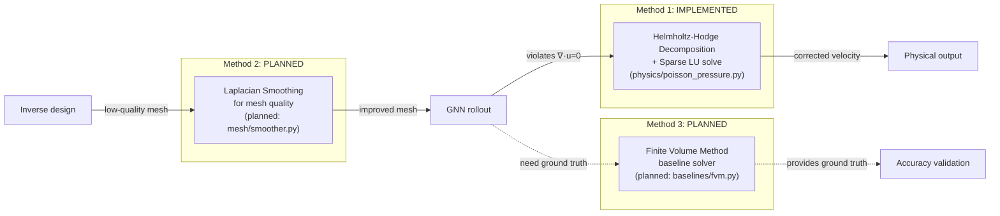
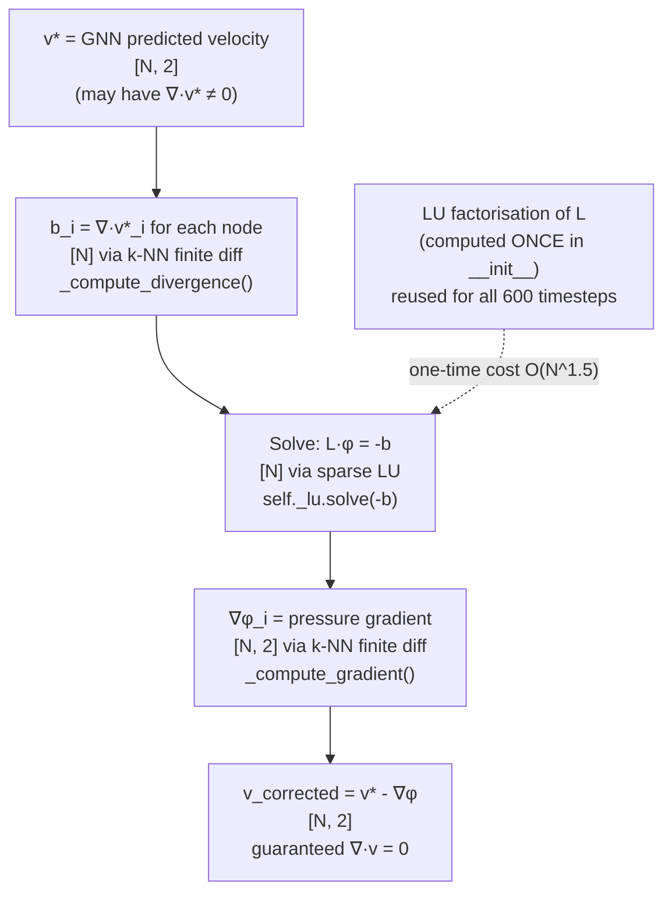
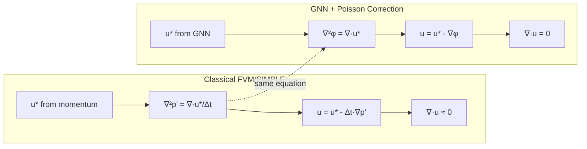
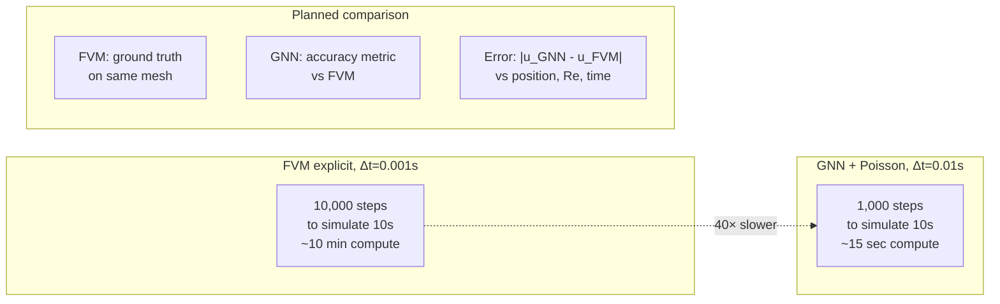

# 12 — Numerical Methods in PhysIQ

> **Audience**: ML engineers and senior software engineers. This document assumes some familiarity with calculus and linear algebra but builds the intuition from scratch.
> **Story arc**: Three numerical methods. One fully implemented (Helmholtz-Hodge / Poisson correction), two planned. For each: the physical motivation, the mathematical machinery, the implementation, and the design decisions.

Related: [[07_poisson_correction_lu]] | [[11_research_connections]] | [[10_scalability]] | [[03_system_architecture]]

---

## Why Does an ML System Need Numerical Methods?

The honest answer: because neural networks don't know about physics.

A GNN trained to predict fluid velocity can learn to approximate it very well on the training distribution. But it won't automatically satisfy ∇·u = 0 (the incompressibility constraint). It won't produce meshes with well-conditioned triangles. It won't respect conservation laws exactly.

Numerical methods are the bridge between "approximately correct ML output" and "physically valid simulation." They encode the hard constraints that the physics enforces but the network doesn't.

This document covers three methods, one at a time.

---

## Overview: Three Numerical Methods



---

## Method 1: Helmholtz-Hodge Decomposition with Sparse LU (Implemented)

### The Physical Problem

The incompressible Navier-Stokes equations include a constraint: ∇·u = 0. This says the divergence of the velocity field is zero everywhere. In physical terms: what flows into a control volume must flow out. No sources, no sinks. Fluid doesn't compress.

A GNN predicting velocity at each timestep doesn't know about this constraint. It minimises L2 loss between predicted and ground-truth velocities. The ground-truth velocities *happen to be* divergence-free (they came from a FEM solver that enforces it), but the GNN prediction at each step might not be.

Over 600 timesteps of autoregressive rollout, small divergence errors accumulate. The velocity field "leaks" mass. The simulation gradually diverges from physical reality.

The Poisson pressure correction eliminates this error by decomposing the predicted velocity into its divergence-free component (physically meaningful) and its curl-free component (the "error"), then discarding the error.

### The Mathematical Tool: Helmholtz-Hodge Theorem

The Helmholtz decomposition states that any sufficiently smooth vector field **v** can be uniquely decomposed into:

```
v = u + ∇φ
```

where:
- **u** = divergence-free component: ∇·u = 0
- **∇φ** = curl-free (irrotational) component: φ is a scalar potential

For incompressible flow, **u** is the physically correct velocity. **∇φ** is the divergence error introduced by the GNN.

To find φ, take the divergence of both sides:

```
∇·v = ∇·u + ∇·(∇φ)
∇·v = 0 + ∇²φ         (since ∇·u = 0 by definition)
∇²φ = ∇·v
```

This is the **pressure Poisson equation**: a second-order elliptic PDE. Solve for φ, then compute the corrected velocity:

```
u = v - ∇φ
```

u is guaranteed to be divergence-free.

### Discretisation on an Unstructured Mesh

The mesh is an unstructured graph. We can't use standard finite-difference Laplacians (those require regular grids). We need a graph-based approximation of both ∇·v and ∇²φ.

#### Step 1: Discrete divergence via local finite differences

For each node i, we want ∇·v ≈ ∂vx/∂x + ∂vy/∂y.

Collect node i's k nearest neighbours {j₁, j₂, ..., j_k}. For each neighbour j, the finite difference approximation is:

```
Δr_ij · ∇v ≈ Δv_ij
```

where Δr_ij = r_j - r_i is the displacement vector and Δv_ij = v_j - v_i is the velocity difference.

With k > 2 neighbours (k=6 in our implementation), this is an *overdetermined* system:

```
A_i · g_i = b_i

A_i ∈ ℝ^{k×2}  — rows are displacement vectors Δr_ij
g_i ∈ ℝ^2      — gradient components [∂vx/∂x, ∂vx/∂y; ∂vy/∂x, ∂vy/∂y]... wait, this is 2×2
b_i ∈ ℝ^k      — velocity differences Δv_ij
```

Actually for the full Jacobian (2×2 for 2D velocity), we solve each velocity component separately. For component c (vx or vy):

```
A_i · [∂vc/∂x, ∂vc/∂y]^T = [Δvc_ij for all j]
```

Normal equations: **(A_i^T A_i) · g_ic = A_i^T · b_ic**

A_i^T A_i is 2×2 — a tiny dense linear system, solved with LAPACK's `dgesv`.

The divergence is then: ∇·v_i = ∂vx/∂x_i + ∂vy/∂y_i.

In code (from `physics/poisson_pressure.py`):

```python
def _compute_divergence(self, vel: np.ndarray) -> np.ndarray:
    """Vectorised: solve 2×2 system for all N nodes simultaneously."""
    dv = vel[self._neighbor_idxs] - vel[:, np.newaxis, :]  # [N, k-1, 2]
    
    # rhs: [N, 2, 2] — one system per velocity component per node
    rhs = self._drT @ dv.astype(np.float64)   # self._drT: [N, 2, k-1]
    
    # self._A: [N, 2, 2] = A_i^T A_i + ε·I (precomputed, regularised)
    # np.linalg.solve broadcasts: solves N systems of size 2×2 at once
    grad = np.linalg.solve(self._A, rhs)   # [N, 2, 2]
    
    # divergence = ∂vx/∂x + ∂vy/∂y
    return (grad[:, 0, 0] + grad[:, 1, 1]).astype(np.float64)
```

**Vectorisation note**: `np.linalg.solve` with `self._A` of shape `[N, 2, 2]` and `rhs` of shape `[N, 2, 2]` solves N independent 2×2 systems simultaneously using LAPACK's batched mode. For N=10,000 nodes, this is O(N × 2³) = O(N) effectively.

#### Step 2: Discrete Laplacian (graph Laplacian)

The Poisson equation ∇²φ = ∇·v must be discretised on the graph. The graph Laplacian L is:

```
L_ij = -w_ij          for i ≠ j (connected nodes)
L_ii = Σ_j w_ij       (sum of weights in the row)
L_ij = 0              for unconnected nodes
```

On a regular grid, all w_ij = 1 gives the standard 5-point Laplacian stencil. On an irregular mesh, we use **inverse-distance-squared weights**:

```
w_ij = 1 / ||r_i - r_j||²
```

Why inverse-distance-squared? The finite difference approximation Δφ/||r_ij|| ≈ (∂φ/∂n) scales as 1/||r_ij||. To get the Laplacian (which is already scaled by 1/h² in the Taylor expansion), we need one more factor of 1/||r_ij||, giving 1/||r_ij||². This makes the discrete operator consistent with the continuous one in the limit of mesh refinement.

From `physics/poisson_pressure.py`:

```python
@staticmethod
def _build_laplacian(crds, edges, N, regularise):
    ei, ej = edges[:, 0], edges[:, 1]
    dx = crds[ei] - crds[ej]                            # [E, 2]
    dist2 = np.maximum(np.sum(dx**2, axis=1), 1e-20)    # [E] — avoid /0
    w = 1.0 / dist2                                      # inverse-distance-squared

    # Off-diagonal: -w_ij (both directions for symmetric matrix)
    rows_off = np.concatenate([ei, ej])
    cols_off = np.concatenate([ej, ei])
    data_off = -np.concatenate([w, w])

    # Diagonal: weighted degree
    deg = np.zeros(N, dtype=np.float64)
    np.add.at(deg, ei, w);  np.add.at(deg, ej, w)
    data_diag = deg + regularise   # small regularisation for non-singularity

    L = sp.csc_matrix((np.concatenate([data_diag, data_off]),
                        (np.concatenate([np.arange(N), rows_off]),
                         np.concatenate([np.arange(N), cols_off]))),
                       shape=(N, N))
    
    # Pin node 0: Dirichlet BC (p=0 at one node to remove null space)
    L = L.tolil();  L[0, :] = 0.0;  L[0, 0] = 1.0
    return L.tocsc()
```

The Laplacian is **sparse**: N×N matrix with ~k×N non-zero entries (k=5-7). For N=10,000, that's ~70,000 non-zeros out of 100,000,000 possible. Storing it as a dense matrix would be wasteful; `scipy.sparse` uses Compressed Sparse Column (CSC) format.

#### Step 3: Sparse LU Factorisation

The Poisson equation Lφ = b must be solved for φ (we have L and b, want φ).

For a dense system, LU factorisation decomposes A = L·U and then solves by forward/backward substitution. The same principle applies to sparse systems, but with crucial differences.

**The fill-in problem**: sparse LU factorisation can create *fill-in* — non-zeros in L and U where A had zeros. In the worst case, an N×N sparse matrix with O(N) non-zeros can produce dense L, U factors with O(N²) non-zeros. This destroys the sparsity advantage.

**Reordering to reduce fill-in**: the key insight is that the fill-in pattern depends on the *ordering* of rows and columns. AMD (Approximate Minimum Degree) ordering reorders rows/columns to minimise the fill-in. `scipy.sparse.linalg.splu` uses UMFPACK under the hood, which applies AMD automatically.

```python
# In __init__:
self._lu = splu(L)   # splu: sparse LU with AMD ordering, UMFPACK backend
                     # Cost: O(N^{1.5}) for 2D meshes (good fill-in reduction)
                     # Stores: L, U factors (sparse, ~5-10× more non-zeros than L itself)
```

**Factorisation cost**: O(N^{1.5}) for 2D problems (with good ordering). For N=10,000: ~3M operations. One-time cost.

**Per-step solve cost**: after factorisation, solving Lφ = b is forward/backward substitution: O(nnz(L) + nnz(U)) ≈ O(N log N) for 2D meshes. For N=10,000: ~100K operations. Takes ~0.1ms.

The full correction pipeline per timestep:
1. Compute divergence: O(N × k²) ≈ O(N) vectorised → ~0.5ms
2. Sparse solve: O(N log N) → ~0.1ms
3. Compute gradient of φ: O(N × k²) ≈ O(N) → ~0.5ms
4. Subtract: O(N) → negligible

Total: ~1ms per timestep. The one-time LU factorisation: ~5ms. For a 600-step rollout, correction adds ~600ms (6% overhead on the 10 second rollout).

#### The Dirichlet Boundary Condition: Removing the Null Space

The graph Laplacian L has a **null space**: the constant vector [1, 1, ..., 1]. If φ is a solution to Lφ = b, then φ + c is also a solution for any constant c. This makes L singular — `splu` would fail.

Fix: pin one node to zero pressure (Dirichlet boundary condition). We clear row 0 of L and set L[0,0] = 1, b[0] = 0. This forces φ[0] = 0 and makes L non-singular.

The choice of which node to pin is arbitrary (only the pressure *gradient* ∇φ affects the velocity correction, not the absolute pressure). Pinning node 0 is conventional.

```python
# In _build_laplacian:
L[0, :] = 0.0    # clear row 0
L[0, 0] = 1.0    # L[0,0] = 1 → φ[0] = b[0] = 0

# In correct():
b[0] = 0.0       # set RHS for Dirichlet node
p = self._lu.solve(-b)
```

#### The ε Regularisation

The Laplacian diagonal gets a small additive regularisation `ε = 1e-6`. Why?

Even with the Dirichlet BC, numerical conditioning can be poor. The regularisation shifts all eigenvalues up by ε, ensuring L is positive definite (not just positive semi-definite). This is analogous to ridge regression (L2 regularisation in the ML world): add a small term to the diagonal to improve conditioning.

The effect on the solution: φ is slightly damped. For ε = 1e-6 and typical Laplacian eigenvalues ~0.1-10, the relative perturbation is 10⁻⁵ to 10⁻⁷ — negligible.

#### Full Correction Pipeline, Visualised



### Design Decisions and Tradeoffs

**Decision: sparse LU vs iterative solver (CG, PCG)**

For symmetric positive definite systems, Conjugate Gradient (CG) is often preferred over direct LU because it's O(N) per iteration and can be stopped early. But:

- For multiple RHS (we solve 600 times with the same L): direct LU is much better. Factorisation once, solves are each O(N log N) with zero iteration overhead.
- CG convergence depends on condition number. The graph Laplacian can be poorly conditioned for irregular meshes. Preconditioning (ILU, AMG) adds complexity.
- For N < 100,000, direct sparse LU is faster in practice. For N > 1,000,000, CG with AMG preconditioning wins.

We're at N = 2,000-10,000. Direct sparse LU is the right choice.

**Decision: k-NN edges for Laplacian vs using the mesh edges**

The `PoissonPressureCorrector.__init__` accepts an optional `edges` parameter (the actual mesh edges). If provided, the Laplacian uses the real mesh topology. If not provided, it builds k-NN edges from the coordinates.

When to use mesh edges: the mesh topology captures the actual FEM connectivity. The Laplacian built from mesh edges is the same operator the original solver used. More physically accurate.

When k-NN is better: some meshes have poorly-connected regions (long thin elements with few neighbours). k-NN provides a more uniform connectivity regardless of mesh quality.

Current default: k-NN with k=7. Could be improved by passing actual mesh edges when available.

**Decision: float64 for all numerical operations**

The entire Poisson solve uses float64 even though the GNN operates in float32. Why?

The sparse LU factorisation and linear solve are sensitive to numerical precision. The condition number of the Laplacian can be up to ~10⁶ for fine meshes (ratio of largest to smallest eigenvalue). In float32 (machine epsilon ~10⁻⁷), this leaves only one digit of accuracy in the solution. In float64 (machine epsilon ~10⁻¹⁵), there's ample precision.

The conversion overhead: float32 → float64 → float32 for each timestep costs ~O(N) operations. Negligible compared to the solve cost.

---

## Method 2: Laplacian Smoothing for Mesh Quality (Planned)

### The Problem It Solves

The CVAE inverse design module generates geometry *parameters*, which are then converted to a mesh by a meshing tool. But the generated parameters don't guarantee mesh quality. A generated cylinder radius/position combination might produce:
- Highly elongated triangles (aspect ratio >> 1) near the cylinder wall
- Near-degenerate triangles at the wake region
- Badly-conditioned elements that make GNN edge features meaningless

```
Ideal triangle: equilateral, aspect ratio = 1
                All sides equal length

Bad triangle: aspect ratio >> 1
              Very long and thin
              |r_ij| varies by 10×
              Finite difference gradients on such triangles are inaccurate
              GNN edge features (based on |r_ij|) are noisy
```

Poor mesh quality feeds back into the GNN in two ways:
1. Edge features `[|r_ij|, r_ij/|r_ij|, ...]` have extreme values for bad triangles
2. The Laplacian for Poisson correction has extreme weights for near-degenerate triangles (w = 1/||r_ij||² → very large for close nodes)

### The Algorithm

Laplacian smoothing iteratively moves each interior node toward the centroid of its neighbours:

```
x_i^{new} = (1 - λ) · x_i + λ · (1/|N(i)|) Σ_{j ∈ N(i)} x_j
```

where λ ∈ (0, 1) is the relaxation parameter. Typically λ = 0.5 and 10-50 iterations.

**Convergence**: after sufficient iterations, each interior node is at the centroid of its neighbours. This is the steady state of the discrete Laplace equation Δx = 0 — the same equation as Poisson with zero RHS. The smoothed mesh satisfies the discrete Laplace equation for node positions.

**Matrix form**: one iteration is:

```
x^{new} = (1 - λ)·x + λ·D⁻¹·A·x = ((1-λ)·I + λ·D⁻¹·A)·x
```

where A is the adjacency matrix and D is the degree matrix. Multiple iterations are repeated matrix-vector products — O(N × k) per iteration for a k-NN mesh.

### Implementation Plan

```python
# planned: mesh/smoother.py

import numpy as np
import scipy.sparse as sp

class LaplacianSmoother:
    def __init__(self, crds: np.ndarray, edges: np.ndarray, boundary_mask: np.ndarray):
        """
        Args:
            crds:          [N, 2] initial node coordinates
            edges:         [E, 2] mesh edge list
            boundary_mask: [N] boolean — True = boundary node (fixed, not moved)
        """
        N = crds.shape[0]
        # Build adjacency matrix for smoothing operator
        ei, ej = edges[:, 0], edges[:, 1]
        data = np.ones(2 * len(ei))
        row = np.concatenate([ei, ej])
        col = np.concatenate([ej, ei])
        A = sp.csr_matrix((data, (row, col)), shape=(N, N))
        
        # Degree matrix (for normalisation)
        degree = np.array(A.sum(axis=1)).flatten()
        D_inv = sp.diags(1.0 / np.maximum(degree, 1))
        
        # Laplacian operator: L = I - D⁻¹A
        # One iteration: x_new = x - λ·L·x = (I - λ·L)·x
        I = sp.eye(N)
        lam = 0.5
        self._S = I - lam * (I - D_inv @ A)   # smoothing operator
        self._boundary_mask = boundary_mask

    def smooth(self, crds: np.ndarray, n_iters: int = 20) -> np.ndarray:
        """Apply n_iters of Laplacian smoothing, preserving boundary nodes."""
        crds = crds.copy()
        boundary = self._boundary_mask
        
        for _ in range(n_iters):
            crds_new = (self._S @ crds)      # [N, 2] — matrix-vector product
            crds[~boundary] = crds_new[~boundary]   # only move interior nodes
        
        return crds
```

### Why Boundary Nodes Must Be Fixed

Laplacian smoothing applied to boundary nodes would distort the geometry:
- A circular cylinder boundary would collapse toward the center
- An airfoil trailing edge would move to the wing centroid

The physical constraint: the geometry defines the problem. We're optimising the interior mesh distribution, not the shape.

Identifying boundary nodes: any node connected to at least one boundary edge. Boundary edges are those shared by only one triangle (as opposed to interior edges, shared by two). The meshing tool typically provides this information.

### Cotangent Laplacian: Better for Angle Quality

The simple graph Laplacian (uniform weights) improves node distribution but doesn't specifically target angle quality. The **cotangent Laplacian** uses geometric weights that directly optimise triangle angles:

```
w_ij = (cot α_ij + cot β_ij) / 2
```

where α_ij and β_ij are the angles opposite edge (i,j) in the two triangles sharing that edge.

This is the Laplacian from discrete differential geometry — the intrinsic Laplace-Beltrami operator discretised on the mesh. It exactly minimises Dirichlet energy, which corresponds to minimising triangle distortion.

However, cotangent weights can become negative for obtuse triangles (angles > 90°), causing numerical instability. The simpler uniform-weight Laplacian is more robust for the highly irregular meshes that CVAE might generate.

For Phase 2 implementation: start with uniform Laplacian, upgrade to cotangent if triangle quality metrics show it's needed.

### Stopping Criterion

How many smoothing iterations are enough? Monitor the aspect ratio improvement:

```python
def triangle_aspect_ratio(crds, triangles):
    """Returns max aspect ratio across all triangles. 1.0 = equilateral (best)."""
    for tri in triangles:
        a, b, c = crds[tri[0]], crds[tri[1]], crds[tri[2]]
        sides = [np.linalg.norm(b-a), np.linalg.norm(c-b), np.linalg.norm(a-c)]
        max_side, min_side = max(sides), min(sides)
        yield max_side / min_side

max_ar = max(triangle_aspect_ratio(crds, triangles))
```

Stop when `max_ar < threshold` (e.g., 5.0) or when improvement per iteration falls below tolerance.

---

## Method 3: Finite Volume Method Baseline (Planned)

### Why We Need an Independent Solver

Currently, we validate GNN predictions against the DeepMind CFD dataset. This dataset was generated by a Finite Element Method (FEM) solver, which is our ground truth. But this creates a circular dependency:

1. We train on FEM data
2. We evaluate by comparing to FEM data
3. FEM errors are invisible to us (they appear as "correct" ground truth)

An independent Finite Volume Method (FVM) solver would let us:
1. **Validate on new geometries**: not in the training set, not in the DeepMind dataset
2. **Generate new training data**: without the TFRecord dependency (the original DeepMind data requires TensorFlow to parse)
3. **Quantify Poisson correction improvement**: compare GNN + correction vs FVM on the same mesh
4. **Measure CFL violations**: check whether the GNN is making predictions that would be numerically unstable for a classical solver

### FVM Fundamentals

The Finite Volume Method discretises the domain into control volumes (cells). For each cell, it integrates the conservation law over the cell volume:

**Conservation of momentum** (incompressible, inviscid for simplicity):
```
∂/∂t ∫_V u dV + ∮_∂V (u ⊗ u) · n dA + ∮_∂V p · n dA = 0
```

Discrete form for cell i with volume V_i and faces F:
```
V_i · (u_i^{n+1} - u_i^n) / Δt + Σ_f (u_f · n_f) · u_f · A_f + Σ_f p_f · n_f · A_f = 0
```

**Conservation of mass** (incompressibility):
```
Σ_f (u_f · n_f) · A_f = 0   for each cell
```

The face values `u_f` and `p_f` are interpolated from cell centres. For unstructured meshes, linear interpolation weighted by distance.

### Pressure-Velocity Coupling: SIMPLE Algorithm

The challenge: momentum and mass conservation are coupled through pressure. You can't solve them independently.

**SIMPLE** (Semi-Implicit Method for Pressure-Linked Equations, Patankar & Spalding 1972):

1. **Predict u***: solve momentum equation using current pressure p^n (ignoring mass conservation)
2. **Pressure correction**: compute pressure correction p' to enforce ∇·u = 0
3. **Velocity correction**: u^{n+1} = u* - ∇p'
4. **Update pressure**: p^{n+1} = p^n + αp · p' (underrelaxation factor αp)
5. **Repeat** until convergence

The pressure correction equation is — the Poisson equation:
```
∇²p' = (1/Δt) ∇·u*
```

This is exactly the equation we solve in `PoissonPressureCorrector`! The Helmholtz decomposition correction we apply to GNN outputs is mathematically equivalent to one SIMPLE iteration.

**This connection is not a coincidence.** The Poisson correction is a physics-informed post-processing step that mimics what the SIMPLE algorithm does to enforce incompressibility. We're applying one projection step, which is exactly what classical CFD solvers do at each timestep.



### Implementation Plan

```python
# planned: baselines/fvm.py

class FVMSolver:
    """
    2D incompressible Navier-Stokes on unstructured triangular mesh.
    Uses SIMPLE algorithm for pressure-velocity coupling.
    First-order implicit time integration.
    """
    
    def __init__(self, mesh: Mesh, nu: float, dt: float):
        """
        Args:
            mesh:  Mesh object (nodes, elements, boundary conditions)
            nu:    kinematic viscosity
            dt:    time step
        """
        self._mesh = mesh
        self._nu = nu
        self._dt = dt
        self._u = np.zeros((mesh.n_cells, 2))   # cell-centred velocity
        self._p = np.zeros(mesh.n_cells)          # cell-centred pressure
        
        # Precompute face areas, normals, cell volumes (mesh-dependent, computed once)
        self._precompute_geometry()
        
        # Build Poisson matrix for SIMPLE (same structure as PoissonPressureCorrector)
        self._poisson_lu = self._build_pressure_system()

    def step(self) -> tuple[np.ndarray, np.ndarray]:
        """Advance one timestep using SIMPLE. Returns (u, p)."""
        u_star = self._momentum_predict()           # explicit momentum step
        p_prime = self._pressure_correct(u_star)    # Poisson solve
        u_new = u_star - self._dt * self._gradient(p_prime)
        p_new = self._p + p_prime
        self._u, self._p = u_new, p_new
        return self._u.copy(), self._p.copy()

    def rollout(self, n_steps: int) -> tuple[np.ndarray, np.ndarray]:
        """Run n_steps and return trajectory arrays."""
        u_traj = np.zeros((n_steps, self._mesh.n_cells, 2))
        p_traj = np.zeros((n_steps, self._mesh.n_cells))
        for t in range(n_steps):
            u_traj[t], p_traj[t] = self.step()
        return u_traj, p_traj
```

### CFL Condition and the GNN's Advantage

The **Courant-Friedrichs-Lewy (CFL) condition** is a necessary condition for the stability of explicit numerical schemes:

```
CFL = |u| · Δt / Δx ≤ 1
```

In words: information should travel at most one cell per timestep. If the velocity u is too large, or the time step Δt too large, or the mesh spacing Δx too small, the scheme becomes unstable (solution diverges to infinity).

**Practical consequence for FVM**: for high-Reynolds-number flows (fast velocity) or fine meshes (small Δx), the required Δt can be tiny:
- Typical CFD mesh: Δx ≈ 0.01m, |u| ≈ 1 m/s, CFL=1 → Δt ≤ 0.01s
- Near a no-slip wall (fine mesh): Δx ≈ 0.001m, same u → Δt ≤ 0.001s
- Re=10000: |u| could be 10 m/s → Δt ≤ 0.0001s

To simulate 6 seconds: 60,000 timesteps at Δt=0.0001. A FVM solver might take hours.

**The GNN's advantage**: the GNN is not constrained by CFL. It was trained on trajectories with Δt = 0.01s (from the DeepMind dataset). At inference, it steps forward by Δt = 0.01s regardless of flow velocity or mesh resolution. This is a *10-100× larger timestep* than a conditionally stable explicit FVM would use.

The Poisson correction helps the GNN maintain physical validity at this large timestep by enforcing incompressibility — essentially acting as the "implicit" part of a semi-implicit scheme.

**Caveat**: the GNN's large-timestep accuracy degrades for flows very different from the training distribution (very high Re, novel geometry, long time horizons). The confidence index (KDTree distance in embedding space) is designed to flag exactly these cases.



### What the FVM Baseline Enables

With a working FVM solver, we can answer questions we currently can't:

**1. Accuracy vs speedup curve**:
"At what point does the GNN deviate significantly from the FVM? At what speedup factor?"

**2. Poisson correction value**:
Compute `RMSE(GNN_raw, FVM)` vs `RMSE(GNN_corrected, FVM)`. Quantify how much the Poisson correction improves physical accuracy.

**3. New training data generation**:
Generate CFD datasets for geometries not in the DeepMind dataset (different Re, different boundary conditions) without needing the TFRecord format.

**4. CFL analysis**:
For each test case, compute `max(CFL)` across the mesh at each timestep. Correlate high-CFL regions with GNN prediction errors. This would validate the intuition that the GNN struggles where physics changes rapidly.

---

## Summary: Numerical Methods as Physical Constraints

The three methods serve three distinct purposes in the physical simulation pipeline:

| Method | Purpose | When applied | Status |
|--------|---------|-------------|--------|
| Helmholtz-Hodge + Sparse LU | Enforce ∇·u = 0 | Post-GNN, every timestep | ✅ Implemented |
| Laplacian smoothing | Improve mesh quality | Post-CVAE, before GNN | 🔲 Planned |
| Finite Volume Method | Ground-truth validation | Offline, for benchmarking | 🔲 Planned |

The deeper pattern: each method addresses a different type of physical constraint violation.

- The GNN violates conservation (divergence). Helmholtz projection fixes it by enforcing the hard constraint.
- The CVAE violates mesh quality. Laplacian smoothing fixes it by relaxing node positions toward equilibrium.
- We currently can't verify GNN accuracy on unseen cases. FVM baseline fixes it by providing an independent oracle.

In ML systems that touch physics, numerical methods aren't an afterthought — they're the engineering layer that transforms "approximately correct" into "physically valid." The craft is knowing which constraints to enforce hard (Poisson: always, it's cheap and improves every rollout) vs soft (mesh quality: when CVAE output is used) vs offline (FVM: too expensive for production inference, but essential for validation).
