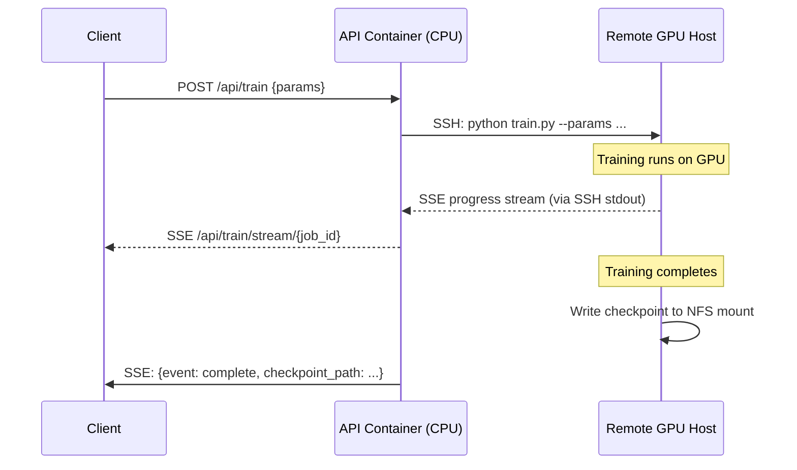
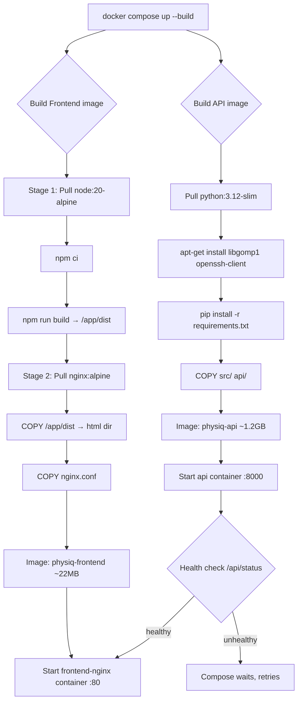

# 13 — Docker Deployment

> **Related notes**: [[03_system_architecture]] · [[10_api_layer]] · [[11_frontend]] · [[14_design_decisions_tradeoffs]]

---

## The Problem: "It Works on My Machine"

Every serious ML project eventually runs into this wall.

On one developer's laptop:
- Python 3.12.2, PyTorch 2.1.0+cu118, torch-geometric 2.4.0, Node.js 20.11 LTS, nginx 1.25.3
- A specific `.venv` built over months of `pip install` trial and error
- A `node_modules/` tree with 1,400 packages pinned to a specific lockfile

On a second developer's machine — or a fresh CI runner, or a production VM — some combination of those is different. A PyTorch minor version mismatch changes gradient behavior. A mismatched `torch-scatter` build causes a silent wrong-answer bug. A Node version difference silently compiles the frontend bundle differently.

**Docker's answer**: package the entire environment — OS, system libraries, Python runtime, installed packages, compiled binaries, source code — into a single *image*. That image runs identically on any host with Docker installed, whether that's a laptop, a CI server, or a production VM.

The rest of this note walks through every decision in PhysIQ's Docker setup.

---

## Repository Structure

```
meshGraphNets_pytorch/
├── docker/
│   ├── Dockerfile.api           # Python / FastAPI image
│   ├── Dockerfile.frontend      # Node build → nginx serve
│   └── nginx.conf               # nginx config (SSE-aware)
├── docker-compose.yml           # Orchestration
├── .dockerignore                # Files excluded from build context
└── ...
```

---

## Two Dockerfiles, Two Concerns

### `Dockerfile.api` — Python / FastAPI

```dockerfile
FROM python:3.12-slim

WORKDIR /app

# System deps needed by torch-geometric (libgomp, etc.)
RUN apt-get update && apt-get install -y --no-install-recommends \
    libgomp1 \
    openssh-client \       # <-- needed for SSH GPU dispatch
    && rm -rf /var/lib/apt/lists/*

COPY requirements.txt .
RUN pip install --no-cache-dir -r requirements.txt

COPY src/ ./src/
COPY api/ ./api/

EXPOSE 8000
CMD ["uvicorn", "api.main:app", "--host", "0.0.0.0", "--port", "8000"]
```

Key choices here:
- `python:3.12-slim` — the `slim` variant strips documentation, manpages, and some locale data. Saves ~100 MB versus the full image.
- `--no-cache-dir` on pip — don't cache `.whl` files inside the image layer. They're never needed again after install.
- `openssh-client` is a deliberate inclusion; the container needs to initiate SSH connections to the remote GPU host. See [[#CPU-Only Containers and SSH GPU Dispatch]].
- `requirements.txt` is copied and installed *before* source code. This exploits Docker's layer cache: if your source changes but requirements don't, Docker reuses the expensive pip-install layer.

---

### `Dockerfile.frontend` — Multi-Stage Build

```dockerfile
# ─── Stage 1: Build ───────────────────────────────────────────────────
FROM node:20-alpine AS builder

WORKDIR /app

# Install deps first (layer cache benefit)
COPY package.json package-lock.json ./
RUN npm ci --frozen-lockfile

# Copy source and build
COPY . .
RUN npm run build
# Result: /app/dist/ contains index.html + JS bundles + CSS

# ─── Stage 2: Serve ───────────────────────────────────────────────────
FROM nginx:alpine

# Copy only the compiled output from Stage 1
COPY --from=builder /app/dist /usr/share/nginx/html

# Inject our SSE-aware nginx config
COPY docker/nginx.conf /etc/nginx/conf.d/default.conf

EXPOSE 80
```

#### Why Two Stages?

This is the most important Dockerfile pattern to understand.

Stage 1 (the *builder*) needs:
- Node.js 20 runtime
- npm + 1,400+ `node_modules/` packages
- TypeScript compiler
- Vite bundler
- All `devDependencies`

That adds up to ~500 MB. But none of it is needed at runtime — nginx just needs static HTML, JS, and CSS files.

Stage 2 (the *server*) contains:
- nginx:alpine (~20 MB)
- The compiled `/dist` directory (~2-5 MB of bundled assets)

**Result**: the final image is ~22 MB instead of ~500 MB.

```
Image size comparison
┌─────────────────────────────┬──────────┐
│ Approach                    │ Size     │
├─────────────────────────────┼──────────┤
│ Single-stage (node + files) │ ~490 MB  │
│ Multi-stage (nginx + files) │ ~22 MB   │
└─────────────────────────────┴──────────┘
```

Smaller images mean:
- Faster CI (less to push/pull from registry)
- Faster deployment (less to transfer to production host)
- Smaller attack surface (no compiler, no npm, no package manager)

---

## `.dockerignore`

The build context is everything Docker sends to the daemon before processing the Dockerfile. Without `.dockerignore`, Docker ships your entire repo — including gigabytes of training data — to the daemon, even if the `COPY` instructions never reference those files.

```
# .dockerignore

# Python environment
venv/
.venv/
__pycache__/
*.pyc

# Large data files
data/*.tfrecord
data/*.dat
data/*.bin
*.pkl

# Checkpoints (large binary files)
checkpoints/

# Node
node_modules/

# Git
.git/
.gitignore

# IDE
.vscode/
.idea/

# Local secrets
.env
*.env.local
```

Without this file, a build that should take 3 seconds takes 40 seconds while Docker serializes gigabytes of `.tfrecord` files into the build context, only to discard them immediately.

---

## CPU-Only Containers and SSH GPU Dispatch

This is the most unusual architectural decision in the Docker setup, and it deserves a full explanation.

### Why Not GPU Inside the Container?

Running PyTorch with CUDA inside a Docker container requires:

1. **NVIDIA Container Runtime** (`nvidia-docker2`) installed on the host
2. The container's CUDA version must be **compatible with the host GPU driver**
3. The `--gpus all` flag passed to `docker run`
4. Potential CUDA library conflicts between the container and host

For PhysIQ, the GPU is a *remote* machine — not the same host where the API container runs. Asking every deployment target to have NVIDIA drivers and the container runtime configured is a significant operational burden.

### The SSH GPU Dispatch Pattern

Instead, the API container (CPU-only) dispatches training jobs over SSH:



The API container's `openssh-client` package enables this. The SSH key is mounted as a Docker secret or bind-mount at runtime:

```yaml
# docker-compose.yml (relevant section)
services:
  api:
    volumes:
      - ~/.ssh/physiq_gpu_key:/run/secrets/gpu_ssh_key:ro
      - ./data:/app/data          # Shared via NFS or same host
      - ./checkpoints:/app/checkpoints
```

### The Tradeoff

This is explicitly a pragmatic choice. See [[14_design_decisions_tradeoffs#SSH GPU Dispatch vs Embedded CUDA vs Cloud GPU API]] for the full analysis. The costs:

- ~50–100ms SSH connection overhead per job (negligible vs. hours of training)
- SSH key management adds operational complexity
- The GPU host must be reachable from wherever the API container runs
- Not auto-scalable (can't spawn additional GPU instances on demand)

The benefit: dead-simple deployment. `docker compose up` on any machine with Docker gives you a fully functional API, regardless of GPU hardware.

---

## SSE Through nginx: The Buffering Problem

Server-Sent Events (SSE) is how the frontend receives live training progress. The client opens a long-lived HTTP connection; the server pushes newline-delimited JSON events as training progresses.

```
data: {"step": 100, "loss": 0.0432, "epoch": 1}\n\n
data: {"step": 200, "loss": 0.0387, "epoch": 1}\n\n
data: {"step": 300, "loss": 0.0341, "epoch": 1}\n\n
...
```

**The problem**: nginx buffers proxy responses by default.

nginx sits between the client and the uvicorn API server. Without explicit configuration, nginx accumulates the response in a buffer (default: 8KB or 16KB depending on config) and only forwards data to the client when the buffer fills or the connection closes.

For SSE, this means:
- Client sees nothing for the first hour of training
- When training completes, all 6,000 progress events arrive simultaneously
- The UI updates once, at the end — completely defeating the purpose of SSE

### The Fix: `docker/nginx.conf`

```nginx
server {
    listen 80;

    # Static frontend files
    location / {
        root /usr/share/nginx/html;
        try_files $uri $uri/ /index.html;
    }

    # API reverse proxy
    location /api/ {
        proxy_pass http://api:8000/;
        proxy_http_version 1.1;

        # ── SSE-critical settings ──────────────────────────────────
        proxy_buffering off;                # Do not buffer responses
        chunked_transfer_encoding on;       # Allow HTTP chunked encoding
        proxy_read_timeout 3600s;           # Training can take hours
        proxy_send_timeout 3600s;

        # ── Standard proxy headers ─────────────────────────────────
        proxy_set_header Host $host;
        proxy_set_header X-Real-IP $remote_addr;
        proxy_set_header X-Forwarded-For $proxy_add_x_forwarded_for;
        proxy_set_header Connection '';     # Disable keepalive upgrade for SSE
    }
}
```

The three SSE-critical settings:

| Setting | Default | Our Value | Why |
|---|---|---|---|
| `proxy_buffering` | `on` | `off` | Events flow immediately to client |
| `chunked_transfer_encoding` | depends | `on` | Allows streaming without `Content-Length` |
| `proxy_read_timeout` | `60s` | `3600s` | Training runs for minutes to hours |

Without `proxy_buffering off`, the frontend's training progress bar never moves — all updates arrive in a burst at the end. This is the most subtle configuration detail in the entire Docker setup.

---

## Docker Compose: Profiles

`docker-compose.yml` uses the `profiles` feature to support both production and development workflows from a single file.

```yaml
version: "3.9"

services:

  # ─── API ────────────────────────────────────────────────────────────
  api:
    build:
      context: .
      dockerfile: docker/Dockerfile.api
    ports:
      - "8000:8000"
    volumes:
      - ./data:/app/data
      - ./checkpoints:/app/checkpoints
      - ./result:/app/result
      - ./runs:/app/runs
      - ~/.ssh/physiq_gpu_key:/run/secrets/gpu_ssh_key:ro
    environment:
      - GPU_HOST=${GPU_HOST:-localhost}
      - GPU_USER=${GPU_USER:-user}
    healthcheck:
      test: ["CMD", "curl", "-f", "http://localhost:8000/api/status"]
      interval: 30s
      timeout: 10s
      retries: 3

  # ─── Production Frontend (nginx + static) ───────────────────────────
  frontend-nginx:
    build:
      context: .
      dockerfile: docker/Dockerfile.frontend
    ports:
      - "80:80"
    depends_on:
      api:
        condition: service_healthy
    profiles: ["prod"]  # Only starts with: docker compose --profile prod up

  # ─── Development Frontend (Vite HMR) ────────────────────────────────
  frontend-dev:
    build:
      context: .
      dockerfile: docker/Dockerfile.frontend.dev  # Dev variant
    ports:
      - "5173:5173"
    volumes:
      - ./frontend/src:/app/src   # Live mount for HMR
    profiles: ["dev"]   # Only starts with: docker compose --profile dev up
```

### Production Profile

```bash
docker compose --profile prod up --build
```

- `api` container: uvicorn on port 8000 (internal)
- `frontend-nginx` container: nginx on port 80
  - Serves `/dist` static files for `GET /`
  - Reverse-proxies `GET /api/*` to `api:8000`
- All data directories mounted from host

The `depends_on: condition: service_healthy` clause ensures the frontend only starts after the API's health check passes. Without this, nginx might start routing `/api/*` requests before uvicorn is ready.

### Development Profile

```bash
docker compose --profile dev up
```

- `api` container with `--reload` flag: uvicorn restarts on Python file changes
- `frontend-dev` container: Vite dev server with Hot Module Replacement
  - Source files bind-mounted from host: edit `frontend/src/App.tsx`, browser updates in <100ms
  - No need to rebuild the container on code changes

### Why Not Just `docker run` ?

Compose manages:
- Service startup order (`depends_on`)
- A shared Docker network (`physiq_default`) so services address each other by name (`api:8000`, not an IP)
- Volume lifecycle (named volumes persist, bind mounts reflect host changes)
- Health checks and automatic restart policies

---

## Volume Strategy

```mermaid
graph LR
    subgraph Host["Host Filesystem"]
        HD[data/]
        HC[checkpoints/]
        HR[result/]
        HRU[runs/]
    end

    subgraph APIContainer["api container"]
        AD[/app/data]
        AC[/app/checkpoints]
        AR[/app/result]
        ARU[/app/runs]
    end

    HD -- bind mount --> AD
    HC -- bind mount --> AC
    HR -- bind mount --> AR
    HRU -- bind mount --> ARU
```

All four data directories are **bind-mounted** (not Docker volumes). The distinction matters:

| | Bind Mount | Docker Named Volume |
|---|---|---|
| Location | Exact host path | Docker-managed (`/var/lib/docker/volumes/`) |
| Host access | Direct (`ls ./checkpoints/`) | Requires `docker volume inspect` + path lookup |
| Portability | Tied to host path | Portable across hosts |
| Our use case | ✅ Need host access for DVC, inspecting results | — |

Bind mounts mean a training run that produces `checkpoints/gn_epoch_50.pt` is immediately visible on the host filesystem, accessible by DVC (see [[09_experiment_tracking]]), and survives container restarts or rebuilds.

---

## Build Pipeline: What Happens on `docker compose up --build`



---

## Common Operations

```bash
# Full production stack
docker compose --profile prod up --build -d

# Development (hot reload on both frontend and backend)
docker compose --profile dev up

# Rebuild only the API image (e.g., after requirements.txt change)
docker compose build api

# View API logs
docker compose logs -f api

# Shell into running API container
docker compose exec api bash

# Inspect the GPU SSH key mount
docker compose exec api ls -la /run/secrets/

# Check health
docker compose ps

# Tear everything down (preserves bind-mounted data)
docker compose down
```

---

## Design Decisions Summary

| Decision | Alternative | Why We Chose This |
|---|---|---|
| Multi-stage frontend | Single-stage | 22 MB vs 490 MB image |
| CPU-only API container | GPU in container | Avoids NVIDIA runtime complexity |
| SSH GPU dispatch | Cloud GPU API | Reuses existing hardware, no cloud cost |
| `proxy_buffering off` | Default nginx | SSE requires streaming, not buffering |
| Bind mounts for data | Docker volumes | Host needs direct access (DVC, inspection) |
| Two containers | Monolith | Independent restarts, separate concerns |
| Compose profiles | Multiple compose files | Single source of truth for both envs |

See [[14_design_decisions_tradeoffs]] for deeper analysis of the architectural decisions that led here.

---

## Troubleshooting

**SSE events not arriving until job completes**
→ Check `proxy_buffering off` is in `nginx.conf`. Verify nginx config loaded: `docker compose exec frontend-nginx nginx -T | grep buffering`.

**API container exits immediately**
→ `docker compose logs api`. Usually a missing environment variable (`GPU_HOST`) or failed import.

**"Permission denied" on SSH to GPU host**
→ Verify key is mounted: `docker compose exec api ls -la /run/secrets/gpu_ssh_key`. Verify permissions: key must be `600`.

**Frontend shows "502 Bad Gateway"**
→ API health check failing. `docker compose ps` to check status. `docker compose logs api` for errors.

**Large build context (slow builds)**
→ Verify `.dockerignore` is present and lists `data/*.tfrecord`, `checkpoints/`, `venv/`.

---

*Next: [[14_design_decisions_tradeoffs]] — every major design decision in the project, with alternatives considered and tradeoffs accepted.*
