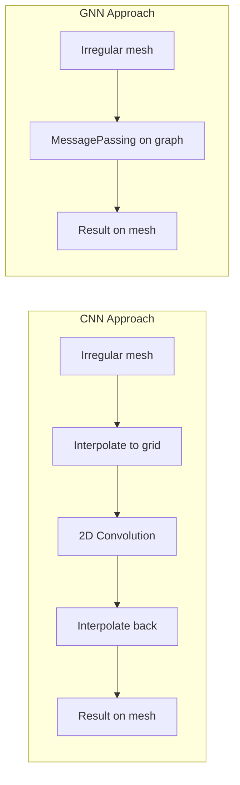
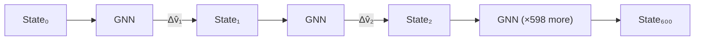
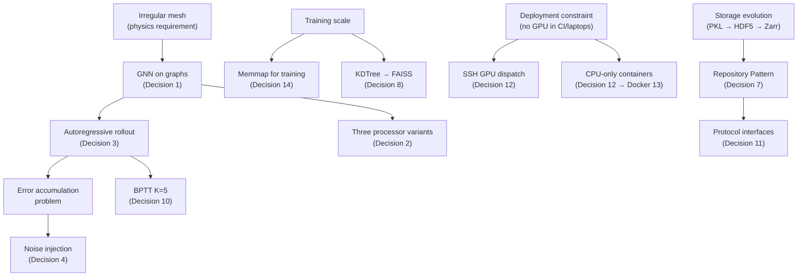

# 14 — Design Decisions & Tradeoffs

> **Related notes**: [[03_system_architecture]] · [[04_gnn_architecture]] · [[05_confidence_scoring]] · [[06_inverse_design]] · [[07_poisson_correction_lu]] · [[08_data_pipeline]] · [[09_experiment_tracking]] · [[13_docker_deployment]]

---

## How to Read This Note

Every non-trivial decision in PhysIQ had at least two reasonable alternatives. This note catalogs those decisions in a consistent format:

> **Decision**: what we chose  
> **Alternative(s)**: what we considered  
> **Rationale**: why we made this choice  
> **Cost**: what we gave up  

This is a living reference. When a new architectural decision is made, add it here. When the tradeoffs change (e.g., training set grows past 100k trajectories), revisit the relevant entry.

---

## 1. GNN on Graphs vs CNN on Grids

### Decision
Use a Graph Neural Network (GNN) operating on an irregular mesh.

### Alternatives Considered
- **CNN on regular grid**: discretize the domain onto a fixed Cartesian grid, apply standard 2D/3D convolutions.
- **FNO (Fourier Neural Operator)**: spectral methods on regular grids.

### Rationale

Physics simulations produce *meshes* — triangulations or tetrahedral decompositions of irregular domains. A wing profile, a combustion chamber, a cloth mesh: none of these have a natural regular grid representation.

Forcing an irregular mesh onto a regular grid requires:
- Interpolation (introducing error)
- Padding (wasting computation on "empty" grid cells)
- A fixed grid resolution (no adaptivity)

A GNN operates directly on the graph: nodes are mesh vertices, edges are mesh connections. The `MessagePassing` framework naturally handles the irregular topology. No interpolation, no wasted cells, and the graph can be different for every simulation domain.



### Cost

CNNs are *extremely* well-optimized for GPUs. `torch.nn.Conv2d` compiles to dense CUDA matrix multiplications (cuBLAS). GNN scatter operations (`scatter_add`, `scatter_mean`) are inherently irregular memory access patterns — harder to parallelize, worse cache behavior.

On a regular 256×256 grid, a ResNet-style CNN runs ~10× faster than a comparably-expressive GNN on the same hardware. We accept this cost because correctness on irregular domains matters more than raw throughput.

---

## 2. Three Processor Variants vs Single Architecture

### Decision
Maintain three interchangeable processor variants: **GN** (Graph Network), **TNS** (Transformer + Neighbor Sampling), **SAGE** (GraphSAGE).

### Alternatives Considered
- **Single architecture**: pick the best one, remove the others.
- **Ensemble**: run all three, average predictions.

### Rationale

Different physical domains have different structural properties:

| Domain | Key characteristic | Best processor |
|---|---|---|
| Fluid dynamics (pressure) | Long-range dependencies (pressure propagates globally) | **TNS** (attention captures global context) |
| Large meshes (>50k nodes) | Memory and compute budget | **SAGE** (mini-batch, efficient aggregation) |
| Stable baselines / research | Proven, predictable behavior | **GN** (original DeepMind architecture) |

Locking to a single architecture means losing performance on two out of three common cases. The three variants share the same encoder/decoder, the same noise injection logic, the same training loop — only the `ProcessorLayer` differs.

### Cost

Three processor variants means:
- Three codepaths to maintain and test
- Three sets of hyperparameter defaults to tune
- Three checkpoint formats (though they share the same serialization convention)
- Users must make a choice at training time

The UI mitigates the last point: the [[11_frontend]] tracks the best validation loss per architecture and presents them side-by-side, so users can train all three and compare without manually managing checkpoint files.

---

## 3. Autoregressive Rollout vs Direct Multi-Step Prediction

### Decision
**Autoregressive rollout**: predict one step at a time, feed the prediction back as input for the next step.

### Alternatives Considered
- **Direct multi-step**: train the model to predict all 600 future states simultaneously from the initial condition.
- **Sliding window**: predict K steps ahead, slide the window forward.

### Rationale

Autoregressive rollout is the natural generative model for time-series dynamics. It is flexible: a model trained on 600-step trajectories can roll out for 1,200 or 6,000 steps at inference time without retraining.

Direct multi-step prediction would require:
- A fixed output size (cannot change rollout length without retraining)
- Memory proportional to rollout length × graph size (storing 600 full graph states in GPU memory simultaneously)
- At 600 steps × 50k nodes × 5 features × 4 bytes = ~600 MB just for one trajectory



### Cost

**Error accumulation**: small errors at step *t* become inputs at step *t+1*, where they produce slightly larger errors, which compound over the rollout. A 0.1% error per step accumulates to ~45% drift over 600 steps.

Mitigation: [[#4. Noise Injection vs Scheduled Sampling vs No Noise]].

---

## 4. Noise Injection vs Scheduled Sampling vs No Noise

### Decision
**Noise injection**: during training, add Gaussian noise to the input node features before each step.

### Alternatives Considered
- **Scheduled sampling**: a curriculum that gradually transitions from using ground-truth inputs to model-generated inputs over the course of training.
- **No noise**: train on clean ground-truth trajectories only.

### Rationale

The core problem: at training time, the model sees clean ground-truth inputs. At test time (autoregressive rollout), it sees its own (slightly imperfect) outputs. This distribution shift causes error accumulation.

Noise injection is a simple, effective solution: by adding noise `ε ~ N(0, σ²)` to inputs during training, we teach the model to be robust to the kind of small perturbations it will encounter during rollout. It's robust to its own mistakes because its mistakes *look like* training noise.

**Scheduled sampling** is theoretically more principled but:
- Requires a curriculum schedule (another hyperparameter to tune)
- Can destabilize early training (the model receives its own bad predictions before it's learned anything)
- Adds a stateful component to the training loop

**No noise** produces models that look good on one-step validation loss but diverge rapidly on long rollouts. This is a known failure mode documented in the original MeshGraphNets paper.

### Cost

Noise injection is not free:
- `σ` is a hyperparameter. Too small: insufficient robustness. Too large: model can't learn the signal (all it sees is noise).
- Empirically, `σ ≈ 0.003 × feature_std` works well for most fluid dynamics domains. Different domains (cloth, combustion) may need tuning.
- Training loss is slightly higher (because the task is harder), which can be mistaken for underfitting.

---

## 5. Predict Accelerations (Δv) vs Absolute Velocities

### Decision
The GNN predicts **accelerations** — the *change* in velocity from step *t* to step *t+1* — not the absolute velocity at step *t+1*.

### Alternatives Considered
- **Predict absolute velocity**: the model outputs `v_{t+1}` directly.
- **Predict absolute position**: the model outputs `x_{t+1}` directly.

### Rationale

Physical dynamics are described by accelerations (Newton's second law: `F = ma`). Velocities are large numbers with a wide range. Accelerations are small corrections — much easier to learn.

Concretely: in a fluid simulation, velocities might range from 0 to 50 m/s. Accelerations from one timestep to the next are typically 0.1–2 m/s². The GNN has one fewer order of magnitude to cover, which makes the regression problem easier and improves gradient behavior.

The integration step is:
```python
v_next = v_curr + model(graph)    # model predicts Δv
x_next = x_curr + v_next * dt
```

This is the Euler integration scheme. The GNN only needs to get `Δv` right; the integration handles the rest.

### Cost

An extra integration step at inference time (negligible). The integration scheme (Euler) introduces its own truncation error. For the timestep sizes used in training data (typically Δt = 0.01s), this error is acceptable. For larger timesteps, a higher-order integrator (Runge-Kutta) could be used, though that is not currently implemented.

---

## 6. Poisson Correction: Opt-In vs Always-On

### Decision
The Poisson pressure correction (see [[07_poisson_correction_lu]]) is an **opt-in** post-processing step, disabled by default.

### Alternatives Considered
- **Always-on**: every prediction is passed through the pressure correction, guaranteeing divergence-free velocity fields.
- **Baked into the model**: train the GNN with a divergence-free constraint in the loss function.

### Rationale

The Poisson correction solves `∇²p = ∇·v` via LU decomposition to produce a divergence-free velocity field. It is physically principled but:

1. **~10–15% inference overhead**: LU solve on a large sparse system is not free.
2. **Not universally applicable**: cloth simulation, combustion, and compressible flow do not have a divergence-free constraint. Applying the correction to these domains introduces incorrect physics.
3. **Requires the user to understand it**: enabling correction without understanding that it assumes incompressible flow could silently degrade results.

YAGNI principle: "You Aren't Gonna Need It" for most users. Power users who need guaranteed divergence-free output for downstream computations (e.g., feeding into a CFD solver) can enable it explicitly.

**Baking into the loss** (divergence penalty `λ||∇·v||²`) is an active research direction but adds a loss coefficient to tune and can destabilize early training.

### Cost

Users who need divergence-free fields must opt in. Default predictions may have small divergence errors that accumulate over long rollouts. In practice, for well-trained models on incompressible domains, the GNN learns approximate divergence-free fields without explicit enforcement.

---

## 7. Storage Evolution: PKL → HDF5 → Zarr

### Decision
Support all three formats via the **Repository Pattern**. New deployments use HDF5 locally; cloud deployments use Zarr; legacy data in PKL is supported read-only.

### Alternatives Considered
- **PKL only**: stay with the original format.
- **HDF5 only**: migrate everything, drop PKL support.
- **Zarr only**: cloud-native from the start.

### Rationale

This reflects the actual evolution of the project:

| Format | Why introduced | Limitation discovered |
|---|---|---|
| PKL | Zero dependencies, trivial to implement | Not queryable, not streamable, not compressed, must load entire file |
| HDF5 | Structured, compressed, supports `load_timestep()` partial reads | POSIX-only (no S3), requires `h5py` |
| Zarr | Cloud-native (S3/GCS backends), parallel chunk writes, Blosc/LZ4 compression, chunked I/O | More complex setup, another dependency |

Rather than forcing a migration each time the format changed, the Repository Pattern abstracts storage:

```python
class ResultRepository(Protocol):
    def save(self, trajectory: Trajectory) -> str: ...
    def load(self, path: str) -> Trajectory: ...
    def load_timestep(self, path: str, t: int) -> State: ...
```

`PKLRepository`, `HDF5Repository`, and `ZarrRepository` all satisfy this protocol. The API layer never knows which one it's using.

### Cost

Three implementations to maintain. Format-specific features (e.g., Zarr's parallel writes) are only available when using the right repository. Users on legacy PKL data must continue using `PKLRepository` with its limitations (no partial reads, high memory usage on large trajectories).

See [[08_data_pipeline]] for the full data flow.

---

## 8. KDTree vs FAISS for Confidence Scoring

### Decision
Use **scipy KDTree** for nearest-neighbor lookup in the confidence scoring embedding space.

### Alternatives Considered
- **FAISS** (Facebook AI Similarity Search): approximate nearest neighbor, GPU-accelerated, scales to billions of vectors.
- **Annoy**: approximate NN, low memory, good for read-heavy workloads.
- **Brute force**: exact, O(N·D) per query.

### Rationale

The confidence scorer (see [[05_confidence_scoring]]) embeds each simulation's initial conditions into a latent space, then finds the nearest neighbors in the training set to estimate how well the model covers that region of the space.

Current training set: ~5,000–10,000 trajectories. At this scale:
- KDTree exact search: O(log N) per query, builds in seconds, query in microseconds
- FAISS: overkill; ANN approximation error is unnecessary at this scale; adds a C++ dependency and GPU build complexity

The decision criterion is explicit: **switch to FAISS when training set exceeds 100k trajectories**. At that point, KDTree construction time becomes noticeable and approximate methods become justified.

### Cost

KDTree is exact (which is actually better than FAISS's approximate results) and performant at current scale. The cost is paid later: if training set grows to 1M+ trajectories, KDTree construction becomes slow and we'll need to migrate. This is a known, accepted future technical debt item.

---

## 9. Latin Hypercube Sampling vs Random Normal Sampling for CVAE

### Decision
Use **Latin Hypercube Sampling (LHS)** to generate latent space candidates in the CVAE-based inverse design component.

### Alternatives Considered
- **Random normal sampling**: draw `z ~ N(0, I)` and decode each.
- **Grid search**: systematic coverage on a fixed grid.
- **Sobol sequences**: another quasi-random low-discrepancy sequence.

### Rationale

The inverse design workflow (see [[06_inverse_design]]) samples a small number of latent vectors (typically 10–20), decodes each into candidate design parameters, evaluates them with the surrogate, and picks the best. With only 10–20 samples, **coverage of the latent space matters enormously**.

Random normal sampling concentrates samples in high-probability regions (near the mode of `N(0, I)`). With 10 samples, you might get 7 samples clustered near zero and 3 in the tails — missing large regions of the latent space entirely.

LHS stratifies each dimension into N equal intervals and ensures exactly one sample per stratum. With 10 samples in a 16-dimensional latent space, LHS guarantees uniform coverage along each marginal dimension.

```
Random Normal (10 samples, 2D latent space):
· · ·           (clustered)
  · · ·
      ·

LHS (10 samples, 2D latent space):
·               (one per stratum)
    ·
  ·
        ·
...
```

### Cost

LHS requires computing the stratification grid upfront — a tiny overhead (~1ms for 20 samples in 16D). Random normal is marginally simpler to implement. The quality improvement for small sample budgets far outweighs the implementation cost.

---

## 10. BPTT K=5 Steps vs Full Rollout vs One-Step Gradient

### Decision
**Truncated Backpropagation Through Time (BPTT) with K=5 steps**: unroll the model for 5 autoregressive steps, compute the loss, backpropagate through those 5 steps only.

### Alternatives Considered
- **Full rollout gradient (K=600)**: unroll all 600 steps, backpropagate through the entire trajectory.
- **One-step gradient (K=1)**: train only on single-step prediction, no multi-step unrolling.

### Rationale

| K | Memory cost | Gradient quality | Practical? |
|---|---|---|---|
| 1 | O(1) per step | No temporal context; model can't learn dynamics | Yes, but poor |
| 5 | O(5) = small | Captures ~5-step physics context | ✅ Yes |
| 600 | O(600) = ~600× K=1 | Perfect; includes long-range dependencies | No; OOM on most GPUs |

K=5 is a pragmatic middle ground well-established in sequence modeling literature (language models use K=32–128). For physics simulation, 5 steps captures the immediate dynamics context (vortex formation, shock propagation at coarse resolution) without the memory explosion of full rollout.

### Cost

Gradients from step *t+6* and beyond do not flow back through the model weights. Long-range temporal dependencies (e.g., slow pressure wave propagation across a large domain) are not captured in the training gradient. The model must learn these from the data distribution rather than gradient signal. In practice, this has not been a limiting factor at the rollout lengths (600 steps) used in training.

---

## 11. Protocol vs ABC for Repository and Adapter Interfaces

### Decision
Use **typing.Protocol** (structural subtyping) for `SolverAdapter`, `ResultRepository`, and `DatasetRepository` interfaces.

### Alternatives Considered
- **Abstract Base Classes (ABC)**: `class ResultRepository(ABC): @abstractmethod def save(...)`
- **Duck typing without any interface**: no formal interface, just convention.

### Rationale

Python's `Protocol` enables structural subtyping: any class that implements the required methods satisfies the protocol, without explicit inheritance. This is "duck typing with static checking."

The key question for choosing Protocol vs ABC: **is there shared behavior to inherit?**

For `ResultRepository`:
- `PKLRepository`, `HDF5Repository`, and `ZarrRepository` share no implementation — their `save` and `load` methods are completely different
- There is no useful default implementation for any method
- We don't want to require that third-party adapters (e.g., a user's custom S3 backend) inherit from our ABC

Protocol is the correct tool when the interface is purely behavioral (a contract) with no shared implementation.

ABCs are better when there is shared behavior: e.g., a `BaseTrainer` with a concrete `train_epoch` method that calls abstract `forward` and `compute_loss` methods.

### Cost

Protocol errors are caught at type-check time (`mypy`, `pyright`) rather than at class-definition time. A class that *almost* satisfies a Protocol — missing one method — will pass Python's runtime check (`isinstance` doesn't work with Protocol by default) but fail at the call site. This is a minor footgun mitigated by running `mypy` in CI.

---

## 12. SSH GPU Dispatch vs Embedded CUDA vs Cloud GPU API

### Decision
**SSH GPU dispatch**: the API container is CPU-only; GPU training jobs are submitted to a remote host via SSH.

### Alternatives Considered
- **Embedded CUDA**: GPU support inside the Docker container (requires NVIDIA Container Runtime).
- **Cloud GPU API**: submit jobs to Lambda Labs, RunPod, or Modal.
- **Celery + Redis task queue**: decouple job submission from SSH.

### Rationale

See also [[13_docker_deployment#CPU-Only Containers and SSH GPU Dispatch]].

The deployment target is a research lab with:
- One dedicated GPU workstation
- Multiple developer laptops (no GPU)
- No cloud GPU budget

Embedded CUDA requires every deployment host to have NVIDIA drivers + Container Runtime. The developer laptops don't have GPUs; the CI server doesn't have a GPU. Maintaining a separate "GPU deployment" path adds complexity.

Cloud GPU APIs are pay-per-use and introduce external dependencies. For a research project running training runs continuously, the cost can be significant. Also: the training data is local (not in S3), so every cloud GPU run would require uploading data.

SSH dispatch reuses the existing GPU workstation with zero cloud cost. The SSH client lives in the API container; the SSH key is a runtime secret. No additional infrastructure required.

### Cost

- **SSH complexity**: key management, host key verification, connection pooling
- **Not auto-scalable**: can only use the one GPU workstation
- **Single point of failure**: if the GPU host is down, all training fails
- **~50-100ms connection overhead**: negligible vs hours of training

If the project scales to needing parallel training runs or cloud deployment, this would be the first architecture to revisit.

---

## 13. DVC vs git-lfs vs Custom S3 Scripts

### Decision
Use **DVC** (Data Version Control) for dataset versioning and experiment tracking.

### Alternatives Considered
- **git-lfs**: git extension for large file storage.
- **Custom S3 scripts**: `boto3`-based upload/download scripts.
- **Weights & Biases Artifacts**: W&B's artifact versioning system.

### Rationale

| Tool | Pipeline-aware | Multiple remotes | Standard tooling | Reproducible runs |
|---|---|---|---|---|
| git-lfs | No | No (git remote only) | Yes | No |
| Custom S3 | No | Yes (manual) | No | No |
| W&B Artifacts | Partial | Yes | Yes | Partial |
| **DVC** | **Yes** | **Yes** | **Yes** | **Yes** |

DVC is pipeline-aware: `dvc.yaml` defines stages (preprocess → train → evaluate) with input/output hashes. Running `dvc repro` reruns only the stages whose inputs have changed. This gives reproducibility without re-running the entire pipeline on every experiment.

DVC supports multiple storage backends (local, S3, GCS, SSH) and integrates with git: every git commit can be associated with a specific version of the dataset and model artifacts.

### Cost

DVC adds another tool to the stack. Developers must understand the DVC workflow (`dvc add`, `dvc push`, `dvc pull`) in addition to git. DVC's `.dvc` pointer files must be committed to git; the actual data lives in the DVC remote. This two-system workflow occasionally confuses new contributors.

See [[09_experiment_tracking]] for the full DVC integration.

---

## 14. Memmap for Training Data vs HDF5 vs Streaming

### Decision
Use **numpy memmap** for training data access; **HDF5** for simulation result storage.

### Alternatives Considered
- **HDF5 for training**: compressed random access.
- **Streaming (TFRecord / WebDataset)**: sequential disk reads.
- **In-memory (load all)**: fastest random access, no disk I/O during training.

### Rationale

Training requires *random access*: each mini-batch samples a random subset of timesteps from random trajectories. The access pattern is:

```
Batch 0: trajectory_4712, timestep_387
         trajectory_0023, timestep_091
         trajectory_8834, timestep_512
...
```

For random access:

| Method | Random access latency | Memory use | Compression |
|---|---|---|---|
| In-memory | O(1) nanoseconds | Entire dataset in RAM | No |
| Memmap | O(1) microseconds (OS cache) | Virtual only | No |
| HDF5 | O(1) milliseconds (chunk read) | Virtual | Yes (zstd) |
| Streaming | Not supported | Virtual | Yes |

Memmap (memory-mapped files) gives O(1) random access with the OS managing the actual page cache. No data is loaded until accessed; frequently accessed pages stay in RAM automatically. For a 50 GB training dataset on a machine with 32 GB RAM, the OS will cache the "hot" portion of the dataset in memory.

HDF5 random access is slower because HDF5 chunks (typically 64KB) must be decompressed before a single 4-byte float can be read. For sequential access (loading entire trajectories), HDF5 compression gives significant I/O savings — hence its use for *result* storage, where we read complete trajectories or do partial timestep reads.

### Cost

Memmap files are uncompressed. Training data takes ~3× more disk space than equivalent HDF5 with `zstd` compression. For a 50 GB dataset, this might mean 150 GB of raw memmap vs 50 GB of HDF5. This is an acceptable tradeoff when disk is cheap and training throughput matters.

---

## Decision Dependency Map



---

## Decisions Pending / Under Review

| Decision | Current state | Trigger to revisit |
|---|---|---|
| KDTree for confidence scoring | KDTree | Training set > 100k trajectories |
| SSH GPU dispatch | SSH | Need parallel training or cloud scaling |
| BPTT K=5 | K=5 | Evidence of long-range gradient deficiency |
| Euler integration | Euler (1st order) | Large-timestep instability reports |
| Opt-in Poisson correction | Opt-in | User demand for always-on |

---

*See also: [[04_gnn_architecture]] for implementation details of the GNN; [[07_poisson_correction_lu]] for the LU decomposition; [[06_inverse_design]] for LHS and CVAE; [[13_docker_deployment]] for Docker and SSH dispatch details.*
