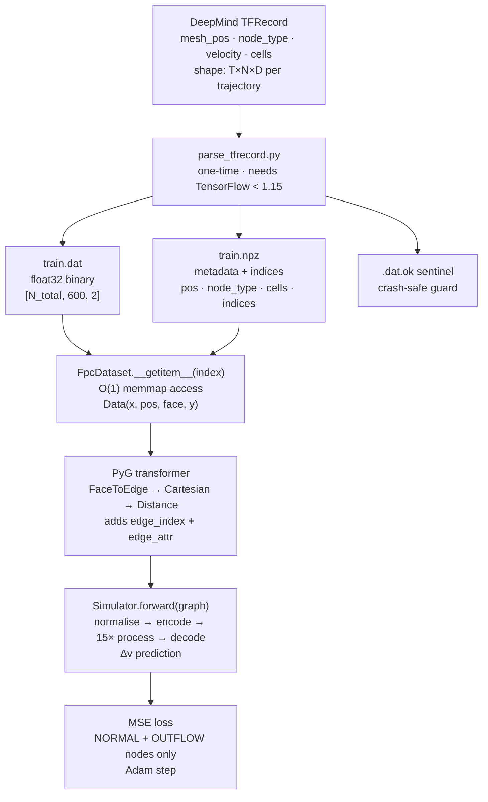
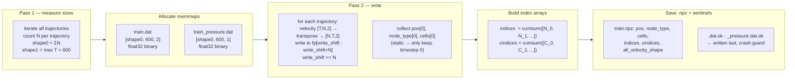
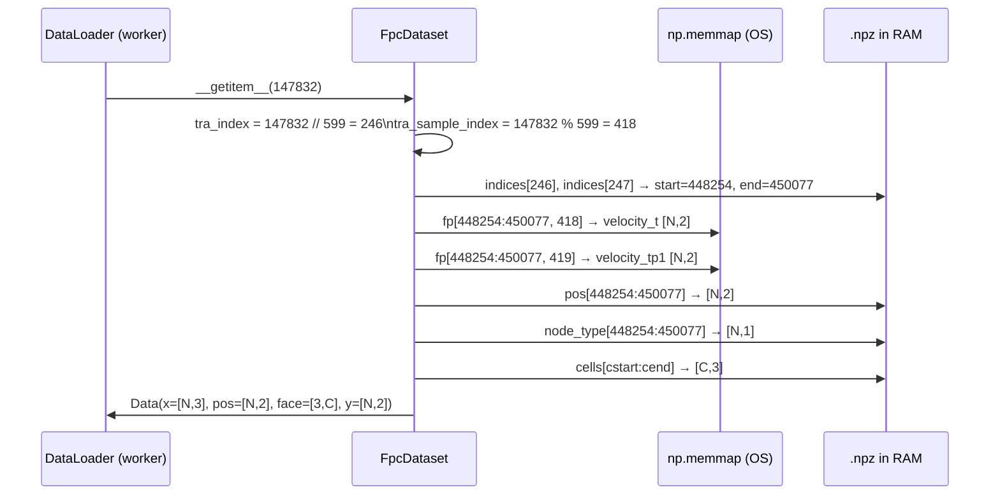
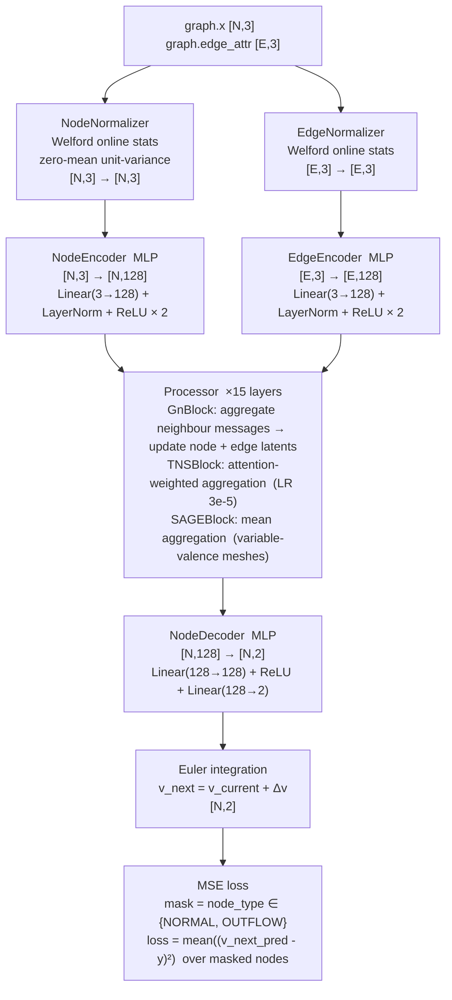
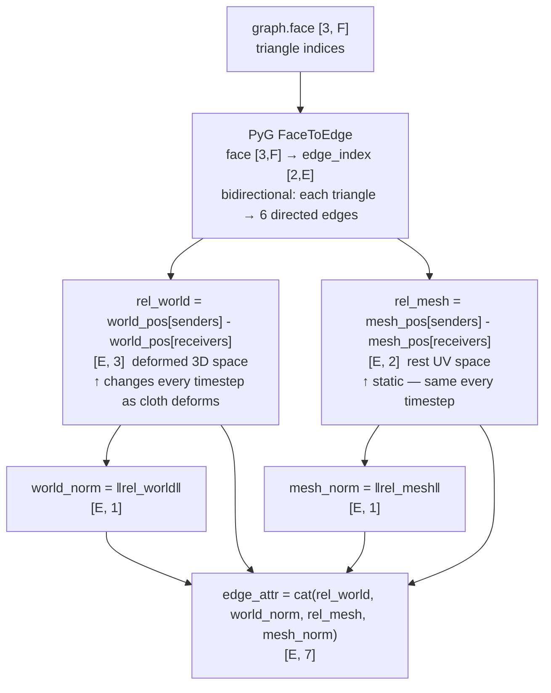
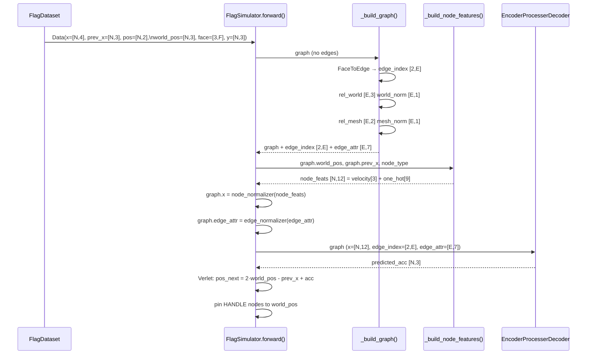
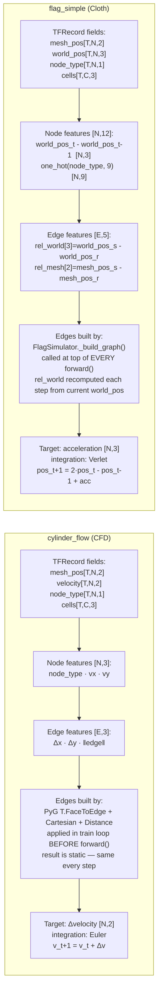

# TFRecord → Graph → GNN Training Pipeline

Complete walkthrough of how raw DeepMind simulation data becomes a trained GNN — every transformation, every file, every tensor shape.

---

## Overview



---

## Stage 1 — What's Inside the TFRecord

DeepMind's dataset is a `.tfrecord` file per split (`train`, `valid`, `test`). Each **record = one trajectory** — a complete simulation run from t=0 to t=599.

Fields are described by `meta.json` alongside the TFRecord:

```
cylinder_flow — one trajectory record:
  mesh_pos    [T, N, 2]   2D x/y coordinates of each mesh node
  node_type   [T, N, 1]   integer label per node (see NodeType enum)
  velocity    [T, N, 2]   vx, vy at each node at each timestep
  pressure    [T, N, 1]   scalar pressure at each node
  cells       [T, C, 3]   triangle connectivity (3 node indices per triangle)

T = 600   N ≈ 1823 (varies per trajectory)   C ≈ 3400 triangles
```

### Node types

| Integer | Name | Meaning |
|---|---|---|
| 0 | NORMAL | Interior fluid node — GNN predicts here |
| 4 | INFLOW | Left boundary — velocity is prescribed |
| 5 | OUTFLOW | Right boundary — free outflow |
| 6 | WALL_BOUNDARY | Top/bottom walls — no-slip |
| other | HANDLE (cloth) | Pinned corner of flag |

### Why mesh_pos and cells are static

For CFD, the mesh does **not deform** — the cylinder is fixed, the fluid flows around it. So `mesh_pos[0] == mesh_pos[1] == ... == mesh_pos[599]`. The parser only saves `mesh_pos[0]`.

Cloth is different: `world_pos` changes every step as the flag deforms. But `mesh_pos` (the rest-pose UV coordinates) is still static — it's used as the reference configuration.

### Why TF < 1.15 is needed

DeepMind's TFRecord uses the TF 1.x VarLen feature format. TF 2.x changed the API incompatibly. The parser is isolated to a one-time preprocessing step so the rest of the codebase has zero TensorFlow dependency.

---

## Stage 2 — parse_tfrecord.py: Flatten to Disk



### The transpose

The TFRecord stores velocity as `[T, N, 2]` — time-first. The memmap stores it as `[N, T, 2]` — node-first. This is the critical layout choice that enables O(1) access: to get all nodes at one timestep, you slice `fp[tra_start:tra_end, t]` which is a contiguous read in the node dimension.

### The index arrays

```python
# Per-trajectory node counts: [1823, 1828, 1819, ...]
# cumsum gives boundaries:
indices = [0, 1823, 3651, 5470, ...]

# Trajectory i occupies nodes indices[i] : indices[i+1]
# Trajectory i occupies cells  cindices[i]: cindices[i+1]
```

These are the "CSR-style" pointers into the flat .dat and .npz arrays.

---

## Stage 3 — FpcDataset: O(1) Random Access

The DataLoader calls `__getitem__(index)` millions of times during training. This must be fast.



### What graph.x contains at this stage

```python
x = concat([node_type, velocity_t], axis=-1)   # [N, 3]
#           └─ [N,1] int ─┘  └─ [N,2] ─┘
#   col 0: node type integer (0,4,5,6,...)
#   col 1: vx at timestep t
#   col 2: vy at timestep t

y = velocity_tp1   # [N, 2] — supervision target, velocity at t+1
```

No edges exist yet. `graph.face = [3, C]` — raw triangle indices.

---

## Stage 4 — PyG Transformer: Triangles → Edges

Applied in the training loop for CFD. **Not applied for cloth** — `FlagSimulator.forward()` builds edges internally because cloth edges change meaning at every step (`rel_world` deforms).

```python
transformer = T.Compose([
    T.FaceToEdge(),          # step 1
    T.Cartesian(norm=False), # step 2
    T.Distance(norm=False),  # step 3
])
```

### Step 1: FaceToEdge

Each triangle `[i, j, k]` becomes 6 directed edges: `i→j, j→i, j→k, k→j, i→k, k→i`.

```
Triangle [42, 107, 391]
→ edge_index cols: [42,107], [107,42], [107,391], [391,107], [42,391], [391,42]
```

Result: `graph.edge_index = [2, E]` where E ≈ 6×C (some edges shared between triangles).

### Step 2: Cartesian

For each edge `(sender, receiver)`:
```python
edge_attr = pos[sender] - pos[receiver]   # [Δx, Δy]
```

Result: `graph.edge_attr = [E, 2]`

### Step 3: Distance

Appends the Euclidean norm:
```python
edge_attr = [Δx, Δy, sqrt(Δx² + Δy²)]
```

Result: `graph.edge_attr = [E, 3]`

### Final graph after transformer

```
graph.x          [N, 3]    node features: [node_type | vx | vy]
graph.pos        [N, 2]    mesh node coordinates (x, y)
graph.edge_index [2, E]    directed edge pairs
graph.edge_attr  [E, 3]    edge features: [Δx, Δy, ‖edge‖]
graph.face       [3, C]    original triangles (kept, not used by GNN)
graph.y          [N, 2]    target velocity at t+1
```

---

## Stage 5 — Simulator.forward: GNN Pass



### Normalizer — Welford online algorithm

The normalizer accumulates running mean and variance across all training batches using Welford's algorithm (numerically stable, single pass). Stats are **baked into the checkpoint** — at inference, the same normalizer is applied with frozen stats so the model sees the same scale it was trained on.

```python
# During training: update stats + normalise
x_norm = node_normalizer(x, is_training=True)

# During inference: normalise with frozen stats only
x_norm = node_normalizer(x, is_training=False)
```

### Noise injection (train-test gap fix)

Before building node features, Gaussian noise is added to the velocity component:

```python
noise = torch.randn_like(velocity) * noise_std   # noise_std ≈ 0.003 × feature_std
noisy_velocity = velocity + noise

# Target is corrected by (1 - noise_gamma) * noise to account for the shift
target_corrected = target + (1 - noise_gamma) * noise
```

Without this, the model only ever sees ground-truth velocities during training. During rollout, it sees its own (slightly wrong) predictions. The noise makes training mimic the rollout distribution, dramatically reducing error accumulation over 600 steps.

### Loss mask — why not all nodes?

INFLOW and WALL_BOUNDARY nodes have prescribed velocities — they don't evolve freely. Including them in the loss would make the model waste capacity learning to predict boundary conditions that are always the same. Only NORMAL (interior fluid) and OUTFLOW nodes matter for the actual physics.

---

## Cloth Graph Construction — `FlagSimulator._build_graph()`

For cloth, **no separate transform is applied before training**. The dataset returns a face-based graph with no edges. The entire graph — edges and edge features — is built from scratch inside `forward()` on every single call.

### What FlagDataset returns (no edges yet)

```
graph.x         [N, 4]   world_pos_t[3] + node_type[1]    ← storage only, not final GNN input
graph.prev_x    [N, 3]   world_pos_{t-1}
graph.pos       [N, 2]   mesh_pos  (2D rest UV, static)
graph.world_pos [N, 3]   world_pos_t  (3D deformed position)
graph.face      [3, F]   triangle connectivity
graph.y         [N, 3]   world_pos_{t+1}  (regression target)

edge_index  — MISSING
edge_attr   — MISSING
```

### `_build_graph()` — called at the top of every `forward()`



### Then `_build_node_features()` replaces `graph.x`

The `graph.x` coming from the dataset (`world_pos_t + node_type`, [N,4]) is just a carrier — it's not the actual GNN input. Inside `forward()`, it gets discarded and replaced:

```
# Extract node_type from graph.x col 3 BEFORE it gets overwritten
node_type_col = graph.x[:, 3:4].squeeze(-1).long()   # [N]

velocity  = world_pos - prev_x                        # [N, 3]  position diff each step
one_hot   = F.one_hot(node_type_col, num_classes=9)   # [N, 9]
node_feats = cat([velocity, one_hot])                 # [N, 12]

graph.x = node_normalizer(node_feats)                 # overwrite: [N, 4] → [N, 12]
```

### Full cloth `forward()` sequence



### Why edges must be rebuilt every step

`rel_world` depends on `world_pos` — the 3D position of every cloth node at the current timestep. As the flag flaps, every node moves, so every edge vector changes. If you pre-computed edge features once (like CFD does), you'd have the wrong geometry for steps 1–599.

`rel_mesh` is actually static (rest-pose UV never changes), but it's computed here anyway — it costs one subtraction and keeps the code in one place.

---

## CFD vs Cloth — Side-by-Side



### Key differences explained

**Why Verlet for cloth?**
Verlet integration (`pos_t+1 = 2·pos_t - pos_t-1 + acc`) gives better energy conservation for elastic systems. It implicitly encodes momentum — knowing both current and previous position is equivalent to knowing position and velocity. Euler integration would cause cloth to gain or lose energy artifically over 600 steps.

**Why two edge spaces for cloth?**
`rel_mesh` = rest-pose UV distance — the material's reference length (like a spring's natural length).
`rel_world` = current deformed distance — how stretched or compressed the edge is right now.
The GNN implicitly computes strain from these two: `strain ≈ ‖rel_world‖ / ‖rel_mesh‖`. The GNN learns restoring forces from strain without being explicitly told about springs.

**Why 12 node features for cloth vs 3 for CFD?**
The velocity-as-position-diff is 3D (x,y,z) instead of 2D. Node type is one-hot encoded into 9 classes (vs raw integer for CFD) because the cloth model needs to sharply distinguish pinned corner nodes (HANDLE) from free nodes — a one-hot encoding makes this boundary condition unambiguous to the network.

---

## Tensor Shape Summary

| Stage | Tensor | Shape | Source |
|---|---|---|---|
| TFRecord | velocity | [T, N, 2] | DeepMind dataset |
| .dat (on disk) | velocity | [N_total, T, 2] | transposed, all trajectories packed |
| __getitem__ | x | [N, 3] | node_type + velocity_t |
| __getitem__ | y | [N, 2] | velocity_t+1 |
| __getitem__ | pos | [N, 2] | mesh node positions |
| __getitem__ | face | [3, C] | triangle indices |
| after transformer | edge_index | [2, E] | FaceToEdge |
| after transformer | edge_attr | [E, 3] | Δx, Δy, distance |
| after encoder | node_latent | [N, 128] | NodeEncoder MLP |
| after encoder | edge_latent | [E, 128] | EdgeEncoder MLP |
| after processor | node_latent | [N, 128] | 15× message passing |
| after decoder | Δv | [N, 2] | NodeDecoder MLP |
| after Euler | v_next | [N, 2] | v_t + Δv |

Typical values: N ≈ 1823, E ≈ 10,800 (≈ 6 × C), C ≈ 1800 triangles per trajectory.
