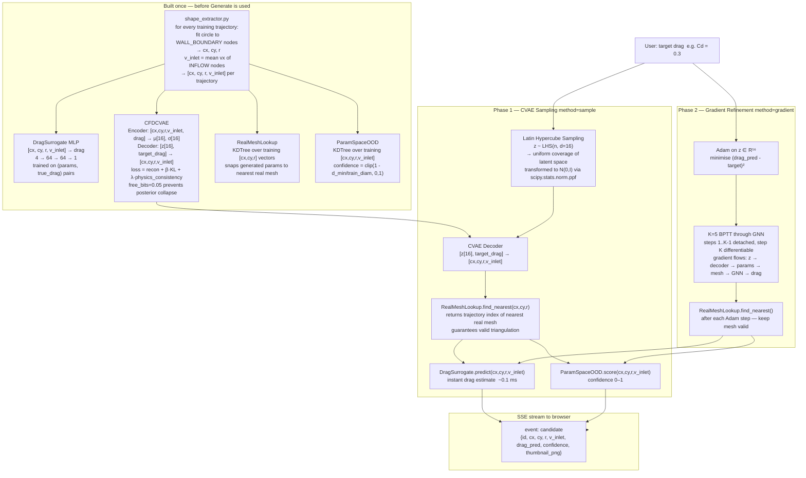
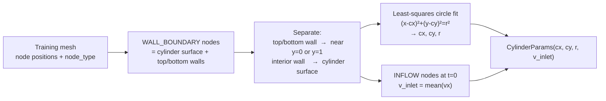
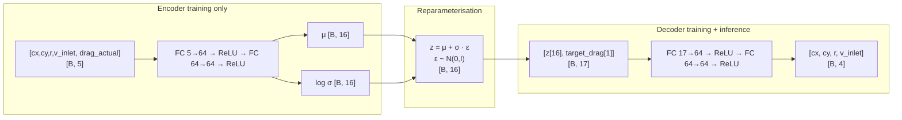
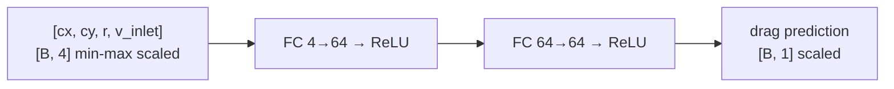
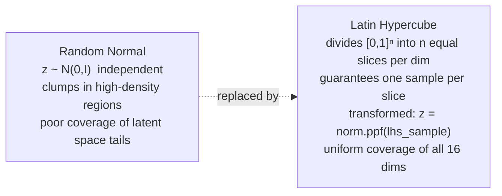
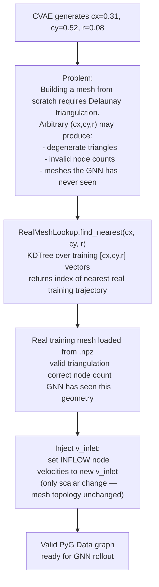
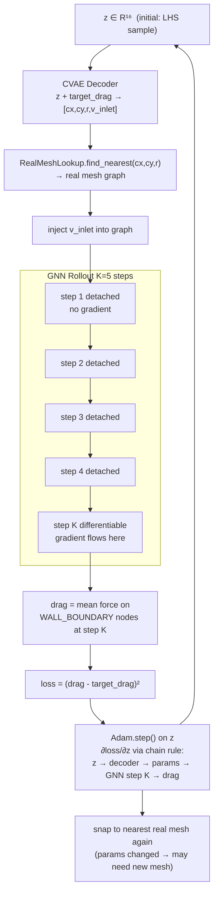
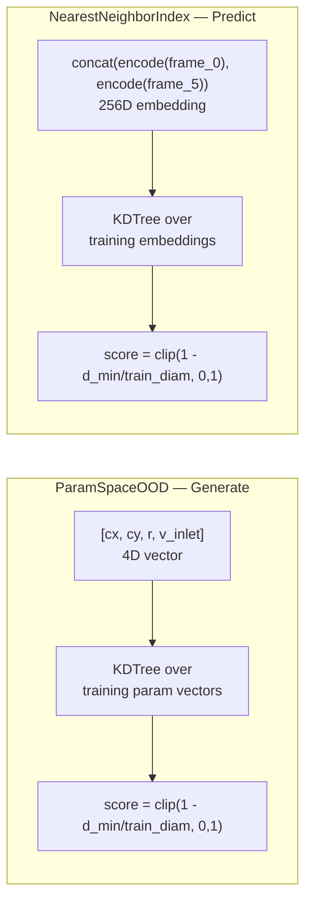

# Inverse Design Pipeline

How PhysIQ finds cylinder geometries that produce a target drag — from user input to candidate mesh.

---

## Overview



---

## Design Parameters — What They Are

Every CFD inverse design candidate is described by 4 scalars:

```
[cx, cy, r, v_inlet]

cx      — cylinder centre x-position (normalised [0,1] of domain width)
cy      — cylinder centre y-position (normalised [0,1] of domain height)
r       — cylinder radius (normalised units)
v_inlet — inlet flow velocity magnitude (m/s)
```

These are **reverse-engineered from the training mesh**, not stored in the TFRecord:



---

## CVAE Architecture



### Training loss

```
L = α · ‖params_recon - params_gt‖²          reconstruction
  + β · KL(q(z|params,drag) ‖ N(0,I))        regularisation  (free_bits=0.05)
  + λ · |drag_surrogate(params_recon) - drag_target|   physics consistency
```

**free_bits = 0.05**: KL per latent dimension is clamped to at least 0.05. Prevents the encoder from collapsing unused latent dimensions to the prior (posterior collapse), ensuring all 16 dimensions carry information.

**Physics consistency term**: the decoder is forced, during training, to produce parameters whose drag (as estimated by the surrogate) matches the target. This makes the decoder learn the physics mapping — not just reconstruction.

---

## Drag Surrogate



Trained on `(params, true_drag)` pairs extracted from training trajectories. `true_drag` is computed from the last 10% of timesteps of each GNN rollout (steady-state average).

Used for:
1. **CVAE physics consistency loss** during CVAE training
2. **Instant candidate scoring** at generate time — avoids running a full 600-step GNN rollout per candidate

---

## Latin Hypercube Sampling



With n=10–20 candidates and a 16-dimensional latent space, random Normal sampling tends to cluster near the origin. LHS partitions each dimension into n equal-probability intervals and places exactly one sample per interval — much better coverage of the latent space with the same budget.

---

## RealMeshLookup — Why Generated Params Must Be Snapped



This is the key design choice that makes gradient refinement possible: instead of differentiating through mesh construction (impossible — Delaunay is not differentiable), we snap to a real mesh and only differentiate through the GNN rollout.

---

## Gradient Refinement — BPTT K=5



**Why K-1 detached steps?** Running all K steps differentiably would require storing intermediate activations for all K steps — high memory. Only the last step is differentiable, which is enough: the gradient signal tells the optimiser which direction to move `z` to reduce drag at the final step.

**Why K=5 and not K=1?** One step isn't enough physics — the flow hasn't developed. Five steps gives enough temporal context for the drag signal to be meaningful without excessive memory.

---

## Confidence Scoring — Two Different OOD Checks

The system has two distinct OOD mechanisms that answer different questions:

| | ParamSpaceOOD (Generate page) | NearestNeighborIndex (Predict page) |
|---|---|---|
| Space | 4D parameter space [cx,cy,r,v_inlet] | 256D embedding space |
| Question | "Is this cylinder geometry unusual?" | "Is this simulation unusual?" |
| KDTree input | training param vectors | training GNN embeddings |
| Used for | candidate confidence in Generate | rollout confidence in Predict |



---

## Full Tensor Shape Summary

| Step | Tensor | Shape | Notes |
|---|---|---|---|
| CVAE encoder input | [params, drag] | [B, 5] | 4 design params + 1 drag |
| CVAE latent | μ, log σ | [B, 16] | 16-dim latent space |
| LHS samples | z | [n, 16] | n = n_candidates |
| CVAE decoder input | [z, target_drag] | [n, 17] | |
| CVAE decoder output | params | [n, 4] | cx, cy, r, v_inlet |
| DragSurrogate input | params (scaled) | [n, 4] | min-max normalised |
| DragSurrogate output | drag | [n, 1] | |
| ParamSpaceOOD query | params | [1, 4] | per candidate |
| GNN rollout output | velocity field | [N, 2] per step | used to compute drag |
