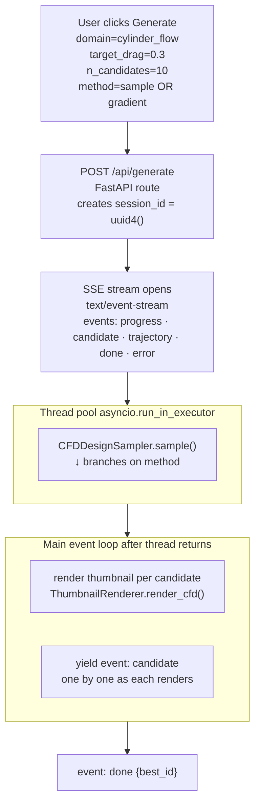
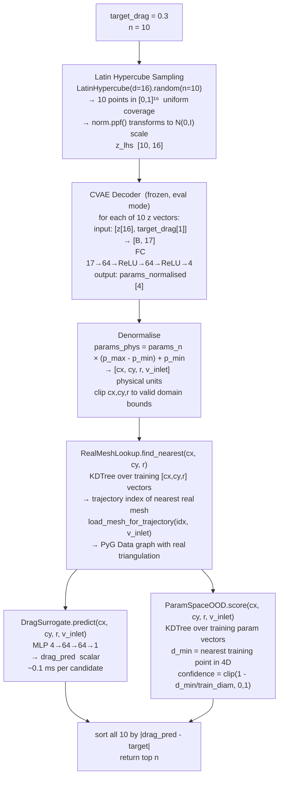
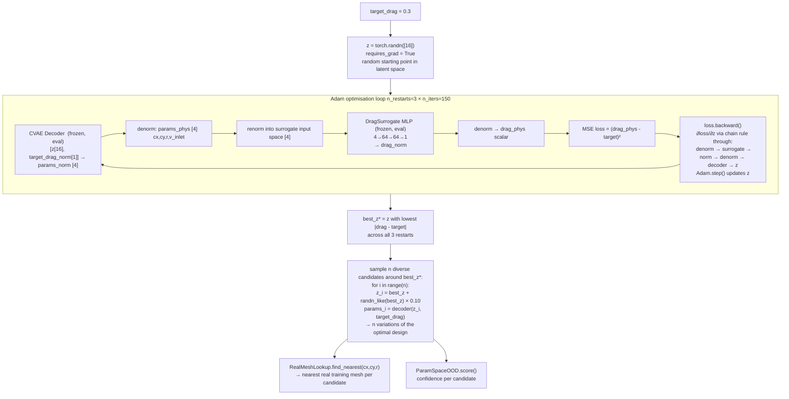
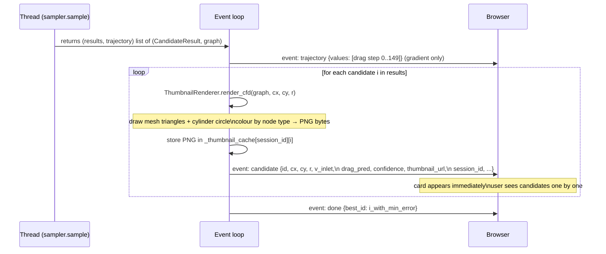
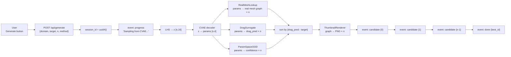
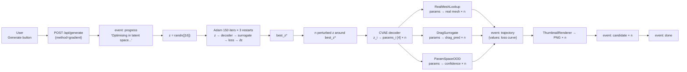

# Generate — Full Flow from Button Press to Candidates

Everything that happens from the moment the user clicks **Generate** to the moment candidates appear in the browser. Both `sample` and `gradient` methods covered in full.

---

## Top-Level Overview



---

## Path A — `method="sample"` (CVAE + LHS)



### What each z[16] is

`z` is the CVAE latent code — a 16-dimensional vector in a learned continuous space where similar cylinder designs are nearby. It has no human-interpretable dimensions; the CVAE encoder mapped thousands of `(cx,cy,r,v_inlet)` training examples into this space during training.

Sampling `z ~ N(0,I)` via LHS gives us 10 points that are spread evenly across the latent space rather than clumped near the origin (which random Normal would produce). Each z, when decoded with a target drag condition, produces a different cylinder geometry that the CVAE believes could achieve that drag.

---

## Path B — `method="gradient"` (Adam in latent space)



### Why gradient does NOT flow through the GNN

The GNN path is implemented but disabled (`_use_gnn = False`). The reason:

```
z → decoder → (cx, cy, r, v_inlet)
                       │
                       ▼
       RealMeshLookup.find_nearest(cx, cy, r)
       = KDTree argmin  →  integer index
       ← DISCRETE: ∂index/∂(cx,cy,r) = 0
```

Only `v_inlet` would survive as a differentiable signal through the GNN. With 3 of 4 parameters having zero gradient, plus unit-scale mismatches between GNN drag proxy and target drag, the optimiser can barely steer `z`. The surrogate is fully differentiable through all 4 parameters and well-scaled — it's strictly better for optimisation.

### Gradient chain (surrogate path, what actually runs)

```
z [16]  requires_grad=True
  ↓  CVAE decoder  (FC layers, ∂/∂z ✓)
params_norm [4]
  ↓  affine denorm  (∂/∂params_norm ✓)
params_phys [4]  (cx, cy, r, v_inlet)
  ↓  affine renorm into surrogate space  (∂/∂params_phys ✓)
params_surr [4]
  ↓  DragSurrogate MLP  FC 4→64→64→1  (∂/∂params_surr ✓)
drag_norm [1]
  ↓  affine denorm  (∂/∂drag_norm ✓)
drag_phys [1]
  ↓  MSE  = (drag_phys - target)²
loss
  ↓  .backward()
∂loss/∂z  →  Adam updates z
```

Every step is matrix multiplications and affine transforms — PyTorch autograd traces through automatically. 150 iterations × 3 restarts = 450 total gradient steps.

### After optimisation — n diverse candidates

Gradient mode finds **one** optimal `z*`. To give the user n candidates, small noise is added:

```python
z_i = best_z + torch.randn_like(best_z) * 0.10
```

`noise_scale=0.10` with `latent_dim=16` gives `E[‖noise‖] = 0.10 × √16 = 0.40` — a modest perturbation that keeps candidates near the optimum while varying the geometry. These are n variations of the same intent, not n independent designs (unlike sample mode).

---

## Path A vs Path B — When to use which

| | `method="sample"` | `method="gradient"` |
|---|---|---|
| How z is found | LHS covers latent space broadly | Adam searches for best z |
| n candidates | n independent designs, diverse geometries | n variations around one optimal design |
| Drag accuracy | Depends on where the decoder points | Explicitly minimised — closer to target |
| Speed | Fast (n decoder calls) | Slower (450 gradient steps) |
| Best for | "Show me diverse options near target drag" | "Find the design closest to exactly Cd=0.3" |

---

## After sampling — rendering and streaming (both paths)



### SSE event types

| Event | Payload | When |
|---|---|---|
| `progress` | `{phase, step, done, total}` | Before sampling starts, during rendering |
| `trajectory` | `{values: [float]}` | Gradient mode only — loss curve |
| `candidate` | Full CandidateResult + thumbnail_url + session_id | Once per candidate as it renders |
| `done` | `{best_id}` | After all candidates streamed |
| `warning` | `{detail}` | e.g. CVAE not trained yet |
| `error` | `{detail}` | Exception during sampling |

### Thumbnail URL

`thumbnail_url = /api/generate/thumbnail/{session_id}/{candidate_id}`

The PNG is stored in an in-process dict `_thumbnail_cache[(session_id, id)]`. The browser fetches it separately after receiving the candidate event. Session is kept for 5 minutes then evicted.

---

## Full end-to-end — sample mode



## Full end-to-end — gradient mode


