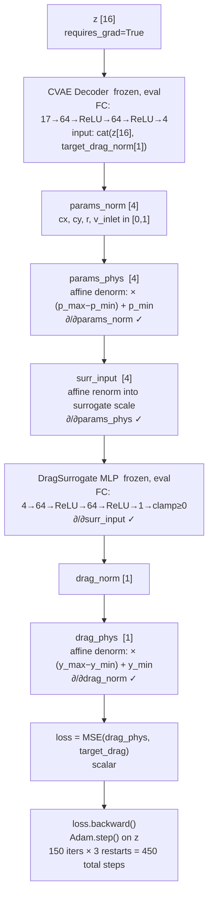
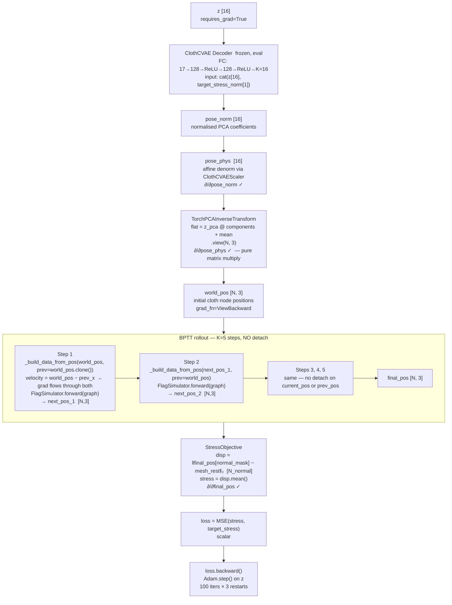

# Inverse Design — Differentiable Path (CFD vs Cloth)

Both domains optimise a single latent vector `z ∈ R¹⁶` via Adam. The gradient path from loss back to `z` is completely different because CFD uses a surrogate MLP while cloth uses full BPTT through the GNN.

---

## The Shared Setup (Both Domains)

```
z = torch.randn([16], requires_grad=True)   ← only leaf variable

All other networks are frozen (eval mode, no weight updates):
  - CVAE decoder
  - DragSurrogate / FlagSimulator
  - Normalizers

Only z moves. Gradients flow THROUGH frozen networks to reach z.
```

Adam optimiser: `lr=0.05`, 3 restarts.

---

## CFD — Surrogate MLP Path

### Why not the GNN?

`_use_gnn = False` is hardcoded in `CFDDesignSampler._gradient_sample()`.

The GNN path is **implemented** but **always disabled** for two reasons:

```
z → decoder → (cx, cy, r, v_inlet)
                      │
                      ▼
    RealMeshLookup.find_nearest(cx, cy, r)
    = KDTree argmin → integer index
    ← DISCRETE: ∂index/∂(cx,cy,r) = 0
```

Only `v_inlet` would survive as gradient through the GNN. With cx/cy/r having zero gradient, the optimiser can barely steer `z`. The surrogate MLP is fully differentiable through all 4 parameters with well-matched units — strictly better for optimisation.

### Full Chain (CFD)



### Tensor shapes at each step

| Step | Tensor | Shape |
|---|---|---|
| Leaf | `z` | `[16]` |
| Decoder input | `cat(z, target_norm)` | `[17]` |
| Decoder output | `params_norm` | `[4]` |
| Denorm | `params_phys` | `[4]` |
| Renorm | `surr_input` | `[1, 4]` |
| Surrogate output | `drag_norm` | `[1]` |
| Denorm | `drag_phys` | `[1]` |
| Loss | scalar | `[]` |

Every operation is a matrix multiply or affine transform — PyTorch autograd traces through all of them automatically. The gradient `∂loss/∂z` flows back through the surrogate MLP weights (which are fixed scalars at this point) then through the decoder weights (also fixed) to reach `z`.

---

## Cloth — BPTT Through GNN

### Why the GNN (not a surrogate)?

Cloth has a **continuous** latent→position mapping via PCA inverse transform:

```
z → decoder → PCA coefficients → PCA⁻¹ (matrix multiply) → world_pos [N, 3]
```

PCA inverse transform is an exact differentiable matrix multiply — no discrete lookup. All 4 parameters are differentiable all the way to `z`. The GNN rollout is the only model that can compute physically meaningful stress (displacement from rest), so BPTT through it is both possible and necessary.

`StressSurrogate` MLP exists but is only used during **CVAE training** as the physics consistency loss term — it is **not used** during inverse design optimisation.

### Full Chain (Cloth)



### Why prev_x must NOT be detached

Inside `_build_data_from_pos`, the velocity feature is:

```python
delta_pos = world_pos - prev_x   # [N, 3]
```

If `prev_x` were detached, the gradient would be cut at that edge feature, losing half the velocity signal's contribution. The code explicitly preserves the grad_fn:

```python
if prev_x is None:
    prev_x = world_pos.clone()   # clone() keeps grad_fn — NOT detach()
```

### Tensor shapes through the cloth chain

| Step | Tensor | Shape |
|---|---|---|
| Leaf | `z` | `[16]` |
| Decoder input | `cat(z, target_norm)` | `[17]` |
| Decoder output | `pose_norm` | `[16]` |
| Denorm | `pose_phys` | `[16]` |
| PCA inverse | `world_pos` | `[N, 3]` |
| After each GNN step | `next_pos` | `[N, 3]` |
| Displacement | `disp` | `[N_normal]` |
| Stress | scalar | `[]` |
| Loss | scalar | `[]` |

---

## Side-by-Side Comparison

| | CFD (`cylinder_flow`) | Cloth (`flag_simple`) |
|---|---|---|
| **Leaf variable** | `z [16]` | `z [16]` |
| **Physics model in loop** | `DragSurrogate` MLP (4→64→64→1) | `FlagSimulator` GNN × 5 rollout steps |
| **GNN used?** | ❌ `_use_gnn = False` | ✅ Always — full BPTT |
| **Why no GNN for CFD** | Discrete KDTree mesh lookup → ∂/∂(cx,cy,r)=0 | N/A — PCA inverse is continuous |
| **Surrogate role** | Replaces GNN during optimisation | CVAE training only — not used here |
| **Loss** | `MSE(surrogate_drag, target_drag)` | `MSE(mean_‖pos−rest‖, target_stress)` |
| **Gradient path length** | z → 2-layer decoder → 3-layer MLP → loss | z → 2-layer decoder → PCA⁻¹ → 5×(15-layer GNN) → stress → loss |
| **All params differentiable?** | ✅ All 4: cx,cy,r,v_inlet | ✅ Full N×3 position field |
| **Iterations** | 150 × 3 restarts = 450 steps | 100 × 3 restarts = 300 steps (80 × 2 from API) |

---

## What the gradient actually updates

In both cases, `loss.backward()` computes `∂loss/∂z`. The frozen network weights receive `∂loss/∂weights` but are **never stepped** — only `z` moves.

```
Frozen (computed but not updated):
  ∂loss/∂decoder_weights    ← passes through but Adam ignores
  ∂loss/∂surrogate_weights  ← CFD only
  ∂loss/∂GNN_weights        ← cloth only

Updated:
  ∂loss/∂z  →  Adam.step()  →  z_{t+1} = z_t - lr · m̂/√v̂
```

This is the same mechanism as feature inversion / style transfer in image models — you backprop through a frozen network to optimise an input, not the weights.
