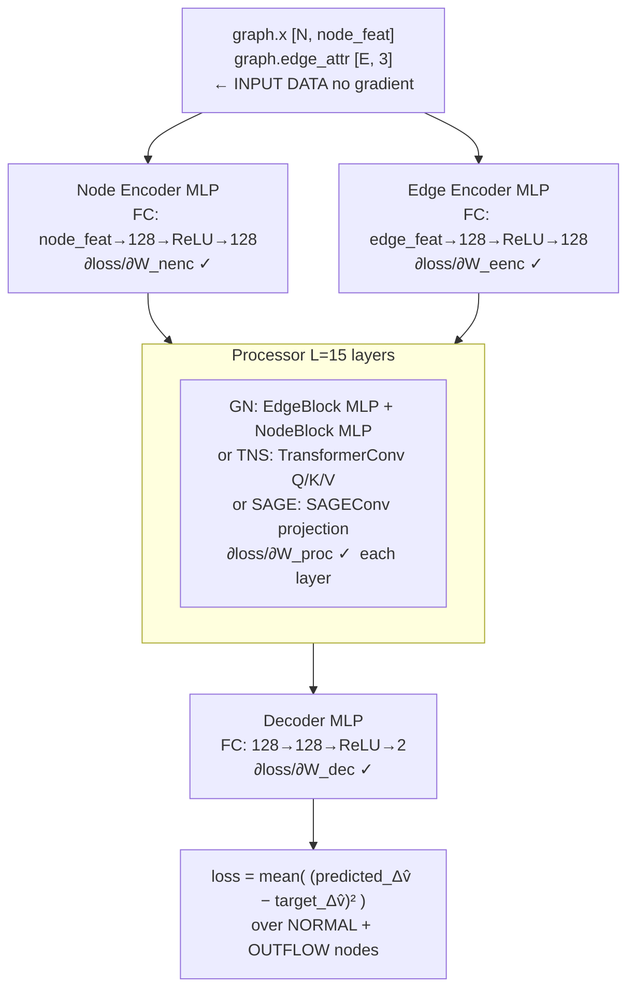
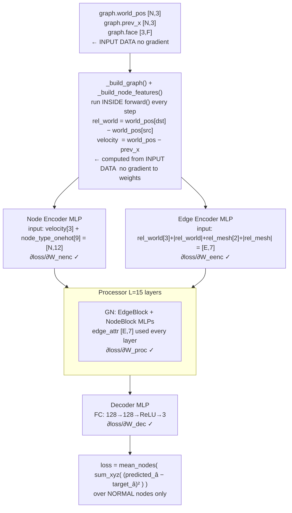

# Training — Backprop Through the GNN (CFD vs Cloth)

How the GNN learns: what the loss is, what the target is, and exactly how gradients flow from loss back to every learnable weight.

---

## The Shared Structure (Both Domains)

```
for each mini-batch:
    graph = dataloader[i]          ← input graph (positions, velocities, node types)
    predicted = simulator(graph)   ← GNN forward pass
    loss = MSE(predicted, target)  ← compare to ground truth
    loss.backward()                ← compute ∂loss/∂weights
    optimizer.step()               ← update all GNN weights
```

**What moves:** all learnable `nn.Linear` weights inside the encoder MLPs, processor block MLPs (or TransformerConv Q/K/V, or SAGEConv projections), and decoder MLP.

**What does NOT move:** input node positions, node types, edge geometry — these are data, not parameters.

---

## CFD — Velocity Prediction

### What the GNN predicts

```
predicted_norm = EncoderProcessorDecoder(graph)   [N, 2]
```

Normalized velocity change `Δv̂` — the predicted acceleration in z-scored space.

### What the target is

```python
target_change      = graph.y - noised_current          # v_{t+1} − (v_t + ε)   [N, 2]
target_change_norm = output_normalizer(target_change)  # z-score                [N, 2]
```

- `graph.y` = ground-truth next velocity from the dataset
- `noised_current` = current velocity + injected Gaussian noise (σ=0.02)
- The target is corrected for the noise so the model learns the true physics, not to undo noise

### Loss

```python
errors = (predicted_norm - target_norm) ** 2           # element-wise squared error  [N, 2]
errors = errors[node_type ∈ {NORMAL, OUTFLOW}]         # mask — exclude boundary/obstacle nodes
loss   = errors.mean()                                 # scalar MSE
```

OBSTACLE and WALL_BOUNDARY nodes are excluded — their velocities are constrained by boundary conditions, not physics, so supervising on them would mislead the model.

### Full backprop chain (CFD)



### Noise injection — why it's needed

```
Without noise:
  At training time: model sees clean v_t → predicts Δv perfectly
  At rollout time:  model sees v_t + accumulated_error → prediction drifts badly

With noise (σ=0.02):
  Model trained with: noised_v_t = v_t + ε
  Model learns:       Δv = f(noised_v_t)  ≈ f(v_t + small_error)
  At rollout:         model is robust to the small errors it accumulates
```

The noise is sampled fresh each step: `ε ~ N(0, σ²·I)`. It does NOT carry gradient — it's a regularization device, not part of the differentiable path.

### Normalizer — differentiable but frozen stats

```python
# normalization.py
def forward(self, x, accumulate=True):
    if accumulate:
        self._accumulate(x.detach())   ← stats computed on DETACHED x
    return (x - self._mean) / self._std
```

- Stats (`_mean`, `_std`) are accumulated as non-differentiable buffers via `.detach()`
- The normalization `(x − mean) / std` is an affine transform with **constant** mean/std
- Gradient flows through `x` cleanly: `∂(x−mean)/std / ∂x = 1/std`
- After enough batches, stats converge and `accumulate=False` is used at inference

---

## Cloth — Acceleration Prediction (Verlet)

### What the GNN predicts

```
predicted_norm = EncoderProcessorDecoder(graph)   [N, 3]
```

Normalized 3D acceleration `â` — the predicted second derivative of position in z-scored space.

### What the target is

```python
# Verlet second difference — discrete acceleration
target_acc      = pos_{t+1} − 2·pos_t + pos_{t−1}          # [N, 3]

# Noise correction (prevents learning to undo noise)
target_world    = graph.y + (1 − noise_gamma) · noise       # noise_gamma=0.1
target_acc_corr = target_world − 2·world_pos + prev_world   # [N, 3]
target_acc_norm = output_normalizer(target_acc_corr)        # z-score  [N, 3]
```

Why Verlet instead of direct velocity?

```
Direct velocity: v_{t+1} = pos_{t+1} − pos_t
  → First-order, noisy, sensitive to frame rate

Verlet acceleration: a_t = pos_{t+1} − 2·pos_t + pos_{t−1}
  → Second-order, physically meaningful
  → Same quantity Newton's law predicts: F = ma
  → Much smoother signal for the GNN to learn
```

### Loss

```python
errors = (predicted_norm - target_norm) ** 2       # [N, 3]
errors = errors[node_type == NORMAL]               # mask — exclude HANDLE nodes
loss   = errors.sum(dim=-1).mean()                 # sum over xyz, mean over nodes
```

**Why sum over xyz, not mean?**
Mean treats each axis independently — a 1mm error in x counts the same as a 1mm error summed over xyz. Sum treats the 3D acceleration as a single vector, so the loss reflects the true 3D magnitude of the prediction error.

HANDLE nodes (pinned cloth corners) are excluded — their positions are kinematically constrained, not physics-driven.

### Full backprop chain (Cloth)



### Why edges are rebuilt every step

CFD uses a static mesh — edges are built once before training and reused. Cloth is different:

```
CFD edge features: rel_pos = pos[dst] − pos[src]
  → mesh never deforms → computed once, stored in graph.edge_attr

Cloth edge features: rel_world = world_pos[dst] − world_pos[src]
  → cloth deforms every step → world_pos changes → rel_world changes
  → must recompute edge_attr at every forward() call
```

This means cloth's `_build_graph()` runs inside `forward()` on every training step, unlike CFD where it runs once in the DataLoader's collate step.

---

## Side-by-Side Comparison

| | CFD (`cylinder_flow`) | Cloth (`flag_simple`) |
|---|---|---|
| **GNN output** | `Δv̂` [N, 2] velocity change | `â` [N, 3] acceleration |
| **Target formula** | `normalize(v_{t+1} − (v_t + noise))` | `normalize(pos_{t+1} − 2·pos_t + pos_{t−1})` |
| **Target source** | `graph.y` = next velocity | `graph.y` = next world position |
| **Loss aggregation** | mean over nodes, mean over xy | sum over xyz, mean over nodes |
| **Masked nodes** | OBSTACLE + WALL_BOUNDARY excluded | HANDLE (pinned corners) excluded |
| **Noise injection** | On velocity (σ=0.02) | On position (gamma=0.1 correction on target) |
| **Edge features** | Static — built once, [E, 3]: Δx, Δy, dist | Dynamic — rebuilt every step, [E, 7]: rel_world + rel_mesh |
| **Node features** | [N, 5–7]: vx, vy, node_type, ... | [N, 12]: velocity[3] + node_type_onehot[9] |
| **Processor default** | GN (15 layers, edge+node MLPs) | GN (15 layers, edge+node MLPs) |
| **Optimizer** | Adam lr=1e-4 | Adam lr=1e-4, exponential decay |

---

## What Gets Updated vs What Doesn't

```
UPDATED by optimizer.step():
  Node encoder MLP weights
  Edge encoder MLP weights
  Processor block weights (L=15 layers):
    GN:   EdgeBlock MLP weights + NodeBlock MLP weights
    TNS:  TransformerConv W_Q, W_K, W_V, W_root per layer
    SAGE: SAGEConv lin_l, lin_r per layer
  Decoder MLP weights
  LayerNorm γ, β parameters (all variants)

NOT updated (constants / input data):
  Node positions (graph.x, graph.world_pos)
  Edge geometry (graph.edge_attr)
  Node types (graph.node_type)
  Normalizer running mean/std (accumulated via .detach())
  Noise tensor ε (sampled, no requires_grad)
  Ground truth graph.y
```

---

## Relation to Inverse Design Backprop

Training and inverse design use the same GNN but for opposite purposes:

| | Training | Inverse Design |
|---|---|---|
| **Goal** | Learn physics | Find input that produces desired output |
| **What moves** | GNN weights | Latent vector `z` |
| **What's frozen** | Nothing | GNN / surrogate + CVAE decoder |
| **Loss** | MSE(predicted, ground_truth_physics) | MSE(predicted_quantity, user_target) |
| **Gradient flows to** | All Linear weights | `z` through frozen networks |
| **Iterations** | Many epochs over full dataset | 100–150 Adam steps per candidate |

See [[20_inverse_design_backprop]] for the full inverse design gradient chains.
